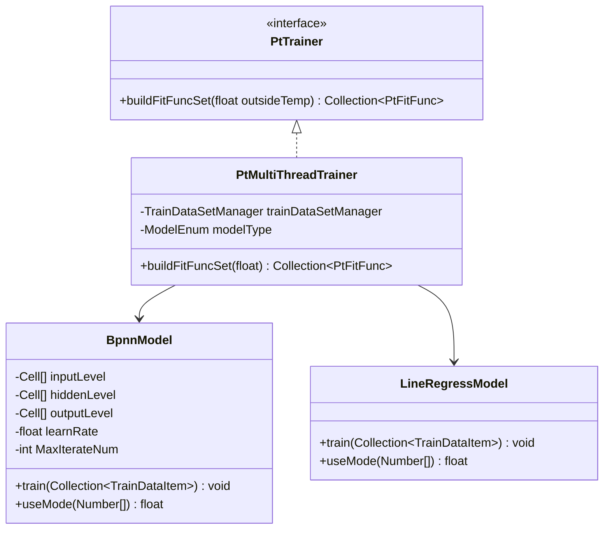
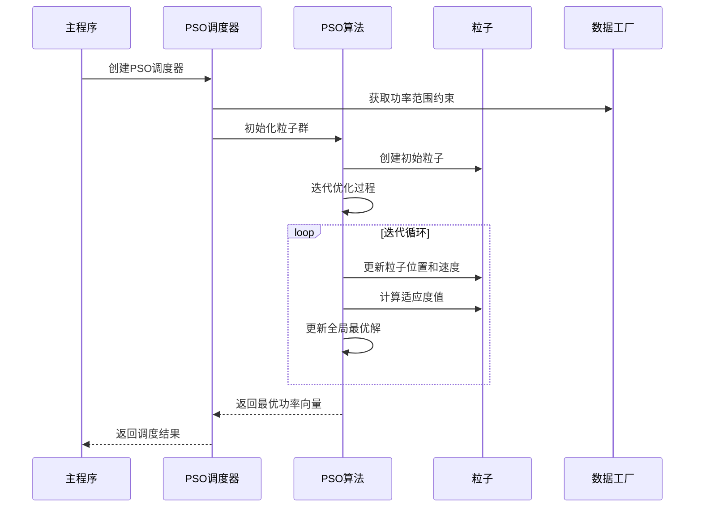
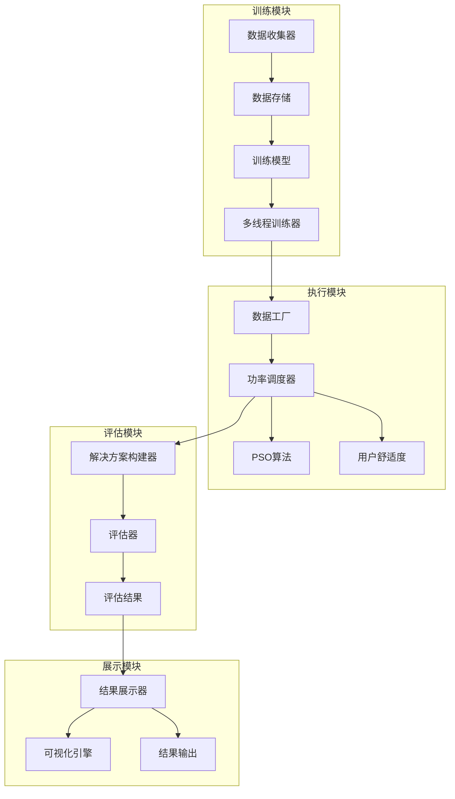
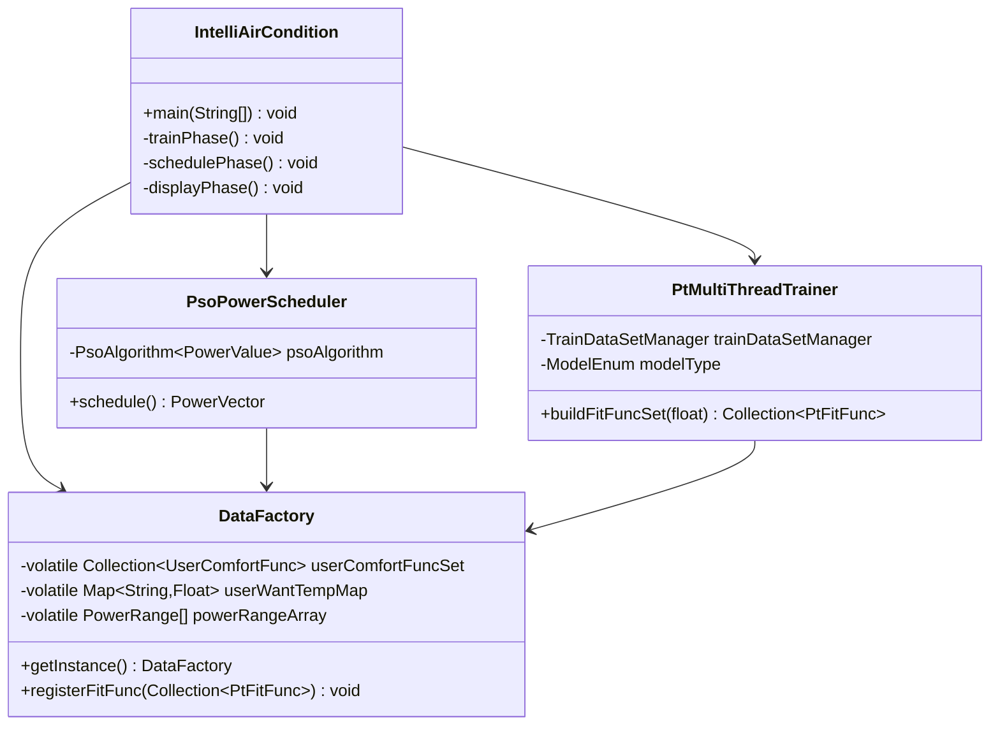
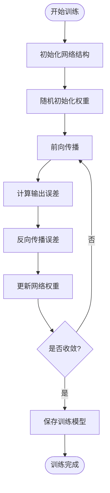
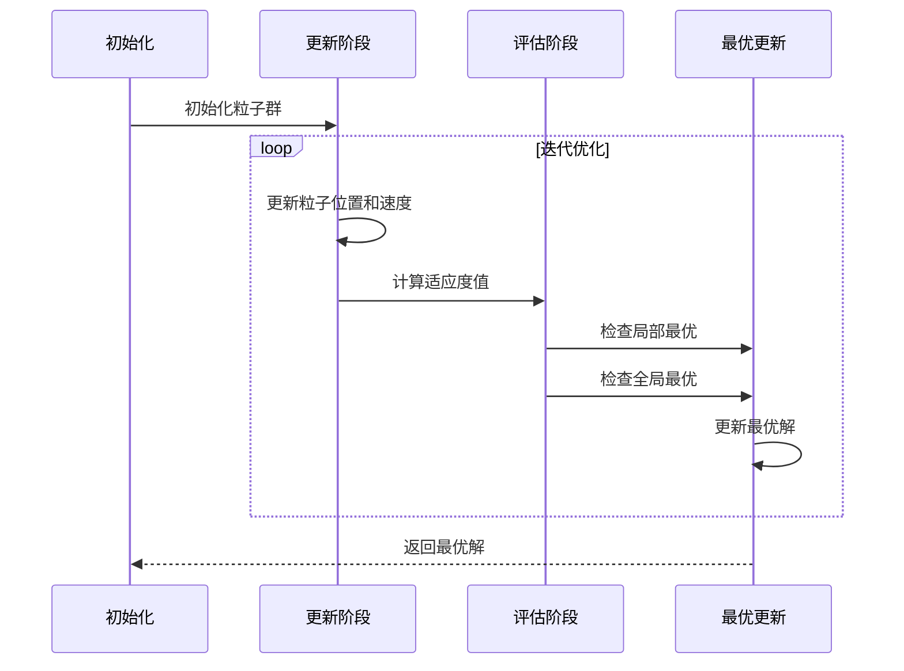
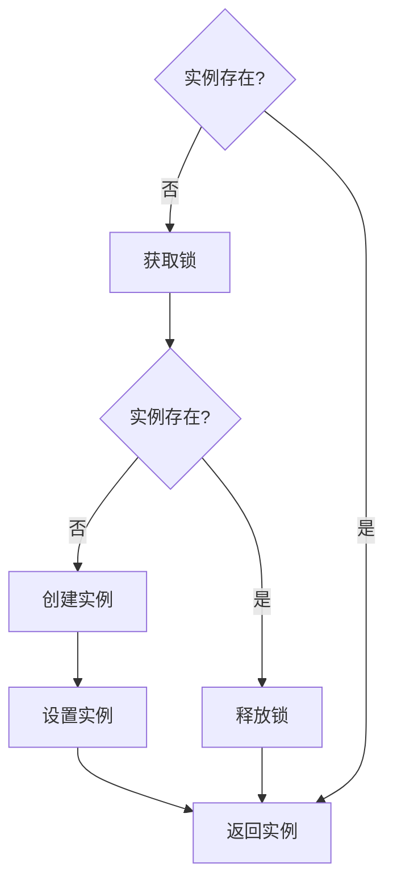

# IntelliCondition 智能空调仿真平台开发计划

<cite>
**本文档引用的文件**
- [开发计划.txt](file://开发计划.txt)
- [README.md](file://README.md)
- [IntelliAirCondition.java](file://src/main/java/com/leavesfly/iac/IntelliAirCondition.java)
- [AppContextConstant.java](file://src/main/java/com/leavesfly/iac/config/AppContextConstant.java)
- [PsoPowerScheduler.java](file://src/main/java/com/leavesfly/iac/execute/scheduler/PsoPowerScheduler.java)
- [PsoAlgorithm.java](file://src/main/java/com/leavesfly/iac/execute/scheduler/pso/PsoAlgorithm.java)
- [PowerVector.java](file://src/main/java/com/leavesfly/iac/domain/PowerVector.java)
- [DataFactory.java](file://src/main/java/com/leavesfly/iac/datasource/DataFactory.java)
- [BpnnModel.java](file://src/main/java/com/leavesfly/iac/train/trainer/bp/BpnnModel.java)
- [PtTrainer.java](file://src/main/java/com/leavesfly/iac/train/PtTrainer.java)
</cite>

## 目录
1. [项目概述](#项目概述)
2. [当前已完成功能](#当前已完成功能)
3. [系统架构概览](#系统架构概览)
4. [核心功能模块分析](#核心功能模块分析)
5. [未来发展规划](#未来发展规划)
6. [技术演进路线图](#技术演进路线图)
7. [贡献机会指南](#贡献机会指南)
8. [总结](#总结)

## 项目概述

IntelliCondition 是一个基于机器学习和粒子群优化算法(PSO)的智能空调仿真平台。该系统通过训练功率-温度映射函数，并使用PSO算法优化空调功率分配，实现最佳的温度控制效果和能耗平衡。

### 核心特性

- **智能训练模块** - 基于历史数据训练功率-温度映射函数
- **PSO优化算法** - 使用粒子群优化和混沌PSO算法寻找最优功率分配
- **个性化舒适度** - 支持用户个性化温度偏好设置
- **多策略评估** - 提供个性化和全局优化两种模式
- **数据可视化** - 集成JFreeChart提供结果展示和分析
- **多线程处理** - 支持并发训练和调度执行

## 当前已完成功能

### 训练模块功能

#### 1. 数据收集与存储
- **数据收集器** - 从文本文件收集训练数据
- **数据存储** - 采用Apache Lucene 3.6.0进行高效的数据存储和检索
- **多线程训练** - 支持并发模型训练，提升效率

#### 2. 功率-温度函数训练
- **BP神经网络** - 实现3层BP神经网络模型，支持自定义网络结构
- **线性回归模型** - 提供LR模型作为备选方案
- **模型评估** - 内置模型性能评估机制

**图表来源**
- [PtTrainer.java](file://src/main/java/com/leavesfly/iac/train/PtTrainer.java#L1-L20)
- [BpnnModel.java](file://src/main/java/com/leavesfly/iac/train/trainer/bp/BpnnModel.java#L1-L50)

#### 3. 数据工厂管理
- **单例模式** - DataFactory采用双重检查锁定机制确保线程安全
- **数据注册** - 支持温度预测函数的动态注册
- **地理位置管理** - 统一管理用户和传感器的地理位置信息

**章节来源**
- [开发计划.txt](file://开发计划.txt#L1-L22)
- [README.md](file://README.md#L1-L50)
- [DataFactory.java](file://src/main/java/com/leavesfly/iac/datasource/DataFactory.java#L1-L100)

### 执行模块功能

#### 1. PSO算法实现
- **标准PSO算法** - 实现标准粒子群优化算法
- **混沌PSO算法** - 改进的PSO算法，提高收敛性能
- **策略模式** - 使用策略模式实现通用的PSO算法框架
- **泛型支持** - 支持不同类型的粒子位置和速度

**图表来源**
- [PsoPowerScheduler.java](file://src/main/java/com/leavesfly/iac/execute/scheduler/PsoPowerScheduler.java#L1-L50)
- [PsoAlgorithm.java](file://src/main/java/com/leavesfly/iac/execute/scheduler/pso/PsoAlgorithm.java#L1-L80)

#### 2. 用户舒适度模块
- **个性化舒适度** - 支持用户个性化温度偏好设置
- **地理位置感知** - 根据用户和传感器的地理位置关系进行优化
- **温度范围管理** - 统一管理用户舒适温度范围

#### 3. 并发执行支持
- **多线程调度** - 支持并行执行多种优化策略
- **线程安全** - 使用CountDownLatch确保任务同步
- **资源管理** - 自动管理线程池资源

**章节来源**
- [开发计划.txt](file://开发计划.txt#L10-L22)
- [PsoPowerScheduler.java](file://src/main/java/com/leavesfly/iac/execute/scheduler/PsoPowerScheduler.java#L1-L92)
- [IntelliAirCondition.java](file://src/main/java/com/leavesfly/iac/IntelliAirCondition.java#L80-L150)

### 评估模块功能

#### 1. 解决方案评估
- **满意度计算** - 基于用户舒适度函数计算总满意度
- **功耗成本** - 计算总功耗成本和功率效用
- **多策略对比** - 支持个性化和全局优化两种模式的对比

#### 2. 结果展示
- **可视化输出** - 使用JFreeChart进行数据可视化
- **格式化显示** - 提供友好的结果展示格式
- **统计分析** - 输出详细的评估统计数据

**章节来源**
- [IntelliAirCondition.java](file://src/main/java/com/leavesfly/iac/IntelliAirCondition.java#L150-L187)

## 系统架构概览

### 整体架构设计

**图表来源**
- [IntelliAirCondition.java](file://src/main/java/com/leavesfly/iac/IntelliAirCondition.java#L1-L50)
- [DataFactory.java](file://src/main/java/com/leavesfly/iac/datasource/DataFactory.java#L1-L100)

### 核心组件关系

**图表来源**
- [IntelliAirCondition.java](file://src/main/java/com/leavesfly/iac/IntelliAirCondition.java#L30-L80)
- [DataFactory.java](file://src/main/java/com/leavesfly/iac/datasource/DataFactory.java#L30-L100)

**章节来源**
- [README.md](file://README.md#L20-L60)
- [IntelliAirCondition.java](file://src/main/java/com/leavesfly/iac/IntelliAirCondition.java#L1-L187)

## 核心功能模块分析

### 1. 智能训练模块

#### BP神经网络模型实现

BP神经网络是系统的核心训练组件，采用三层网络结构：

- **输入层** - 接收功率特征数据
- **隐藏层** - 通过非线性激活函数提取特征
- **输出层** - 预测温度值

**图表来源**
- [BpnnModel.java](file://src/main/java/com/leavesfly/iac/train/trainer/bp/BpnnModel.java#L150-L250)

#### 多线程训练架构

系统采用多线程架构提升训练效率：

- **并行模型训练** - 支持同时训练多个模型
- **资源池管理** - 自动管理线程资源
- **负载均衡** - 智能分配训练任务

**章节来源**
- [BpnnModel.java](file://src/main/java/com/leavesfly/iac/train/trainer/bp/BpnnModel.java#L1-L100)
- [PtTrainer.java](file://src/main/java/com/leavesfly/iac/train/PtTrainer.java#L1-L20)

### 2. PSO优化算法模块

#### 粒子群优化算法实现

PSO算法是系统的核心优化组件：

**图表来源**
- [PsoAlgorithm.java](file://src/main/java/com/leavesfly/iac/execute/scheduler/pso/PsoAlgorithm.java#L60-L100)

#### 混沌PSO算法改进

混沌PSO算法通过引入混沌理论提高算法性能：

- **混沌初始化** - 使用混沌序列初始化粒子位置
- **混沌惯性权重** - 动态调整惯性权重
- **混沌搜索策略** - 增强全局搜索能力

**章节来源**
- [PsoAlgorithm.java](file://src/main/java/com/leavesfly/iac/execute/scheduler/pso/PsoAlgorithm.java#L1-L116)
- [PsoPowerScheduler.java](file://src/main/java/com/leavesfly/iac/execute/scheduler/PsoPowerScheduler.java#L1-L92)

### 3. 数据工厂管理系统

#### 单例模式实现

DataFactory采用双重检查锁定机制确保线程安全：

**图表来源**
- [DataFactory.java](file://src/main/java/com/leavesfly/iac/datasource/DataFactory.java#L80-L120)

#### 数据管理架构

DataFactory统一管理各类数据：

- **用户数据** - 舒适度函数、期望温度、地理位置
- **传感器数据** - 位置信息、温度预测函数
- **模型数据** - 训练好的功率-温度映射函数
- **评估数据** - 优化结果和评估指标

**章节来源**
- [DataFactory.java](file://src/main/java/com/leavesfly/iac/datasource/DataFactory.java#L1-L200)

## 未来发展规划

### 第一阶段：功能扩展与优化

#### 1. 支持更多机器学习模型

**短期目标（3-6个月）**：
- **集成深度学习模型** - 引入LSTM、GRU等时间序列模型
- **支持随机森林** - 实现基于决策树的集成学习
- **模型融合机制** - 开发模型组合和投票机制

**中期目标（6-12个月）**：
- **自动模型选择** - 基于数据特征自动选择最优模型
- **模型性能监控** - 实时监控各模型的预测性能
- **模型版本管理** - 支持模型版本控制和回滚

#### 2. 引入更复杂的用户舒适度模型

**个性化舒适度增强**：
- **动态舒适度函数** - 基于用户行为模式动态调整舒适度曲线
- **环境因素考虑** - 考虑湿度、风速等环境因素对舒适度的影响
- **社交影响模型** - 考虑多人环境下的舒适度协调

**章节来源**
- [开发计划.txt](file://开发计划.txt#L1-L22)
- [AppContextConstant.java](file://src/main/java/com/leavesfly/iac/config/AppContextConstant.java#L50-L100)

### 第二阶段：系统架构升级

#### 1. 微服务架构迁移

**服务拆分计划**：
- **训练服务** - 独立的模型训练服务
- **调度服务** - 专门的优化算法服务
- **评估服务** - 独立的结果评估服务
- **数据服务** - 统一的数据管理服务

**容器化部署**：
- **Docker支持** - 提供完整的Docker镜像
- **Kubernetes编排** - 支持集群部署和扩缩容
- **服务发现** - 实现微服务间的自动发现和通信

#### 2. 实时数据流处理

**实时处理能力**：
- **流式数据处理** - 支持实时传感器数据流处理
- **在线学习** - 实现模型的在线更新和增量训练
- **事件驱动架构** - 基于事件的异步处理机制

**章节来源**
- [README.md](file://README.md#L100-L150)

### 第三阶段：用户体验提升

#### 1. Web可视化界面

**前端架构设计**：
- **React/Vue.js** - 现代化的前端框架
- **数据可视化** - 使用D3.js等工具进行复杂数据展示
- **交互式控制** - 提供直观的参数调整界面

**功能特性**：
- **实时监控面板** - 显示空调运行状态和环境参数
- **历史数据分析** - 提供历史数据的查询和分析功能
- **报告生成功能** - 自动生成优化效果报告

#### 2. 移动端应用

**跨平台支持**：
- **Android/iOS应用** - 提供原生移动应用
- **响应式设计** - 适配各种移动设备屏幕
- **离线功能** - 支持离线模式下的基本功能

#### 3. API开放平台

**RESTful API设计**：
- **标准化接口** - 提供完整的API文档
- **认证授权** - 支持OAuth2.0等标准认证
- **SDK支持** - 提供多种编程语言的SDK

**章节来源**
- [README.md](file://README.md#L150-L176)

## 技术演进路线图

### 技术栈升级规划

#### 1. Java版本升级

**当前状态**：
- 使用Java 1.7作为开发语言
- 依赖Apache Lucene 3.6.0、Weka 3.6.10等较旧版本

**升级计划**：
- **Java 17 LTS** - 迁移到最新的长期支持版本
- **Spring Boot** - 采用现代化的微服务框架
- **新特性利用** - 利用新的语言特性和API

#### 2. 机器学习框架现代化

**当前框架**：
- Weka 3.6.10 - 传统的机器学习库
- 自实现的BP神经网络 - 基础的深度学习实现

**现代化选择**：
- **TensorFlow/PyTorch** - 强大的深度学习框架
- **Scikit-learn** - 优秀的传统机器学习库
- **ONNX** - 模型交换格式支持

#### 3. 数据存储优化

**当前方案**：
- Apache Lucene 3.6.0 - 文档数据库
- 基于文件的存储方式

**优化方案**：
- **MongoDB** - NoSQL文档数据库
- **PostgreSQL** - 关系型数据库
- **分布式存储** - 支持大规模数据存储

### 性能优化路线图

#### 1. 并发性能提升

**现有架构**：
- 基于线程池的并发处理
- 同步数据访问控制

**优化策略**：
- **协程支持** - 引入协程提高并发效率
- **无锁编程** - 减少锁竞争
- **内存优化** - 改善内存使用效率

#### 2. 算法性能优化

**PSO算法优化**：
- **并行计算** - 利用GPU加速粒子计算
- **算法变种** - 引入更先进的PSO变种
- **参数自适应** - 动态调整算法参数

**章节来源**
- [README.md](file://README.md#L40-L80)
- [PsoAlgorithm.java](file://src/main/java/com/leavesfly/iac/execute/scheduler/pso/PsoAlgorithm.java#L1-L50)

## 贡献机会指南

### 开发者贡献路径

#### 1. 新功能开发

**推荐贡献领域**：
- **机器学习模型** - 开发新的训练模型
- **优化算法** - 实现新的优化算法
- **数据处理** - 改进数据收集和预处理
- **可视化组件** - 开发新的可视化功能

**贡献流程**：
1. Fork项目仓库
2. 创建功能分支
3. 实现功能并添加单元测试
4. 提交Pull Request
5. 代码审查和合并

#### 2. 代码质量改进

**重点关注领域**：
- **代码重构** - 优化现有代码结构
- **性能优化** - 提升系统运行效率
- **错误修复** - 修复已知问题
- **文档完善** - 补充和完善文档

#### 3. 社区建设

**参与方式**：
- **Issue讨论** - 参与问题讨论和解决方案制定
- **Wiki维护** - 协助维护项目Wiki
- **教程编写** - 编写使用教程和最佳实践
- **翻译工作** - 协助文档翻译

### 技能要求

#### 1. 基础技能
- **Java编程** - 熟练掌握Java语言和面向对象编程
- **算法基础** - 理解常用算法和数据结构
- **机器学习基础** - 了解基本的机器学习概念
- **软件工程** - 理解软件开发生命周期和最佳实践

#### 2. 进阶技能
- **分布式系统** - 理解微服务架构和分布式系统设计
- **大数据处理** - 熟悉大数据处理技术和工具
- **前端开发** - 具备Web前端开发能力
- **DevOps** - 了解持续集成和部署流程

#### 3. 专业领域
- **优化算法** - 深入理解PSO等优化算法
- **神经网络** - 熟悉深度学习和神经网络原理
- **数据可视化** - 具备数据可视化设计能力
- **系统架构** - 理解大型系统的设计原则

### 贡献奖励机制

#### 1. 技术成长
- **项目经验** - 获得实际项目开发经验
- **技术视野** - 拓宽技术视野和知识面
- **团队协作** - 提升团队协作和沟通能力
- **开源贡献** - 积累开源社区贡献经验

#### 2. 职业发展
- **简历加分** - 为简历增添有价值的项目经历
- **技能认证** - 获得相关技术领域的技能认证
- **行业认可** - 获得行业内专业人士的认可
- **职业机会** - 获得更好的职业发展机会

## 总结

IntelliCondition智能空调仿真平台已经完成了核心功能的开发，包括基于机器学习的功率-温度映射训练和基于PSO算法的空调功率优化调度。系统采用模块化设计，具有良好的可扩展性和维护性。

### 当前成就

- **完整的训练体系** - 支持BP神经网络和线性回归等多种模型
- **高效的优化算法** - 实现了标准和混沌PSO算法
- **统一的数据管理** - 通过DataFactory实现数据的集中管理
- **多策略评估** - 支持个性化和全局优化两种模式

### 发展前景

系统正处于快速发展期，未来将在以下几个方面取得突破：

1. **功能扩展** - 支持更多类型的机器学习模型和优化算法
2. **架构升级** - 迁移到微服务架构，提升系统可扩展性
3. **用户体验** - 开发Web可视化界面和移动端应用
4. **实时处理** - 实现实时数据流处理和在线学习

### 贡献价值

对于开发者而言，参与IntelliCondition项目不仅能获得宝贵的技术经验，还能参与到一个真正有影响力的实际项目中。无论是初学者还是资深开发者，都能在这个项目中找到适合自己的贡献机会。

项目的开放性和活跃的社区氛围为贡献者提供了良好的成长环境。通过参与项目开发，不仅可以提升个人技术能力，还能建立宝贵的行业人脉，为职业发展奠定坚实基础。

让我们携手共创智能空调控制的新未来！