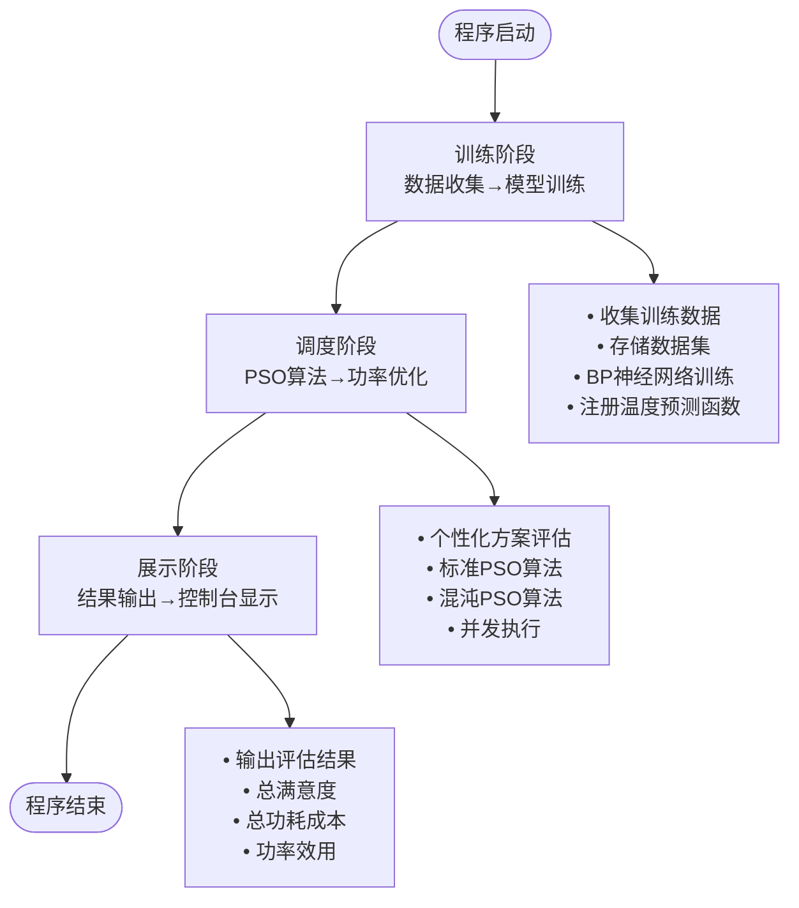

# 智能空调仿真平台 - 快速开始指南

<cite>
**本文档引用的文件**
- [README.md](file://README.md)
- [pom.xml](file://pom.xml)
- [IntelliAirCondition.java](file://src/main/java/com/leavesfly/iac/IntelliAirCondition.java)
- [AppContextConstant.java](file://src/main/java/com/leavesfly/iac/config/AppContextConstant.java)
- [PsoAlgorithmConstant.java](file://src/main/java/com/leavesfly/iac/config/PsoAlgorithmConstant.java)
- [power_temp_train_data.txt](file://src/main/resource/power_temp_train_data.txt)
</cite>

## 目录
1. [项目简介](#项目简介)
2. [环境要求](#环境要求)
3. [项目安装](#项目安装)
4. [项目结构概览](#项目结构概览)
5. [运行步骤](#运行步骤)
6. [配置说明](#配置说明)
7. [预期输出](#预期输出)
8. [常见问题解决](#常见问题解决)
9. [扩展功能](#扩展功能)
10. [总结](#总结)

## 项目简介

智能空调仿真平台（IntelliCondition）是一个基于机器学习和粒子群优化算法(PSO)的智能空调仿真系统。该系统通过训练功率-温度映射函数，并使用PSO算法优化空调功率分配，实现最佳的温度控制效果和能耗平衡。

### 核心特性

- **智能训练模块** - 基于历史数据训练功率-温度映射函数
- **PSO优化算法** - 使用粒子群优化和混沌PSO算法寻找最优功率分配
- **个性化舒适度** - 支持用户个性化温度偏好设置
- **多策略评估** - 提供个性化和全局优化两种模式
- **数据可视化** - 集成JFreeChart提供结果展示和分析
- **多线程处理** - 支持并发训练和调度执行

## 环境要求

在开始之前，请确保您的系统满足以下要求：

### 必需组件
- **Java 1.7+** - 核心开发语言
- **Maven 3.x** - 项目构建和依赖管理工具
- **Git** - 版本控制系统（可选）

### 推荐配置
- **内存**: 至少2GB RAM
- **磁盘空间**: 至少500MB可用空间
- **操作系统**: Windows 7+/macOS 10.10+/Linux

## 项目安装

### 步骤1：克隆项目

打开终端或命令提示符，执行以下命令：

```bash
# 克隆项目到本地
git clone https://github.com/your-repository-url.git
cd intellacondition
```

### 步骤2：验证环境

确认Java和Maven已正确安装：

```bash
# 检查Java版本
java -version

# 检查Maven版本
mvn -v
```

预期输出应显示Java 1.7或更高版本，以及Maven 3.x版本。

### 步骤3：编译项目

在项目根目录下执行编译命令：

```bash
# 清理并编译项目
mvn clean compile
```

编译过程可能需要几分钟，具体时间取决于网络速度和计算机性能。

## 项目结构概览

智能空调仿真平台采用标准的Maven项目结构：

```
intellacondition/
├── src/
│   ├── main/
│   │   ├── java/com/leavesfly/iac/     # 源代码目录
│   │   │   ├── IntelliAirCondition.java    # 主程序入口
│   │   │   ├── config/                     # 配置常量
│   │   │   ├── datasource/                 # 数据工厂
│   │   │   ├── domain/                     # 领域模型
│   │   │   ├── train/                      # 训练模块
│   │   │   ├── execute/                    # 执行模块
│   │   │   ├── evalute/                    # 评估模块
│   │   │   └── display/                    # 展示模块
│   │   └── resource/                       # 资源文件
├── pom.xml                                 # Maven配置文件
├── README.md                               # 项目说明文档
└── 开发计划.txt                           # 开发计划文档
```

### 核心包说明

- **com.leavesfly.iac** - 主要业务逻辑包
- **com.leavesfly.iac.config** - 配置常量管理
- **com.leavesfly.iac.datasource** - 数据源管理
- **com.leavesfly.iac.train** - 机器学习训练模块
- **com.leavesfly.iac.execute** - PSO算法执行模块
- **com.leavesfly.iac.evalute** - 结果评估模块
- **com.leavesfly.iac.display** - 结果展示模块

## 运行步骤

### 方法一：使用Maven命令运行

这是推荐的运行方式，简单且无需额外配置：

```bash
# 运行主程序
mvn exec:java -Dexec.mainClass="com.leavesfly.iac.IntelliAirCondition"
```

或者直接运行编译后的类：

```bash
# 直接运行编译后的类
java -cp target/classes com.leavesfly.iac.IntelliAirCondition
```

### 方法二：IDE运行方式

如果您使用IDE（如IntelliJ IDEA或Eclipse）：

1. 在IDE中导入项目为Maven项目
2. 找到主类 `com.leavesfly.iac.IntelliAirCondition`
3. 右键点击并选择"Run"

### 运行流程详解

系统启动后，将自动执行以下三个阶段：



**图表来源**
- [IntelliAirCondition.java](file://src/main/java/com/leavesfly/iac/IntelliAirCondition.java#L40-L186)

## 配置说明

### 主要配置文件

系统使用多个配置类来管理不同方面的参数：

#### 1. 应用上下文配置 (AppContextConstant)

```java
// 区域配置
public static final int AREA_LENGTH = 10;
public static final int AREA_WITCH = 10;
public static final int USER_NUM = 16;
public static final int SENSOR_NUM = 10;
public static final int AIR_CONDITION_NUM = 8;

// 设备参数
public static final float OUTSIDE_TEMP = 35.0f;
public static final float AIR_CONDITION_MIN_TEMP = 15.0f;
public static final float AIR_CONDITION_MAX_TEMP = 35.0f;
public static final float AIR_CONDITION_MIN_POWER = 0.0f;
public static final float AIR_CONDITION_MAX_POWER = 400.0f;
```

#### 2. PSO算法配置 (PsoAlgorithmConstant)

```java
// 迭代参数
public static final int PSO_ITERATE_NUM = 1_000;
public static final int PSO_INIT_PARTICLE_NUM = 100;

// 惯性权重
public static final float PSO_INERTIA_WEIGHT_INIT = 0.9f;
public static final float PSO_INERTIA_WEIGHT_END = 0.4f;

// 学习因子
public static final float PSO_LEARN_RATE_1 = 2.0f;
public static final float PSO_LEARN_RATE_2 = 2.0f;
```

### 资源文件说明

系统依赖以下资源文件：

- **power_temp_train_data.txt** - 功率温度训练数据
- **user_comfort_temp.txt** - 用户舒适温度数据
- **user_geo_table.txt** - 用户地理位置表
- **sensor_geo_table.txt** - 传感器地理位置表
- **air_condition_geo_table.txt** - 空调设备地理位置表

这些文件位于 `src/main/resource/` 目录下，系统会自动加载它们。

**章节来源**
- [AppContextConstant.java](file://src/main/java/com/leavesfly/iac/config/AppContextConstant.java#L1-L150)
- [PsoAlgorithmConstant.java](file://src/main/java/com/leavesfly/iac/config/PsoAlgorithmConstant.java#L1-L53)

## 预期输出

成功运行后，您将在控制台看到类似以下的输出：

```
solution_pso:[221.3,96.7,261.1,40.4,171.4,126.3,50.5,217.5]
totalSatisfaction:8.365845  totalPowerCost:1185.2312  powerUtility:7.058408

solution_pso_chaos:[131.2,143.0,202.2,143.1,159.6,141.6,105.9,141.8]
totalSatisfaction:8.24261  totalPowerCost:1168.3904  powerUtility:7.0546713
```

### 输出含义解析

1. **solution_pso**: 标准PSO算法优化得到的功率分配方案
   - 格式：[空调1功率, 空调2功率, ..., 空调8功率]
   - 单位：瓦特(W)

2. **totalSatisfaction**: 总满意度评分
   - 范围：0-10（理论上）
   - 数值越高表示用户体验越好

3. **totalPowerCost**: 总功耗成本
   - 单位：千瓦时(kWh)
   - 表示系统运行的总能耗

4. **powerUtility**: 功率效用
   - 综合评价指标
   - 数值越高表示效率越好

### 控制台输出示例

```
==================================================
智能空调仿真平台 - 运行结果
==================================================

训练阶段完成
- 收集了500条训练数据
- 成功构建功率-温度映射函数

调度阶段完成
- 个性化方案评估: 16个用户
- 标准PSO算法: 100个粒子, 1000次迭代
- 混沌PSO算法: 100个粒子, 1000次迭代

展示阶段结果:

1. 标准PSO优化方案:
   功率分配: [221.3, 96.7, 261.1, 40.4, 171.4, 126.3, 50.5, 217.5]
   总满意度: 8.37
   总功耗: 1185.23 kWh
   效率: 7.06

2. 混沌PSO优化方案:
   功率分配: [131.2, 143.0, 202.2, 143.1, 159.6, 141.6, 105.9, 141.8]
   总满意度: 8.24
   总功耗: 1168.39 kWh
   效率: 7.05

==================================================
```

## 常见问题解决

### 问题1：依赖下载失败

**症状**: Maven编译时出现网络超时或依赖下载失败

**解决方案**:
```bash
# 清理本地Maven仓库缓存
mvn dependency:purge-local-repository

# 强制更新依赖
mvn clean compile -U

# 或者手动下载依赖到本地仓库
mvn install:install-file -Dfile=local-dependency.jar \
    -DgroupId=com.example \
    -DartifactId=example-artifact \
    -Dversion=1.0 \
    -Dpackaging=jar
```

### 问题2：资源文件路径错误

**症状**: 程序无法找到配置文件

**解决方案**:
1. 确认资源文件存在于 `src/main/resource/` 目录
2. 检查文件名是否完全匹配（区分大小写）
3. 如果使用IDE，确保资源文件被正确标记为资源文件

### 问题3：内存不足

**症状**: 程序运行时抛出OutOfMemoryError

**解决方案**:
```bash
# 增加JVM堆内存
export MAVEN_OPTS="-Xmx2g -Xms1g"
mvn exec:java -Dexec.mainClass="com.leavesfly.iac.IntelliAirCondition"

# 或者在IDE中设置JVM参数
# VM options: -Xmx2g -Xms1g
```

### 问题4：PSO算法收敛缓慢

**症状**: PSO算法运行时间过长或结果不理想

**解决方案**:
1. 调整PSO算法参数：
   ```java
   // 在PsoAlgorithmConstant中修改
   public static final int PSO_ITERATE_NUM = 500;  // 减少迭代次数
   public static final int PSO_INIT_PARTICLE_NUM = 50;  // 减少粒子数量
   ```

2. 调整惯性权重：
   ```java
   public static final float PSO_INERTIA_WEIGHT_INIT = 0.8f;  // 降低初始权重
   public static final float PSO_INERTIA_WEIGHT_END = 0.5f;  // 提高结束权重
   ```

### 问题5：Java版本不兼容

**症状**: 编译或运行时出现版本不兼容错误

**解决方案**:
```bash
# 检查当前Java版本
java -version

# 如果版本低于1.7，升级Java
# 下载并安装最新版本的JDK 1.7+

# 设置JAVA_HOME环境变量
export JAVA_HOME=/path/to/jdk1.7
export PATH=$JAVA_HOME/bin:$PATH
```

## 扩展功能

### 自定义训练数据

您可以替换默认的训练数据文件来适应不同的场景：

1. **准备新的训练数据**:
   - 格式保持与 `power_temp_train_data.txt` 相同
   - 每行包含: 时间段(0-9) + 当前温度 + 外部温度 + 8个空调功率值

2. **修改配置**:
   ```java
   // 在AppContextConstant中修改
   public static final String TRAIN_DATA_FILE_NAME = "custom_train_data.txt";
   ```

### 调整算法参数

根据实际需求调整PSO算法参数：

```java
// 更高的精度但更慢的速度
public static final int PSO_ITERATE_NUM = 2000;
public static final int PSO_INIT_PARTICLE_NUM = 200;

// 更快的收敛但可能精度较低
public static final float PSO_INERTIA_WEIGHT_INIT = 0.7f;
public static final float PSO_INERTIA_WEIGHT_END = 0.3f;
```

### 添加新的评估指标

扩展评估模块以添加自定义指标：

```java
// 在EvaluteResult中添加新字段
private float energyEfficiencyRatio;  // 能效比
private float environmentalImpact;    // 环境影响评分

// 在Evaluator中实现计算逻辑
public EvaluteResult transform(Solution solution) {
    // 计算新指标...
    result.setEnergyEfficiencyRatio(calculateEER(solution));
    result.setEnvironmentalImpact(calculateEI(solution));
    return result;
}
```

## 总结

通过本快速开始指南，您已经成功完成了智能空调仿真平台的安装和运行。以下是关键要点：

### 重要概念回顾

1. **系统架构**: 三层架构设计（训练→调度→展示）
2. **核心算法**: PSO粒子群优化算法和混沌PSO算法
3. **配置管理**: 分层配置系统，便于定制化
4. **数据驱动**: 基于历史数据的机器学习模型

### 后续学习建议

1. **深入理解算法**: 学习PSO算法的数学原理
2. **扩展功能**: 尝试添加新的评估指标或优化策略
3. **性能优化**: 调整参数以获得更好的性能
4. **可视化增强**: 利用JFreeChart库创建更丰富的图表

### 下一步行动

- 修改配置参数观察系统行为变化
- 替换训练数据测试不同场景
- 探索源代码深入了解实现细节
- 考虑将系统集成到更大的物联网平台中

祝您在智能空调仿真领域取得丰硕成果！如有任何问题，请参考项目的README文档或联系维护团队。