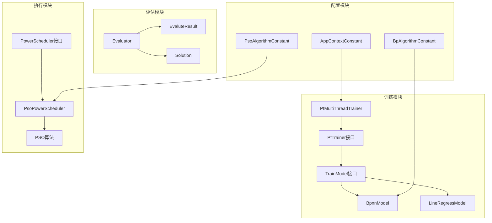

# 扩展与定制指南

<cite>
**本文档引用的文件**
- [PtTrainer.java](file://src/main/java/com/leavesfly/iac/train/PtTrainer.java)
- [TrainModel.java](file://src/main/java/com/leavesfly/iac/train/trainer/TrainModel.java)
- [ModelEnum.java](file://src/main/java/com/leavesfly/iac/train/trainer/ModelEnum.java)
- [PtMultiThreadTrainer.java](file://src/main/java/com/leavesfly/iac/train/trainer/PtMultiThreadTrainer.java)
- [TrainTask.java](file://src/main/java/com/leavesfly/iac/train/trainer/TrainTask.java)
- [BpnnModel.java](file://src/main/java/com/leavesfly/iac/train/trainer/bp/BpnnModel.java)
- [PowerScheduler.java](file://src/main/java/com/leavesfly/iac/execute/PowerScheduler.java)
- [PsoPowerScheduler.java](file://src/main/java/com/leavesfly/iac/execute/scheduler/PsoPowerScheduler.java)
- [Evaluator.java](file://src/main/java/com/leavesfly/iac/evalute/Evaluator.java)
- [EvaluteResult.java](file://src/main/java/com/leavesfly/iac/evalute/EvaluteResult.java)
- [AppContextConstant.java](file://src/main/java/com/leavesfly/iac/config/AppContextConstant.java)
- [BpAlgorithmConstant.java](file://src/main/java/com/leavesfly/iac/config/BpAlgorithmConstant.java)
- [IntelliAirCondition.java](file://src/main/java/com/leavesfly/iac/IntelliAirCondition.java)
</cite>

## 1. 引言

IntelliAirCondition是一个基于机器学习和粒子群优化算法的智能空调仿真平台。本指南详细说明了如何扩展和定制系统功能，包括添加新的机器学习模型、实现新的优化算法以及扩展评估指标。

## 2. 系统架构概览



**图表来源**
- [PtTrainer.java](file://src/main/java/com/leavesfly/iac/train/PtTrainer.java#L1-L19)
- [TrainModel.java](file://src/main/java/com/leavesfly/iac/train/trainer/TrainModel.java#L1-L34)
- [PowerScheduler.java](file://src/main/java/com/leavesfly/iac/execute/PowerScheduler.java#L1-L18)
- [Evaluator.java](file://src/main/java/com/leavesfly/iac/evalute/Evaluator.java#L1-L40)

## 3. 添加新的机器学习模型

### 3.1 实现TrainModel接口

要添加新的机器学习模型，需要实现`TrainModel`接口：

```java
public interface TrainModel {
    /**
     * 训练模型
     * @param trainDataSet 训练数据集
     */
    public <T extends TrainDataItem<Float, Float>> void train(Collection<T> trainDataSet);

    /**
     * 使用模型进行预测
     * @param feature 特征值数组
     * @return 预测结果
     */
    public <T extends Number> float useMode(T[] feature);
}
```

### 3.2 示例：实现随机森林模型

```java
public class RandomForestModel implements TrainModel {
    
    private Random forest;
    private int numTrees;
    private int maxDepth;
    
    public RandomForestModel(int numTrees, int maxDepth) {
        this.numTrees = numTrees;
        this.maxDepth = maxDepth;
        this.forest = new Random();
    }
    
    @Override
    public <T extends TrainDataItem<Float, Float>> void train(Collection<T> trainDataSet) {
        // 实现随机森林训练逻辑
        // 1. 创建多个决策树
        // 2. 每棵树使用不同的样本子集
        // 3. 每个分裂节点使用随机特征子集
    }
    
    @Override
    public <T extends Number> float useMode(T[] feature) {
        // 实现随机森林预测逻辑
        // 1. 使用所有树进行预测
        // 2. 返回多数投票结果或平均值
        return predictWithRandomForest(feature);
    }
    
    private float predictWithRandomForest(T[] feature) {
        // 随机森林预测实现
        return 0.0f;
    }
}
```

### 3.3 注册新模型到系统

1. 在`ModelEnum`中添加新的模型类型：

```java
public enum ModelEnum {
    BPNN("Back Propagation Neural Network"),
    BPWEKA("BP Neural Network of Weka"),
    LR("Linear Regression"),
    RANDOM_FOREST("Random Forest");  // 新增模型
}
```

2. 创建相应的训练任务类：

```java
public class RandomForestTrainTask extends TrainTask {
    
    public RandomForestTrainTask(CyclicBarrier barrier, 
                                Collection<IntellacTrainDataItem> trainDataSet,
                                float outsideTemp, String sensorId, 
                                Collection<PtFitFunc> fitFuncOfPTSet) {
        super(barrier, trainDataSet, outsideTemp, sensorId, fitFuncOfPTSet);
    }
    
    @Override
    protected TrainModel getTrainModelInstance() {
        return new RandomForestModel(100, 10);  // 100棵树，最大深度10
    }
}
```

3. 修改`PtMultiThreadTrainer`以支持新模型：

```java
public Collection<PtFitFunc> buildFitFuncSet(float outsideTemp) {
    // ... 现有代码 ...
    
    switch (modelSelect) {
        case BPNN:
            trainTask = new BpTrianTask(barrier, trainDataSet, outsideTemp, sensorId, fitFuncOfPTSet);
            break;
        case LR:
            trainTask = new LrTrainTask(barrier, trainDataSet, outsideTemp, sensorId, fitFuncOfPTSet);
            break;
        case RANDOM_FOREST:  // 新增支持
            trainTask = new RandomForestTrainTask(barrier, trainDataSet, outsideTemp, sensorId, fitFuncOfPTSet);
            break;
        default:
            throw new IllegalArgumentException("Unsupported model type");
    }
    
    // ... 现有代码 ...
}
```

## 4. 实现新的优化算法

### 4.1 实现PowerScheduler接口

要添加新的优化算法，需要实现`PowerScheduler`接口：

```java
public interface PowerScheduler {
    /**
     * 执行功率调度算法
     * @return 调度后的功率向量
     */
    public PowerVector schedule();
}
```

### 4.2 示例：实现遗传算法调度器

```java
public class GeneticPowerScheduler implements PowerScheduler {
    
    private int populationSize;
    private int generations;
    private double mutationRate;
    private PowerRange[] powerRanges;
    
    public GeneticPowerScheduler(int populationSize, int generations, double mutationRate) {
        this.populationSize = populationSize;
        this.generations = generations;
        this.mutationRate = mutationRate;
        this.powerRanges = DataFactory.getInstance().getPowerRangeArray();
    }
    
    @Override
    public PowerVector schedule() {
        // 初始化种群
        List<Chromosome> population = initializePopulation();
        
        // 迭代进化
        for (int generation = 0; generation < generations; generation++) {
            // 评估适应度
            evaluateFitness(population);
            
            // 选择、交叉、变异
            population = evolvePopulation(population);
        }
        
        // 返回最佳个体
        Chromosome bestChromosome = getBestChromosome(population);
        return convertToPowerVector(bestChromosome);
    }
    
    private List<Chromosome> initializePopulation() {
        // 初始化种群实现
        return new ArrayList<>();
    }
    
    private void evaluateFitness(List<Chromosome> population) {
        // 适应度评估实现
    }
    
    private List<Chromosome> evolvePopulation(List<Chromosome> population) {
        // 进化操作实现
        return new ArrayList<>();
    }
    
    private Chromosome getBestChromosome(List<Chromosome> population) {
        // 获取最佳个体实现
        return null;
    }
    
    private PowerVector convertToPowerVector(Chromosome chromosome) {
        // 将染色体转换为功率向量实现
        return new PowerVector(chromosome.toPowerValues());
    }
}
```

### 4.3 示例：实现模拟退火调度器

```java
public class SimulatedAnnealingScheduler implements PowerScheduler {
    
    private double initialTemperature;
    private double coolingRate;
    private int iterationsPerTemperature;
    private PowerRange[] powerRanges;
    
    public SimulatedAnnealingScheduler(double initialTemperature, 
                                     double coolingRate, 
                                     int iterationsPerTemperature) {
        this.initialTemperature = initialTemperature;
        this.coolingRate = coolingRate;
        this.iterationsPerTemperature = iterationsPerTemperature;
        this.powerRanges = DataFactory.getInstance().getPowerRangeArray();
    }
    
    @Override
    public PowerVector schedule() {
        // 当前状态
        PowerVector currentState = generateRandomSolution();
        float currentEnergy = calculateEnergy(currentState);
        
        // 最佳状态
        PowerVector bestState = currentState.clone();
        float bestEnergy = currentEnergy;
        
        double temperature = initialTemperature;
        
        while (temperature > 0.001) {
            for (int i = 0; i < iterationsPerTemperature; i++) {
                // 生成邻域解
                PowerVector newState = generateNeighbor(currentState);
                float newEnergy = calculateEnergy(newState);
                
                // 接受准则
                if (accept(newState, currentState, newEnergy, currentEnergy, temperature)) {
                    currentState = newState;
                    currentEnergy = newEnergy;
                    
                    // 更新最佳解
                    if (newEnergy < bestEnergy) {
                        bestState = newState;
                        bestEnergy = newEnergy;
                    }
                }
            }
            
            // 降温
            temperature *= coolingRate;
        }
        
        return bestState;
    }
    
    private boolean accept(PowerVector newState, PowerVector currentState, 
                          float newEnergy, float currentEnergy, double temperature) {
        if (newEnergy < currentEnergy) {
            return true;
        }
        
        double probability = Math.exp((currentEnergy - newEnergy) / temperature);
        return Math.random() < probability;
    }
    
    // 其他辅助方法...
}
```

### 4.4 集成到主流程

在`IntelliAirCondition`的调度阶段添加新的调度器：

```java
private void schedulePhase() {
    // ... 现有代码 ...
    
    // 提交第四个任务：遗传算法功率调度
    executorService.submit(new Runnable() {
        @Override
        public void run() {
            PowerScheduler geneticScheduler = new GeneticPowerScheduler(100, 1000, 0.02);
            PowerVector powerVector = geneticScheduler.schedule();
            Solution solution = SolutionBuilder.buildSolution(
                    AppContextConstant.SOLUTIN_NAME_PREFIX + "genetic", powerVector);
            EvaluteResult evaluteResult = Evaluator.transform(solution);
            dataFactory.addEvaluteResult(evaluteResult);
            latch.countDown();
        }
    });
    
    // 提交第五个任务：模拟退火功率调度
    executorService.submit(new Runnable() {
        @Override
        public void run() {
            PowerScheduler saScheduler = new SimulatedAnnealingScheduler(100.0, 0.95, 100);
            PowerVector powerVector = saScheduler.schedule();
            Solution solution = SolutionBuilder.buildSolution(
                    AppContextConstant.SOLUTIN_NAME_PREFIX + "sa", powerVector);
            EvaluteResult evaluteResult = Evaluator.transform(solution);
            dataFactory.addEvaluteResult(evaluteResult);
            latch.countDown();
        }
    });
    
    // ... 现有代码 ...
}
```

## 5. 扩展评估指标

### 5.1 修改Evaluator类

要添加新的评估指标，可以扩展`Evaluator`类：

```java
public class EnhancedEvaluator extends Evaluator {
    
    /**
     * 计算碳排放量
     * @param powerVector 功率向量
     * @return 碳排放量（kg CO2）
     */
    public static float calCarbonEmission(PowerVector powerVector) {
        if (powerVector == null) {
            throw new IllegalArgumentException();
        }
        
        float totalPower = 0.0f;
        PowerValue[] powerValueArray = powerVector.getPowerValueVector();
        
        for (PowerValue powerValue : powerValueArray) {
            totalPower += powerValue.getValue();
        }
        
        // 假设每千瓦时产生0.5 kg CO2
        return totalPower * AppContextConstant.POWER_PRICE * 0.5f / 1000.0f;
    }
    
    /**
     * 计算设备磨损度
     * @param powerVector 功率向量
     * @return 设备磨损度
     */
    public static float calEquipmentWear(PowerVector powerVector) {
        if (powerVector == null) {
            throw new IllegalArgumentException();
        }
        
        float wearFactor = 0.0f;
        PowerValue[] powerValueArray = powerVector.getPowerValueVector();
        
        for (PowerValue powerValue : powerValueArray) {
            // 高功率运行增加磨损
            wearFactor += Math.pow(powerValue.getValue() / AppContextConstant.AIR_CONDITION_MAX_POWER, 2);
        }
        
        return wearFactor / powerValueArray.length;
    }
    
    /**
     * 转换解决方案为增强的评估结果
     */
    public static EnhancedEvaluteResult transformEnhanced(Solution solution) {
        PowerVector powerVector = solution.getPowerVector();
        float satisfaction = calTotalSatisfaction(powerVector);
        float powerCost = calTotalPowerCost(powerVector);
        float carbonEmission = calCarbonEmission(powerVector);
        float equipmentWear = calEquipmentWear(powerVector);
        
        return new EnhancedEvaluteResult(solution, satisfaction, powerCost, 
                                        carbonEmission, equipmentWear);
    }
}
```

### 5.2 创建增强的评估结果类

```java
public class EnhancedEvaluteResult extends EvaluteResult {
    
    private float carbonEmission;
    private float equipmentWear;
    
    public EnhancedEvaluteResult(Solution solution, float totalSatisfaction, 
                                float totalPowerCost, float carbonEmission, 
                                float equipmentWear) {
        super(solution, totalSatisfaction, totalPowerCost);
        this.carbonEmission = carbonEmission;
        this.equipmentWear = equipmentWear;
    }
    
    public float getCarbonEmission() {
        return carbonEmission;
    }
    
    public float getEquipmentWear() {
        return equipmentWear;
    }
    
    @Override
    public String toString() {
        return super.toString() + 
               ", carbonEmission=" + carbonEmission +
               ", equipmentWear=" + equipmentWear;
    }
}
```

### 5.3 修改解决方案构建器

```java
public class EnhancedSolutionBuilder extends SolutionBuilder {
    
    public static Solution buildEnhancedSolution(String solutionName, PowerVector powerVector) {
        Solution solution = new Solution(solutionName, powerVector);
        
        // 添加额外的评估指标
        EnhancedEvaluator evaluator = new EnhancedEvaluator();
        EnhancedEvaluteResult evaluteResult = evaluator.transformEnhanced(solution);
        
        // 可以在这里添加更多自定义指标
        solution.setAdditionalMetrics(Map.of(
            "carbonEmission", evaluteResult.getCarbonEmission(),
            "equipmentWear", evaluteResult.getEquipmentWear()
        ));
        
        return solution;
    }
}
```

## 6. 自定义系统行为

### 6.1 修改配置常量

可以通过修改`AppContextConstant`类来自定义系统行为：

```java
public class AppContextConstant {
    
    // 用户舒适度相关参数
    public static final float COMFORT_MIN_VALUE = 0.2f;
    public static final float COMFORT_UP_DOWN_RANGE_VALUE = 1.5f;
    
    // 优化算法参数
    public static final float SATISFY_WEIGHT = 0.5f;
    public static final float POWER_COST_WEIGHT = 0.5f;  // 修改权重
    
    // 系统约束
    public static final float OUTSIDE_TEMP = 35.0f;
    public static final float AIR_CONDITION_MIN_TEMP = 15.0f;
    public static final float AIR_CONDITION_MAX_TEMP = 35.0f;  // 修改为相同值
    
    // 新增参数
    public static final float CARBON_EMISSION_FACTOR = 0.5f;  // 碳排放系数
    public static final float EQUIPMENT_WEAR_FACTOR = 0.01f;  // 设备磨损系数
}
```

### 6.2 创建自定义配置类

```java
public class CustomAlgorithmConstant {
    
    // 随机森林参数
    public static final int RANDOM_FOREST_TREES = 100;
    public static final int RANDOM_FOREST_MAX_DEPTH = 10;
    public static final double RANDOM_FOREST_SUBSAMPLE_RATIO = 0.8;
    
    // 遗传算法参数
    public static final int GENETIC_POPULATION_SIZE = 100;
    public static final int GENETIC_GENERATIONS = 1000;
    public static final double GENETIC_MUTATION_RATE = 0.02;
    public static final double GENETIC_CROSSOVER_RATE = 0.8;
    
    // 模拟退火参数
    public static final double SA_INITIAL_TEMPERATURE = 100.0;
    public static final double SA_COOLING_RATE = 0.95;
    public static final int SA_ITERATIONS_PER_TEMP = 100;
    
    // 新增评估指标参数
    public static final float ENERGY_EFFICIENCY_THRESHOLD = 0.8f;
    public static final float COST_EFFECTIVENESS_THRESHOLD = 0.7f;
}
```

### 6.3 修改资源文件

编辑训练数据文件以支持新的评估指标：

```text
# power_temp_train_data.txt
# 格式: sensorId,outsideTemp,power1,power2,...,temperature,energyConsumption,carbonEmission,equipmentWear
1,30,100,200,150,25,10,0.5,0.02
2,30,120,180,160,26,12,0.6,0.03
3,30,110,190,170,25.5,11,0.55,0.025
```

## 7. 高级扩展建议

### 7.1 线程安全考虑

```java
public class ThreadSafeMultiThreadTrainer implements PtTrainer {
    
    private final ReentrantLock lock = new ReentrantLock();
    private final ConcurrentHashMap<String, PtFitFunc> fitFuncMap = new ConcurrentHashMap<>();
    
    @Override
    public Collection<PtFitFunc> buildFitFuncSet(float outsideTemp) {
        lock.lock();
        try {
            // 线程安全的训练逻辑
            return processTraining(outsideTemp);
        } finally {
            lock.unlock();
        }
    }
    
    private Collection<PtFitFunc> processTraining(float outsideTemp) {
        // 实现线程安全的训练过程
        return Collections.emptyList();
    }
}
```

### 7.2 性能优化

```java
public class OptimizedEvaluator extends Evaluator {
    
    // 使用缓存减少重复计算
    private static final Cache<String, Float> satisfactionCache = CacheBuilder.newBuilder()
            .maximumSize(1000)
            .expireAfterWrite(10, TimeUnit.MINUTES)
            .build();
    
    @Override
    public static float calTotalSatisfaction(PowerVector powerVector) {
        String cacheKey = generateCacheKey(powerVector);
        
        try {
            return satisfactionCache.get(cacheKey, () -> {
                return calculateSatisfaction(powerVector);
            });
        } catch (ExecutionException e) {
            return calculateSatisfaction(powerVector);
        }
    }
    
    private static String generateCacheKey(PowerVector powerVector) {
        // 生成缓存键
        return Arrays.toString(powerVector.getPowerValueVector());
    }
    
    private static float calculateSatisfaction(PowerVector powerVector) {
        // 原有的满意度计算逻辑
        return 0.0f;
    }
}
```

### 7.3 模块解耦设计

```java
public interface TrainingStrategy {
    <T extends TrainDataItem<Float, Float>> void train(Collection<T> trainDataSet);
    <T extends Number> float predict(T[] feature);
}

public class FactoryPatternTrainingStrategy implements TrainingStrategy {
    
    private final ModelEnum modelType;
    
    public FactoryPatternTrainingStrategy(ModelEnum modelType) {
        this.modelType = modelType;
    }
    
    @Override
    public <T extends TrainDataItem<Float, Float>> void train(Collection<T> trainDataSet) {
        // 根据模型类型选择训练策略
        switch (modelType) {
            case BPNN:
                new BpnnModel().train(trainDataSet);
                break;
            case RANDOM_FOREST:
                new RandomForestModel(100, 10).train(trainDataSet);
                break;
            default:
                throw new IllegalArgumentException("Unknown model type");
        }
    }
    
    @Override
    public <T extends Number> float predict(T[] feature) {
        // 根据模型类型选择预测策略
        return 0.0f;
    }
}
```

## 8. 总结

本指南提供了完整的扩展与定制方案，涵盖了：

1. **机器学习模型扩展**：通过实现`TrainModel`接口添加新的训练算法
2. **优化算法集成**：通过实现`PowerScheduler`接口添加新的调度算法
3. **评估指标扩展**：通过修改`Evaluator`类添加新的评估维度
4. **系统配置定制**：通过修改配置常量和资源文件自定义系统行为
5. **高级优化建议**：提供线程安全、性能优化和模块解耦的最佳实践

开发者可以根据具体需求选择合适的扩展方式，并遵循本指南提供的最佳实践来确保系统的稳定性和可维护性。