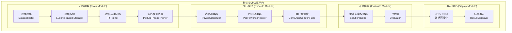
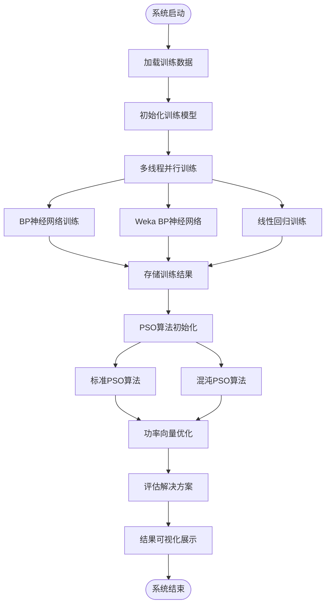
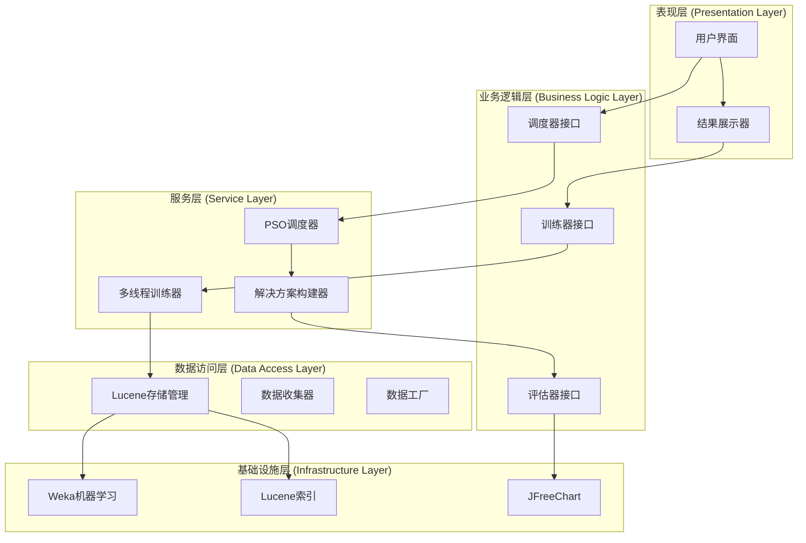
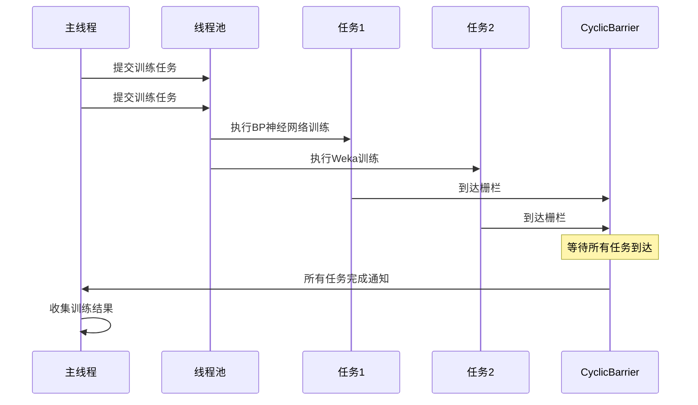

# 技术栈与依赖

<cite>
**本文档引用的文件**
- [pom.xml](file://pom.xml)
- [PtMultiThreadTrainer.java](file://src/main/java/com/leavesfly/iac/train/trainer/PtMultiThreadTrainer.java)
- [BpnnModel.java](file://src/main/java/com/leavesfly/iac/train/trainer/bp/BpnnModel.java)
- [TrainDataSetManagerInLucene.java](file://src/main/java/com/leavesfly/iac/train/store/TrainDataSetManagerInLucene.java)
- [FittingCurve.java](file://src/main/java/com/leavesfly/iac/display/plot/demo/FittingCurve.java)
- [AppContextConstant.java](file://src/main/java/com/leavesfly/iac/config/AppContextConstant.java)
- [BpAlgorithmConstant.java](file://src/main/java/com/leavesfly/iac/config/BpAlgorithmConstant.java)
- [PowerVector.java](file://src/main/java/com/leavesfly/iac/domain/PowerVector.java)
- [README.md](file://README.md)
</cite>

## 目录
1. [项目概述](#项目概述)
2. [技术架构](#技术架构)
3. [核心依赖分析](#核心依赖分析)
4. [内部架构设计](#内部架构设计)
5. [并发编程与设计模式](#并发编程与设计模式)
6. [技术选型背景](#技术选型背景)
7. [总结](#总结)

## 项目概述

IntelliCondition是一个基于机器学习和粒子群优化算法(PSO)的智能空调仿真平台。该项目采用Java 1.7作为核心开发语言，使用Maven进行项目构建和依赖管理。系统通过训练功率-温度映射函数，并使用PSO算法优化空调功率分配，实现最佳的温度控制效果和能耗平衡。

**章节来源**
- [README.md](file://README.md#L1-L50)

## 技术架构

### 系统组成架构



**图表来源**
- [README.md](file://README.md#L20-L40)

### 核心算法架构



**图表来源**
- [PtMultiThreadTrainer.java](file://src/main/java/com/leavesfly/iac/train/trainer/PtMultiThreadTrainer.java#L60-L90)

**章节来源**
- [README.md](file://README.md#L15-L45)

## 核心依赖分析

### Maven依赖结构

项目使用Maven进行依赖管理和构建，核心依赖包括：

```xml
<dependencies>
    <!-- 测试框架 -->
    <dependency>
        <groupId>junit</groupId>
        <artifactId>junit</artifactId>
        <version>4.5</version>
        <scope>test</scope>
    </dependency>
    
    <!-- Apache Commons Lang -->
    <dependency>
        <groupId>commons-lang</groupId>
        <artifactId>commons-lang</artifactId>
        <version>2.6</version>
    </dependency>
    
    <!-- Apache Lucene -->
    <dependency>
        <groupId>org.apache.lucene</groupId>
        <artifactId>lucene-core</artifactId>
        <version>3.6.0</version>
    </dependency>
    
    <!-- Weka机器学习库 -->
    <dependency>
        <groupId>nz.ac.waikato.cms.weka</groupId>
        <artifactId>weka-stable</artifactId>
        <version>3.6.10</version>
    </dependency>
    
    <!-- JFreeChart可视化 -->
    <dependency>
        <groupId>jfree</groupId>
        <artifactId>jfreechart</artifactId>
        <version>1.0.7</version>
    </dependency>
</dependencies>
```

### 关键依赖详解

#### 1. Weka - 机器学习核心引擎

Weka是项目中最重要的机器学习依赖，提供了强大的BP神经网络训练能力：

```java
// Weka BP神经网络模型调用
public class BpWekaTrianTask extends TrainTask {
    @Override
    protected TrainModel getTrainModelInstance() {
        return BpWekaModel.getIntance();
    }
}
```

**Weka的作用**：
- 实现BP神经网络的高级训练算法
- 提供稳定的机器学习模型接口
- 支持复杂的神经网络结构配置
- 优化训练过程的收敛性能

#### 2. Apache Lucene - 高效数据存储

Lucene提供了高性能的全文搜索引擎，用于训练数据的存储和检索：

```java
// 基于Lucene的训练数据管理
public class TrainDataSetManagerInLucene implements TrainDataSetManager {
    private static IndexWriter indexWriter;
    private static Directory directory;
    private static volatile IndexSearcher indexSearcher;
    
    // 支持按传感器ID和室外温度快速检索
    public Collection<IntellacTrainDataItem> fetchTrainDataSetBySensorId(
        String sensorId, float outsideTemp) {
        // 构建布尔查询进行高效检索
    }
}
```

**Lucene的优势**：
- 内存索引提供极快的查询速度
- 支持复杂查询条件组合
- 高效的二进制数据存储
- 可扩展的索引结构

#### 3. JFreeChart - 数据可视化

JFreeChart负责系统的数据可视化展示：

```java
// 多项式拟合曲线绘制
public class FittingCurve extends ApplicationFrame {
    public JFreeChart getChart() {
        XYDataset xydataset = this.getXYDataset();
        JFreeChart xyChart = ChartFactory.createXYLineChart(
            "二次多项式拟合光滑曲线", "X轴", "Y轴", xydataset,
            PlotOrientation.VERTICAL, true, true, false);
        return xyChart;
    }
}
```

**JFreeChart的功能**：
- 支持多种图表类型（折线图、柱状图等）
- 提供平滑曲线拟合算法
- 可定制的图表样式和布局
- 实时数据更新支持

#### 4. Apache Commons Lang - 基础工具库

提供Java基础类型的增强功能：

**章节来源**
- [pom.xml](file://pom.xml#L15-L50)
- [TrainDataSetManagerInLucene.java](file://src/main/java/com/leavesfly/iac/train/store/TrainDataSetManagerInLucene.java#L1-L50)
- [FittingCurve.java](file://src/main/java/com/leavesfly/iac/display/plot/demo/FittingCurve.java#L1-L50)

## 内部架构设计

### 分层设计原则

系统采用清晰的分层架构，每一层都有明确的职责：



**图表来源**
- [PtMultiThreadTrainer.java](file://src/main/java/com/leavesfly/iac/train/trainer/PtMultiThreadTrainer.java#L1-L30)

### 模块化组织

系统按照功能模块进行组织，每个模块职责单一且相对独立：

#### 1. 训练模块 (Train Module)
- **数据收集**：从文本文件收集历史训练数据
- **数据存储**：基于Lucene的高效数据存储
- **模型训练**：支持多种机器学习模型
- **多线程训练**：并发执行多个训练任务

#### 2. 执行模块 (Execute Module)
- **功率调度**：根据优化结果分配空调功率
- **PSO算法**：实现粒子群优化算法
- **用户舒适度**：考虑用户个性化需求

#### 3. 评估模块 (Evaluate Module)
- **解决方案评估**：计算各项性能指标
- **结果比较**：对比不同优化策略的效果

#### 4. 展示模块 (Display Module)
- **数据可视化**：使用JFreeChart展示结果
- **结果输出**：格式化的评估报告

### 高内聚低耦合设计

系统通过接口抽象和依赖注入实现松耦合：

```java
// 多线程训练器的核心设计
public class PtMultiThreadTrainer implements PtTrainer {
    public final ExecutorService executorService;
    public final ModelEnum modelSelect;
    public final CyclicBarrier barrier;
    
    @Override
    public Collection<PtFitFunc> buildFitFuncSet(float outsideTemp) {
        // 根据模型类型动态创建训练任务
        switch (modelSelect) {
            case BPNN:
                trainTask = new BpTrianTask(barrier, trainDataSet, ...);
                break;
            case BPWEKA:
                trainTask = new BpWekaTrianTask(barrier, trainDataSet, ...);
                break;
            case LR:
                trainTask = new LrTrainTask(barrier, trainDataSet, ...);
                break;
        }
        executorService.submit(trainTask);
    }
}
```

**章节来源**
- [PtMultiThreadTrainer.java](file://src/main/java/com/leavesfly/iac/train/trainer/PtMultiThreadTrainer.java#L30-L114)

## 并发编程与设计模式

### ExecutorService - 并行任务调度

系统广泛使用Java并发编程API实现高性能的并行处理：

```java
// 多线程训练器的并发实现
public class PtMultiThreadTrainer implements PtTrainer {
    public final ExecutorService executorService;
    public final CyclicBarrier barrier;
    
    public PtMultiThreadTrainer(TrainDataSetManager trainDataSetManager, ModelEnum modelSelect) {
        // 创建缓存线程池，自动管理线程生命周期
        executorService = Executors.newCachedThreadPool();
        this.modelSelect = modelSelect;
        
        // 使用CyclicBarrier实现多线程同步
        barrier = new CyclicBarrier(AppContextConstant.SENSOR_NUM + 1);
    }
    
    @Override
    public Collection<PtFitFunc> buildFitFuncSet(float outsideTemp) {
        // 为每个传感器并行创建训练任务
        for (String sensorId : sensorIdSet) {
            // 异步提交训练任务
            executorService.submit(trainTask);
        }
        
        // 等待所有训练任务完成
        barrier.await();
        
        // 关闭线程池
        executorService.shutdown();
        return fitFuncSet;
    }
}
```

### 设计模式应用

#### 1. 单例模式 (Singleton Pattern)
```java
// BP神经网络模型的单例实现
public class BpnnModel implements TrainModel {
    public static TrainModel getIntance() {
        return new BpnnModel();
    }
}
```

#### 2. 策略模式 (Strategy Pattern)
```java
// 不同训练模型的策略实现
public interface TrainModel {
    // 统一的训练接口
}

// 具体策略实现
public class BpnnModel implements TrainModel { /* ... */ }
public class BpWekaModel implements TrainModel { /* ... */ }
public class LineRegressModel implements TrainModel { /* ... */ }
```

#### 3. 工厂模式 (Factory Pattern)
```java
// 数据工厂提供线程安全的全局数据访问
public class DataFactory {
    private static volatile DataFactory instance;
    
    public static DataFactory getInstance() {
        if (instance == null) {
            synchronized (DataFactory.class) {
                if (instance == null) {
                    instance = new DataFactory();
                }
            }
        }
        return instance;
    }
}
```

### 并发同步机制

系统使用多种并发同步机制确保数据一致性和线程安全：



**图表来源**
- [PtMultiThreadTrainer.java](file://src/main/java/com/leavesfly/iac/train/trainer/PtMultiThreadTrainer.java#L70-L100)

**章节来源**
- [PtMultiThreadTrainer.java](file://src/main/java/com/leavesfly/iac/train/trainer/PtMultiThreadTrainer.java#L25-L114)

## 技术选型背景

### Java 1.7 - 核心开发语言

选择Java 1.7作为开发语言的原因：

1. **稳定性**：Java 1.7提供了成熟的并发编程API
2. **兼容性**：广泛的生态系统支持
3. **性能**：JVM优化带来的良好性能表现
4. **跨平台**：一次编译，到处运行

### Maven - 项目构建和依赖管理

Maven的选择基于以下考虑：

1. **标准化**：行业标准的构建工具
2. **依赖管理**：自动解析和下载依赖
3. **生命周期**：标准化的项目生命周期管理
4. **插件生态**：丰富的插件支持

### Apache Lucene 3.6.0 - 训练数据存储

Lucene的选择原因：

1. **高性能**：内存索引提供毫秒级查询响应
2. **灵活性**：支持复杂查询和过滤
3. **可扩展**：支持大规模数据存储
4. **成熟度**：经过生产环境验证

### Weka 3.6.10 - 机器学习算法库

Weka作为机器学习核心的原因：

1. **易用性**：简单的API接口
2. **完整性**：支持多种机器学习算法
3. **稳定性**：成熟的算法实现
4. **社区支持**：活跃的开发者社区

### JFreeChart 1.0.7 - 数据可视化

JFreeChart的选择理由：

1. **功能丰富**：支持多种图表类型
2. **定制性强**：可完全自定义图表外观
3. **性能优秀**：高效的渲染引擎
4. **集成简单**：易于与Java应用集成

### Apache Commons Lang 2.6 - 工具类库

Commons Lang提供的重要功能：

1. **字符串处理**：增强的字符串操作方法
2. **对象工具**：对象比较和克隆工具
3. **集合工具**：集合操作辅助方法
4. **日期时间**：日期时间处理工具

### JUnit 4.5 - 单元测试

JUnit作为测试框架的优势：

1. **简单易用**：简洁的注解式测试语法
2. **广泛支持**：IDE和CI/CD工具的全面支持
3. **断言丰富**：提供多种断言方法
4. **扩展性强**：支持自定义Runner和Rule

**章节来源**
- [pom.xml](file://pom.xml#L1-L64)
- [README.md](file://README.md#L50-L80)

## 总结

IntelliCondition项目展现了现代Java企业应用的最佳实践。通过精心选择的技术栈和架构设计，系统实现了高性能、高可靠性的智能空调仿真功能。

### 技术优势

1. **高性能并发**：利用Java并发API实现多线程并行训练
2. **智能算法集成**：深度集成Weka机器学习库和PSO优化算法
3. **高效数据存储**：基于Lucene的内存索引提供极速数据访问
4. **可视化展示**：完整的JFreeChart数据可视化解决方案
5. **模块化设计**：清晰的分层架构和模块化组织

### 架构特色

- **高内聚低耦合**：各模块职责明确，接口设计合理
- **可扩展性**：支持多种机器学习模型和优化算法
- **可维护性**：清晰的代码结构和完善的注释
- **可测试性**：完整的单元测试覆盖

### 发展前景

该项目的技术架构为未来的功能扩展奠定了坚实基础，可以轻松支持更多机器学习算法、优化策略和可视化需求。通过持续的技术演进和功能完善，IntelliCondition将成为智能空调领域的标杆解决方案。