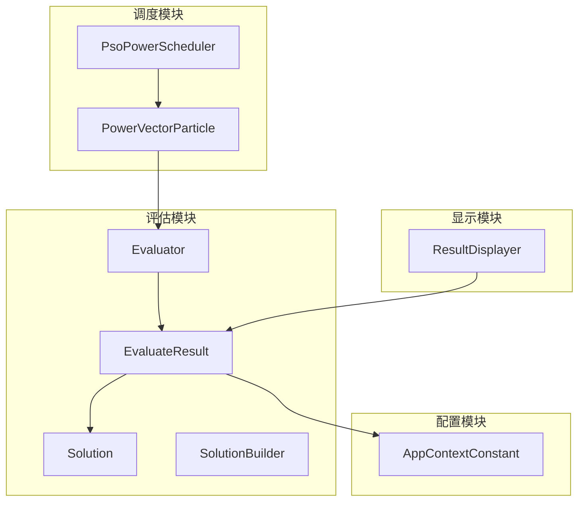
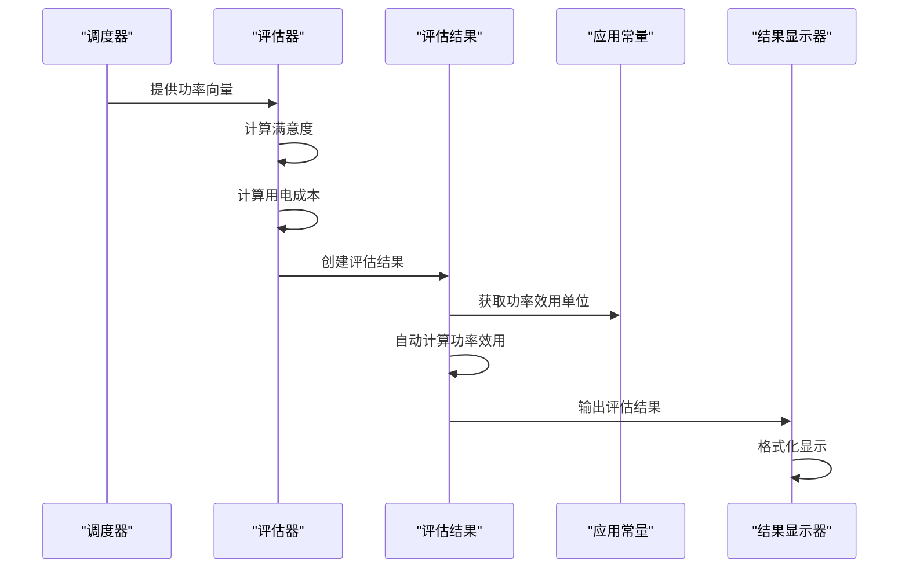
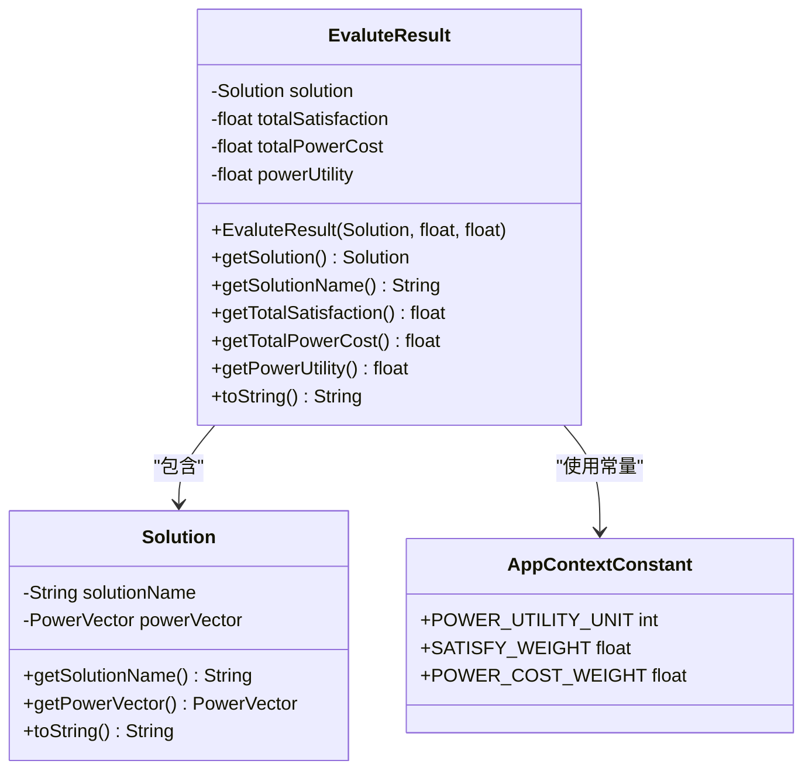
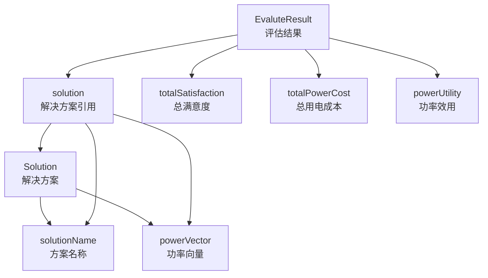
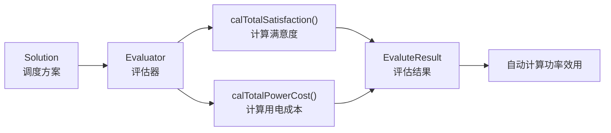
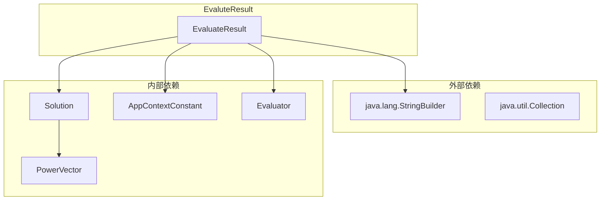

# EvaluteResult 数据模型文档

<cite>
**本文档引用的文件**
- [EvaluteResult.java](file://src/main/java/com/leavesfly/iac/evalute/EvaluteResult.java)
- [Solution.java](file://src/main/java/com/leavesfly/iac/evalute/Solution.java)
- [Evaluator.java](file://src/main/java/com/leavesfly/iac/evalute/Evaluator.java)
- [AppContextConstant.java](file://src/main/java/com/leavesfly/iac/config/AppContextConstant.java)
- [PsoPowerScheduler.java](file://src/main/java/com/leavesfly/iac/execute/scheduler/PsoPowerScheduler.java)
- [PowerVectorParticle.java](file://src/main/java/com/leavesfly/iac/execute/scheduler/PowerVectorParticle.java)
- [UserComfortFunc.java](file://src/main/java/com/leavesfly/iac/execute/domain/UserComfortFunc.java)
</cite>

## 目录
1. [简介](#简介)
2. [项目结构](#项目结构)
3. [核心组件](#核心组件)
4. [架构概览](#架构概览)
5. [详细组件分析](#详细组件分析)
6. [依赖关系分析](#依赖关系分析)
7. [性能考虑](#性能考虑)
8. [故障排除指南](#故障排除指南)
9. [结论](#结论)

## 简介

EvaluteResult 是智能空调仿真平台中的核心数据模型，专门设计用于封装和管理空调功率调度方案的最终评估结果。该类作为评估系统的核心容器，包含了四个关键指标：关联的原始方案、用户总满意度、总用电成本和功率效用。EvaluteResult 类不仅提供了完整的数据封装功能，还实现了自动化的功率效用计算和便捷的结果展示机制。

该数据模型在整个空调调度算法中扮演着至关重要的角色，它连接了算法执行过程与结果分析阶段，为不同调度方案的性能比较提供了统一的数据格式和计算基准。通过精确的指标计算和标准化的输出格式，EvaluteResult 使得算法性能对比变得简单直观。

## 项目结构

EvaluteResult 类位于 `com.leavesfly.iac.evalute` 包中，与其他评估相关类形成了清晰的功能模块划分：



**图表来源**
- [EvaluteResult.java](file://src/main/java/com/leavesfly/iac/evalute/EvaluteResult.java#L1-L105)
- [Solution.java](file://src/main/java/com/leavesfly/iac/evalute/Solution.java#L1-L59)
- [Evaluator.java](file://src/main/java/com/leavesfly/iac/evalute/Evaluator.java#L1-L123)

**章节来源**
- [EvaluteResult.java](file://src/main/java/com/leavesfly/iac/evalute/EvaluteResult.java#L1-L105)

## 核心组件

EvaluteResult 类包含四个核心字段，每个字段都承载着特定的业务含义和计算逻辑：

### 主要字段说明

1. **solution（解决方案）**：存储与评估结果关联的具体空调功率调度方案
2. **totalSatisfaction（总满意度）**：反映用户整体舒适度水平的量化指标
3. **totalPowerCost（总用电成本）**：计算空调系统运行的总电力消耗成本
4. **powerUtility（功率效用）**：综合满意度和成本的效能指标

这些字段共同构成了评估结果的完整视图，使开发者能够全面了解每个调度方案的性能表现。

**章节来源**
- [EvaluteResult.java](file://src/main/java/com/leavesfly/iac/evalute/EvaluteResult.java#L10-L30)

## 架构概览

EvaluteResult 在整个空调调度系统中处于核心位置，作为数据流转的关键节点：



**图表来源**
- [Evaluator.java](file://src/main/java/com/leavesfly/iac/evalute/Evaluator.java#L95-L123)
- [EvaluteResult.java](file://src/main/java/com/leavesfly/iac/evalute/EvaluteResult.java#L32-L38)

## 详细组件分析

### EvaluteResult 类分析

EvaluteResult 类是一个典型的 Java Bean 模式实现，提供了完整的数据封装和访问控制：



**图表来源**
- [EvaluteResult.java](file://src/main/java/com/leavesfly/iac/evalute/EvaluteResult.java#L10-L105)
- [Solution.java](file://src/main/java/com/leavesfly/iac/evalute/Solution.java#L10-L59)
- [AppContextConstant.java](file://src/main/java/com/leavesfly/iac/config/AppContextConstant.java#L120-L125)

#### 构造函数分析

构造函数是 EvaluteResult 的核心逻辑所在，它接收三个基本参数并自动计算功率效用：

```java
public EvaluteResult(Solution solution, float totalSatisfaction, float totalPowerCost) {
    this.solution = solution;
    this.totalSatisfaction = totalSatisfaction;
    this.totalPowerCost = totalPowerCost;
    powerUtility = (totalSatisfaction / totalPowerCost) * AppContextConstant.POWER_UTILITY_UNIT;
}
```

这个构造函数的设计体现了以下关键特性：
- **参数验证**：虽然没有显式的参数检查，但通过调用链保证了输入的有效性
- **自动计算**：功率效用的计算被封装在构造函数中，确保数据的一致性
- **常量依赖**：使用 AppContextConstant.POWER_UTILITY_UNIT 来标准化功率效用的计算

#### 功率效用计算机制

功率效用的计算公式体现了系统对满意度和成本的平衡考量：

```
powerUtility = (totalSatisfaction / totalPowerCost) × POWER_UTILITY_UNIT
```

这种设计的优势在于：
- **归一化处理**：通过 POWER_UTILITY_UNIT 常量将结果标准化到可读范围内
- **成本效益比**：直接反映了每单位成本所能获得的满意度
- **数值稳定性**：避免了因成本过小导致的除零错误

**章节来源**
- [EvaluteResult.java](file://src/main/java/com/leavesfly/iac/evalute/EvaluteResult.java#L32-L38)
- [AppContextConstant.java](file://src/main/java/com/leavesfly/iac/config/AppContextConstant.java#L120-L125)

### Solution 类集成

EvaluteResult 与 Solution 类形成了紧密的关联关系，Solution 类提供了完整的调度方案信息：



**图表来源**
- [Solution.java](file://src/main/java/com/leavesfly/iac/evalute/Solution.java#L10-L59)
- [EvaluteResult.java](file://src/main/java/com/leavesfly/iac/evalute/EvaluteResult.java#L10-L30)

**章节来源**
- [Solution.java](file://src/main/java/com/leavesfly/iac/evalute/Solution.java#L1-L59)

### toString() 方法实现

EvaluteResult 的 toString() 方法提供了标准化的结果输出格式：

```java
@Override
public String toString() {
    StringBuilder strBuilder = new StringBuilder();
    strBuilder.append(solution.toString()).append("\t")
              .append("totalSatisfaction:").append(totalSatisfaction).append("\t")
              .append("totalPowerCost:").append(totalPowerCost).append("\t")
              .append("powerUtility:").append(powerUtility);
    return strBuilder.toString();
}
```

这个实现的特点包括：
- **制表符分隔**：使用制表符（\t）分隔不同字段，便于表格化显示
- **结构化输出**：每个字段都有明确的标签标识
- **可读性强**：生成的字符串易于理解和解析
- **兼容性好**：适合各种数据处理和可视化工具

**章节来源**
- [EvaluteResult.java](file://src/main/java/com/leavesfly/iac/evalute/EvaluteResult.java#L90-L105)

### 评估流程集成

EvaluteResult 在整个评估流程中发挥着关键作用，特别是在 Evaluator 类的 transform 方法中：



**图表来源**
- [Evaluator.java](file://src/main/java/com/leavesfly/iac/evalute/Evaluator.java#L95-L123)
- [EvaluteResult.java](file://src/main/java/com/leavesfly/iac/evalute/EvaluteResult.java#L32-L38)

**章节来源**
- [Evaluator.java](file://src/main/java/com/leavesfly/iac/evalute/Evaluator.java#L95-L123)

## 依赖关系分析

EvaluteResult 的依赖关系展现了系统的模块化设计：



**图表来源**
- [EvaluteResult.java](file://src/main/java/com/leavesfly/iac/evalute/EvaluteResult.java#L1-L5)
- [AppContextConstant.java](file://src/main/java/com/leavesfly/iac/config/AppContextConstant.java#L1-L150)

### 关键依赖说明

1. **AppContextConstant.POWER_UTILITY_UNIT**：这是功率效用计算的核心常量，决定了结果的数值范围
2. **Solution 类**：提供了完整的调度方案信息，包括方案名称和功率向量
3. **Evaluator 类**：负责实际的评估计算，将原始数据转换为 EvaluteResult 实例

**章节来源**
- [EvaluteResult.java](file://src/main/java/com/leavesfly/iac/evalute/EvaluteResult.java#L1-L105)
- [AppContextConstant.java](file://src/main/java/com/leavesfly/iac/config/AppContextConstant.java#L120-L125)

## 性能考虑

EvaluteResult 类在设计时充分考虑了性能优化：

### 内存效率
- **不可变设计**：一旦创建，EvaluteResult 对象的状态保持不变，有利于多线程环境下的安全使用
- **延迟计算**：功率效用在构造时一次性计算，避免重复计算的开销

### 计算效率
- **单次计算**：功率效用的计算只在构造函数中执行一次，提高了运行时性能
- **常量优化**：使用静态常量而非动态计算，减少了运行时开销

### 扩展性考虑
- **接口设计**：提供了完整的 getter 方法，便于扩展新的评估指标
- **格式化支持**：toString() 方法提供了标准化的输出格式，便于集成到各种展示系统中

## 故障排除指南

### 常见问题及解决方案

1. **功率效用异常**
   - **问题**：计算出的功率效用值异常高或低
   - **原因**：totalPowerCost 接近零或负值
   - **解决方案**：在构造函数中添加输入验证，确保 totalPowerCost 为正数

2. **空指针异常**
   - **问题**：NullPointerException 在访问 solution 或其他字段时发生
   - **原因**：传入的参数为 null
   - **解决方案**：在构造函数中添加非空检查

3. **精度丢失**
   - **问题**：浮点数运算导致精度损失
   - **原因**：连续的浮点运算累积误差
   - **解决方案**：考虑使用 BigDecimal 进行高精度计算

**章节来源**
- [EvaluteResult.java](file://src/main/java/com/leavesfly/iac/evalute/EvaluteResult.java#L32-L38)

## 结论

EvaluteResult 数据模型是智能空调仿真平台的核心组件之一，它成功地将复杂的评估指标整合到一个简洁而强大的数据结构中。通过精心设计的字段组合、自动化的计算逻辑和标准化的输出格式，EvaluteResult 为整个调度系统的性能评估提供了坚实的基础。

该类的主要优势包括：
- **完整性**：涵盖了评估所需的所有关键指标
- **自动化**：减少了手动计算的工作量和出错的可能性
- **标准化**：提供了统一的结果格式，便于后续处理和分析
- **可扩展性**：良好的设计模式为未来的功能扩展预留了空间

EvaluteResult 不仅是一个数据容器，更是连接算法执行与结果分析的桥梁，它的设计体现了软件工程中关注点分离和单一职责原则的最佳实践。通过深入理解这个类的设计理念和实现细节，开发者可以更好地利用其功能来构建高效的空调调度系统。