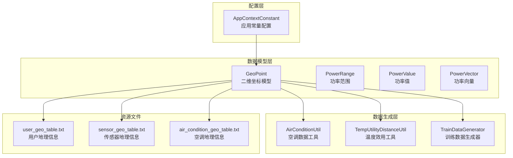
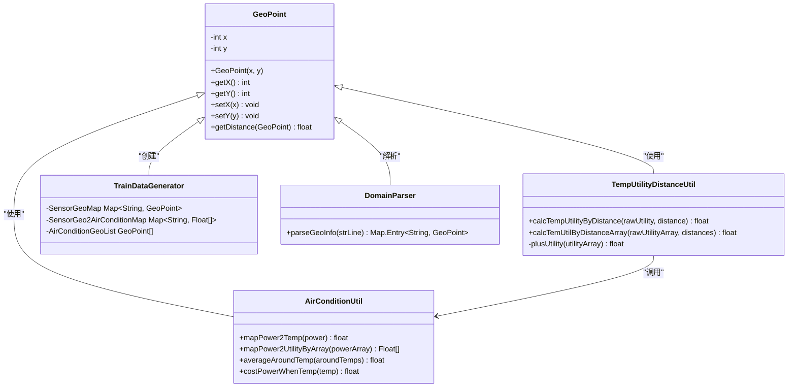
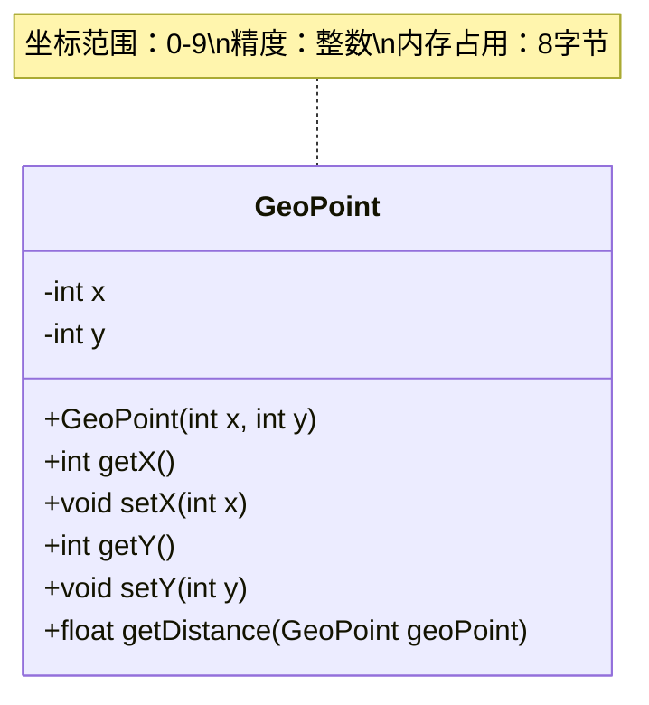
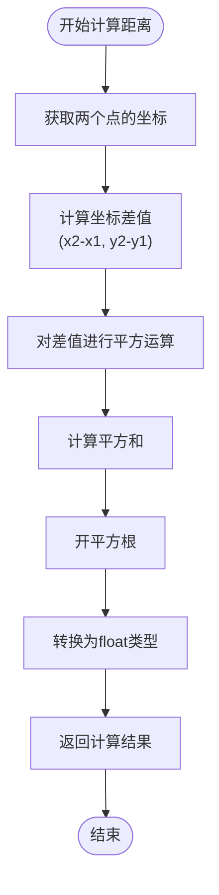
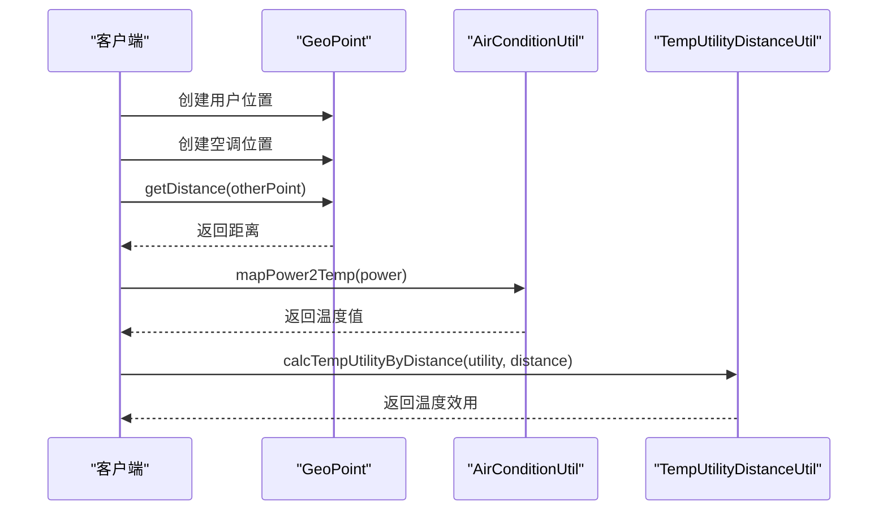
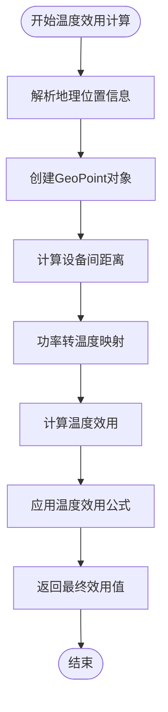
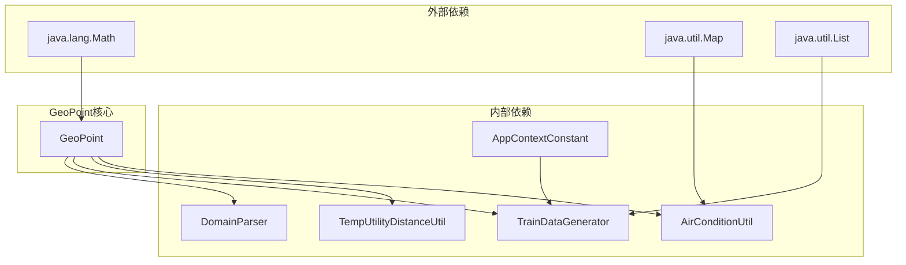

# GeoPoint数据模型文档

<cite>
**本文档引用的文件**
- [GeoPoint.java](file://src/main/java/com/leavesfly/iac/domain/GeoPoint.java)
- [AirConditionUtil.java](file://src/main/java/com/leavesfly/iac/datasource/datagene/AirConditionUtil.java)
- [TempUtilityDistanceUtil.java](file://src/main/java/com/leavesfly/iac/datasource/datagene/TempUtilityDistanceUtil.java)
- [TrainDataGenerator.java](file://src/main/java/com/leavesfly/iac/datasource/datagene/TrainDataGenerator.java)
- [DomainParser.java](file://src/main/java/com/leavesfly/iac/datasource/DomainParser.java)
- [AppContextConstant.java](file://src/main/java/com/leavesfly/iac/config/AppContextConstant.java)
- [user_geo_table.txt](file://src/main/resource/user_geo_table.txt)
- [sensor_geo_table.txt](file://src/main/resource/sensor_geo_table.txt)
- [air_condition_geo_table.txt](file://src/main/resource/air_condition_geo_table.txt)
</cite>

## 目录
1. [简介](#简介)
2. [项目结构](#项目结构)
3. [核心组件](#核心组件)
4. [架构概览](#架构概览)
5. [详细组件分析](#详细组件分析)
6. [依赖关系分析](#依赖关系分析)
7. [性能考虑](#性能考虑)
8. [故障排除指南](#故障排除指南)
9. [结论](#结论)

## 简介

GeoPoint是智能空调仿真平台中的核心数据模型，用于表示系统中各类设备（空调、传感器、用户）的二维平面坐标位置。该类提供了简洁而高效的二维坐标存储和距离计算功能，是整个系统中地理位置相关计算的基础组件。

GeoPoint类采用简单的整型坐标设计，通过x和y两个字段精确表示设备在10x10米区域内的位置。这种设计既保证了计算效率，又满足了仿真精度需求。类中最重要的方法是`getDistance(GeoPoint)`，它实现了欧几里得距离计算，为系统中的温度影响模拟和设备间交互提供了数学基础。

## 项目结构

GeoPoint数据模型在整个项目架构中占据重要地位，位于domain包中作为核心领域对象。其设计遵循了面向对象的基本原则，提供了清晰的接口和良好的封装性。



**图表来源**
- [GeoPoint.java](file://src/main/java/com/leavesfly/iac/domain/GeoPoint.java#L1-L75)
- [AppContextConstant.java](file://src/main/java/com/leavesfly/iac/config/AppContextConstant.java#L1-L150)

## 核心组件

GeoPoint类的核心组件包括两个基本属性和一系列操作方法。这些组件协同工作，为系统提供完整的地理位置管理功能。

### 坐标字段设计

GeoPoint类使用两个整型字段来表示二维坐标：

- **x坐标**：表示设备在水平方向上的位置
- **y坐标**：表示设备在垂直方向上的位置

这种设计具有以下优势：
- **内存效率**：整型占用固定内存空间，适合大量对象存储
- **计算效率**：整数运算比浮点运算更快
- **精度控制**：避免浮点数精度问题
- **简单直观**：符合二维平面坐标系的标准表示

### 距离计算核心

`getDistance(GeoPoint)`方法是GeoPoint类的核心功能，实现了欧几里得距离计算：

```java
public float getDistance(GeoPoint geoPoint) {
    return (float) (Math.sqrt(Math.pow(geoPoint.getX() - x, 2) + Math.pow(geoPoint.getY() - y, 2)));
}
```

该方法的计算过程：
1. 计算两个点在x轴和y轴上的坐标差
2. 对差值进行平方运算
3. 将平方和相加
4. 对总和开平方根
5. 转换为float类型返回

**章节来源**
- [GeoPoint.java](file://src/main/java/com/leavesfly/iac/domain/GeoPoint.java#L1-L75)

## 架构概览

GeoPoint在智能空调仿真系统中扮演着基础设施的角色，支撑着整个系统的地理位置相关功能。其架构设计体现了分层思想和模块化原则。



**图表来源**
- [GeoPoint.java](file://src/main/java/com/leavesfly/iac/domain/GeoPoint.java#L1-L75)
- [AirConditionUtil.java](file://src/main/java/com/leavesfly/iac/datasource/datagene/AirConditionUtil.java#L1-L51)
- [TempUtilityDistanceUtil.java](file://src/main/java/com/leavesfly/iac/datasource/datagene/TempUtilityDistanceUtil.java#L1-L62)

## 详细组件分析

### GeoPoint类详细分析

GeoPoint类是一个典型的Java Bean，具有标准的getter/setter方法和构造函数。其设计充分体现了面向对象编程的最佳实践。

#### 类结构图



**图表来源**
- [GeoPoint.java](file://src/main/java/com/leavesfly/iac/domain/GeoPoint.java#L1-L75)

#### 构造函数和访问器

GeoPoint类提供了简洁的构造函数和访问器方法：

```java
// 构造函数
public GeoPoint(int x, int y) {
    this.x = x;
    this.y = y;
}

// 访问器方法
public int getX() { return x; }
public int getY() { return y; }
public void setX(int x) { this.x = x; }
public void setY(int y) { this.y = y; }
```

这些方法的设计特点：
- **直接赋值**：没有额外的验证逻辑，保持高性能
- **无参数检查**：假设调用者已经确保输入的有效性
- **标准命名**：符合JavaBean规范

#### 距离计算方法深度分析

`getDistance(GeoPoint)`方法是GeoPoint类的核心功能，其实现体现了数学原理和编程技巧的完美结合：



**图表来源**
- [GeoPoint.java](file://src/main/java/com/leavesfly/iac/domain/GeoPoint.java#L60-L65)

该方法的数学基础是欧几里得距离公式：
```
distance = √[(x₂-x₁)² + (y₂-y₁)²]
```

这种方法的优势：
- **准确性**：精确计算两点间的直线距离
- **通用性**：适用于任何二维坐标系
- **可扩展性**：可以轻松扩展到三维空间

**章节来源**
- [GeoPoint.java](file://src/main/java/com/leavesfly/iac/domain/GeoPoint.java#L1-L75)

### 在数据生成工具中的应用

GeoPoint类在多个数据生成工具中发挥重要作用，特别是在温度效用计算和距离映射方面。

#### AirConditionUtil的应用

AirConditionUtil类展示了GeoPoint在功率转换中的应用：



**图表来源**
- [AirConditionUtil.java](file://src/main/java/com/leavesfly/iac/datasource/datagene/AirConditionUtil.java#L1-L51)
- [TempUtilityDistanceUtil.java](file://src/main/java/com/leavesfly/iac/datasource/datagene/TempUtilityDistanceUtil.java#L1-L62)

#### 温度效用计算流程

TempUtilityDistanceUtil类展示了GeoPoint在温度影响模拟中的具体应用：



**图表来源**
- [TrainDataGenerator.java](file://src/main/java/com/leavesfly/iac/datasource/datagene/TrainDataGenerator.java#L43-L88)
- [TempUtilityDistanceUtil.java](file://src/main/java/com/leavesfly/iac/datasource/datagene/TempUtilityDistanceUtil.java#L1-L62)

**章节来源**
- [AirConditionUtil.java](file://src/main/java/com/leavesfly/iac/datasource/datagene/AirConditionUtil.java#L1-L51)
- [TempUtilityDistanceUtil.java](file://src/main/java/com/leavesfly/iac/datasource/datagene/TempUtilityDistanceUtil.java#L1-L62)

### 实际使用示例

#### 实例化GeoPoint对象

以下是GeoPoint类的实际使用示例：

```java
// 创建用户位置
GeoPoint userLocation = new GeoPoint(5, 3);

// 创建空调位置
GeoPoint acLocation = new GeoPoint(7, 9);

// 计算两者之间的距离
float distance = userLocation.getDistance(acLocation);
System.out.println("用户与空调的距离：" + distance + "米");
```

#### 基于地理位置的温度影响模拟

```java
// 计算温度效用
float rawUtility = 10.0f; // 原始效用值
float distance = userLocation.getDistance(acLocation); // 距离
float temperatureEffect = TempUtilityDistanceUtil.calcTempUtilityByDistance(rawUtility, distance);
```

#### 批量设备距离计算

```java
// 计算传感器到所有空调的距离
GeoPoint sensor = new GeoPoint(5, 2);
Float[] distances = new Float[8]; // 假设有8个空调

for (int i = 0; i < 8; i++) {
    GeoPoint ac = new GeoPoint(/* 空调坐标 */);
    distances[i] = sensor.getDistance(ac);
}
```

**章节来源**
- [TrainDataGenerator.java](file://src/main/java/com/leavesfly/iac/datasource/datagene/TrainDataGenerator.java#L43-L88)

## 依赖关系分析

GeoPoint类在整个系统中具有广泛的依赖关系，体现了其作为基础设施组件的重要性。



**图表来源**
- [GeoPoint.java](file://src/main/java/com/leavesfly/iac/domain/GeoPoint.java#L1-L75)
- [AppContextConstant.java](file://src/main/java/com/leavesfly/iac/config/AppContextConstant.java#L1-L150)

### 外部依赖分析

GeoPoint类主要依赖以下外部库：

1. **java.lang.Math**：提供数学运算功能，特别是sqrt和pow方法
2. **java.util.Map**：在数据生成工具中用于存储地理位置映射
3. **java.util.List**：在批量处理中用于存储设备列表

### 内部依赖分析

GeoPoint类被多个内部组件广泛使用：

- **AirConditionUtil**：用于功率到温度的转换计算
- **TempUtilityDistanceUtil**：用于温度效用计算
- **TrainDataGenerator**：用于批量生成训练数据
- **DomainParser**：用于解析地理位置文件

**章节来源**
- [GeoPoint.java](file://src/main/java/com/leavesfly/iac/domain/GeoPoint.java#L1-L75)
- [AppContextConstant.java](file://src/main/java/com/leavesfly/iac/config/AppContextConstant.java#L1-L150)

## 性能考虑

GeoPoint类的设计充分考虑了性能优化，采用了多种策略来提高运行效率。

### 内存优化

- **基本数据类型**：使用int而非Integer，减少对象开销
- **固定内存占用**：每个GeoPoint对象占用8字节内存
- **无额外字段**：不包含不必要的元数据或缓存

### 计算优化

- **整数运算**：坐标使用整数，避免浮点运算开销
- **直接数学运算**：getDistance方法直接使用Math库函数
- **无额外验证**：构造函数和方法不包含参数验证逻辑

### 使用建议

1. **批量处理**：在需要计算大量距离时，优先使用数组而非单个对象
2. **缓存结果**：对于重复计算的距离，应该缓存结果
3. **合理范围**：坐标值应限制在0-9范围内，避免溢出风险

## 故障排除指南

### 常见问题及解决方案

#### 1. 坐标越界问题

**问题描述**：坐标值超出预期范围导致计算错误

**解决方案**：
```java
// 在使用前进行范围检查
if (x >= 0 && x < AppContextConstant.AREA_LENGTH && 
    y >= 0 && y < AppContextConstant.AREA_WITCH) {
    GeoPoint point = new GeoPoint(x, y);
}
```

#### 2. 距离计算精度问题

**问题描述**：浮点数精度可能导致微小误差

**解决方案**：
```java
// 使用适当的精度控制
float distance = Math.round(originalDistance * 100.0f) / 100.0f;
```

#### 3. 内存泄漏问题

**问题描述**：大量GeoPoint对象可能导致内存压力

**解决方案**：
```java
// 使用对象池模式
private static final ObjectPool<GeoPoint> pool = new ObjectPool<>(GeoPoint::new);

// 使用完毕后归还对象
GeoPoint point = pool.borrowObject();
try {
    // 使用point
} finally {
    pool.returnObject(point);
}
```

**章节来源**
- [GeoPoint.java](file://src/main/java/com/leavesfly/iac/domain/GeoPoint.java#L1-L75)
- [AppContextConstant.java](file://src/main/java/com/leavesfly/iac/config/AppContextConstant.java#L1-L150)

## 结论

GeoPoint数据模型是智能空调仿真平台的核心基础设施，其简洁而高效的设计为整个系统提供了可靠的地理位置管理功能。通过两个整型坐标字段和欧几里得距离计算方法，GeoPoint成功地平衡了性能、精度和易用性。

该类的主要优势包括：
- **高性能**：整数运算和简单结构确保了最佳性能
- **高精度**：精确的欧几里得距离计算满足仿真需求
- **易扩展**：清晰的接口设计便于功能扩展
- **低耦合**：独立的设计使其易于在不同模块中使用

GeoPoint类在AirConditionUtil、TempUtilityDistanceUtil等关键工具中的广泛应用，证明了其设计的成功。它不仅支持了温度影响模拟，还为基于地理位置的决策提供了数学基础。

未来的发展方向可能包括：
- 支持三维坐标扩展
- 添加更多的几何计算方法
- 实现更复杂的距离计算算法
- 提供更丰富的坐标变换功能

总的来说，GeoPoint类作为一个优秀的数据模型，为智能空调仿真平台的成功实施奠定了坚实的基础。