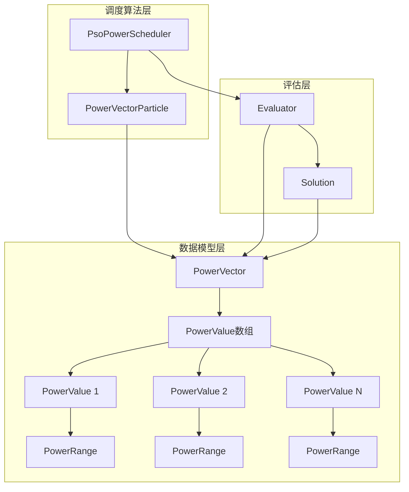
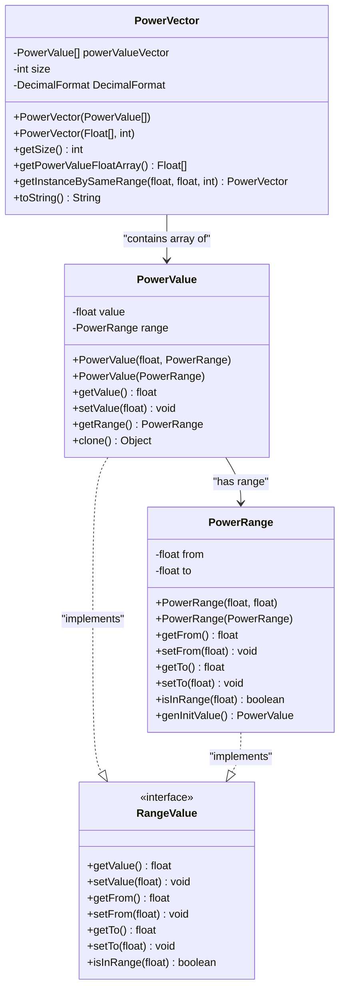
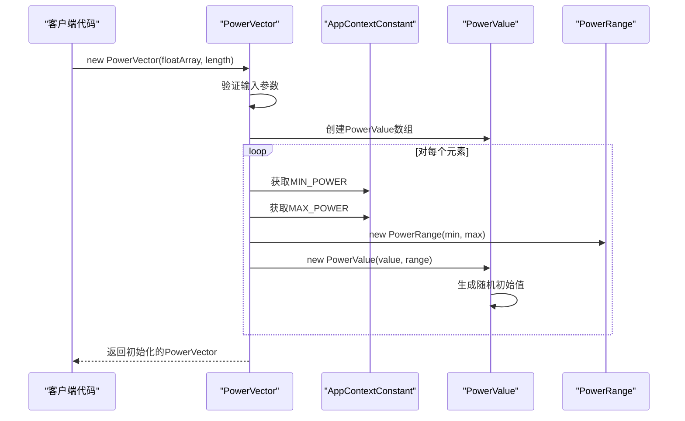
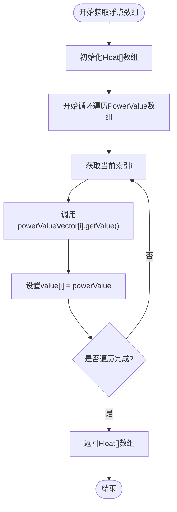
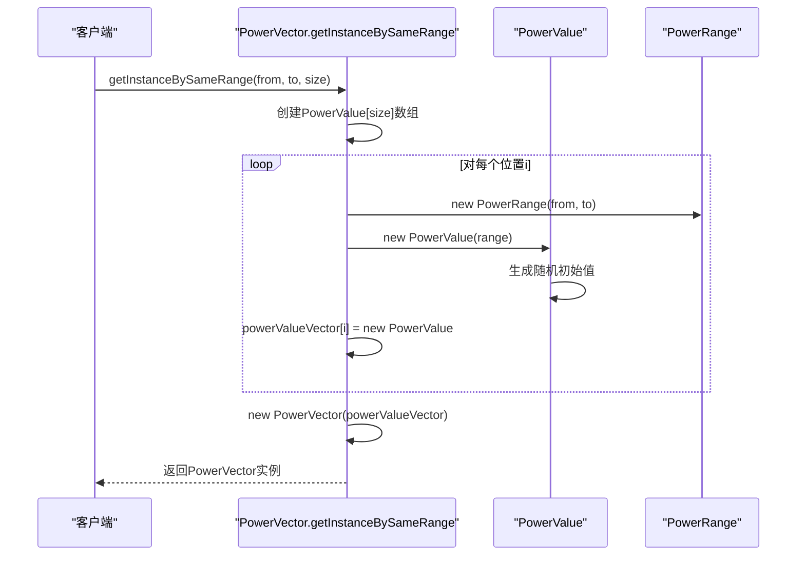
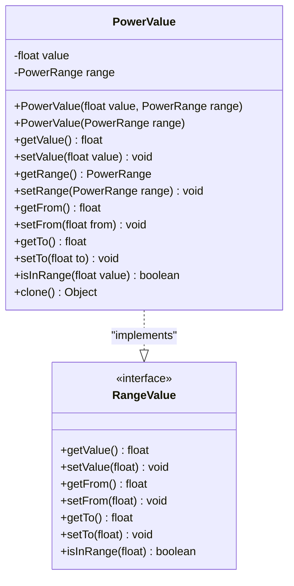
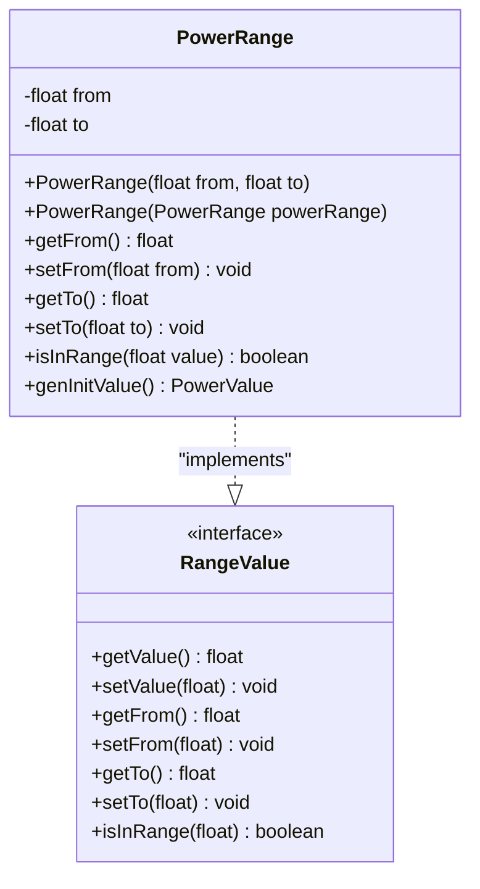
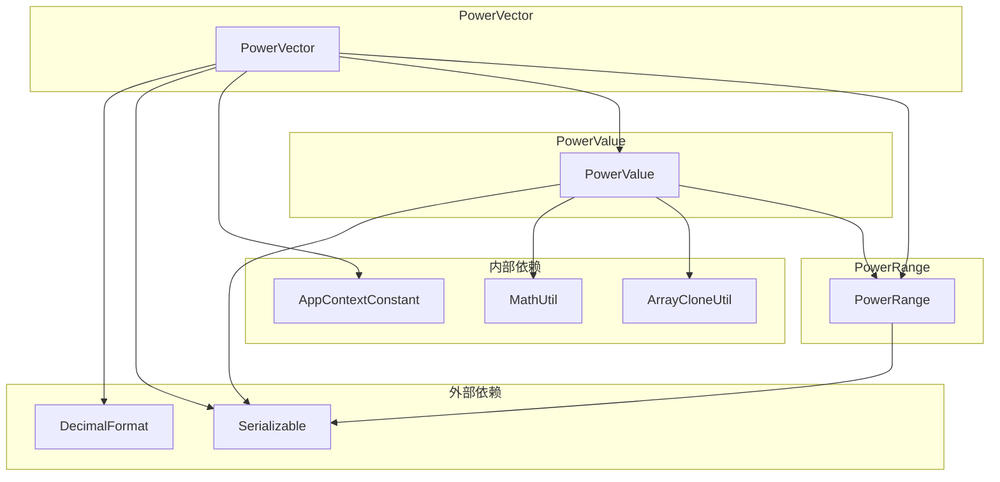

# PowerVector数据模型文档

<cite>
**本文档引用的文件**
- [PowerVector.java](file://src/main/java/com/leavesfly/iac/domain/PowerVector.java)
- [PowerValue.java](file://src/main/java/com/leavesfly/iac/domain/PowerValue.java)
- [PowerRange.java](file://src/main/java/com/leavesfly/iac/domain/PowerRange.java)
- [AppContextConstant.java](file://src/main/java/com/leavesfly/iac/config/AppContextConstant.java)
- [PsoPowerScheduler.java](file://src/main/java/com/leavesfly/iac/execute/scheduler/PsoPowerScheduler.java)
- [PowerVectorParticle.java](file://src/main/java/com/leavesfly/iac/execute/scheduler/PowerVectorParticle.java)
- [Evaluator.java](file://src/main/java/com/leavesfly/iac/evalute/Evaluator.java)
- [Solution.java](file://src/main/java/com/leavesfly/iac/evalute/Solution.java)
</cite>

## 目录
1. [简介](#简介)
2. [项目结构](#项目结构)
3. [核心组件](#核心组件)
4. [架构概览](#架构概览)
5. [详细组件分析](#详细组件分析)
6. [依赖关系分析](#依赖关系分析)
7. [性能考虑](#性能考虑)
8. [故障排除指南](#故障排除指南)
9. [结论](#结论)

## 简介

PowerVector是智能空调仿真平台中的核心数据模型，专门设计用于表示空调设备的功率向量配置。该类作为PSO（粒子群优化）算法中粒子的基础表示，承载着空调系统中每个设备的功率值及其约束范围信息。

PowerVector类采用数组结构存储PowerValue对象，每个PowerValue包含具体的功率值和对应的PowerRange约束范围。这种设计使得系统能够精确控制空调设备的功率输出，同时确保所有功率值都在合理的物理范围内。

## 项目结构

PowerVector数据模型在整个智能空调仿真系统中占据重要地位，其结构与其他核心组件紧密集成：



**图表来源**
- [PowerVector.java](file://src/main/java/com/leavesfly/iac/domain/PowerVector.java#L1-L142)
- [PsoPowerScheduler.java](file://src/main/java/com/leavesfly/iac/execute/scheduler/PsoPowerScheduler.java#L1-L91)

## 核心组件

PowerVector数据模型由三个核心组件构成，形成了完整的功率向量表示体系：

### PowerValue组件
PowerValue类封装了具体的功率值及其取值范围，实现了RangeValue接口，提供了完整的范围验证和操作功能。

### PowerRange组件
PowerRange类定义了功率值的有效范围，包含最小值和最大值，并提供了范围验证和初始值生成功能。

### PowerVector组件
PowerVector类作为容器，管理多个PowerValue对象，提供了向量级别的操作和转换功能。

**章节来源**
- [PowerVector.java](file://src/main/java/com/leavesfly/iac/domain/PowerVector.java#L1-L142)
- [PowerValue.java](file://src/main/java/com/leavesfly/iac/domain/PowerValue.java#L1-L183)
- [PowerRange.java](file://src/main/java/com/leavesfly/iac/domain/PowerRange.java#L1-L105)

## 架构概览

PowerVector数据模型在整个智能空调仿真系统中扮演着关键角色，其架构设计体现了分层和模块化的思想：



**图表来源**
- [PowerVector.java](file://src/main/java/com/leavesfly/iac/domain/PowerVector.java#L1-L142)
- [PowerValue.java](file://src/main/java/com/leavesfly/iac/domain/PowerValue.java#L1-L183)
- [PowerRange.java](file://src/main/java/com/leavesfly/iac/domain/PowerRange.java#L1-L105)

## 详细组件分析

### PowerVector类详细分析

PowerVector类是整个功率向量系统的核心，提供了两种不同的构造函数来满足不同的使用场景：

#### 构造函数分析

**第一种构造函数：直接传入PowerValue数组**
```java
public PowerVector(PowerValue[] powerValueVector)
```
这个构造函数适用于已经存在PowerValue对象的情况，例如从序列化数据恢复或手动构建功率向量时使用。

**第二种构造函数：传入浮点数组和长度**
```java
public PowerVector(Float[] powerValueArray, int length)
```
这个构造函数在初始化时会自动应用全局最小/最大功率限制，这些限制定义在AppContextConstant中：
- `AIR_CONDITION_MIN_POWER = 0.0f`
- `AIR_CONDITION_MAX_POWER = 400.0f`



**图表来源**
- [PowerVector.java](file://src/main/java/com/leavesfly/iac/domain/PowerVector.java#L41-L58)
- [AppContextConstant.java](file://src/main/java/com/leavesfly/iac/config/AppContextConstant.java#L89-L93)

#### 核心方法分析

**getSize()方法**
```java
public int getSize()
```
该方法返回功率向量的大小，即PowerValue数组的长度。这是调度算法中重要的元数据，用于确定粒子维度和算法参数。

**getPowerValueFloatArray()方法**
```java
public Float[] getPowerValueFloatArray()
```
该方法将PowerValue数组转换为纯浮点数数组，主要用于算法计算和结果输出。它遍历所有PowerValue对象，提取其值字段。



**图表来源**
- [PowerVector.java](file://src/main/java/com/leavesfly/iac/domain/PowerVector.java#L83-L91)

**getInstanceBySameRange静态方法**
```java
public static PowerVector getInstanceBySameRange(float from, float to, int size)
```
这个静态工厂方法用于创建具有统一范围的功率向量实例。它特别适用于需要所有空调设备在相同功率范围内运行的场景。



**图表来源**
- [PowerVector.java](file://src/main/java/com/leavesfly/iac/domain/PowerVector.java#L108-L117)

**toString()方法**
```java
@Override
public String toString()
```
该方法提供了调试友好的字符串表示，格式化输出所有功率值，便于算法调试和结果展示。

**章节来源**
- [PowerVector.java](file://src/main/java/com/leavesfly/iac/domain/PowerVector.java#L1-L142)

### PowerValue类详细分析

PowerValue类实现了RangeValue接口，提供了完整的功率值管理和范围控制功能：



**图表来源**
- [PowerValue.java](file://src/main/java/com/leavesfly/iac/domain/PowerValue.java#L1-L183)

**章节来源**
- [PowerValue.java](file://src/main/java/com/leavesfly/iac/domain/PowerValue.java#L1-L183)

### PowerRange类详细分析

PowerRange类提供了功率范围的完整管理功能，支持范围验证和初始值生成：



**图表来源**
- [PowerRange.java](file://src/main/java/com/leavesfly/iac/domain/PowerRange.java#L1-L105)

**章节来源**
- [PowerRange.java](file://src/main/java/com/leavesfly/iac/domain/PowerRange.java#L1-L105)

## 依赖关系分析

PowerVector数据模型的依赖关系体现了系统的模块化设计：



**图表来源**
- [PowerVector.java](file://src/main/java/com/leavesfly/iac/domain/PowerVector.java#L1-L10)
- [PowerValue.java](file://src/main/java/com/leavesfly/iac/domain/PowerValue.java#L1-L10)

**章节来源**
- [PowerVector.java](file://src/main/java/com/leavesfly/iac/domain/PowerVector.java#L1-L142)
- [PowerValue.java](file://src/main/java/com/leavesfly/iac/domain/PowerValue.java#L1-L183)
- [PowerRange.java](file://src/main/java/com/leavesfly/iac/domain/PowerRange.java#L1-L105)

## 性能考虑

PowerVector数据模型在设计时充分考虑了性能优化：

### 内存效率
- 使用基本数据类型（float）存储功率值，减少内存开销
- 实现Serializable接口支持高效的序列化传输
- 采用数组结构而非动态列表，提高访问速度

### 计算效率
- 提供直接的浮点数组转换方法，避免不必要的对象创建
- 静态工厂方法减少重复的对象初始化开销
- 范围验证逻辑简单高效，时间复杂度为O(1)

### 并发安全
- 所有方法都是无状态的，天然支持并发访问
- 不可变字段设计确保线程安全

## 故障排除指南

### 常见问题及解决方案

**IllegalArgumentException异常**
当使用Float[]构造函数时，如果输入数组为null或长度不匹配，会抛出此异常。解决方法是确保输入参数的有效性。

**范围验证失败**
如果尝试设置超出PowerRange范围的功率值，可能会导致验证失败。建议在设置值之前先检查范围。

**序列化问题**
虽然实现了Serializable接口，但在跨版本迁移时仍可能出现兼容性问题。建议定期测试序列化/反序列化流程。

**章节来源**
- [PowerVector.java](file://src/main/java/com/leavesfly/iac/domain/PowerVector.java#L41-L58)

## 结论

PowerVector数据模型是智能空调仿真平台的核心组件，通过精心设计的三层结构（PowerVector、PowerValue、PowerRange），实现了空调功率向量的完整表示和管理。其主要特点包括：

1. **灵活的构造方式**：支持多种初始化方式，适应不同的使用场景
2. **完整的范围控制**：通过PowerRange确保所有功率值都在合理范围内
3. **高效的算法支持**：提供必要的方法支持PSO算法和其他优化算法
4. **良好的扩展性**：清晰的接口设计便于功能扩展和维护
5. **完善的调试支持**：提供详细的字符串表示便于调试和监控

该数据模型在PSO算法粒子表示、调度方案生成和系统评估中发挥着关键作用，是整个智能空调仿真系统稳定运行的重要基础。