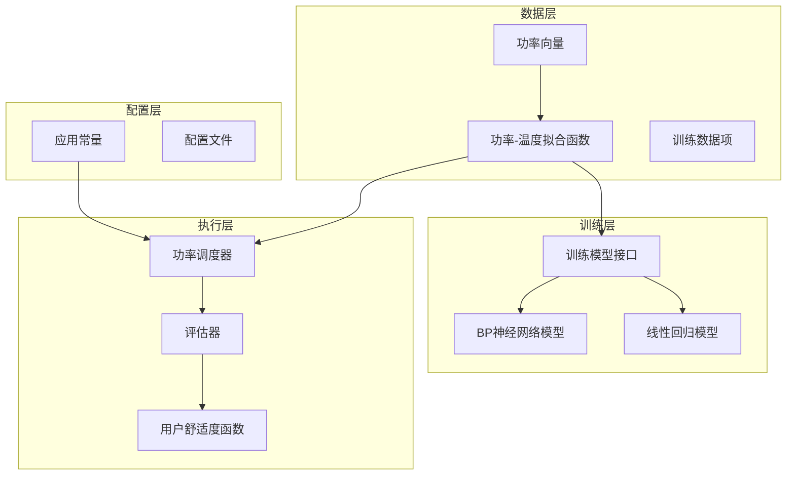
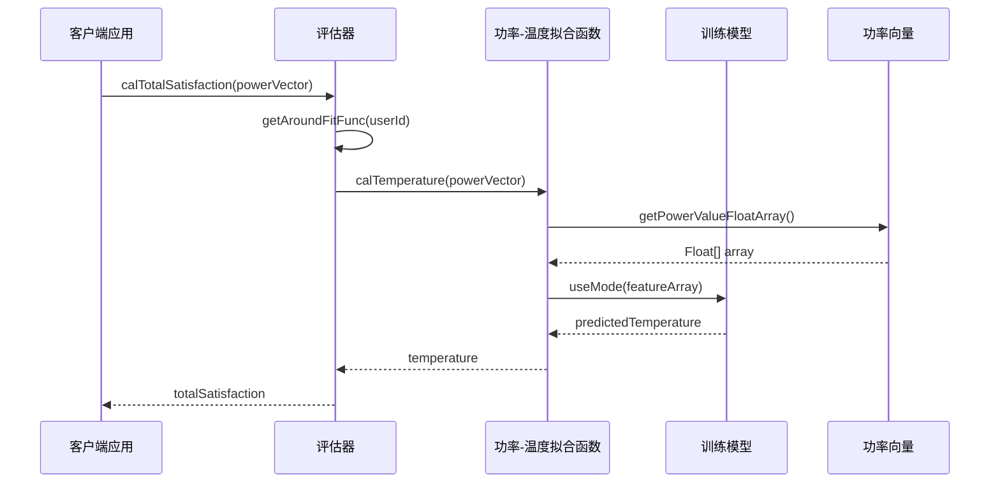
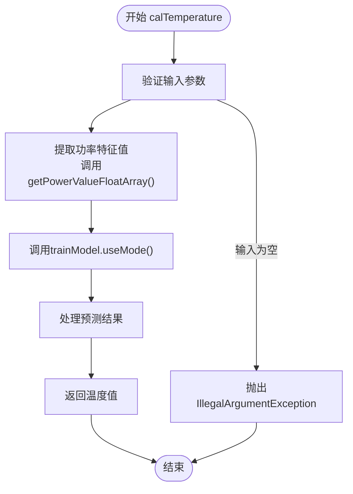
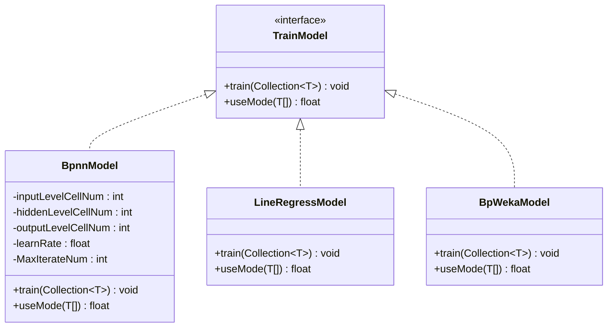
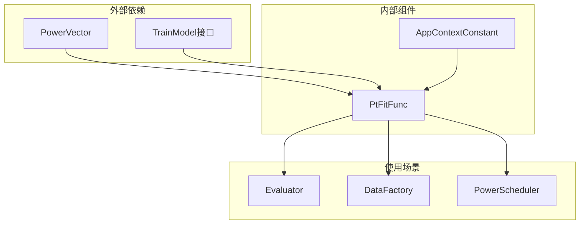

# PtFitFunc数据模型详细文档

<cite>
**本文档引用的文件**
- [PtFitFunc.java](file://src/main/java/com/leavesfly/iac/domain/PtFitFunc.java)
- [PowerVector.java](file://src/main/java/com/leavesfly/iac/domain/PowerVector.java)
- [TrainModel.java](file://src/main/java/com/leavesfly/iac/train/trainer/TrainModel.java)
- [BpnnModel.java](file://src/main/java/com/leavesfly/iac/train/trainer/bp/BpnnModel.java)
- [Evaluator.java](file://src/main/java/com/leavesfly/iac/evalute/Evaluator.java)
- [AppContextConstant.java](file://src/main/java/com/leavesfly/iac/config/AppContextConstant.java)
</cite>

## 目录
1. [简介](#简介)
2. [项目结构概述](#项目结构概述)
3. [核心组件分析](#核心组件分析)
4. [架构概览](#架构概览)
5. [详细组件分析](#详细组件分析)
6. [依赖关系分析](#依赖关系分析)
7. [性能考虑](#性能考虑)
8. [故障排除指南](#故障排除指南)
9. [结论](#结论)

## 简介

PtFitFunc（功率-温度拟合函数）是智能空调仿真平台中的核心数据模型，专门设计用于表示传感器节点位置的功率-温度映射关系。该类作为连接训练模块与执行模块的关键桥梁，通过封装传感器ID、室外温度条件和实际预测模型，实现了从功率向量到温度预测值的高效转换。

该数据模型在仿真过程中对用户舒适度评估具有基础性作用，它能够根据不同室外温度条件和功率输入，为每个传感器节点提供精确的温度预测，从而支持整个系统的优化决策过程。

## 项目结构概述

智能空调仿真平台采用分层架构设计，主要包含以下核心模块：



**图表来源**
- [PtFitFunc.java](file://src/main/java/com/leavesfly/iac/domain/PtFitFunc.java#L1-L88)
- [PowerVector.java](file://src/main/java/com/leavesfly/iac/domain/PowerVector.java#L1-L142)
- [TrainModel.java](file://src/main/java/com/leavesfly/iac/train/trainer/TrainModel.java#L1-L34)

## 核心组件分析

PtFitFunc类作为功率-温度映射的核心载体，包含三个关键属性：

### 核心属性详解

1. **sensorId（传感器ID）**
   - 类型：String
   - 作用：唯一标识特定传感器节点
   - 关键性：确保每个功率-温度映射关系的可追溯性和准确性

2. **outsideTemp（室外温度）**
   - 类型：float
   - 作用：记录影响温度预测的环境条件
   - 关键性：室外温度直接影响空调系统的运行效率和温度分布

3. **trainModel（训练模型）**
   - 类型：TrainModel
   - 作用：封装实际的机器学习模型
   - 关键性：决定温度预测的精度和可靠性

**章节来源**
- [PtFitFunc.java](file://src/main/java/com/leavesfly/iac/domain/PtFitFunc.java#L15-L30)

## 架构概览

PtFitFunc在整个系统架构中扮演着承上启下的关键角色：



**图表来源**
- [Evaluator.java](file://src/main/java/com/leavesfly/iac/evalute/Evaluator.java#L25-L50)
- [PtFitFunc.java](file://src/main/java/com/leavesfly/iac/domain/PtFitFunc.java#L40-L45)

## 详细组件分析

### CalTemperature方法深度解析

`calTemperature(PowerVector powerVector)`方法是PtFitFunc类的核心功能，它实现了从功率向量到温度预测值的转换：



**图表来源**
- [PtFitFunc.java](file://src/main/java/com/leavesfly/iac/domain/PtFitFunc.java#L40-L45)
- [PowerVector.java](file://src/main/java/com/leavesfly/iac/domain/PowerVector.java#L80-L90)

#### 方法执行流程

1. **输入验证阶段**
   - 检查PowerVector参数是否为null
   - 确保输入数据的有效性

2. **特征提取阶段**
   - 调用PowerVector的`getPowerValueFloatArray()`方法
   - 将PowerValue对象数组转换为Float数组
   - 准备模型所需的特征输入

3. **模型预测阶段**
   - 调用trainModel的`useMode()`方法
   - 将功率特征值传递给训练好的机器学习模型
   - 执行温度预测计算

4. **结果返回阶段**
   - 接收模型预测的温度值
   - 返回给调用方作为最终结果

### 构造函数设计模式

PtFitFunc类采用简洁的构造函数设计，直接初始化三个核心属性：

```java
public PtFitFunc(String sensorId, float outsideTemp, TrainModel trainModel) {
    this.sensorId = sensorId;
    this.outsideTemp = outsideTemp;
    this.trainModel = trainModel;
}
```

这种设计遵循了以下原则：
- **单一职责**：专注于初始化核心属性
- **不可变性**：一旦创建，核心属性保持不变
- **灵活性**：支持不同类型的训练模型

**章节来源**
- [PtFitFunc.java](file://src/main/java/com/leavesfly/iac/domain/PtFitFunc.java#L32-L38)

### 多样化的训练模型支持

系统支持多种训练模型类型，每种都有其特定的应用场景：



**图表来源**
- [TrainModel.java](file://src/main/java/com/leavesfly/iac/train/trainer/TrainModel.java#L1-L34)
- [BpnnModel.java](file://src/main/java/com/leavesfly/iac/train/trainer/bp/BpnnModel.java#L1-L50)

### 实际应用场景示例

#### 场景一：不同室外温度条件下的温度预测

假设我们有以下两个PtFitFunc实例：

```java
// 实例1：高温环境
PtFitFunc highTempFitFunc = new PtFitFunc("SENSOR_001", 35.0f, bpModel);

// 实例2：低温环境  
PtFitFunc lowTempFitFunc = new PtFitFunc("SENSOR_001", 20.0f, bpModel);
```

对于相同的功率向量`[100.0, 150.0, 200.0]`，这两个实例会产生不同的温度预测结果：

```java
PowerVector powerVector = new PowerVector(new Float[]{100.0f, 150.0f, 200.0f}, 3);
float highTempResult = highTempFitFunc.calTemperature(powerVector); // 较高温度
float lowTempResult = lowTempFitFunc.calTemperature(powerVector);  // 较低温度
```

#### 场景二：用户舒适度评估中的应用

在评估器中，PtFitFunc被广泛用于计算用户位置的温度：

```java
private static float calUserPointTemp(Collection<PtFitFunc> sensorFuncSet, PowerValue[] location) {
    float result = 0.0f;
    for (PtFitFunc fitFunc : sensorFuncSet) {
        result += fitFunc.calTemperature(new PowerVector(location));
    }
    return result / sensorFuncSet.size();
}
```

这种方法通过平均多个传感器的预测温度，提高了温度估计的准确性和鲁棒性。

**章节来源**
- [Evaluator.java](file://src/main/java/com/leavesfly/iac/evalute/Evaluator.java#L75-L85)

## 依赖关系分析

PtFitFunc类的依赖关系体现了清晰的分层架构设计：



**图表来源**
- [PtFitFunc.java](file://src/main/java/com/leavesfly/iac/domain/PtFitFunc.java#L1-L10)
- [Evaluator.java](file://src/main/java/com/leavesfly/iac/evalute/Evaluator.java#L1-L15)

### 关键依赖说明

1. **PowerVector依赖**
   - 提供功率特征值的提取功能
   - 支持多种功率向量构建方式
   - 确保数据格式的一致性

2. **TrainModel接口依赖**
   - 支持多种机器学习模型
   - 提供统一的预测接口
   - 允许模型的灵活替换和扩展

3. **配置常量依赖**
   - 提供系统参数的标准化管理
   - 确保配置的一致性和可维护性

**章节来源**
- [PtFitFunc.java](file://src/main/java/com/leavesfly/iac/domain/PtFitFunc.java#L1-L10)
- [AppContextConstant.java](file://src/main/java/com/leavesfly/iac/config/AppContextConstant.java#L1-L50)

## 性能考虑

### 内存使用优化

PtFitFunc类采用了轻量级的设计原则：

- **不可变属性**：核心属性一旦初始化后不再修改，减少内存碎片
- **延迟加载**：训练模型在需要时才进行预测，避免不必要的资源消耗
- **高效的数据结构**：使用基本数据类型和简单的对象结构

### 计算效率优化

1. **特征提取优化**
   ```java
   public Float[] getPowerValueFloatArray() {
       Float[] value = new Float[powerValueVector.length];
       for (int i = 0; i < value.length; i++) {
           value[i] = powerValueVector[i].getValue();
       }
       return value;
   }
   ```

2. **批量处理支持**
   - 支持多个PtFitFunc实例的并行计算
   - 在评估器中实现温度预测的批量处理

### 扩展性设计

- **接口导向**：TrainModel接口支持新模型类型的无缝集成
- **配置驱动**：通过配置文件控制模型参数和行为
- **模块化架构**：各组件职责明确，便于独立优化

## 故障排除指南

### 常见问题及解决方案

#### 1. NullPointerException异常

**症状**：调用`calTemperature()`方法时抛出NullPointerException

**原因**：PowerVector参数为null或trainModel未正确初始化

**解决方案**：
```java
// 检查输入参数
if (powerVector == null || trainModel == null) {
    throw new IllegalArgumentException("Invalid input parameters");
}
```

#### 2. 模型预测结果异常

**症状**：温度预测值超出合理范围

**原因**：训练数据不足或模型过拟合

**解决方案**：
- 检查训练数据的质量和数量
- 调整模型参数（如学习率、迭代次数）
- 使用交叉验证评估模型性能

#### 3. 性能问题

**症状**：大量PtFitFunc实例计算速度慢

**解决方案**：
- 实现缓存机制存储频繁使用的预测结果
- 使用并行计算处理多个实例
- 优化模型选择，优先使用计算效率高的模型

**章节来源**
- [PtFitFunc.java](file://src/main/java/com/leavesfly/iac/domain/PtFitFunc.java#L40-L45)
- [Evaluator.java](file://src/main/java/com/leavesfly/iac/evalute/Evaluator.java#L75-L85)

## 结论

PtFitFunc数据模型作为智能空调仿真平台的核心组件，成功地实现了功率-温度映射关系的封装和管理。通过其简洁而强大的设计，该类不仅提供了高效的温度预测能力，还为整个系统的可扩展性和可维护性奠定了坚实基础。

### 主要优势

1. **清晰的职责分离**：将功率预测逻辑与业务逻辑有效分离
2. **高度的可扩展性**：支持多种训练模型和配置选项
3. **优秀的性能表现**：轻量级设计和高效的计算流程
4. **良好的可维护性**：模块化架构和清晰的接口设计

### 应用价值

在仿真过程中，PtFitFunc为用户舒适度评估提供了基础性的温度预测服务，使得系统能够：
- 准确评估不同功率调度方案的用户体验
- 优化空调系统的运行效率
- 实现智能化的能源管理和舒适度平衡

该数据模型的成功实施证明了合理的软件架构设计对于复杂系统开发的重要价值，为类似项目的开发提供了宝贵的参考经验。