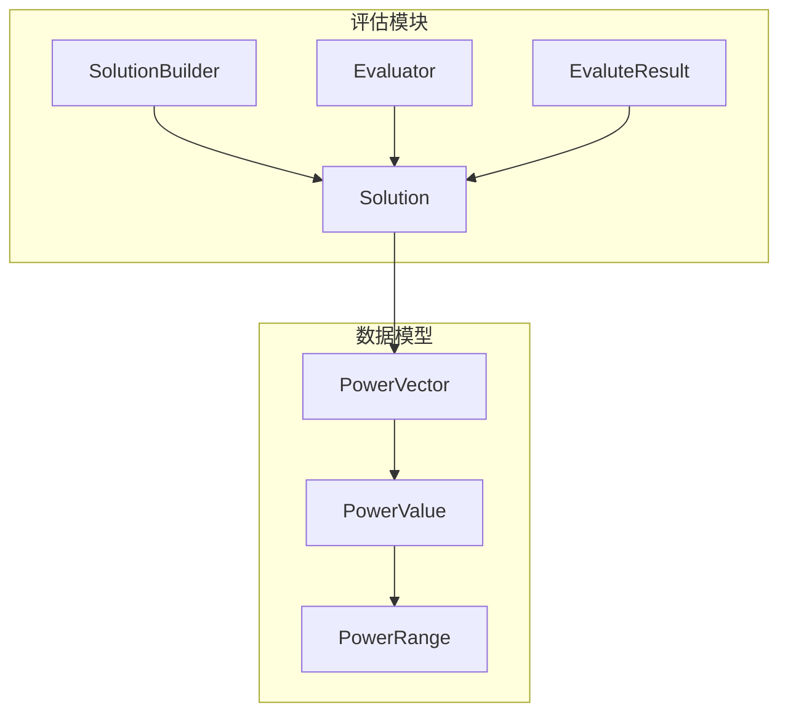
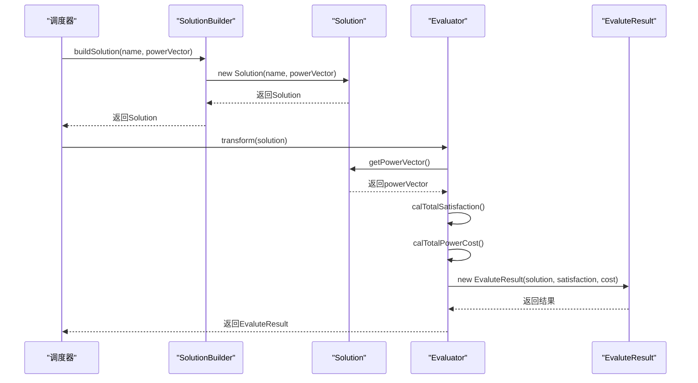
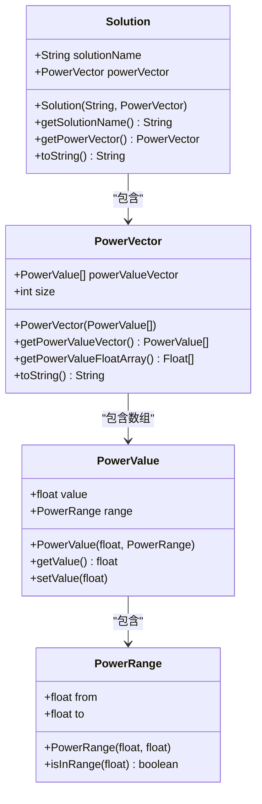
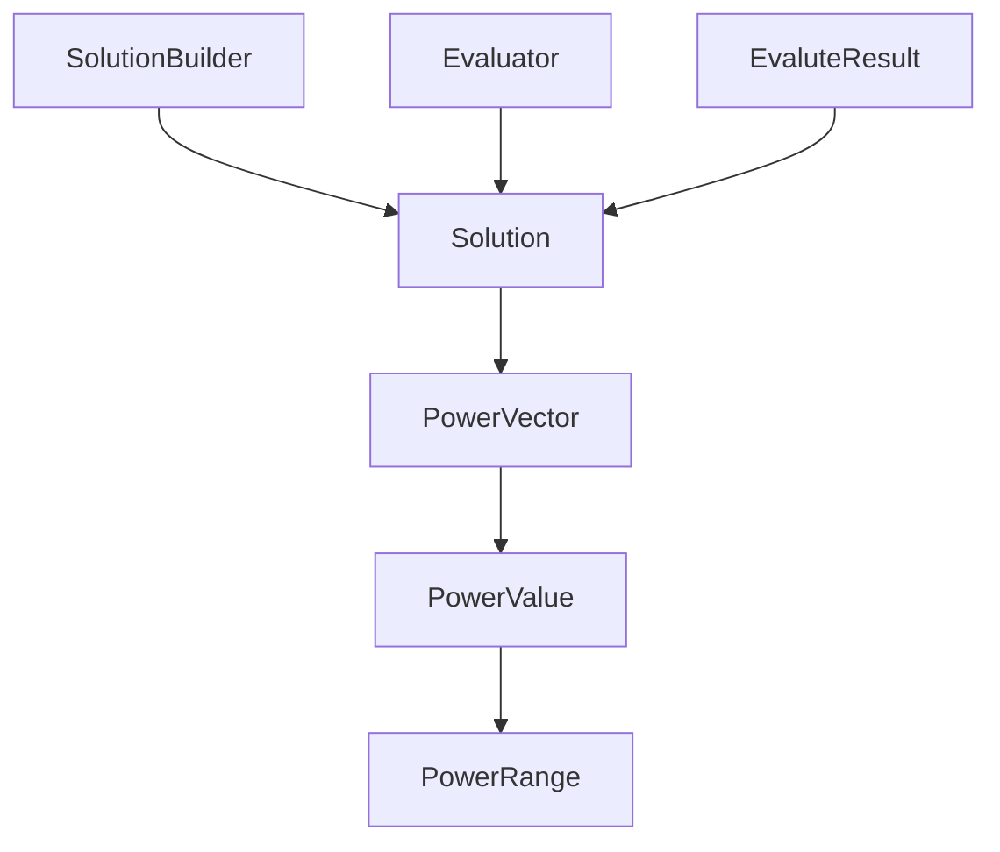

# Solution

<cite>
**本文档引用的文件**  
- [Solution.java](file://src/main/java/com/leavesfly/iac/evalute/Solution.java)
- [PowerVector.java](file://src/main/java/com/leavesfly/iac/domain/PowerVector.java)
- [PowerValue.java](file://src/main/java/com/leavesfly/iac/domain/PowerValue.java)
- [PowerRange.java](file://src/main/java/com/leavesfly/iac/domain/PowerRange.java)
- [SolutionBuilder.java](file://src/main/java/com/leavesfly/iac/evalute/SolutionBuilder.java)
- [Evaluator.java](file://src/main/java/com/leavesfly/iac/evalute/Evaluator.java)
- [EvaluteResult.java](file://src/main/java/com/leavesfly/iac/evalute/EvaluteResult.java)
- [AppContextConstant.java](file://src/main/java/com/leavesfly/iac/config/AppContextConstant.java)
- [AirConditionUtil.java](file://src/main/java/com/leavesfly/iac/datasource/datagene/AirConditionUtil.java)
</cite>

## 目录
1. [引言](#引言)
2. [项目结构](#项目结构)
3. [核心组件](#核心组件)
4. [架构概述](#架构概述)
5. [详细组件分析](#详细组件分析)
6. [依赖分析](#依赖分析)
7. [性能考虑](#性能考虑)
8. [故障排除指南](#故障排除指南)
9. [结论](#结论)

## 引言

`Solution` 类是智能空调功率调度系统中的核心数据模型，用于表示一次调度计算的完整解决方案。该对象封装了调度策略的名称和为所有空调设备分配的具体功率值，作为评估模块的输入贯穿整个评估流程。本文档详细说明 `Solution` 类的设计、构造、使用方式及其在整个系统中的作用。

## 项目结构

`Solution` 类位于 `src/main/java/com/leavesfly/iac/evalute/` 目录下，属于评估模块的核心组件。它与 `domain` 包中的 `PowerVector`、`PowerValue` 和 `PowerRange` 类紧密协作，共同构建完整的功率调度数据模型。



**Diagram sources**
- [Solution.java](file://src/main/java/com/leavesfly/iac/evalute/Solution.java#L1-L58)
- [PowerVector.java](file://src/main/java/com/leavesfly/iac/domain/PowerVector.java#L1-L142)

**Section sources**
- [Solution.java](file://src/main/java/com/leavesfly/iac/evalute/Solution.java#L1-L58)
- [PowerVector.java](file://src/main/java/com/leavesfly/iac/domain/PowerVector.java#L1-L142)

## 核心组件

`Solution` 类是调度结果的核心载体，包含 `solutionName` 和 `powerVector` 两个关键字段。`solutionName` 用于标识不同的调度策略（如 'PSO'、'ChaosPSO'），`powerVector` 存储了为所有空调设备分配的具体功率值。该类通过构造函数将名称与功率向量绑定，并提供 `getPowerVector()` 方法为评估模块提供待评估的数据。

**Section sources**
- [Solution.java](file://src/main/java/com/leavesfly/iac/evalute/Solution.java#L1-L58)
- [PowerVector.java](file://src/main/java/com/leavesfly/iac/domain/PowerVector.java#L1-L142)

## 架构概述

`Solution` 对象作为调度计算的输出和评估模块的输入，在系统中扮演着关键角色。调度算法生成功率向量后，通过 `SolutionBuilder` 构建 `Solution` 对象，然后传递给 `Evaluator` 进行评估，最终生成 `EvaluteResult`。



**Diagram sources**
- [SolutionBuilder.java](file://src/main/java/com/leavesfly/iac/evalute/SolutionBuilder.java#L1-L45)
- [Solution.java](file://src/main/java/com/leavesfly/iac/evalute/Solution.java#L1-L58)
- [Evaluator.java](file://src/main/java/com/leavesfly/iac/evalute/Evaluator.java#L1-L122)
- [EvaluteResult.java](file://src/main/java/com/leavesfly/iac/evalute/EvaluteResult.java#L1-L104)

## 详细组件分析

### Solution 类分析

`Solution` 类是调度结果的封装，其核心功能是将调度策略名称与功率向量绑定，为后续评估提供统一的数据结构。

#### 类图


**Diagram sources**
- [Solution.java](file://src/main/java/com/leavesfly/iac/evalute/Solution.java#L1-L58)
- [PowerVector.java](file://src/main/java/com/leavesfly/iac/domain/PowerVector.java#L1-L142)
- [PowerValue.java](file://src/main/java/com/leavesfly/iac/domain/PowerValue.java#L1-L182)
- [PowerRange.java](file://src/main/java/com/leavesfly/iac/domain/PowerRange.java#L1-L104)

#### 构造函数分析
`Solution` 类的构造函数接收解决方案名称和功率向量两个参数，将它们绑定到实例字段上。这种设计确保了每个解决方案都有唯一的标识和对应的功率分配方案。

**Section sources**
- [Solution.java](file://src/main/java/com/leavesfly/iac/evalute/Solution.java#L25-L33)

#### getPowerVector() 方法分析
`getPowerVector()` 方法是评估模块获取待评估数据的关键接口。`Evaluator` 类通过此方法获取功率向量，然后计算用户满意度和用电成本等指标。

**Section sources**
- [Solution.java](file://src/main/java/com/leavesfly/iac/evalute/Solution.java#L45-L49)
- [Evaluator.java](file://src/main/java/com/leavesfly/iac/evalute/Evaluator.java#L1-L122)

#### 创建解决方案示例
以下代码展示了如何创建一个名为 'Baseline' 的解决方案：

```java
// 使用统一温度创建解决方案
Solution baselineSolution = SolutionBuilder.buildSolution("Baseline", 26.0f);

// 或使用已有的功率向量创建解决方案
Float[] powerValues = new Float[8];
Arrays.fill(powerValues, 200.0f);
PowerVector powerVector = new PowerVector(powerValues, 8);
Solution customSolution = new Solution("Custom", powerVector);
```

**Section sources**
- [SolutionBuilder.java](file://src/main/java/com/leavesfly/iac/evalute/SolutionBuilder.java#L1-L45)
- [Solution.java](file://src/main/java/com/leavesfly/iac/evalute/Solution.java#L25-L33)

#### toString() 方法分析
`toString()` 方法在结果日志输出中起着重要的格式化作用，它将解决方案名称和功率向量的字符串表示连接起来，便于调试和结果展示。

**Section sources**
- [Solution.java](file://src/main/java/com/leavesfly/iac/evalute/Solution.java#L51-L58)
- [PowerVector.java](file://src/main/java/com/leavesfly/iac/domain/PowerVector.java#L120-L141)

## 依赖分析

`Solution` 类依赖于 `PowerVector` 类来存储功率数据，而 `PowerVector` 又依赖于 `PowerValue` 和 `PowerRange` 类。`SolutionBuilder` 和 `Evaluator` 类则依赖于 `Solution` 类来构建和评估解决方案。



**Diagram sources**
- [SolutionBuilder.java](file://src/main/java/com/leavesfly/iac/evalute/SolutionBuilder.java#L1-L45)
- [Evaluator.java](file://src/main/java/com/leavesfly/iac/evalute/Evaluator.java#L1-L122)
- [EvaluteResult.java](file://src/main/java/com/leavesfly/iac/evalute/EvaluteResult.java#L1-L104)
- [Solution.java](file://src/main/java/com/leavesfly/iac/evalute/Solution.java#L1-L58)
- [PowerVector.java](file://src/main/java/com/leavesfly/iac/domain/PowerVector.java#L1-L142)

**Section sources**
- [Solution.java](file://src/main/java/com/leavesfly/iac/evalute/Solution.java#L1-L58)
- [SolutionBuilder.java](file://src/main/java/com/leavesfly/iac/evalute/SolutionBuilder.java#L1-L45)
- [Evaluator.java](file://src/main/java/com/leavesfly/iac/evalute/Evaluator.java#L1-L122)

## 性能考虑

`Solution` 类的设计考虑了性能因素。`PowerVector` 的 `toString()` 方法使用 `StringBuilder` 来高效构建字符串，避免了字符串拼接的性能开销。此外，所有数据类都实现了 `Serializable` 接口，支持序列化，便于在分布式环境中传输。

## 故障排除指南

当遇到 `Solution` 相关问题时，请检查以下几点：
1. 确保 `powerVector` 不为 null
2. 检查功率值是否在有效范围内（0.0-400.0）
3. 确认 `solutionName` 是否符合命名规范

**Section sources**
- [Solution.java](file://src/main/java/com/leavesfly/iac/evalute/Solution.java#L1-L58)
- [PowerVector.java](file://src/main/java/com/leavesfly/iac/domain/PowerVector.java#L1-L142)
- [AppContextConstant.java](file://src/main/java/com/leavesfly/iac/config/AppContextConstant.java#L1-L150)

## 结论

`Solution` 类作为智能空调调度系统的核心数据模型，有效地封装了调度策略和功率分配方案。通过清晰的接口设计和合理的依赖关系，它为评估模块提供了稳定可靠的数据输入，确保了整个评估流程的顺利进行。