# 数据模型

<cite>
**本文档中引用的文件**
- [PowerVector.java](file://src/main/java/com/leavesfly/iac/domain/PowerVector.java)
- [PowerValue.java](file://src/main/java/com/leavesfly/iac/domain/PowerValue.java)
- [PowerRange.java](file://src/main/java/com/leavesfly/iac/domain/PowerRange.java)
- [PtFitFunc.java](file://src/main/java/com/leavesfly/iac/domain/PtFitFunc.java)
- [Solution.java](file://src/main/java/com/leavesfly/iac/evalute/Solution.java)
- [EvaluteResult.java](file://src/main/java/com/leavesfly/iac/evalute/EvaluteResult.java)
- [GeoPoint.java](file://src/main/java/com/leavesfly/iac/domain/GeoPoint.java)
- [RangeValue.java](file://src/main/java/com/leavesfly/iac/domain/RangeValue.java)
- [AppContextConstant.java](file://src/main/java/com/leavesfly/iac/config/AppContextConstant.java)
- [Evaluator.java](file://src/main/java/com/leavesfly/iac/evalute/Evaluator.java)
- [TrainModel.java](file://src/main/java/com/leavesfly/iac/train/trainer/TrainModel.java)
</cite>

## 目录
1. [简介](#简介)
2. [项目结构概览](#项目结构概览)
3. [核心数据模型](#核心数据模型)
4. [PowerVector类详解](#powervector类详解)
5. [PowerValue类详解](#powervalue类详解)
6. [PowerRange类详解](#powerrange类详解)
7. [PtFitFunc类详解](#ptfitfunc类详解)
8. [Solution类详解](#solution类详解)
9. [EvaluteResult类详解](#evaluteresult类详解)
10. [GeoPoint类详解](#geopoint类详解)
11. [模型关系图](#模型关系图)
12. [使用示例](#使用示例)
13. [总结](#总结)

## 简介

本文档详细描述了智能空调调度系统中的核心数据模型。这些模型构成了系统的数据层基础，负责表示空调功率向量、温度预测、调度方案评估等关键概念。通过深入分析各个类的设计和实现，我们将了解它们如何协同工作以支持整个系统的功能需求。

## 项目结构概览

智能空调调度系统采用分层架构设计，数据模型位于domain包中，包含了系统的核心业务实体：

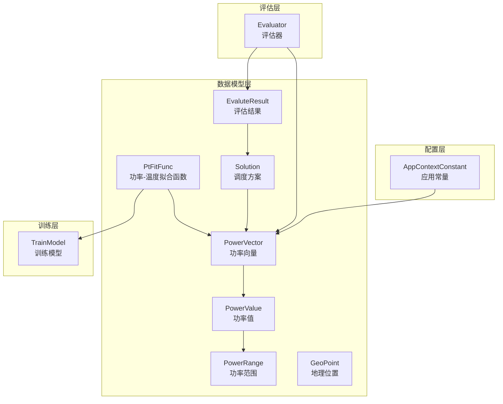

**图表来源**
- [PowerVector.java](file://src/main/java/com/leavesfly/iac/domain/PowerVector.java#L1-L50)
- [PowerValue.java](file://src/main/java/com/leavesfly/iac/domain/PowerValue.java#L1-L50)
- [PtFitFunc.java](file://src/main/java/com/leavesfly/iac/domain/PtFitFunc.java#L1-L50)
- [Solution.java](file://src/main/java/com/leavesfly/iac/evalute/Solution.java#L1-L50)
- [EvaluteResult.java](file://src/main/java/com/leavesfly/iac/evalute/EvaluteResult.java#L1-L50)
- [GeoPoint.java](file://src/main/java/com/leavesfly/iac/domain/GeoPoint.java#L1-L50)

## 核心数据模型

系统中的核心数据模型围绕空调功率调度这一核心业务展开，主要包括以下几个关键组件：

### 设计原则

1. **可序列化性**：所有核心模型都实现了Serializable接口，支持持久化存储
2. **范围约束**：通过PowerRange类确保功率值在合理范围内
3. **接口抽象**：通过RangeValue接口提供统一的范围操作能力
4. **工厂模式**：提供多种构造方式，支持不同场景下的对象创建

### 关键特性

- **类型安全**：强类型设计确保数据的一致性和正确性
- **扩展性**：良好的接口设计支持未来功能扩展
- **性能优化**：合理的内存管理和缓存策略
- **线程安全**：适当的对象不可变设计

## PowerVector类详解

PowerVector类是系统中最核心的数据模型之一，它表示一组空调设备的功率值集合。每个元素是一个PowerValue对象，包含功率值和对应的取值范围。

### 类结构设计

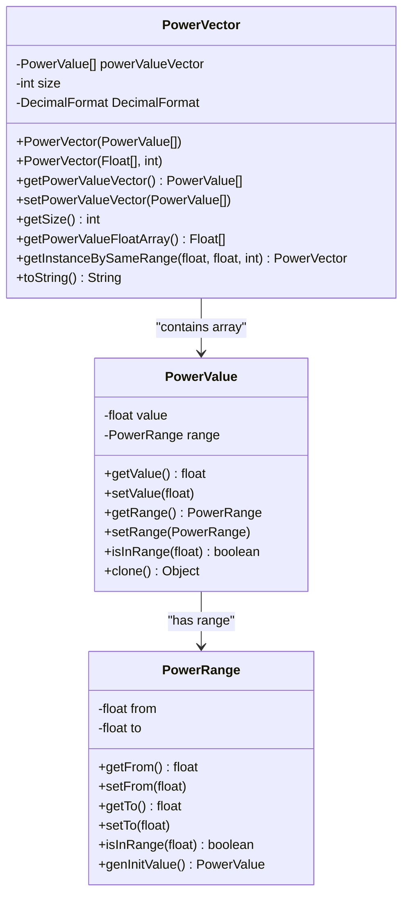

**图表来源**
- [PowerVector.java](file://src/main/java/com/leavesfly/iac/domain/PowerVector.java#L10-L50)
- [PowerValue.java](file://src/main/java/com/leavesfly/iac/domain/PowerValue.java#L15-L50)
- [PowerRange.java](file://src/main/java/com/leavesfly/iac/domain/PowerRange.java#L15-L50)

### 核心属性

- **powerValueVector**：功率值数组，存储所有空调设备的功率信息
- **size**：向量大小，表示空调设备的数量
- **DecimalFormat**：数字格式化器，用于标准化输出格式

### 构造方法

系统提供了两种主要的构造方式：

1. **数组构造**：直接传入PowerValue数组
2. **浮点数组构造**：传入浮点数值数组，自动转换为PowerValue对象

### 关键方法

- **getInstanceBySameRange()**：静态工厂方法，快速创建具有相同范围的功率向量
- **getPowerValueFloatArray()**：获取纯浮点数数组，便于算法处理
- **toString()**：格式化输出，便于调试和日志记录

**章节来源**
- [PowerVector.java](file://src/main/java/com/leavesfly/iac/domain/PowerVector.java#L1-L141)

## PowerValue类详解

PowerValue类表示一个具体的功率值及其取值范围，实现了RangeValue接口和Serializable接口，支持功率值的设置、获取和范围检查，并实现了克隆功能。

### 接口实现

PowerValue类实现了RangeValue接口，提供了完整的范围操作能力：

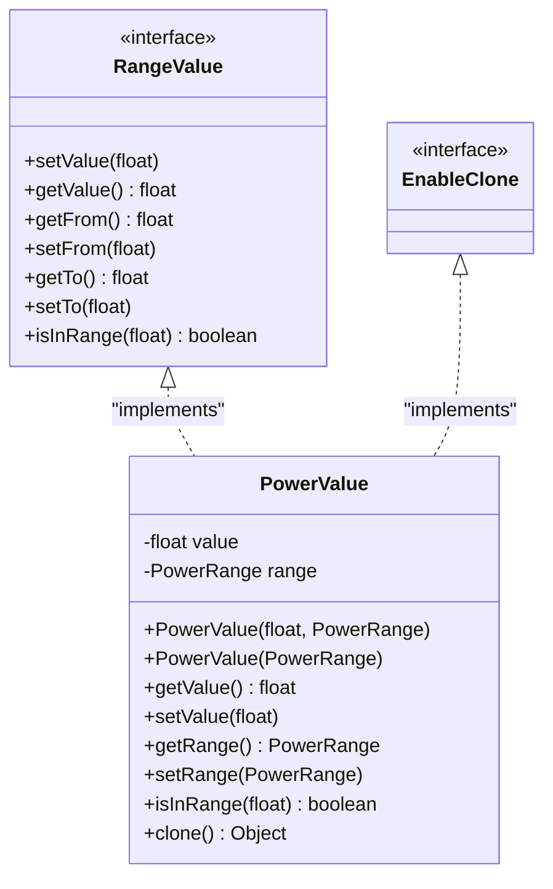

**图表来源**
- [PowerValue.java](file://src/main/java/com/leavesfly/iac/domain/PowerValue.java#L15-L50)
- [RangeValue.java](file://src/main/java/com/leavesfly/iac/domain/RangeValue.java#L1-L60)

### 核心功能

1. **范围验证**：通过PowerRange对象确保功率值在有效范围内
2. **动态生成**：支持随机生成范围内的功率值
3. **克隆支持**：实现深拷贝功能，支持对象复制
4. **序列化**：支持对象持久化存储

### 使用场景

- **初始化**：从PowerRange对象生成初始功率值
- **验证**：检查新设置的功率值是否在允许范围内
- **复制**：通过clone()方法创建精确副本
- **比较**：与其他PowerValue对象进行比较和排序

**章节来源**
- [PowerValue.java](file://src/main/java/com/leavesfly/iac/domain/PowerValue.java#L1-L182)

## PowerRange类详解

PowerRange类表示功率的取值范围，包含最小值和最大值，并提供判断某个值是否在范围内以及生成初始功率值的方法。

### 设计特点

PowerRange类采用了简洁而有效的设计模式：

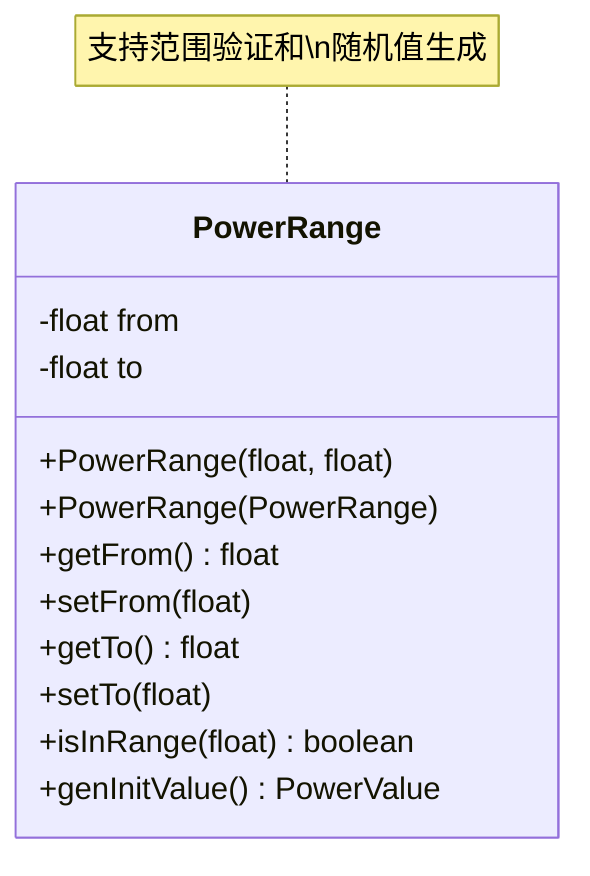

**图表来源**
- [PowerRange.java](file://src/main/java/com/leavesfly/iac/domain/PowerRange.java#L15-L104)

### 核心方法

- **isInRange()**：高效的范围检查算法，避免边界溢出
- **genInitValue()**：基于当前范围生成新的PowerValue对象
- **拷贝构造**：支持深度复制现有范围对象

### 配置常量

系统通过AppContextConstant类定义了标准的功率范围：

- **AIR_CONDITION_MIN_POWER = 0.0f**：空调最小功率
- **AIR_CONDITION_MAX_POWER = 400.0f**：空调最大功率

**章节来源**
- [PowerRange.java](file://src/main/java/com/leavesfly/iac/domain/PowerRange.java#L1-L104)
- [AppContextConstant.java](file://src/main/java/com/leavesfly/iac/config/AppContextConstant.java#L95-L100)

## PtFitFunc类详解

PtFitFunc类作为功率-温度拟合函数的封装，包含传感器ID、室外温度和TrainModel，以及calTemperature方法如何通过模型预测温度。

### 类结构设计

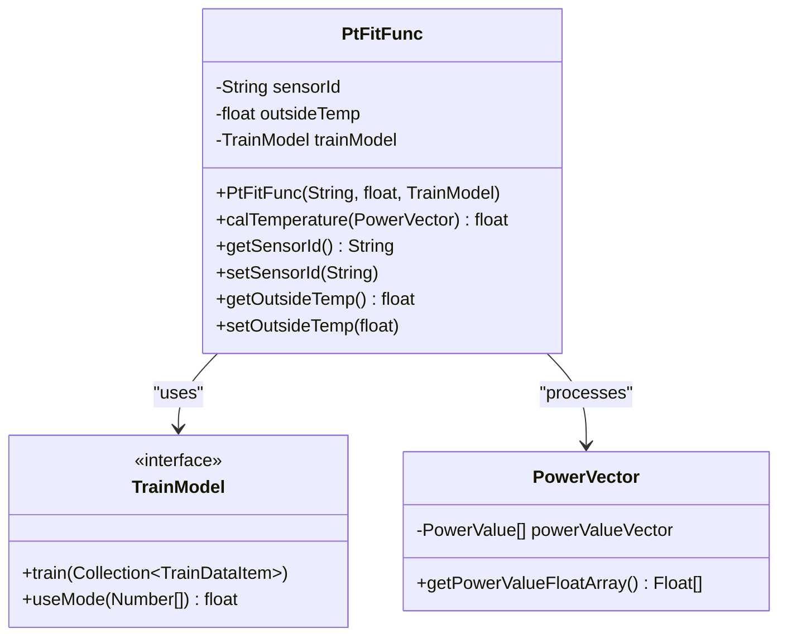

**图表来源**
- [PtFitFunc.java](file://src/main/java/com/leavesfly/iac/domain/PtFitFunc.java#L1-L87)
- [TrainModel.java](file://src/main/java/com/leavesfly/iac/train/trainer/TrainModel.java#L1-L35)

### 核心职责

1. **传感器管理**：维护特定传感器的功率-温度映射关系
2. **环境适应**：考虑室外温度对预测精度的影响
3. **模型集成**：与各种机器学习模型无缝集成
4. **温度预测**：基于功率向量计算预测温度

### 工作流程

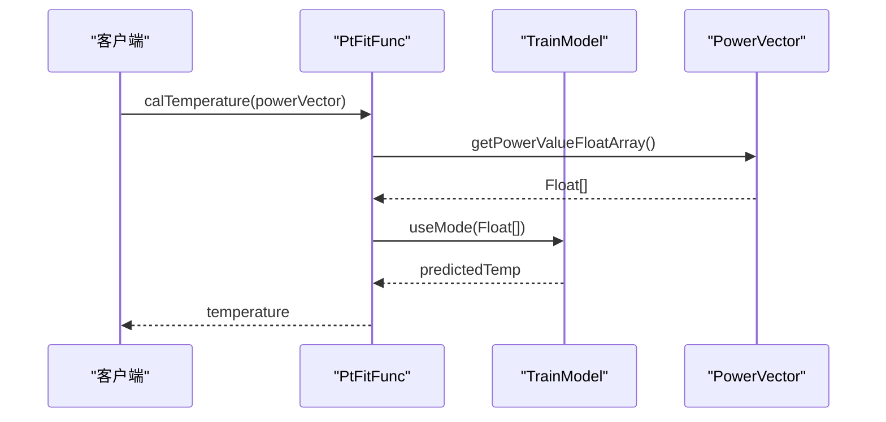

**图表来源**
- [PtFitFunc.java](file://src/main/java/com/leavesfly/iac/domain/PtFitFunc.java#L35-L40)

### 实现细节

- **传感器ID**：唯一标识特定的传感器节点
- **室外温度**：影响温度预测的重要环境因素
- **模型选择**：支持多种训练模型（BP神经网络、线性回归等）

**章节来源**
- [PtFitFunc.java](file://src/main/java/com/leavesfly/iac/domain/PtFitFunc.java#L1-L87)

## Solution类详解

Solution类如何封装一个完整的调度方案（名称和功率向量）。它是调度算法输出的结果载体，包含了调度方案的所有必要信息。

### 类设计

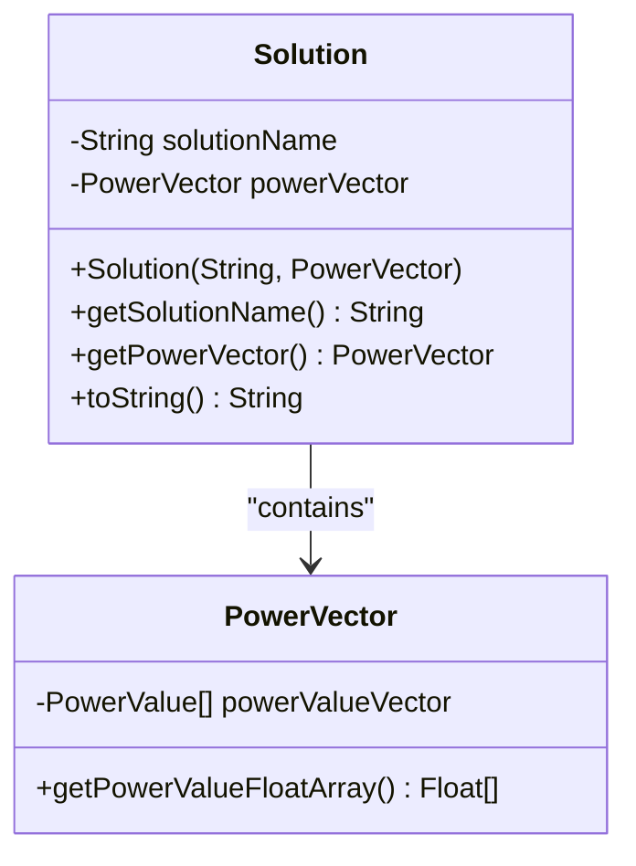

**图表来源**
- [Solution.java](file://src/main/java/com/leavesfly/iac/evalute/Solution.java#L1-L58)

### 核心属性

- **solutionName**：解决方案的唯一标识符，支持多种命名规则
- **powerVector**：实际的功率调度方案，包含所有空调设备的功率设置

### 命名规范

系统定义了标准的解决方案命名规则：

- **SOLUTIN_NAME_PREFIX = "solution_"**：解决方案名称前缀
- **SOLUTIN_NAME_PSO_SUFFIX = "pso"**：PSO算法解决方案后缀
- **SOLUTIN_NAME_PSO_CHAOS_SUFFIX = "pso_chaos"**：混沌PSO算法解决方案后缀

### 使用场景

- **算法输出**：调度算法的最终结果封装
- **结果存储**：持久化保存最佳调度方案
- **方案比较**：不同算法生成方案的对比分析
- **历史追踪**：记录每次调度决策的历史

**章节来源**
- [Solution.java](file://src/main/java/com/leavesfly/iac/evalute/Solution.java#L1-L58)
- [AppContextConstant.java](file://src/main/java/com/leavesfly/iac/config/AppContextConstant.java#L115-L125)

## EvaluteResult类详解

EvaluteResult类如何存储评估结果，包括满意度、功耗成本和功率效用等指标。它是评估器的核心输出，为调度方案的选择提供量化依据。

### 类结构

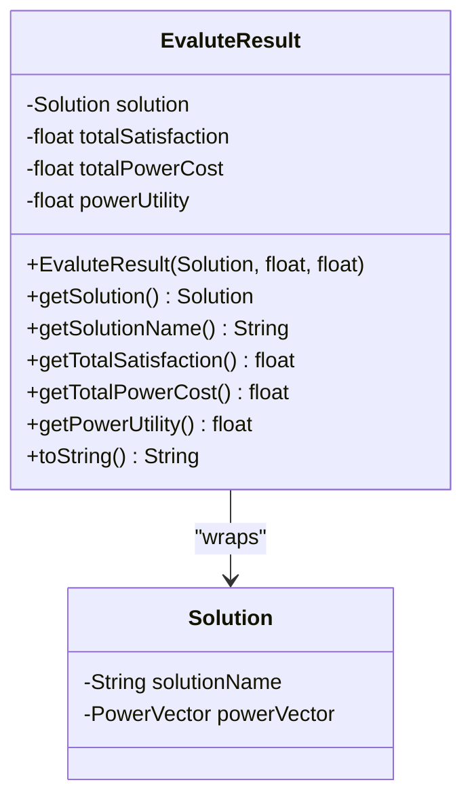

**图表来源**
- [EvaluteResult.java](file://src/main/java/com/leavesfly/iac/evalute/EvaluteResult.java#L1-L104)

### 评估指标

1. **总满意度**：反映用户舒适度的整体水平
2. **总用电成本**：基于功率消耗和电价计算的经济成本
3. **功率效用**：综合满意度和成本的效率指标

### 权重配置

系统通过AppContextConstant类定义了评估指标的权重：

- **SATISFY_WEIGHT = 0.5f**：满意度权重
- **POWER_COST_WEIGHT = 0.5f**：成本权重
- **POWER_UTILITY_UNIT = 1000**：功率效用单位

### 计算公式

功率效用计算公式：
```
powerUtility = (totalSatisfaction / totalPowerCost) × POWER_UTILITY_UNIT
```

### 评估流程

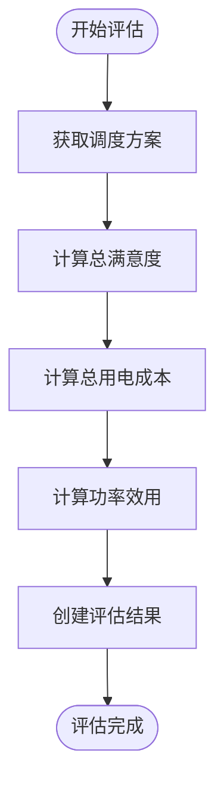

**图表来源**
- [Evaluator.java](file://src/main/java/com/leavesfly/iac/evalute/Evaluator.java#L120-L140)

**章节来源**
- [EvaluteResult.java](file://src/main/java/com/leavesfly/iac/evalute/EvaluteResult.java#L1-L104)
- [Evaluator.java](file://src/main/java/com/leavesfly/iac/evalute/Evaluator.java#L1-L140)
- [AppContextConstant.java](file://src/main/java/com/leavesfly/iac/config/AppContextConstant.java#L75-L90)

## GeoPoint类详解

GeoPoint类如何表示地理位置并计算欧几里得距离。它是地理信息系统的基础组件，支持位置相关的计算和分析。

### 类设计

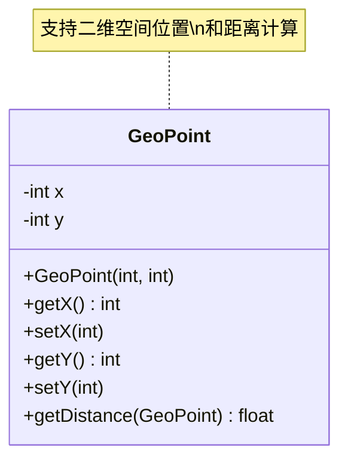

**图表来源**
- [GeoPoint.java](file://src/main/java/com/leavesfly/iac/domain/GeoPoint.java#L1-L76)

### 核心功能

1. **坐标存储**：存储二维空间中的X和Y坐标
2. **距离计算**：基于欧几里得距离公式计算两点间距离
3. **位置比较**：支持位置相关的排序和筛选操作

### 距离计算算法

```java
public float getDistance(GeoPoint geoPoint) {
    return (float) (Math.sqrt(Math.pow(geoPoint.getX() - x, 2) + Math.pow(geoPoint.getY() - y, 2)));
}
```

### 应用场景

- **用户分布**：表示用户在二维空间中的位置
- **传感器部署**：确定传感器的最佳布置位置
- **距离分析**：计算用户与空调设备的距离
- **聚类分析**：基于地理位置进行用户分组

### 配置参数

系统通过AppContextConstant类定义了地理相关的常量：

- **AREA_LENGTH = 10**：区域长度（米）
- **AREA_WITCH = 10**：区域宽度（米）
- **USER_NUM = 16**：用户数量
- **SENSOR_NUM = 10**：传感器数量
- **MAX_DISTANCE**：基于区域大小和传感器数量计算的最大距离

**章节来源**
- [GeoPoint.java](file://src/main/java/com/leavesfly/iac/domain/GeoPoint.java#L1-L76)
- [AppContextConstant.java](file://src/main/java/com/leavesfly/iac/config/AppContextConstant.java#L20-L50)

## 模型关系图

系统中的各个数据模型之间存在复杂的相互关系，形成了一个完整的数据生态系统：

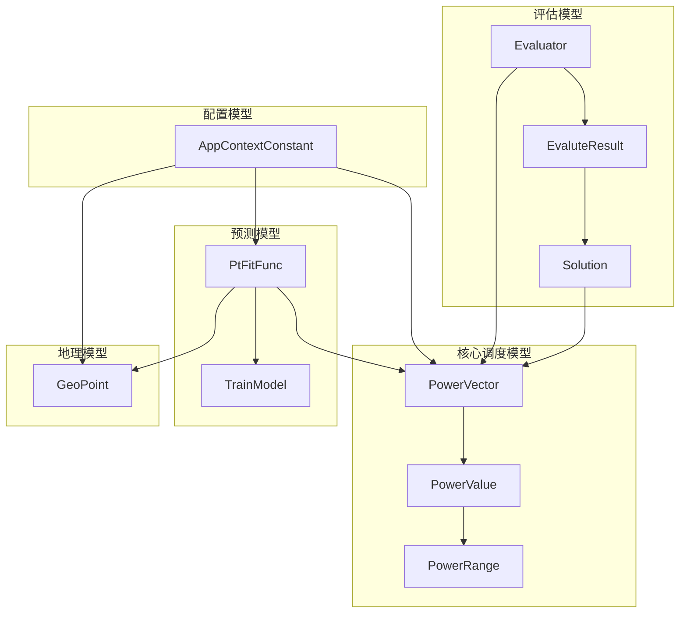

**图表来源**
- 所有相关类的源码分析

### 关联关系

1. **聚合关系**：PowerVector聚合多个PowerValue对象
2. **组合关系**：PtFitFunc组合传感器ID、室外温度和训练模型
3. **依赖关系**：EvaluteResult依赖Solution进行评估
4. **配置依赖**：所有模型都受AppContextConstant配置的影响

### 数据流向

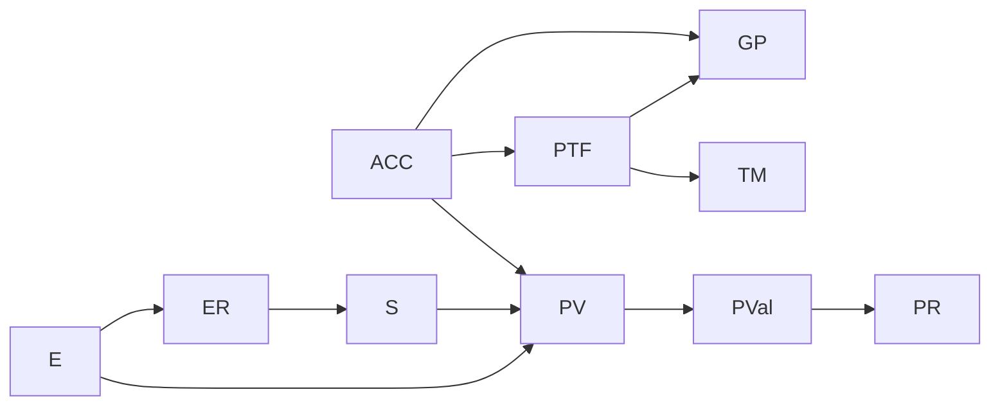

## 使用示例

以下是各个数据模型的实际使用示例：

### 创建功率向量

```java
// 创建功率范围
PowerRange range = new PowerRange(0.0f, 400.0f);

// 创建单个功率值
PowerValue pv1 = new PowerValue(200.0f, range);

// 创建功率向量
PowerValue[] values = new PowerValue[]{pv1};
PowerVector pv = new PowerVector(values);

// 快速创建相同范围的功率向量
PowerVector pv2 = PowerVector.getInstanceBySameRange(0.0f, 400.0f, 8);
```

### 温度预测

```java
// 创建功率向量
PowerVector powerVector = createSamplePowerVector();

// 创建功率-温度拟合函数
PtFitFunc fitFunc = new PtFitFunc("sensor_001", 35.0f, trainModel);

// 计算预测温度
float predictedTemp = fitFunc.calTemperature(powerVector);
```

### 方案评估

```java
// 创建调度方案
PowerVector solutionVector = generateOptimalSolution();
Solution solution = new Solution("pso_solution", solutionVector);

// 评估方案
EvaluteResult result = Evaluator.transform(solution);

// 获取评估指标
System.out.println("满意度: " + result.getTotalSatisfaction());
System.out.println("成本: " + result.getTotalPowerCost());
System.out.println("效用: " + result.getPowerUtility());
```

### 地理位置计算

```java
// 创建用户位置
GeoPoint userPos = new GeoPoint(5, 5);
GeoPoint acPos = new GeoPoint(10, 10);

// 计算距离
float distance = userPos.getDistance(acPos);
System.out.println("距离: " + distance + " 米");
```

## 总结

智能空调调度系统的数据模型设计体现了优秀的软件工程实践：

### 设计优势

1. **模块化设计**：每个模型职责明确，耦合度低
2. **接口抽象**：通过接口实现灵活的扩展和替换
3. **类型安全**：强类型设计减少运行时错误
4. **可扩展性**：良好的架构支持未来功能扩展

### 技术特色

- **范围约束**：通过PowerRange确保数据的有效性
- **工厂模式**：提供多种构造方式满足不同需求
- **接口继承**：通过RangeValue接口统一范围操作
- **配置驱动**：通过AppContextConstant集中管理配置参数

### 应用价值

这些数据模型为智能空调调度系统提供了坚实的数据基础，支持：

- **高效调度**：通过PowerVector和Solution实现精确的功率控制
- **准确预测**：通过PtFitFunc和TrainModel实现温度预测
- **科学评估**：通过EvaluteResult提供客观的方案评价
- **智能布局**：通过GeoPoint支持最优的设备部署

通过深入理解和合理运用这些数据模型，开发者可以构建出更加智能、高效和可靠的空调调度系统。