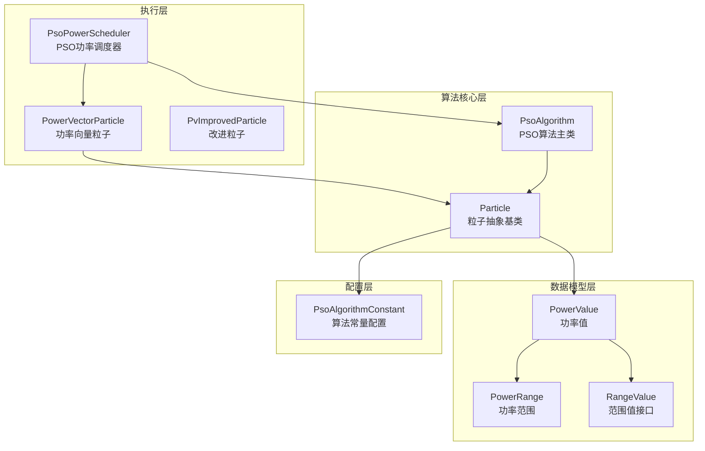
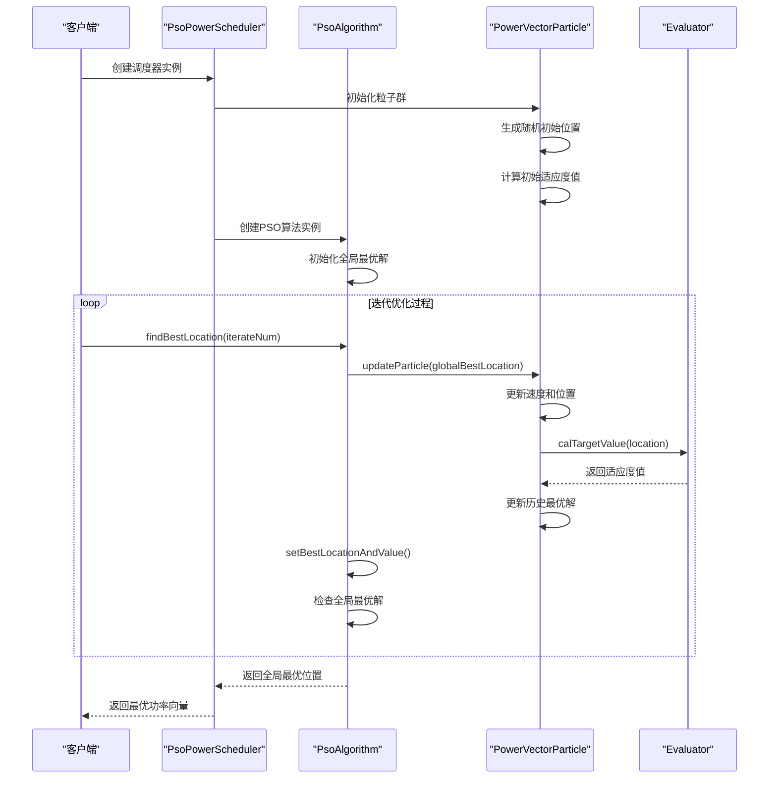
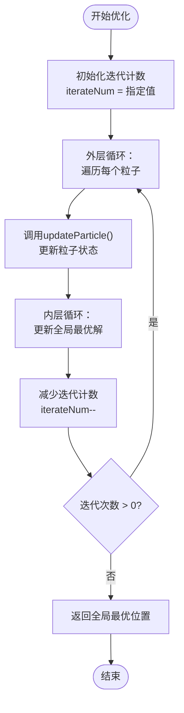
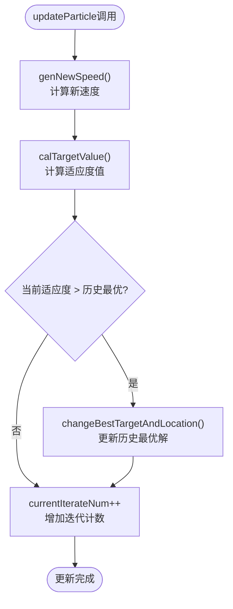
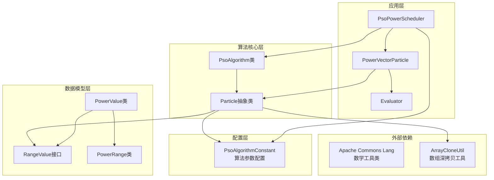

# PSO算法实现详细文档

<cite>
**本文档引用的文件**
- [PsoAlgorithm.java](file://src/main/java/com/leavesfly/iac/execute/scheduler/pso/PsoAlgorithm.java)
- [Particle.java](file://src/main/java/com/leavesfly/iac/execute/scheduler/pso/Particle.java)
- [PsoPowerScheduler.java](file://src/main/java/com/leavesfly/iac/execute/scheduler/PsoPowerScheduler.java)
- [PowerVectorParticle.java](file://src/main/java/com/leavesfly/iac/execute/scheduler/PowerVectorParticle.java)
- [PowerRange.java](file://src/main/java/com/leavesfly/iac/domain/PowerRange.java)
- [PowerValue.java](file://src/main/java/com/leavesfly/iac/domain/PowerValue.java)
- [PsoAlgorithmConstant.java](file://src/main/java/com/leavesfly/iac/config/PsoAlgorithmConstant.java)
- [Evaluator.java](file://src/main/java/com/leavesfly/iac/evalute/Evaluator.java)
- [MathUtil.java](file://src/main/java/com/leavesfly/iac/util/MathUtil.java)
- [RangeValue.java](file://src/main/java/com/leavesfly/iac/domain/RangeValue.java)
</cite>

## 目录
1. [简介](#简介)
2. [项目结构](#项目结构)
3. [核心组件](#核心组件)
4. [架构概览](#架构概览)
5. [详细组件分析](#详细组件分析)
6. [依赖关系分析](#依赖关系分析)
7. [性能考虑](#性能考虑)
8. [故障排除指南](#故障排除指南)
9. [结论](#结论)

## 简介

本文档深入分析了基于Java实现的粒子群优化（PSO）算法，重点关注PsoAlgorithm类及其与Particle类的协作机制。该PSO算法专门设计用于空调功率调度问题，通过迭代优化寻找最优的功率配置方案。

PSO算法是一种基于群体智能的优化算法，模拟鸟群觅食行为来寻找最优解。在本实现中，算法通过维护一个粒子群，每个粒子代表一个可能的功率配置，通过不断更新粒子的位置和速度来逼近全局最优解。

## 项目结构

PSO算法实现采用分层架构设计，主要包含以下核心模块：



**图表来源**
- [PsoPowerScheduler.java](file://src/main/java/com/leavesfly/iac/execute/scheduler/PsoPowerScheduler.java#L1-L92)
- [PsoAlgorithm.java](file://src/main/java/com/leavesfly/iac/execute/scheduler/pso/PsoAlgorithm.java#L1-L116)
- [Particle.java](file://src/main/java/com/leavesfly/iac/execute/scheduler/pso/Particle.java#L1-L245)

**章节来源**
- [PsoPowerScheduler.java](file://src/main/java/com/leavesfly/iac/execute/scheduler/PsoPowerScheduler.java#L1-L92)
- [PsoAlgorithm.java](file://src/main/java/com/leavesfly/iac/execute/scheduler/pso/PsoAlgorithm.java#L1-L116)

## 核心组件

### PsoAlgorithm类 - PSO算法主控制器

PsoAlgorithm类是PSO算法的核心控制器，负责管理整个优化过程。该类采用泛型设计，支持不同类型的粒子位置和速度值。

```java
public class PsoAlgorithm<T extends RangeValue> {
    private Particle<T>[] particleSet;
    private T[] globalBestLocation;
    private float globalBestValue;
}
```

### Particle类 - 粒子抽象基类

Particle类定义了PSO算法中粒子的基本属性和行为，包括位置、速度、历史最优解等核心概念。

```java
public abstract class Particle<T extends RangeValue> {
    protected T[] location;
    protected T[] speed;
    protected T[] bestLocation;
    private float bestTargetValue;
    protected int currentIterateNum = 0;
}
```

**章节来源**
- [PsoAlgorithm.java](file://src/main/java/com/leavesfly/iac/execute/scheduler/pso/PsoAlgorithm.java#L15-L30)
- [Particle.java](file://src/main/java/com/leavesfly/iac/execute/scheduler/pso/Particle.java#L17-L50)

## 架构概览

PSO算法的整体架构遵循面向对象的设计原则，通过清晰的职责分离实现高度的可扩展性和可维护性：



**图表来源**
- [PsoPowerScheduler.java](file://src/main/java/com/leavesfly/iac/execute/scheduler/PsoPowerScheduler.java#L30-L50)
- [PsoAlgorithm.java](file://src/main/java/com/leavesfly/iac/execute/scheduler/pso/PsoAlgorithm.java#L65-L80)
- [Particle.java](file://src/main/java/com/leavesfly/iac/execute/scheduler/pso/Particle.java#L90-L110)

## 详细组件分析

### PsoAlgorithm类详细分析

PsoAlgorithm类实现了标准的PSO算法框架，包含以下关键方法：

#### 构造函数和初始化

```java
public PsoAlgorithm(Particle<T>[] particleSet) {
    this.particleSet = particleSet;
    initBestGlobalBestLocationAndValue();
}
```

构造函数接收粒子群数组并调用`initBestGlobalBestLocationAndValue()`方法初始化全局最优解。

#### findBestLocation方法 - 核心优化循环



**图表来源**
- [PsoAlgorithm.java](file://src/main/java/com/leavesfly/iac/execute/scheduler/pso/PsoAlgorithm.java#L65-L80)

#### initBestGlobalBestLocationAndValue方法 - 初始最优解确定

该方法从粒子群中找出初始的全局最优位置和值：

```java
private void initBestGlobalBestLocationAndValue() {
    Particle<T> bestParticle = getBestLocation();
    globalBestLocation = ArrayCloneUtil.arrayDeepCopy(bestParticle.getBestLocation());
    globalBestValue = bestParticle.getBestTargetValue();
}
```

#### setBestLocationAndValue方法 - 全局最优解更新

```java
private void setBestLocationAndValue() {
    Particle<T> bestParticle = getBestLocation();
    globalBestValue = bestParticle.getBestTargetValue();
    
    T[] bestLocation = bestParticle.getBestLocation();
    for (int i = 0; i < bestLocation.length; i++) {
        globalBestLocation[i].setValue(bestLocation[i].getValue());
    }
}
```

**章节来源**
- [PsoAlgorithm.java](file://src/main/java/com/leavesfly/iac/execute/scheduler/pso/PsoAlgorithm.java#L35-L116)

### Particle类详细分析

Particle类是PSO算法的核心抽象类，定义了粒子的所有基本属性和行为：

#### 粒子属性和常量

```java
protected static final float INERTIA_WEIGHT_INIT = PsoAlgorithmConstant.PSO_INERTIA_WEIGHT_INIT;
protected static final float LEARN_RATE_1 = PsoAlgorithmConstant.PSO_LEARN_RATE_1;
protected static final float LEARN_RATE_2 = PsoAlgorithmConstant.PSO_LEARN_RATE_2;
public final static int iterateNum = PsoAlgorithmConstant.PSO_ITERATE_NUM;
```

#### updateParticle方法 - 粒子状态更新



**图表来源**
- [Particle.java](file://src/main/java/com/leavesfly/iac/execute/scheduler/pso/Particle.java#L90-L110)

#### genNewSpeed方法 - 速度更新算法

速度更新采用标准PSO公式：

```java
protected void genNewSpeed(T[] globalBestLocation) {
    for (int i = 0; i < globalBestLocation.length; i++) {
        float inertiaWeight = INERTIA_WEIGHT_INIT - inertiaWeightFrequency * currentIterateNum;
        
        float value = inertiaWeight * speed[i].getValue() 
            + LEARN_RATE_1 * (float) Math.random() * (bestLocation[i].getValue() - location[i].getValue())
            + LEARN_RATE_2 * (float) Math.random() * (globalBestLocation[i].getValue() - location[i].getValue());
            
        // 速度边界检查
        if (speed[i].isInRange(value)) {
            speed[i].setValue(value);
        } else {
            speed[i].setValue(Math.random() >= HALF_OF_ONE ? speed[i].getFrom() : speed[i].getTo());
        }
    }
}
```

#### genNewLocation方法 - 位置更新算法

```java
protected void genNewLocation() {
    for (int i = 0; i < location.length; i++) {
        float value = location[i].getValue() + speed[i].getValue();
        if (value > location[i].getTo()) {
            location[i].setValue(location[i].getTo());
        } else if (value < location[i].getFrom()) {
            location[i].setValue(location[i].getFrom());
        } else {
            location[i].setValue(value);
        }
    }
}
```

**章节来源**
- [Particle.java](file://src/main/java/com/leavesfly/iac/execute/scheduler/pso/Particle.java#L90-L245)

### PowerVectorParticle类 - 具体粒子实现

PowerVectorParticle类实现了具体的粒子行为，专门用于空调功率调度问题：

#### 目标值计算

```java
@Override
protected float calTargetValue(PowerValue[] powerValueArray) {
    float satisfaction = 0f;
    PowerVector powerVector = new PowerVector(powerValueArray);
    satisfaction += Evaluator.calTotalSatisfaction(powerVector);
    satisfaction *= AppContextConstant.SATISFY_WEIGHT;
    
    float powerCost = 0f;
    powerCost = Evaluator.calTotalPowerCost(powerVector);
    powerCost *= AppContextConstant.POWER_COST_WEIGHT;
    
    // 归一化处理
    return satisfaction - (powerCost / AppContextConstant.AIR_CONDITION_MAX_POWER)
        * ((float) AppContextConstant.USER_NUM / AppContextConstant.AIR_CONDITION_NUM);
}
```

**章节来源**
- [PowerVectorParticle.java](file://src/main/java/com/leavesfly/iac/execute/scheduler/PowerVectorParticle.java#L40-L70)

### 数据模型分析

#### PowerRange类 - 功率范围定义

```java
public class PowerRange implements Serializable {
    private float from;
    private float to;
    
    public boolean isInRange(float value) {
        return value >= from && value <= to;
    }
    
    public PowerValue genInitValue() {
        return new PowerValue(new PowerRange(this));
    }
}
```

#### PowerValue类 - 具体功率值

PowerValue类实现了RangeValue接口，提供了完整的值管理和范围检查功能。

**章节来源**
- [PowerRange.java](file://src/main/java/com/leavesfly/iac/domain/PowerRange.java#L15-L105)
- [PowerValue.java](file://src/main/java/com/leavesfly/iac/domain/PowerValue.java#L15-L183)

## 依赖关系分析

PSO算法实现具有清晰的依赖层次结构：



**图表来源**
- [Particle.java](file://src/main/java/com/leavesfly/iac/execute/scheduler/pso/Particle.java#L1-L15)
- [PsoAlgorithm.java](file://src/main/java/com/leavesfly/iac/execute/scheduler/pso/PsoAlgorithm.java#L1-L10)

**章节来源**
- [Particle.java](file://src/main/java/com/leavesfly/iac/execute/scheduler/pso/Particle.java#L1-L20)
- [PsoAlgorithm.java](file://src/main/java/com/leavesfly/iac/execute/scheduler/pso/PsoAlgorithm.java#L1-L15)

## 性能考虑

### 算法收敛性分析

PSO算法的收敛性受多个参数影响：

1. **惯性权重变化**：从0.9线性递减到0.4，有助于平衡探索和开发
2. **学习因子**：个体学习因子和社交学习因子均为2.0，平衡局部搜索和全局搜索
3. **迭代次数**：默认1000次迭代，可根据问题复杂度调整

### 参数敏感性分析

#### 迭代次数对结果的影响

```java
// 默认配置
public static final int PSO_ITERATE_NUM = 1_000;

// 不同迭代次数的效果对比
// 100次迭代：快速但可能欠收敛
// 1000次迭代：平衡计算成本与解质量
// 5000次迭代：高精度但计算成本高
```

#### 粒子数量对性能的影响

```java
public static final int PSO_INIT_PARTICLE_NUM = 100;

// 粒子数量与计算复杂度关系
// O(n × m × iterations)，其中n为粒子数，m为维度
```

### 性能优化建议

1. **合理设置PSO_ITERATE_NUM**：根据问题规模和精度要求平衡计算成本
2. **动态调整惯性权重**：可考虑非线性递减策略
3. **种群多样性保持**：定期添加随机扰动防止早熟收敛
4. **并行化处理**：利用多核CPU并行更新粒子

## 故障排除指南

### 常见问题及解决方案

#### 1. 粒子位置超出范围

**症状**：粒子位置值超出PowerRange定义的范围

**原因**：速度更新后位置计算导致越界

**解决方案**：
```java
// 在genNewLocation方法中已实现边界检查
if (value > location[i].getTo()) {
    location[i].setValue(location[i].getTo());
} else if (value < location[i].getFrom()) {
    location[i].setValue(location[i].getFrom());
} else {
    location[i].setValue(value);
}
```

#### 2. 算法不收敛

**症状**：算法运行多次但最优解无明显改善

**可能原因**：
- 惯性权重设置不当
- 学习因子失衡
- 目标函数设计不合理

**解决方案**：
- 调整惯性权重范围
- 平衡LEARN_RATE_1和LEARN_RATE_2
- 重新设计目标函数权重

#### 3. 内存溢出

**症状**：粒子数量过多导致内存不足

**解决方案**：
- 减少初始粒子数量
- 实现粒子群大小动态调整
- 使用流式处理减少内存占用

**章节来源**
- [Particle.java](file://src/main/java/com/leavesfly/iac/execute/scheduler/pso/Particle.java#L170-L190)
- [PsoAlgorithmConstant.java](file://src/main/java/com/leavesfly/iac/config/PsoAlgorithmConstant.java#L15-L52)

## 结论

本文档详细分析了PSO算法的完整实现，展示了从基础理论到实际应用的全过程。该实现具有以下特点：

### 技术优势

1. **泛型设计**：支持不同类型的数据类型，提高代码复用性
2. **清晰的架构**：分层设计便于理解和维护
3. **完善的边界检查**：确保算法稳定性和可靠性
4. **灵活的配置**：通过常量类集中管理算法参数

### 应用价值

该PSO算法实现专门针对空调功率调度问题进行了优化，通过综合考虑用户满意度和用电成本，能够有效找到高质量的功率配置方案。

### 发展方向

1. **算法改进**：可考虑引入自适应参数调整机制
2. **并行化**：利用现代多核处理器提升计算效率
3. **可视化**：添加算法执行过程的可视化功能
4. **扩展性**：支持更多类型的优化问题

通过深入理解这些实现细节，开发者可以更好地应用和扩展PSO算法，解决复杂的优化问题。