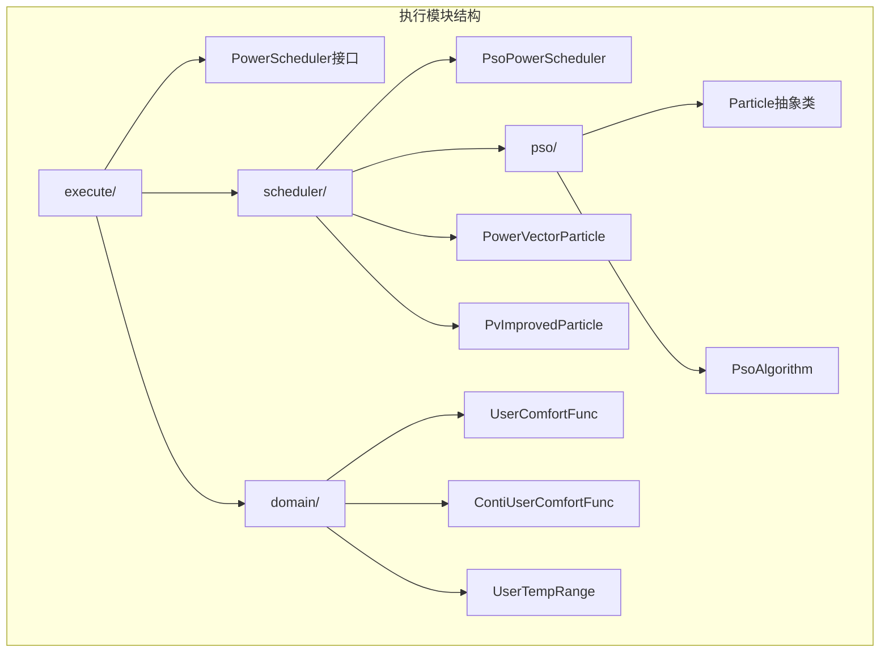
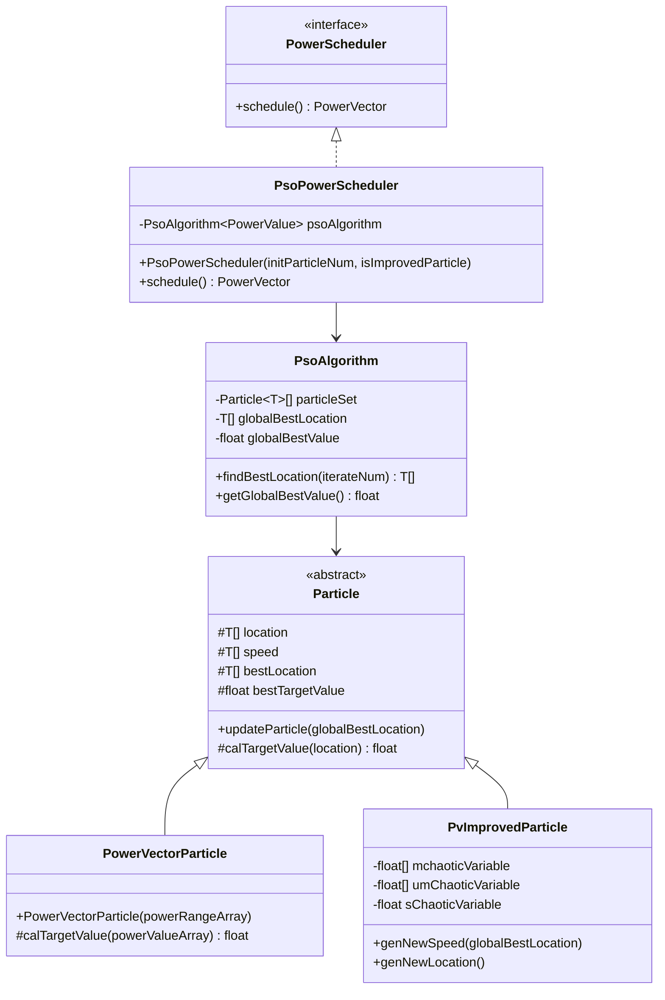
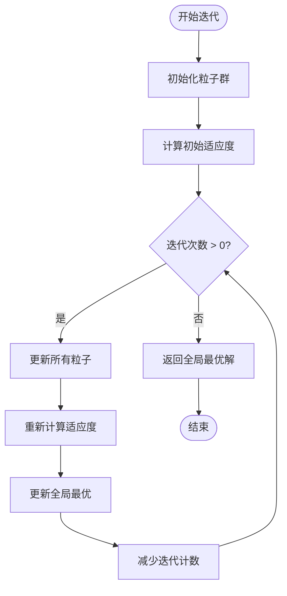
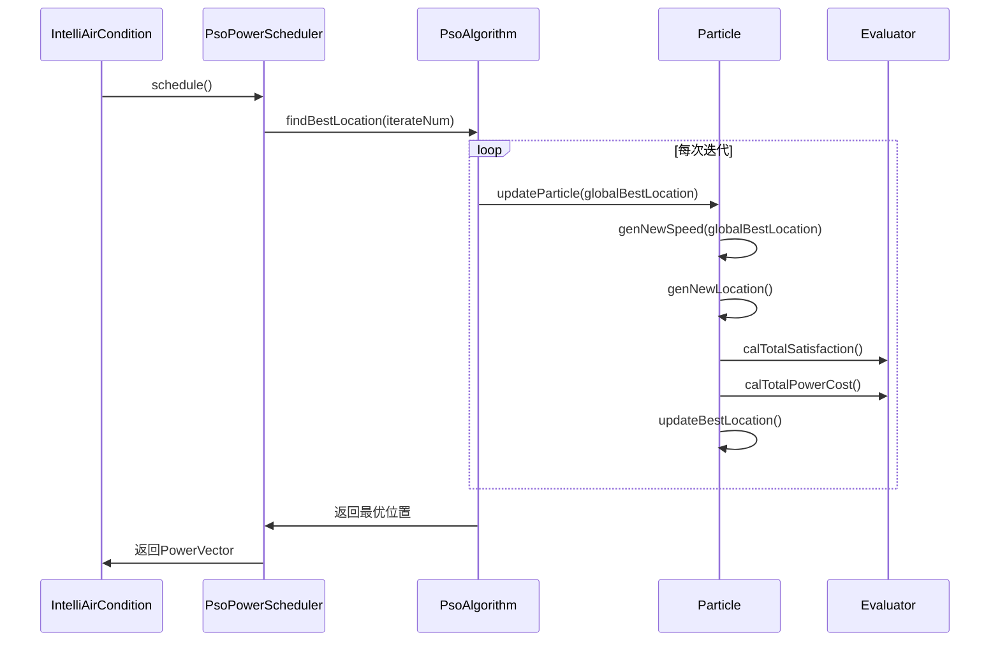
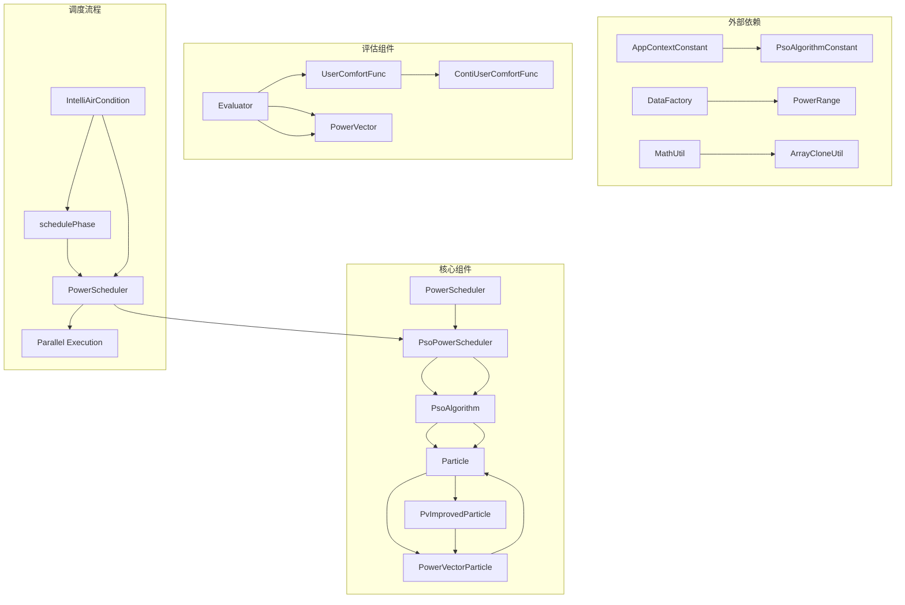

# 执行模块

<cite>
**本文档引用的文件**
- [PowerScheduler.java](file://src/main/java/com/leavesfly/iac/execute/PowerScheduler.java)
- [PsoPowerScheduler.java](file://src/main/java/com/leavesfly/iac/execute/scheduler/PsoPowerScheduler.java)
- [PsoAlgorithm.java](file://src/main/java/com/leavesfly/iac/execute/scheduler/pso/PsoAlgorithm.java)
- [Particle.java](file://src/main/java/com/leavesfly/iac/execute/scheduler/pso/Particle.java)
- [PsoAlgorithmConstant.java](file://src/main/java/com/leavesfly/iac/config/PsoAlgorithmConstant.java)
- [UserComfortFunc.java](file://src/main/java/com/leavesfly/iac/execute/domain/UserComfortFunc.java)
- [ContiUserComfortFunc.java](file://src/main/java/com/leavesfly/iac/execute/domain/ContiUserComfortFunc.java)
- [PowerVectorParticle.java](file://src/main/java/com/leavesfly/iac/execute/scheduler/PowerVectorParticle.java)
- [Evaluator.java](file://src/main/java/com/leavesfly/iac/evalute/Evaluator.java)
- [PvImprovedParticle.java](file://src/main/java/com/leavesfly/iac/execute/scheduler/PvImprovedParticle.java)
- [IntelliAirCondition.java](file://src/main/java/com/leavesfly/iac/IntelliAirCondition.java)
</cite>

## 目录
1. [简介](#简介)
2. [项目结构](#项目结构)
3. [核心组件](#核心组件)
4. [架构概览](#架构概览)
5. [详细组件分析](#详细组件分析)
6. [依赖关系分析](#依赖关系分析)
7. [性能考虑](#性能考虑)
8. [故障排除指南](#故障排除指南)
9. [结论](#结论)

## 简介

执行模块是智能空调系统的核心调度引擎，主要负责基于粒子群优化（PSO）算法的空调功率调度。该模块通过PowerScheduler接口定义了统一的调度策略，支持标准PSO和混沌PSO两种算法变体，能够有效平衡用户舒适度和能源消耗，实现智能化的空调功率分配。

## 项目结构

执行模块采用分层架构设计，包含以下核心包结构：



**图表来源**
- [PowerScheduler.java](file://src/main/java/com/leavesfly/iac/execute/PowerScheduler.java#L1-L19)
- [PsoPowerScheduler.java](file://src/main/java/com/leavesfly/iac/execute/scheduler/PsoPowerScheduler.java#L1-L92)

**章节来源**
- [PowerScheduler.java](file://src/main/java/com/leavesfly/iac/execute/PowerScheduler.java#L1-L19)
- [PsoPowerScheduler.java](file://src/main/java/com/leavesfly/iac/execute/scheduler/PsoPowerScheduler.java#L1-L92)

## 核心组件

### PowerScheduler接口

PowerScheduler接口定义了功率调度器的基本契约，提供了统一的调度方法：

```java
public interface PowerScheduler {
    public PowerVector schedule();
}
```

该接口作为调度系统的顶层抽象，确保不同调度算法实现的一致性。

### PsoPowerScheduler实现类

PsoPowerScheduler是PSO算法的具体实现，支持两种粒子类型：

1. **标准粒子（PowerVectorParticle）**：基于传统PSO算法
2. **混沌粒子（PvImprovedParticle）**：引入混沌理论增强全局搜索能力

```java
public class PsoPowerScheduler implements PowerScheduler {
    private PsoAlgorithm<PowerValue> psoAlgorithm;
    
    public PsoPowerScheduler(int initParticleNum, boolean isImprovedParticle) {
        // 根据参数选择粒子类型
        if (isImprovedParticle) {
            for (int i = 0; i < initParticleNum; i++) {
                ParticleSet[i] = new PvImprovedParticle(powerRangeArray);
            }
        } else {
            for (int i = 0; i < initParticleNum; i++) {
                ParticleSet[i] = new PowerVectorParticle(powerRangeArray);
            }
        }
        psoAlgorithm = new PsoAlgorithm<PowerValue>(ParticleSet);
    }
}
```

**章节来源**
- [PsoPowerScheduler.java](file://src/main/java/com/leavesfly/iac/execute/scheduler/PsoPowerScheduler.java#L1-L92)

## 架构概览

执行模块的整体架构采用策略模式和模板方法模式，实现了高度的可扩展性和灵活性：



**图表来源**
- [PowerScheduler.java](file://src/main/java/com/leavesfly/iac/execute/PowerScheduler.java#L1-L19)
- [PsoPowerScheduler.java](file://src/main/java/com/leavesfly/iac/execute/scheduler/PsoPowerScheduler.java#L1-L92)
- [PsoAlgorithm.java](file://src/main/java/com/leavesfly/iac/execute/scheduler/pso/PsoAlgorithm.java#L1-L116)
- [Particle.java](file://src/main/java/com/leavesfly/iac/execute/scheduler/pso/Particle.java#L1-L245)

## 详细组件分析

### PSO算法核心实现

#### PsoAlgorithm类

PsoAlgorithm类实现了标准的粒子群优化算法，负责协调整个粒子群的迭代过程：

```java
public class PsoAlgorithm<T extends RangeValue> {
    private Particle<T>[] particleSet;
    private T[] globalBestLocation;
    private float globalBestValue;
    
    public T[] findBestLocation(int iterateNum) {
        while (iterateNum > 0) {
            for (Particle<T> particle : particleSet) {
                particle.updateParticle(globalBestLocation);
            }
            setBestLocationAndValue();
            iterateNum--;
        }
        return globalBestLocation;
    }
}
```

算法的核心迭代流程如下：



**图表来源**
- [PsoAlgorithm.java](file://src/main/java/com/leavesfly/iac/execute/scheduler/pso/PsoAlgorithm.java#L70-L85)

#### Particle抽象类

Particle类定义了PSO算法中粒子的基本属性和行为：

```java
public abstract class Particle<T extends RangeValue> {
    protected T[] location;      // 当前位置
    protected T[] speed;         // 当前速度
    protected T[] bestLocation;  // 历史最优位置
    private float bestTargetValue; // 历史最优目标值
    
    public void updateParticle(T[] globalBestLocation) {
        genNewSpeedAndLocation(globalBestLocation);
        currentTargetValue = calTargetValue(location);
        
        if (currentTargetValue > bestTargetValue) {
            changeBestTargetAndLocation();
        }
        currentIterateNum++;
    }
}
```

粒子的速度更新公式为：
```
v = w * v + c1 * r1 * (pbest - x) + c2 * r2 * (gbest - x)
```

其中：
- `w`：惯性权重，随迭代次数递减
- `c1`、`c2`：学习因子
- `r1`、`r2`：随机因子
- `pbest`：个体历史最优位置
- `gbest`：全局最优位置

#### PowerVectorParticle类

PowerVectorParticle类实现了具体的粒子目标值计算逻辑，结合用户舒适度和能耗成本：

```java
@Override
protected float calTargetValue(PowerValue[] powerValueArray) {
    float satisfaction = 0f;
    PowerVector powerVector = new PowerVector(powerValueArray);
    satisfaction += Evaluator.calTotalSatisfaction(powerVector);
    satisfaction *= AppContextConstant.SATISFY_WEIGHT;
    
    float powerCost = 0f;
    powerCost = Evaluator.calTotalPowerCost(powerVector);
    powerCost *= AppContextConstant.POWER_COST_WEIGHT;
    
    return satisfaction - (powerCost / AppContextConstant.AIR_CONDITION_MAX_POWER)
            * ((float) AppContextConstant.USER_NUM / AppContextConstant.AIR_CONDITION_NUM);
}
```

**章节来源**
- [PsoAlgorithm.java](file://src/main/java/com/leavesfly/iac/execute/scheduler/pso/PsoAlgorithm.java#L1-L116)
- [Particle.java](file://src/main/java/com/leavesfly/iac/execute/scheduler/pso/Particle.java#L1-L245)
- [PowerVectorParticle.java](file://src/main/java/com/leavesfly/iac/execute/scheduler/PowerVectorParticle.java#L1-L71)

### 混沌PSO算法实现

#### PvImprovedParticle类

PvImprovedParticle类引入了混沌理论来增强算法的全局搜索能力：

```java
public class PvImprovedParticle extends PowerVectorParticle {
    private float[] mchaoticVariable;
    private final float[] umChaoticVariable;
    private final float sChaoticVariable;
    
    @Override
    protected void genNewLocation() {
        // 混沌变量更新
        for (int i = 0; i < mchaoticVariable.length; i++) {
            mchaoticVariable[i] = (float) Math.pow(mchaoticVariable[i], 
                                                  umChaoticVariable[i] + 1);
        }
        
        // 基于混沌理论的位置更新
        for (int i = 0; i < location.length; i++) {
            float tmp = rmChaoticVariable[i] * sChaoticVariable;
            float value = (float) ((location[i].getValue() + tmp)
                    * Math.exp((1 - Math.exp(-10.f * mchaoticVariable[i]))
                            * (3.0f - 7.5f / rmChaoticVariable[i] 
                               * (location[i].getValue() + tmp)))
                    - tmp + Math.exp(-20.0f * mchaoticVariable[i] * speed[i].getValue()));
            
            // 边界约束处理
            if (value > location[i].getTo()) {
                location[i].setValue(location[i].getTo());
            } else if (value < location[i].getFrom()) {
                location[i].setValue(location[i].getFrom());
            } else {
                location[i].setValue(value);
            }
        }
    }
}
```

混沌PSO算法相比标准PSO的主要改进：

1. **混沌变量引入**：通过混沌映射增加种群多样性
2. **增强探索能力**：避免过早收敛到局部最优
3. **动态调整**：混沌参数随迭代动态变化

**章节来源**
- [PvImprovedParticle.java](file://src/main/java/com/leavesfly/iac/execute/scheduler/PvImprovedParticle.java#L1-L114)

### 用户舒适度函数

#### UserComfortFunc抽象类

UserComfortFunc定义了用户舒适度计算的基础框架：

```java
public abstract class UserComfortFunc {
    protected static final float COMFORT_MIN_VALUE = AppContextConstant.COMFORT_MIN_VALUE;
    protected String userId;
    
    public abstract float calUserComfort(float temperature);
    public abstract boolean isUpMinSatisfy(float temperature);
}
```

#### ContiUserComfortFunc实现类

ContiUserComfortFunc提供了连续型用户舒适度函数的实现：

```java
public class ContiUserComfortFunc extends UserComfortFunc {
    private UserTempRange userTempRange;
    private float average;
    private float variance;
    
    @Override
    public float calUserComfort(float temperature) {
        if (userTempRange.isInRange(temperature)) {
            float value = -(float) Math.pow((temperature - average), 2) / (2 * variance);
            return (float) Math.exp(value);
        }
        return 0f;
    }
}
```

该函数基于正态分布模型，计算用户在特定温度下的舒适度值。

**章节来源**
- [UserComfortFunc.java](file://src/main/java/com/leavesfly/iac/execute/domain/UserComfortFunc.java#L1-L85)
- [ContiUserComfortFunc.java](file://src/main/java/com/leavesfly/iac/execute/domain/ContiUserComfortFunc.java#L1-L143)

### 调度流程集成

#### IntelliAirCondition调度阶段

IntelliAirCondition类展示了调度流程的实际应用：

```java
private void schedulePhase() {
    // 提交标准PSO任务
    executorService.submit(new Runnable() {
        @Override
        public void run() {
            PowerScheduler powerScheduler = new PsoPowerScheduler(
                    PsoAlgorithmConstant.PSO_INIT_PARTICLE_NUM, Boolean.FALSE);
            PowerVector powerVector = powerScheduler.schedule();
            Solution solution = SolutionBuilder.buildSolution(
                    AppContextConstant.SOLUTIN_NAME_PREFIX
                            + AppContextConstant.SOLUTIN_NAME_PSO_SUFFIX, powerVector);
            EvaluteResult evaluteResult = Evaluator.transform(solution);
            dataFactory.addEvaluteResult(evaluteResult);
            latch.countDown();
        }
    });
    
    // 提交混沌PSO任务
    executorService.submit(new Runnable() {
        @Override
        public void run() {
            PowerScheduler powerScheduler = new PsoPowerScheduler(
                    PsoAlgorithmConstant.PSO_INIT_PARTICLE_NUM, Boolean.TRUE);
            PowerVector powerVector = powerScheduler.schedule();
            Solution solution = SolutionBuilder.buildSolution(
                    AppContextConstant.SOLUTIN_NAME_PREFIX
                            + AppContextConstant.SOLUTIN_NAME_PSO_CHAOS_SUFFIX, powerVector);
            EvaluteResult evaluteResult = Evaluator.transform(solution);
            dataFactory.addEvaluteResult(evaluteResult);
            latch.countDown();
        }
    });
}
```

调度流程的关键步骤：



**图表来源**
- [IntelliAirCondition.java](file://src/main/java/com/leavesfly/iac/IntelliAirCondition.java#L95-L140)
- [PsoAlgorithm.java](file://src/main/java/com/leavesfly/iac/execute/scheduler/pso/PsoAlgorithm.java#L70-L85)

**章节来源**
- [IntelliAirCondition.java](file://src/main/java/com/leavesfly/iac/IntelliAirCondition.java#L95-L140)

## 依赖关系分析

执行模块的依赖关系体现了清晰的分层架构：



**图表来源**
- [PsoPowerScheduler.java](file://src/main/java/com/leavesfly/iac/execute/scheduler/PsoPowerScheduler.java#L1-L20)
- [PsoAlgorithm.java](file://src/main/java/com/leavesfly/iac/execute/scheduler/pso/PsoAlgorithm.java#L1-L10)

**章节来源**
- [PsoPowerScheduler.java](file://src/main/java/com/leavesfly/iac/execute/scheduler/PsoPowerScheduler.java#L1-L92)
- [PsoAlgorithm.java](file://src/main/java/com/leavesfly/iac/execute/scheduler/pso/PsoAlgorithm.java#L1-L116)

## 性能考虑

### 算法参数调优

PSO算法的关键参数及其影响：

| 参数 | 默认值 | 说明 | 调优建议 |
|------|--------|------|----------|
| PSO_ITERATE_NUM | 1000 | 迭代次数 | 根据问题复杂度调整，高精度需求可增加到2000-5000 |
| PSO_INERTIA_WEIGHT_INIT | 0.9 | 初始惯性权重 | 平衡探索与开发，建议0.8-0.9 |
| PSO_INERTIA_WEIGHT_END | 0.4 | 结束惯性权重 | 促进收敛，建议0.3-0.5 |
| PSO_LEARN_RATE_1 | 2.0 | 个体学习因子 | 控制个体经验影响，建议1.5-2.5 |
| PSO_LEARN_RATE_2 | 2.0 | 社会学习因子 | 控制群体经验影响，建议1.5-2.5 |

### 内存优化策略

1. **粒子对象复用**：避免频繁的对象创建和销毁
2. **数组深拷贝优化**：使用高效的克隆工具减少内存开销
3. **延迟加载**：按需初始化用户舒适度函数

### 并行化处理

调度阶段采用多线程并行执行不同算法：

```java
ExecutorService executorService = Executors.newCachedThreadPool();
CountDownLatch latch = new CountDownLatch(3);

// 并行执行三种调度策略
executorService.submit(task1);
executorService.submit(task2);  // 标准PSO
executorService.submit(task3);  // 混沌PSO
```

## 故障排除指南

### 常见问题及解决方案

#### 1. PSO算法不收敛

**症状**：算法运行多次但结果差异很大，无法找到稳定解

**可能原因**：
- 惯性权重设置不当
- 学习因子过大导致振荡
- 粒子初始化范围不合理

**解决方案**：
```java
// 调整惯性权重范围
public static final float PSO_INERTIA_WEIGHT_INIT = 0.8f;  // 减小初始值
public static final float PSO_INERTIA_WEIGHT_END = 0.3f;   // 增大结束值

// 调整学习因子
public static final float PSO_LEARN_RATE_1 = 1.5f;         // 减小个体学习因子
public static final float PSO_LEARN_RATE_2 = 1.5f;         // 减小社会学习因子
```

#### 2. 用户舒适度计算异常

**症状**：calUserComfort返回NaN或无穷大

**可能原因**：
- 温度范围超出预期
- 方差计算错误
- 数值溢出

**解决方案**：
```java
// 添加边界检查
@Override
public float calUserComfort(float temperature) {
    if (!userTempRange.isInRange(temperature)) {
        return 0f;
    }
    
    // 防止数值溢出
    float diff = temperature - average;
    if (Math.abs(diff) > 100) {
        return 0f;
    }
    
    float value = -(float) Math.pow(diff, 2) / (2 * variance);
    return Math.min((float) Math.exp(value), 1.0f);
}
```

#### 3. 混沌PSO性能问题

**症状**：混沌PSO运行时间过长

**可能原因**：
- 混沌变量计算复杂度过高
- 循环次数过多

**解决方案**：
```java
// 优化混沌变量计算
private void optimizeChaoticCalculation() {
    // 使用查表法替代实时计算
    // 或者减少混沌变量的维度
}
```

**章节来源**
- [PsoAlgorithmConstant.java](file://src/main/java/com/leavesfly/iac/config/PsoAlgorithmConstant.java#L1-L53)
- [ContiUserComfortFunc.java](file://src/main/java/com/leavesfly/iac/execute/domain/ContiUserComfortFunc.java#L30-L45)

## 结论

执行模块通过精心设计的PSO算法实现了智能空调功率调度，具有以下特点：

1. **算法多样性**：支持标准PSO和混沌PSO两种算法变体
2. **用户友好**：将用户舒适度函数融入优化目标
3. **高效并行**：利用多线程提高调度效率
4. **可扩展性**：清晰的接口设计便于添加新的调度策略
5. **稳定性**：完善的错误处理和参数验证机制

该模块为智能空调系统提供了强大的调度能力，能够有效平衡能源消耗和用户体验，在实际应用中展现出良好的性能和稳定性。