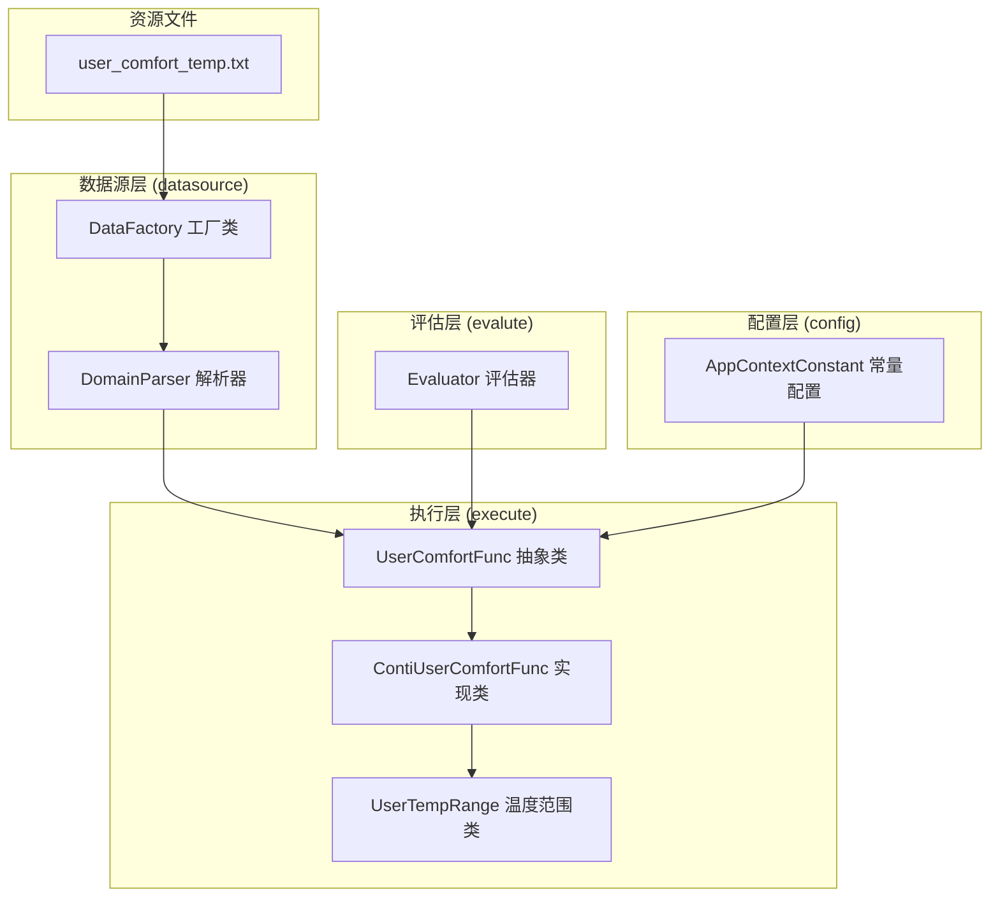
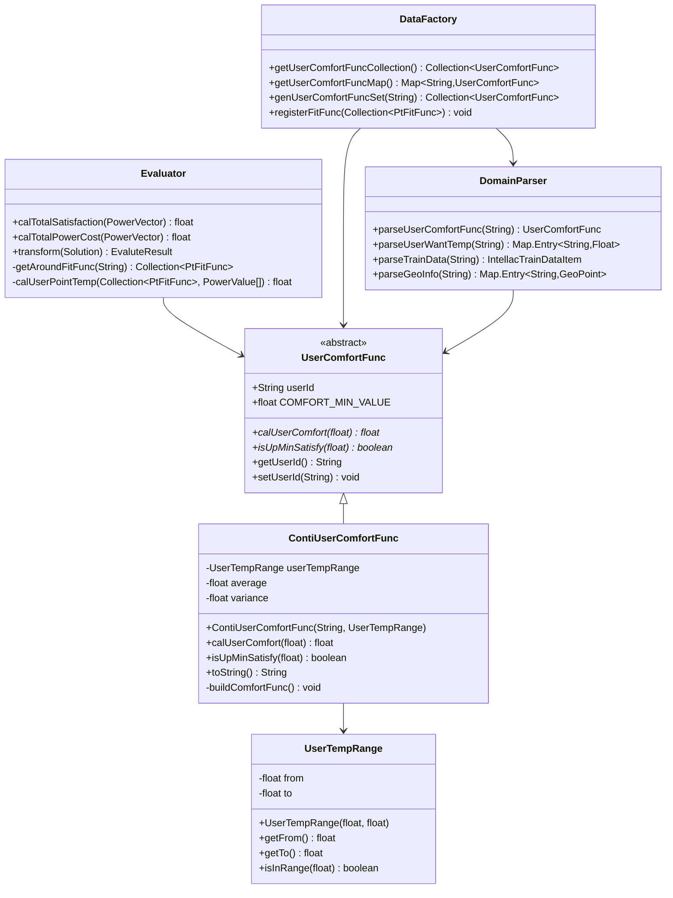
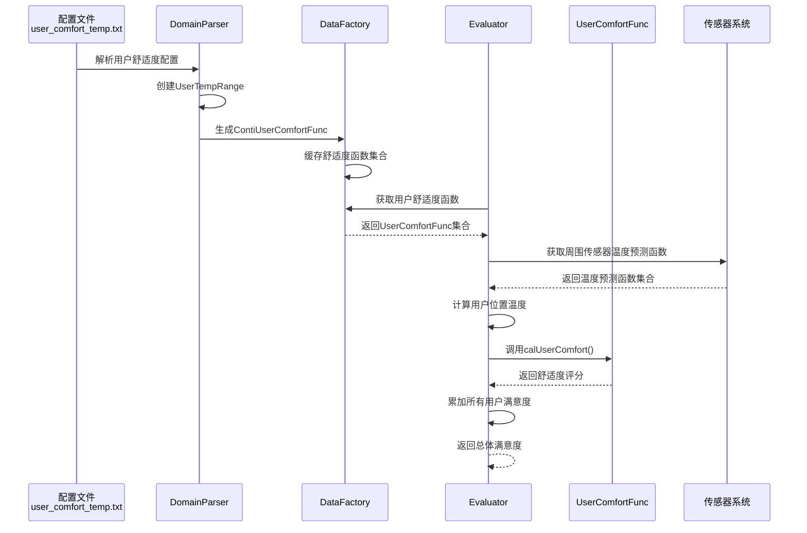

# 用户舒适度模型

<cite>
**本文档引用的文件**
- [UserComfortFunc.java](file://src/main/java/com/leavesfly/iac/execute/domain/UserComfortFunc.java)
- [ContiUserComfortFunc.java](file://src/main/java/com/leavesfly/iac/execute/domain/ContiUserComfortFunc.java)
- [UserTempRange.java](file://src/main/java/com/leavesfly/iac/execute/domain/UserTempRange.java)
- [Evaluator.java](file://src/main/java/com/leavesfly/iac/evalute/Evaluator.java)
- [DomainParser.java](file://src/main/java/com/leavesfly/iac/datasource/DomainParser.java)
- [DataFactory.java](file://src/main/java/com/leavesfly/iac/datasource/DataFactory.java)
- [AppContextConstant.java](file://src/main/java/com/leavesfly/iac/config/AppContextConstant.java)
- [user_comfort_temp.txt](file://src/main/resource/user_comfort_temp.txt)
</cite>

## 目录
1. [简介](#简介)
2. [项目结构概览](#项目结构概览)
3. [核心组件分析](#核心组件分析)
4. [架构设计](#架构设计)
5. [详细组件分析](#详细组件分析)
6. [数据流分析](#数据流分析)
7. [性能考虑](#性能考虑)
8. [故障排除指南](#故障排除指南)
9. [结论](#结论)

## 简介

用户舒适度模型是智能空调仿真平台的核心组件之一，负责量化用户在不同温度环境下的舒适度体验。该模型通过抽象类设计模式，提供了灵活且可扩展的舒适度计算框架，支持多种舒适度函数类型，特别是连续舒适度函数（ContiUserComfortFunc）的实现。

该模型的主要功能包括：
- 定义用户舒适度计算的抽象接口
- 提供基于用户偏好温度范围的连续舒适度函数实现
- 支持舒适度评分计算和最低舒适度阈值判断
- 与评估器集成，在功率调度优化过程中计算总体用户满意度

## 项目结构概览

用户舒适度模型的代码组织遵循清晰的分层架构，主要分布在以下几个关键目录中：



**图表来源**
- [UserComfortFunc.java](file://src/main/java/com/leavesfly/iac/execute/domain/UserComfortFunc.java#L1-L85)
- [ContiUserComfortFunc.java](file://src/main/java/com/leavesfly/iac/execute/domain/ContiUserComfortFunc.java#L1-L143)
- [DomainParser.java](file://src/main/java/com/leavesfly/iac/datasource/DomainParser.java#L1-L158)

## 核心组件分析

### UserComfortFunc 抽象类

UserComfortFunc 是整个舒适度模型的核心抽象基类，定义了所有舒适度函数必须实现的基本接口：

```java
public abstract class UserComfortFunc {
    protected static final float COMFORT_MIN_VALUE = AppContextConstant.COMFORT_MIN_VALUE;
    protected String userId;
    
    public abstract float calUserComfort(float temperature);
    public abstract boolean isUpMinSatisfy(float temperature);
}
```

该抽象类的设计体现了以下关键特性：
- **静态常量定义**：COMFORT_MIN_VALUE 作为所有子类共享的最小舒适度阈值
- **用户标识**：每个舒适度函数都关联一个唯一的用户ID
- **双抽象方法**：同时提供舒适度评分计算和最低舒适度验证功能

### ContiUserComfortFunc 连续舒适度函数

ContiUserComfortFunc 是 UserComfortFunc 的具体实现，基于高斯分布模型计算连续舒适度评分：

```java
public class ContiUserComfortFunc extends UserComfortFunc {
    private UserTempRange userTempRange;
    private float average;
    private float variance;
    
    @Override
    public float calUserComfort(float temperature) {
        if (userTempRange.isInRange(temperature)) {
            float value = -(float) Math.pow((temperature - average), 2) / (2 * variance);
            return (float) Math.exp(value);
        }
        return 0f;
    }
}
```

该实现的关键算法特点：
- **高斯分布计算**：使用标准高斯函数计算舒适度评分
- **温度范围验证**：只有在用户可接受温度范围内才计算舒适度
- **非线性衰减**：远离理想温度时舒适度呈指数下降

**章节来源**
- [UserComfortFunc.java](file://src/main/java/com/leavesfly/iac/execute/domain/UserComfortFunc.java#L1-L85)
- [ContiUserComfortFunc.java](file://src/main/java/com/leavesfly/iac/execute/domain/ContiUserComfortFunc.java#L1-L143)

## 架构设计

用户舒适度模型采用了经典的策略模式和工厂模式相结合的设计架构：



**图表来源**
- [UserComfortFunc.java](file://src/main/java/com/leavesfly/iac/execute/domain/UserComfortFunc.java#L10-L85)
- [ContiUserComfortFunc.java](file://src/main/java/com/leavesfly/iac/execute/domain/ContiUserComfortFunc.java#L3-L143)
- [UserTempRange.java](file://src/main/java/com/leavesfly/iac/execute/domain/UserTempRange.java#L1-L80)

## 详细组件分析

### UserTempRange 温度范围类

UserTempRange 类封装了用户可接受的温度范围概念：

```java
public class UserTempRange {
    private float from;
    private float to;
    
    public boolean isInRange(float temp) {
        if (temp > to || temp < from) {
            return false;
        }
        return true;
    }
}
```

该类的设计特点：
- **简单直接**：提供基本的温度范围管理和验证功能
- **边界处理**：严格区分温度范围内外的条件
- **不可变性**：通过私有字段和只读访问器保证数据一致性

### 基于用户偏好的舒适度函数构建

系统通过 DomainParser 类解析用户舒适度配置文件，构建 UserComfortFunc 实例：

```java
public static UserComfortFunc parseUserComfortFunc(String strLine) {
    String[] strArray = SPLITER_TABLE.split(strLine);
    String userId = strArray[0];
    float wantTemp = NumberUtils.toFloat(strArray[1]);
    UserTempRange userTempRange = new UserTempRange(
        wantTemp - AppContextConstant.COMFORT_UP_DOWN_RANGE_VALUE, 
        wantTemp + AppContextConstant.COMFORT_UP_DOWN_RANGE_VALUE
    );
    return new ContiUserComfortFunc(userId, userTempRange);
}
```

构建过程的关键步骤：
1. **解析输入数据**：从 user_comfort_temp.txt 文件读取用户ID和期望温度
2. **计算温度范围**：基于期望温度和上下调整范围创建 UserTempRange
3. **实例化函数**：创建 ContiUserComfortFunc 实例并初始化内部参数

### 连续舒适度函数的数学原理

ContiUserComfortFunc 使用高斯分布函数计算舒适度评分：

```java
private void buildComfortFunc() {
    average = (userTempRange.getFrom() + userTempRange.getTo()) / 2;
    variance = -(float) Math.pow((userTempRange.getTo() - average), 2) / 
               (2 * (float) Math.log(COMFORT_MIN_VALUE));
}

@Override
public float calUserComfort(float temperature) {
    if (userTempRange.isInRange(temperature)) {
        float value = -(float) Math.pow((temperature - average), 2) / (2 * variance);
        return (float) Math.exp(value);
    }
    return 0f;
}
```

数学公式的含义：
- **平均值计算**：温度范围的中点作为理想温度
- **方差确定**：通过最小舒适度阈值反推方差参数
- **高斯函数**：使用标准正态分布计算舒适度评分
- **非线性衰减**：远离理想温度时舒适度呈指数下降

**章节来源**
- [UserTempRange.java](file://src/main/java/com/leavesfly/iac/execute/domain/UserTempRange.java#L1-L80)
- [DomainParser.java](file://src/main/java/com/leavesfly/iac/datasource/DomainParser.java#L70-L85)
- [ContiUserComfortFunc.java](file://src/main/java/com/leavesfly/iac/execute/domain/ContiUserComfortFunc.java#L15-L30)

## 数据流分析

用户舒适度模型的数据流贯穿整个系统，从配置文件解析到最终的满意度计算：



**图表来源**
- [DomainParser.java](file://src/main/java/com/leavesfly/iac/datasource/DomainParser.java#L70-L85)
- [DataFactory.java](file://src/main/java/com/leavesfly/iac/datasource/DataFactory.java#L130-L150)
- [Evaluator.java](file://src/main/java/com/leavesfly/iac/evalute/Evaluator.java#L25-L50)

### 评估阶段的舒适度计算流程

Evaluator 类在评估阶段调用 UserComfortFunc 进行舒适度计算：

```java
public static float calTotalSatisfaction(PowerVector powerVector) {
    float satisfaction = 0f;
    Collection<UserComfortFunc> userComfortFuncSet = DataFactory.getInstance()
            .getUserComfortFuncCollection();
    
    for (UserComfortFunc userComfortFunc : userComfortFuncSet) {
        String userId = userComfortFunc.getUserId();
        Collection<PtFitFunc> sensorFuncSet = getAroundFitFunc(userId);
        float temperature = calUserPointTemp(sensorFuncSet, powerValueArray);
        satisfaction += userComfortFunc.calUserComfort(temperature);
    }
    return satisfaction;
}
```

计算流程的关键步骤：
1. **获取舒适度函数**：从 DataFactory 获取所有用户的舒适度函数
2. **温度预测**：通过周围传感器的温度预测函数计算用户位置温度
3. **舒适度评分**：调用每个用户的舒适度函数计算评分
4. **满意度累加**：将所有用户的舒适度评分相加得到总体满意度

**章节来源**
- [Evaluator.java](file://src/main/java/com/leavesfly/iac/evalute/Evaluator.java#L25-L50)

## 性能考虑

### 内存优化策略

1. **单例模式**：DataFactory 采用双重检查锁定机制确保线程安全的同时减少内存占用
2. **延迟加载**：舒适度函数集合采用延迟初始化策略，仅在需要时才加载
3. **缓存机制**：解析后的舒适度函数实例被缓存在内存中，避免重复解析

### 计算效率优化

1. **快速温度范围检查**：UserTempRange 的 isInRange 方法提供 O(1) 时间复杂度的温度范围验证
2. **预计算参数**：ContiUserComfortFunc 在构造时预计算平均值和方差，避免重复计算
3. **早期退出**：当温度超出舒适范围时立即返回 0，避免不必要的计算

### 扩展性设计

1. **插件式架构**：通过抽象类设计支持新的舒适度函数类型
2. **配置驱动**：舒适度参数完全由配置文件控制，无需修改代码
3. **多用户支持**：系统设计支持大量用户的舒适度计算，具有良好的可扩展性

## 故障排除指南

### 常见问题及解决方案

#### 1. 舒适度函数未正确加载

**症状**：Evaluator 计算满意度时出现 NullPointerException

**原因**：DataFactory 未能正确加载用户舒适度函数

**解决方案**：
- 检查 user_comfort_temp.txt 文件是否存在且格式正确
- 验证文件路径配置是否正确
- 确认 AppContextConstant 中的文件名常量设置

#### 2. 舒适度评分异常

**症状**：calUserComfort 返回值不在预期范围内

**原因**：温度范围计算或高斯函数参数设置错误

**解决方案**：
- 检查 COMFORT_UP_DOWN_RANGE_VALUE 常量设置
- 验证 UserTempRange 的 from 和 to 值
- 确认高斯函数参数计算的正确性

#### 3. 最低舒适度阈值不生效

**症状**：isUpMinSatisfy 方法返回不符合预期的结果

**原因**：温度范围验证逻辑错误

**解决方案**：
- 检查 UserTempRange 的 isInRange 方法实现
- 验证温度比较逻辑的边界条件
- 确认 COMFORT_MIN_VALUE 常量的设置

**章节来源**
- [DataFactory.java](file://src/main/java/com/leavesfly/iac/datasource/DataFactory.java#L130-L150)
- [ContiUserComfortFunc.java](file://src/main/java/com/leavesfly/iac/execute/domain/ContiUserComfortFunc.java#L49-L53)

## 结论

用户舒适度模型是一个设计精良、功能完善的系统组件，它成功地将抽象设计模式与实际业务需求相结合。该模型的主要优势包括：

### 设计优势

1. **清晰的抽象层次**：UserComfortFunc 抽象类提供了明确的接口规范
2. **灵活的实现策略**：ContiUserComfortFunc 展示了高质量的具体实现
3. **模块化的架构设计**：各组件职责明确，耦合度低
4. **强大的扩展能力**：支持自定义舒适度函数的开发

### 技术特色

1. **数学基础扎实**：基于高斯分布的舒适度计算具有科学依据
2. **性能优化到位**：通过预计算和缓存机制提升运行效率
3. **错误处理完善**：提供了全面的异常处理和验证机制
4. **配置灵活**：参数完全可配置，适应不同的业务场景

### 应用价值

该模型不仅在当前的智能空调仿真平台中发挥重要作用，其设计理念和实现方式也为类似系统的开发提供了宝贵的参考。通过合理的抽象设计和高效的实现策略，该模型成功地平衡了功能性、性能和可维护性的需求。

对于希望开发类似舒适度计算系统的开发者，建议重点关注以下方面：
- 抽象类设计的合理性
- 数学模型选择的准确性
- 性能优化的实际效果
- 扩展性和可维护性的保障