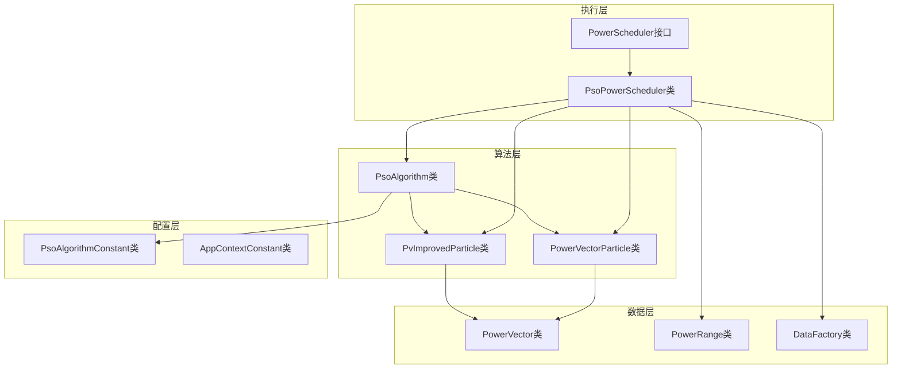
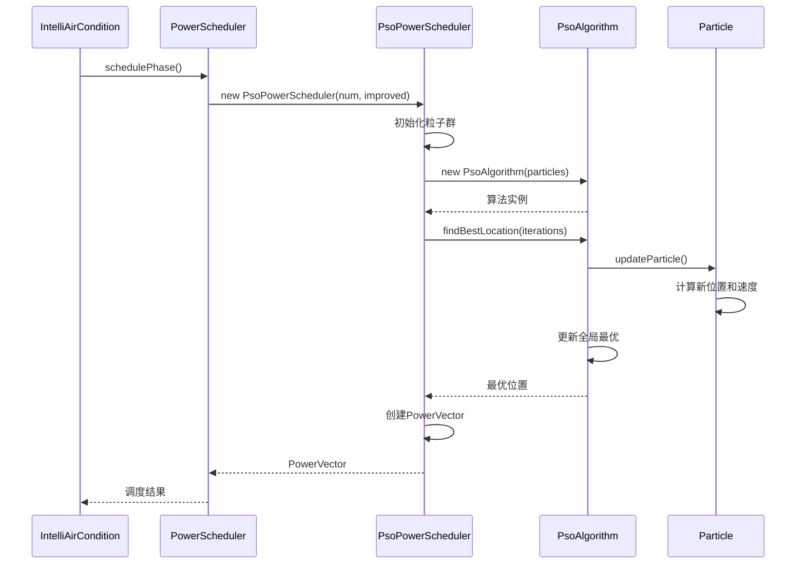
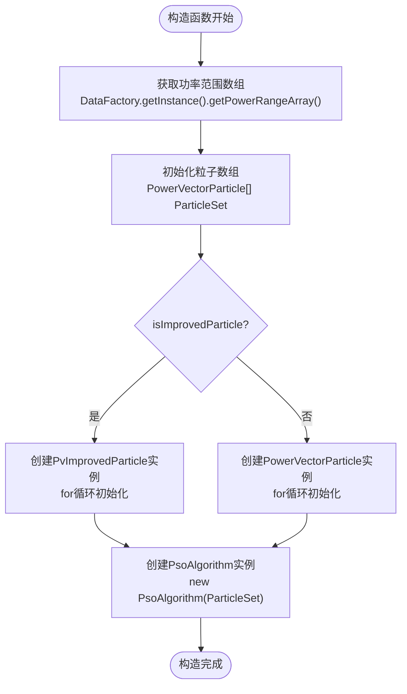
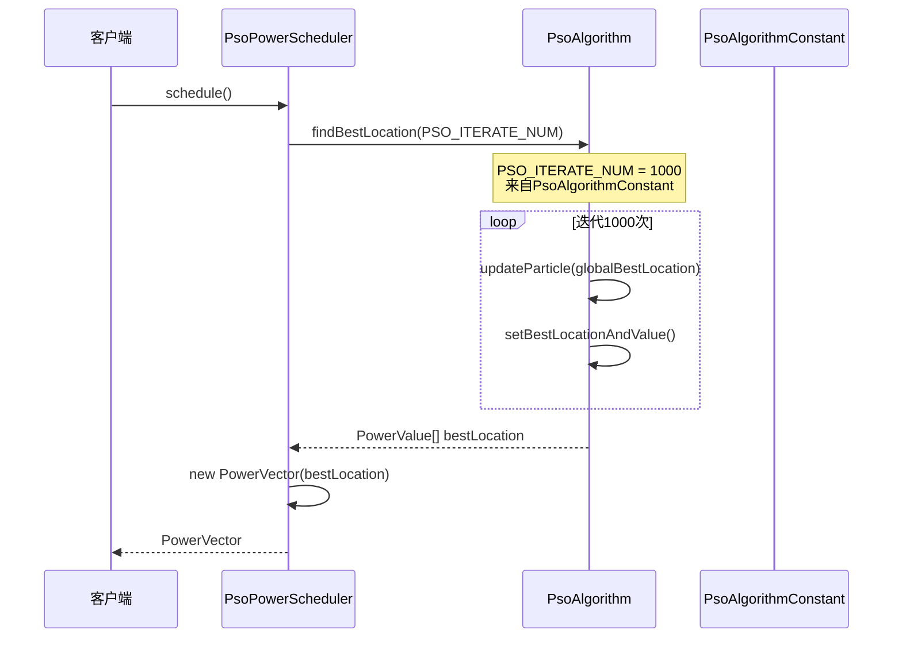
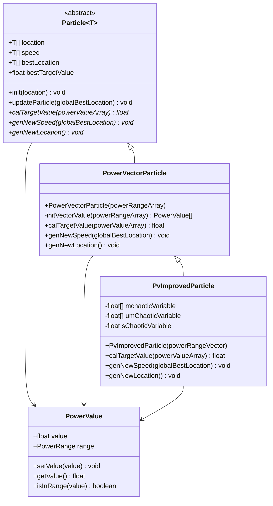
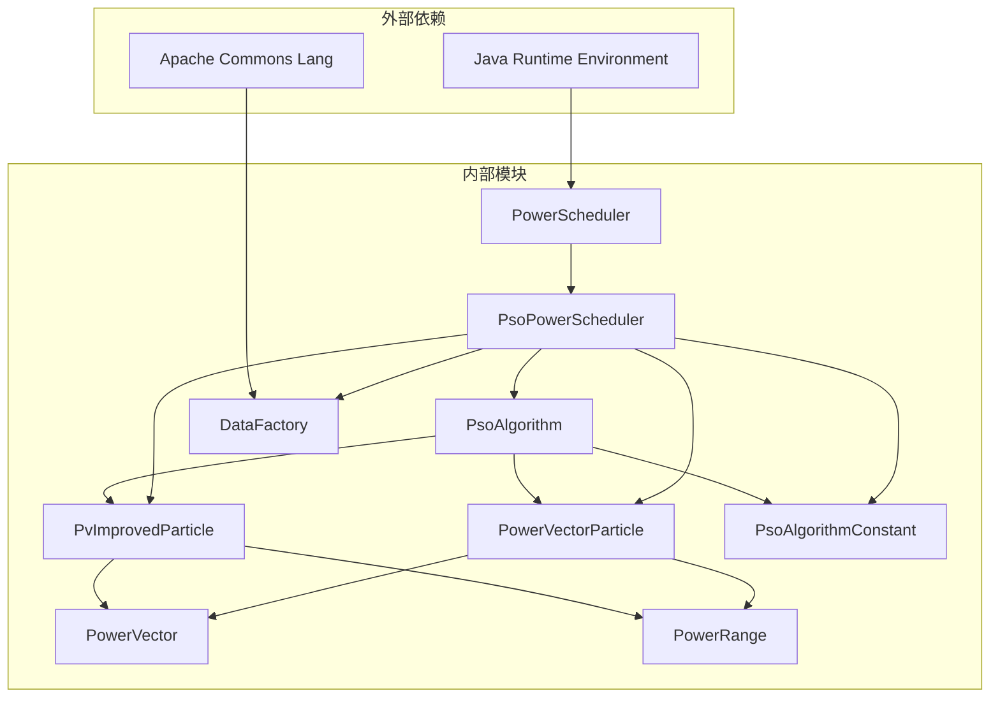

# 调度器设计

<cite>
**本文档引用的文件**
- [PowerScheduler.java](file://src/main/java/com/leavesfly/iac/execute/PowerScheduler.java)
- [PsoPowerScheduler.java](file://src/main/java/com/leavesfly/iac/execute/scheduler/PsoPowerScheduler.java)
- [PsoAlgorithm.java](file://src/main/java/com/leavesfly/iac/execute/scheduler/pso/PsoAlgorithm.java)
- [PowerVectorParticle.java](file://src/main/java/com/leavesfly/iac/execute/scheduler/PowerVectorParticle.java)
- [PvImprovedParticle.java](file://src/main/java/com/leavesfly/iac/execute/scheduler/PvImprovedParticle.java)
- [PowerVector.java](file://src/main/java/com/leavesfly/iac/domain/PowerVector.java)
- [PowerRange.java](file://src/main/java/com/leavesfly/iac/domain/PowerRange.java)
- [DataFactory.java](file://src/main/java/com/leavesfly/iac/datasource/DataFactory.java)
- [IntelliAirCondition.java](file://src/main/java/com/leavesfly/iac/IntelliAirCondition.java)
- [PsoAlgorithmConstant.java](file://src/main/java/com/leavesfly/iac/config/PsoAlgorithmConstant.java)
</cite>

## 目录
1. [简介](#简介)
2. [项目结构](#项目结构)
3. [核心组件](#核心组件)
4. [架构概览](#架构概览)
5. [详细组件分析](#详细组件分析)
6. [依赖关系分析](#依赖关系分析)
7. [性能考虑](#性能考虑)
8. [故障排除指南](#故障排除指南)
9. [结论](#结论)

## 简介

智能空调调度器设计是一个基于粒子群优化（PSO）算法的功率调度系统，旨在通过优化空调设备的功率配置来平衡用户舒适度和能源消耗。该系统采用分层架构设计，通过PowerScheduler接口定义统一的调度策略，PsoPowerScheduler作为具体实现类，利用PsoAlgorithm算法引擎和不同类型的粒子（PowerVectorParticle和PvImprovedParticle）来寻找最优功率向量配置。

系统的核心设计理念是通过智能算法自动调节空调功率，既满足用户的舒适需求，又实现能源的高效利用。调度器支持两种运行模式：标准PSO算法和混沌PSO算法，后者通过引入混沌变量增强全局搜索能力，避免陷入局部最优解。

## 项目结构

调度器相关的文件组织结构清晰，遵循分层架构原则：



**图表来源**
- [PowerScheduler.java](file://src/main/java/com/leavesfly/iac/execute/PowerScheduler.java#L1-L19)
- [PsoPowerScheduler.java](file://src/main/java/com/leavesfly/iac/execute/scheduler/PsoPowerScheduler.java#L1-L92)
- [PsoAlgorithm.java](file://src/main/java/com/leavesfly/iac/execute/scheduler/pso/PsoAlgorithm.java#L1-L116)

**章节来源**
- [PowerScheduler.java](file://src/main/java/com/leavesfly/iac/execute/PowerScheduler.java#L1-L19)
- [PsoPowerScheduler.java](file://src/main/java/com/leavesfly/iac/execute/scheduler/PsoPowerScheduler.java#L1-L92)

## 核心组件

### PowerScheduler接口

PowerScheduler接口定义了功率调度器的基本契约，提供了统一的调度方法：

```java
public interface PowerScheduler {
    public PowerVector schedule();
}
```

该接口的设计体现了面向对象编程的开闭原则，允许不同的调度算法实现类扩展调度功能，而无需修改现有代码。

### PsoPowerScheduler实现类

PsoPowerScheduler是PowerScheduler接口的具体实现，负责协调PSO算法的执行过程：

```java
public class PsoPowerScheduler implements PowerScheduler {
    private PsoAlgorithm<PowerValue> psoAlgorithm;
    
    public PsoPowerScheduler(int initParticleNum, boolean isImprovedParticle) {
        // 初始化逻辑...
    }
    
    @Override
    public PowerVector schedule() {
        PowerValue[] bestLocation = psoAlgorithm.findBestLocation(PsoAlgorithmConstant.PSO_ITERATE_NUM);
        return new PowerVector(bestLocation);
    }
}
```

**章节来源**
- [PowerScheduler.java](file://src/main/java/com/leavesfly/iac/execute/PowerScheduler.java#L1-L19)
- [PsoPowerScheduler.java](file://src/main/java/com/leavesfly/iac/execute/scheduler/PsoPowerScheduler.java#L1-L92)

## 架构概览

调度器采用经典的三层架构设计，从上到下分别为应用层、算法层和数据层：



**图表来源**
- [IntelliAirCondition.java](file://src/main/java/com/leavesfly/iac/IntelliAirCondition.java#L95-L130)
- [PsoPowerScheduler.java](file://src/main/java/com/leavesfly/iac/execute/scheduler/PsoPowerScheduler.java#L50-L65)
- [PsoAlgorithm.java](file://src/main/java/com/leavesfly/iac/execute/scheduler/pso/PsoAlgorithm.java#L65-L80)

## 详细组件分析

### PsoPowerScheduler详细分析

PsoPowerScheduler是调度器的核心实现类，其构造函数根据isImprovedParticle参数决定使用哪种类型的粒子：



**图表来源**
- [PsoPowerScheduler.java](file://src/main/java/com/leavesfly/iac/execute/scheduler/PsoPowerScheduler.java#L30-L50)

#### isImprovedParticle参数机制

isImprovedParticle参数控制着粒子群的初始化方式：

1. **标准模式（false）**：使用PowerVectorParticle，适用于一般场景
2. **改进模式（true）**：使用PvImprovedParticle，引入混沌变量增强全局搜索能力

这种设计允许系统在不同场景下灵活切换优化策略，平衡搜索效率和全局最优性。

#### schedule()方法实现

schedule()方法是调度器的主要入口点，其执行流程如下：



**图表来源**
- [PsoPowerScheduler.java](file://src/main/java/com/leavesfly/iac/execute/scheduler/PsoPowerScheduler.java#L50-L65)
- [PsoAlgorithmConstant.java](file://src/main/java/com/leavesfly/iac/config/PsoAlgorithmConstant.java#L15-L16)

**章节来源**
- [PsoPowerScheduler.java](file://src/main/java/com/leavesfly/iac/execute/scheduler/PsoPowerScheduler.java#L30-L65)

### 粒子类层次结构

系统定义了完整的粒子类层次结构，支持标准和改进两种粒子类型：



**图表来源**
- [PowerVectorParticle.java](file://src/main/java/com/leavesfly/iac/execute/scheduler/PowerVectorParticle.java#L1-L71)
- [PvImprovedParticle.java](file://src/main/java/com/leavesfly/iac/execute/scheduler/PvImprovedParticle.java#L1-L114)

#### PvImprovedParticle的混沌机制

PvImprovedParticle通过引入混沌变量显著增强了算法的全局搜索能力：

```java
// 混沌变量初始化
static {
    rmChaoticVariable = new float[AppContextConstant.AIR_CONDITION_NUM];
    for (int i = 0; i < AppContextConstant.AIR_CONDITION_NUM; i++) {
        rmChaoticVariable[i] = MathUtil.nextInt(10, 20);
    }
}

// 混沌位置更新公式
float value = (float) ((location[i].getValue() + tmp)
    * Math.exp((1 - Math.exp(-10.f * mchaoticVariable[i]))
        * (3.0f - 7.5f / rmChaoticVariable[i] * (location[i].getValue() + tmp)))
    - tmp + Math.exp(-20.0f * mchaoticVariable[i] * speed[i].getValue()));
```

这种混沌机制通过非线性变换增加了搜索空间的多样性，有效避免了早熟收敛问题。

**章节来源**
- [PvImprovedParticle.java](file://src/main/java/com/leavesfly/iac/execute/scheduler/PvImprovedParticle.java#L1-L114)

### 数据工厂集成

DataFactory作为系统的核心数据提供者，负责管理空调功率约束范围：

```mermaid
flowchart LR
subgraph "DataFactory"
D1[getPowerRangeArray]
D2[初始化功率范围]
D3[返回PowerRange[]]
end
subgraph "PsoPowerScheduler"
P1[获取功率范围]
P2[初始化粒子]
P3[创建算法实例]
end
D1 --> P1
D2 --> P2
D3 --> P3
```

**图表来源**
- [DataFactory.java](file://src/main/java/com/leavesfly/iac/datasource/DataFactory.java#L380-L400)
- [PsoPowerScheduler.java](file://src/main/java/com/leavesfly/iac/execute/scheduler/PsoPowerScheduler.java#L35-L45)

**章节来源**
- [DataFactory.java](file://src/main/java/com/leavesfly/iac/datasource/DataFactory.java#L380-L400)

### IntelliAirCondition调度阶段集成

IntelliAirCondition的调度阶段展示了调度器的实际应用场景：

```java
private void schedulePhase() {
    // 标准PSO调度
    PowerScheduler standardPSO = new PsoPowerScheduler(
        PsoAlgorithmConstant.PSO_INIT_PARTICLE_NUM, Boolean.FALSE);
    
    // 混沌PSO调度
    PowerScheduler chaosPSO = new PsoPowerScheduler(
        PsoAlgorithmConstant.PSO_INIT_PARTICLE_NUM, Boolean.TRUE);
    
    // 并行执行多个调度方案
    ExecutorService executorService = Executors.newCachedThreadPool();
    // ... 提交多个调度任务 ...
}
```

这种设计允许系统同时比较不同优化策略的效果，为用户提供多种调度方案选择。

**章节来源**
- [IntelliAirCondition.java](file://src/main/java/com/leavesfly/iac/IntelliAirCondition.java#L95-L130)

## 依赖关系分析

系统的依赖关系呈现清晰的分层结构：



**图表来源**
- [PsoPowerScheduler.java](file://src/main/java/com/leavesfly/iac/execute/scheduler/PsoPowerScheduler.java#L1-L15)
- [PsoAlgorithm.java](file://src/main/java/com/leavesfly/iac/execute/scheduler/pso/PsoAlgorithm.java#L1-L10)

**章节来源**
- [PsoPowerScheduler.java](file://src/main/java/com/leavesfly/iac/execute/scheduler/PsoPowerScheduler.java#L1-L15)
- [PsoAlgorithm.java](file://src/main/java/com/leavesfly/iac/execute/scheduler/pso/PsoAlgorithm.java#L1-L10)

## 性能考虑

### 算法复杂度分析

1. **时间复杂度**：O(iterations × particles × dimensions)
   - iterations：1000次迭代（来自PsoAlgorithmConstant）
   - particles：100个粒子（默认值）
   - dimensions：空调数量（由PowerRange数组长度决定）

2. **空间复杂度**：O(particles × dimensions)
   - 每个粒子需要存储位置和速度向量

### 优化策略

1. **并行处理**：IntelliAirCondition采用线程池并行执行多个调度方案
2. **内存管理**：使用数组深拷贝工具减少内存碎片
3. **缓存机制**：DataFactory采用单例模式减少重复初始化开销

## 故障排除指南

### 常见问题及解决方案

1. **粒子初始化失败**
   - 检查DataFactory.getPowerRangeArray()是否正确初始化
   - 确认空调功率范围配置文件是否存在

2. **算法收敛过慢**
   - 调整PSO算法参数（惯性权重、学习因子等）
   - 增加粒子数量或迭代次数

3. **混沌PSO效果不佳**
   - 检查混沌变量初始化是否正常
   - 调整混沌参数（rmChaoticVariable、sChaoticVariable等）

**章节来源**
- [PsoPowerScheduler.java](file://src/main/java/com/leavesfly/iac/execute/scheduler/PsoPowerScheduler.java#L30-L50)
- [PsoAlgorithmConstant.java](file://src/main/java/com/leavesfly/iac/config/PsoAlgorithmConstant.java#L1-L53)

## 结论

智能空调调度器设计展现了优秀的软件架构设计原则，通过清晰的接口抽象、灵活的算法实现和完善的配置管理，构建了一个可扩展、高性能的功率调度系统。

### 设计亮点

1. **接口驱动设计**：PowerScheduler接口提供了良好的扩展性
2. **算法灵活性**：支持标准PSO和混沌PSO两种优化策略
3. **数据驱动配置**：通过DataFactory集中管理配置和数据
4. **并发性能**：支持多线程并行执行不同调度方案

### 扩展建议

1. **新算法支持**：可以通过实现PowerScheduler接口添加遗传算法等其他优化算法
2. **动态参数调整**：可以根据运行时反馈动态调整PSO算法参数
3. **可视化支持**：可以添加算法执行过程的可视化展示
4. **性能监控**：增加算法性能指标的收集和分析功能

该调度器设计为智能空调系统提供了强大的功率优化能力，是IoT环境下的典型应用案例，具有重要的参考价值和实际应用意义。