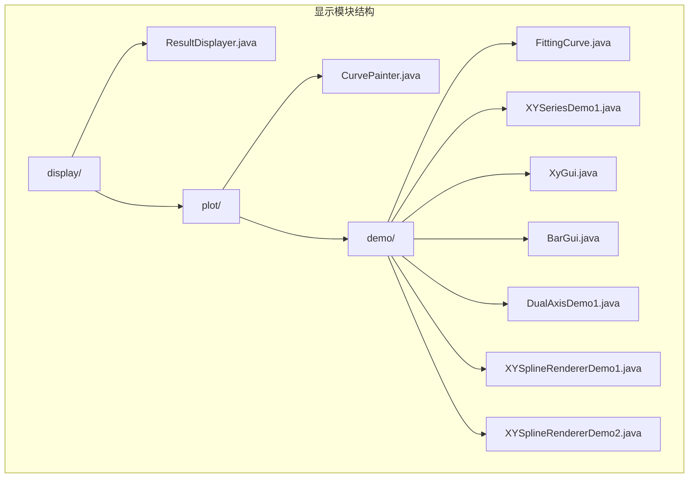
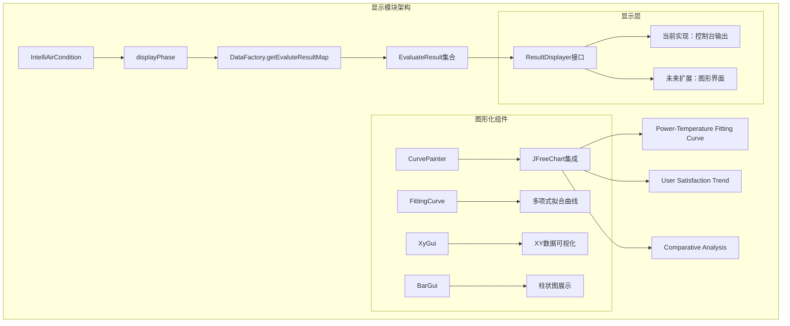
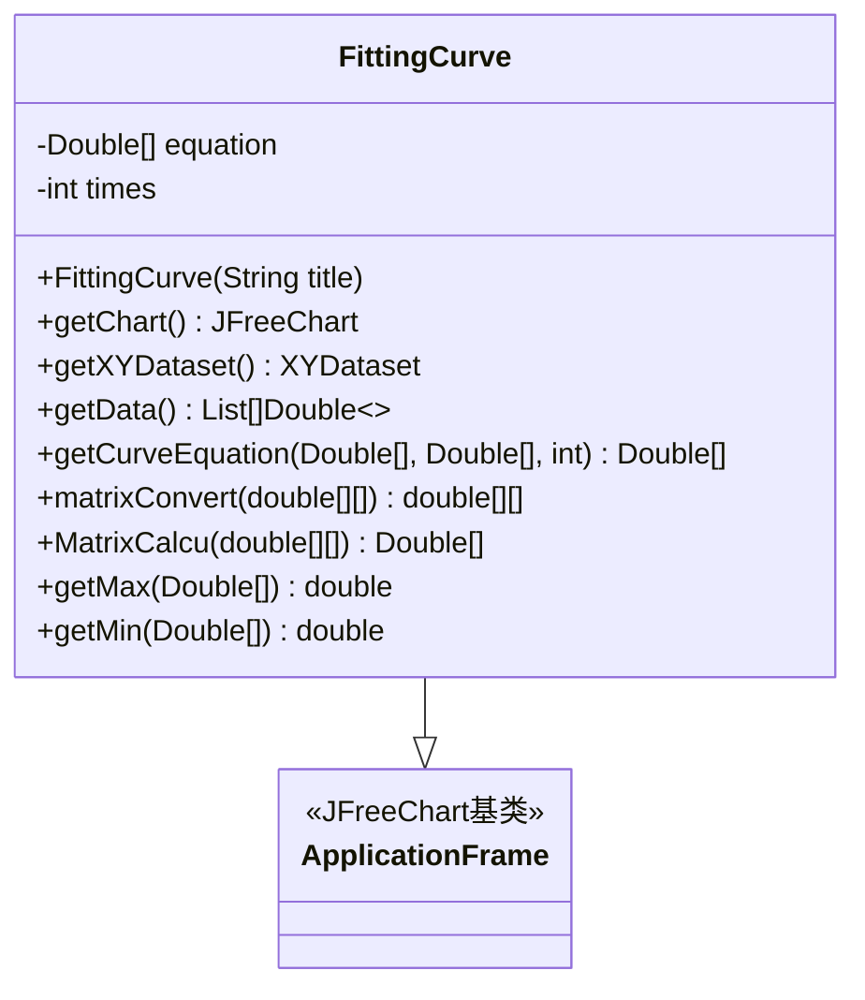
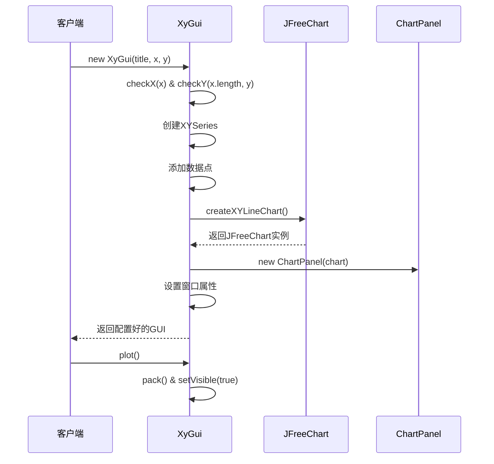
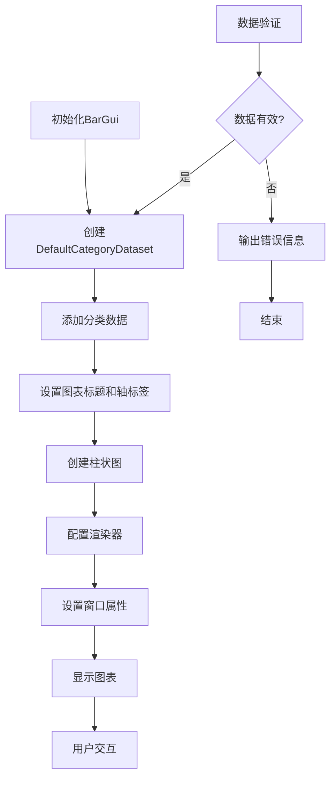
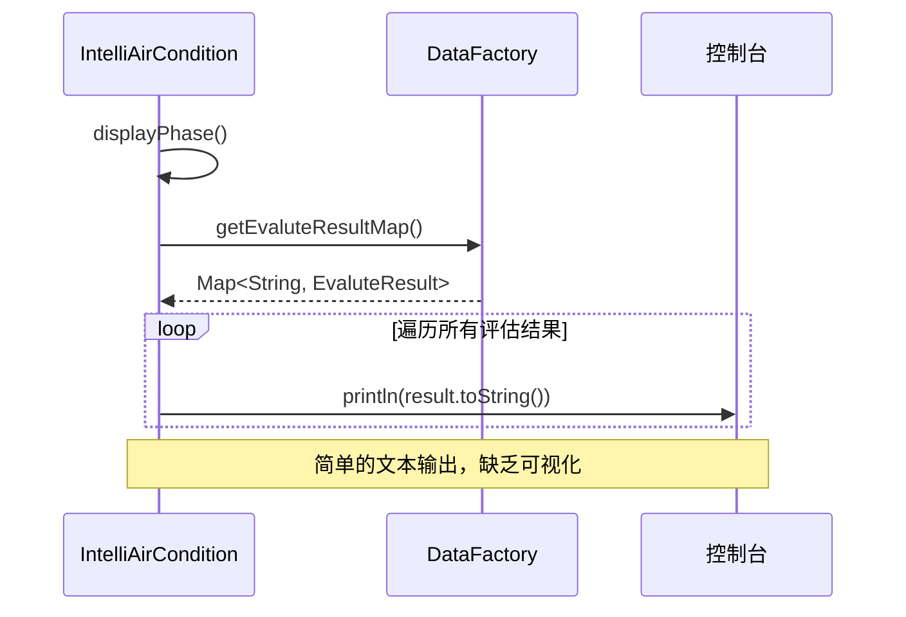
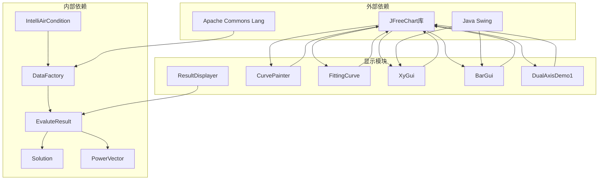

# 显示模块

<cite>
**本文档引用的文件**
- [ResultDisplayer.java](file://src/main/java/com/leavesfly/iac/display/ResultDisplayer.java)
- [CurvePainter.java](file://src/main/java/com/leavesfly/iac/display/plot/CurvePainter.java)
- [FittingCurve.java](file://src/main/java/com/leavesfly/iac/display/plot/demo/FittingCurve.java)
- [XYSeriesDemo1.java](file://src/main/java/com/leavesfly/iac/display/plot/demo/XYSeriesDemo1.java)
- [XyGui.java](file://src/main/java/com/leavesfly/iac/display/plot/demo/XyGui.java)
- [BarGui.java](file://src/main/java/com/leavesfly/iac/display/plot/demo/BarGui.java)
- [DualAxisDemo1.java](file://src/main/java/com/leavesfly/iac/display/plot/demo/DualAxisDemo1.java)
- [XYSplineRendererDemo1.java](file://src/main/java/com/leavesfly/iac/display/plot/demo/XYSplineRendererDemo1.java)
- [XYSplineRendererDemo2.java](file://src/main/java/com/leavesfly/iac/display/plot/demo/XYSplineRendererDemo2.java)
- [EvaluteResult.java](file://src/main/java/com/leavesfly/iac/evalute/EvaluteResult.java)
- [IntelliAirCondition.java](file://src/main/java/com/leavesfly/iac/IntelliAirCondition.java)
- [DataFactory.java](file://src/main/java/com/leavesfly/iac/datasource/DataFactory.java)
</cite>

## 目录
1. [简介](#简介)
2. [项目结构](#项目结构)
3. [核心组件](#核心组件)
4. [架构概览](#架构概览)
5. [详细组件分析](#详细组件分析)
6. [依赖关系分析](#依赖关系分析)
7. [性能考虑](#性能考虑)
8. [故障排除指南](#故障排除指南)
9. [结论](#结论)

## 简介

显示模块是智能空调仿真平台的核心组件之一，负责将复杂的评估结果以直观的方式呈现给用户。该模块主要包含两个核心部分：ResultDisplayer接口定义了统一的显示规范，以及基于JFreeChart库的图形化实现。

当前的显示功能主要集中在控制台输出评估结果，但通过ResultDisplayer接口的设计，系统具备了扩展为图形化界面的能力。模块支持功率-温度拟合曲线、用户满意度变化趋势等多种图表类型，为用户提供直观的数据可视化体验。

## 项目结构

显示模块的文件组织遵循清晰的层次结构，主要分为以下几个部分：



**图表来源**
- [ResultDisplayer.java](file://src/main/java/com/leavesfly/iac/display/ResultDisplayer.java#L1-L14)
- [CurvePainter.java](file://src/main/java/com/leavesfly/iac/display/plot/CurvePainter.java#L1-L14)

**章节来源**
- [ResultDisplayer.java](file://src/main/java/com/leavesfly/iac/display/ResultDisplayer.java#L1-L14)
- [CurvePainter.java](file://src/main/java/com/leavesfly/iac/display/plot/CurvePainter.java#L1-L14)

## 核心组件

### ResultDisplayer接口

ResultDisplayer接口是显示模块的核心抽象，定义了统一的评估结果显示规范：

```java
public interface ResultDisplayer {
    /**
     * 显示评估结果
     * @param evaluteResultSet 评估结果集合
     */
    public void diplayResult(Collection<EvaluteResult> evaluteResultSet);
}
```

该接口的设计体现了以下特点：
- **简洁性**：只定义了一个核心方法，职责单一明确
- **通用性**：接受EvaluteResult集合，支持批量处理
- **可扩展性**：通过接口定义，便于后续实现不同的显示策略

### EvaluteResult数据结构

EvaluteResult类封装了评估结果的所有关键指标：

```java
public class EvaluteResult {
    private Solution solution;              // 解决方案对象
    private float totalSatisfaction;        // 总满意度
    private float totalPowerCost;          // 总用电成本
    private float powerUtility;            // 功率效用
}
```

该类提供了丰富的访问方法，包括：
- `getSolution()`：获取解决方案对象
- `getSolutionName()`：获取解决方案名称
- `getTotalSatisfaction()`：获取总满意度
- `getTotalPowerCost()`：获取总用电成本
- `getPowerUtility()`：获取功率效用
- `toString()`：返回格式化的字符串表示

**章节来源**
- [ResultDisplayer.java](file://src/main/java/com/leavesfly/iac/display/ResultDisplayer.java#L1-L14)
- [EvaluteResult.java](file://src/main/java/com/leavesfly/iac/evalute/EvaluteResult.java#L1-L105)

## 架构概览

显示模块的整体架构采用接口驱动的设计模式，具有良好的扩展性和维护性：



**图表来源**
- [IntelliAirCondition.java](file://src/main/java/com/leavesfly/iac/IntelliAirCondition.java#L150-L165)
- [DataFactory.java](file://src/main/java/com/leavesfly/iac/datasource/DataFactory.java#L380-L390)

## 详细组件分析

### CurvePainter类分析

CurvePainter类目前是一个空壳实现，预示着未来的图形化功能扩展：

```java
public class CurvePainter {
    /**
     * @param args
     */
    public static void main(String[] args) {
        // TODO Auto-generated method stub
    }
}
```

虽然当前没有具体实现，但从命名和包结构可以看出，它将是处理曲线绘制的核心类。根据项目的整体设计，它很可能会：
- 封装JFreeChart的复杂性
- 提供统一的曲线绘制接口
- 支持多种曲线类型和样式

### 图形化示例分析

#### FittingCurve类 - 多项式拟合曲线

FittingCurve类展示了如何使用JFreeChart库创建复杂的拟合曲线：



**图表来源**
- [FittingCurve.java](file://src/main/java/com/leavesfly/iac/display/plot/demo/FittingCurve.java#L18-L247)

该类的核心功能包括：

1. **多项式拟合算法**：实现了最小二乘法进行多项式拟合
2. **数据处理**：从原始数据生成拟合曲线和散点图
3. **图表渲染**：使用JFreeChart创建美观的可视化效果

#### XyGui类 - XY数据可视化

XyGui类提供了简单而有效的XY数据可视化功能：



**图表来源**
- [XyGui.java](file://src/main/java/com/leavesfly/iac/display/plot/demo/XyGui.java#L25-L50)

#### BarGui类 - 柱状图展示

BarGui类专门用于展示分类数据的比较：



**图表来源**
- [BarGui.java](file://src/main/java/com/leavesfly/iac/display/plot/demo/BarGui.java#L30-L45)

**章节来源**
- [FittingCurve.java](file://src/main/java/com/leavesfly/iac/display/plot/demo/FittingCurve.java#L1-L247)
- [XyGui.java](file://src/main/java/com/leavesfly/iac/display/plot/demo/XyGui.java#L1-L161)
- [BarGui.java](file://src/main/java/com/leavesfly/iac/display/plot/demo/BarGui.java#L1-L45)

### 当前显示流程分析

根据IntelliAirCondition类的实现，当前的显示流程相对简单：



**图表来源**
- [IntelliAirCondition.java](file://src/main/java/com/leavesfly/iac/IntelliAirCondition.java#L150-L165)

**章节来源**
- [IntelliAirCondition.java](file://src/main/java/com/leavesfly/iac/IntelliAirCondition.java#L150-L165)

## 依赖关系分析

显示模块的依赖关系展现了清晰的分层架构：



**图表来源**
- [FittingCurve.java](file://src/main/java/com/leavesfly/iac/display/plot/demo/FittingCurve.java#L1-L15)
- [XyGui.java](file://src/main/java/com/leavesfly/iac/display/plot/demo/XyGui.java#L1-L15)

**章节来源**
- [FittingCurve.java](file://src/main/java/com/leavesfly/iac/display/plot/demo/FittingCurve.java#L1-L15)
- [XyGui.java](file://src/main/java/com/leavesfly/iac/display/plot/demo/XyGui.java#L1-L15)
- [DataFactory.java](file://src/main/java/com/leavesfly/iac/datasource/DataFactory.java#L1-L50)

## 性能考虑

### 内存使用优化

1. **数据结构选择**：使用LinkedHashMap保持评估结果的插入顺序，同时保证O(1)的查找性能
2. **延迟加载**：DataFactory采用双重检查锁定机制，按需创建昂贵的对象
3. **集合操作**：使用Collections.synchronizedMap确保线程安全的同时避免过度同步

### 图形渲染性能

1. **数据采样**：FittingCurve类中使用800个采样点平衡精度和性能
2. **缓存机制**：JFreeChart的ChartPanel支持鼠标缩放，减少重复渲染
3. **异步处理**：图形界面可以独立于主业务逻辑运行

### 扩展性考虑

1. **接口设计**：ResultDisplayer接口允许轻松替换不同的显示策略
2. **模块化**：每个图形化组件都是独立的类，便于单独测试和维护
3. **配置灵活**：支持通过参数调整图表样式和行为

## 故障排除指南

### 常见问题及解决方案

#### 1. 图表无法显示

**症状**：调用图形化组件后窗口不显示或显示空白

**可能原因**：
- JFreeChart库未正确导入
- Java版本兼容性问题
- 系统缺少必要的图形库

**解决方案**：
```java
// 检查JFreeChart版本兼容性
System.out.println("JFreeChart Version: " + org.jfree.chart.JFreeChart.class.getPackage().getImplementationVersion());

// 确保Swing事件调度线程正确使用
javax.swing.SwingUtilities.invokeLater(() -> {
    // 图形化组件初始化代码
});
```

#### 2. 数据验证失败

**症状**：XyGui类报告数据长度不匹配或为空

**可能原因**：
- 输入数组长度不一致
- 数组元素包含null值
- 数据格式不符合预期

**解决方案**：
```java
// 在创建XyGui之前进行数据验证
private boolean validateData(double[] x, double[] y) {
    if (x == null || y == null) return false;
    if (x.length != y.length) return false;
    if (x.length == 0) return false;
    return true;
}
```

#### 3. 内存溢出问题

**症状**：处理大量评估结果时出现OutOfMemoryError

**可能原因**：
- 评估结果数量过多
- 图表数据采样点过多
- 缓存策略不当

**解决方案**：
```java
// 实现数据分批处理
public void diplayResult(Collection<EvaluteResult> results) {
    List<EvaluteResult> resultList = new ArrayList<>(results);
    int batchSize = 100; // 适当调整批次大小
    for (int i = 0; i < resultList.size(); i += batchSize) {
        List<EvaluteResult> batch = resultList.subList(i, Math.min(i + batchSize, resultList.size()));
        processBatch(batch);
    }
}
```

**章节来源**
- [XyGui.java](file://src/main/java/com/leavesfly/iac/display/plot/demo/XyGui.java#L100-L140)

## 结论

显示模块展现了智能空调仿真平台在数据可视化方面的前瞻设计。虽然当前主要依赖控制台输出，但通过ResultDisplayer接口的抽象设计，系统已经为未来的图形化扩展奠定了坚实基础。

### 主要优势

1. **清晰的架构设计**：接口驱动的模块化设计便于维护和扩展
2. **丰富的可视化选项**：多个示例类展示了不同类型的图表实现
3. **良好的扩展性**：支持多种显示格式和输出方式
4. **性能优化考虑**：合理的数据结构和算法选择

### 发展方向

1. **图形界面增强**：实现完整的Swing/AWT图形界面
2. **交互式图表**：添加动态交互和实时更新功能
3. **多格式输出**：支持导出为图片、PDF、CSV等格式
4. **主题定制**：提供可配置的主题和样式选项

### 建议改进

1. **实现ResultDisplayer接口**：创建具体的图形化显示实现
2. **添加单元测试**：为图形化组件编写全面的测试用例
3. **性能监控**：添加图表渲染性能的监控和优化
4. **用户反馈机制**：收集用户对显示效果的反馈以持续改进

显示模块作为连接用户和复杂数据的重要桥梁，其设计理念和实现质量直接影响用户体验。随着系统的不断发展，这个模块将成为提升平台易用性和专业性的关键因素。