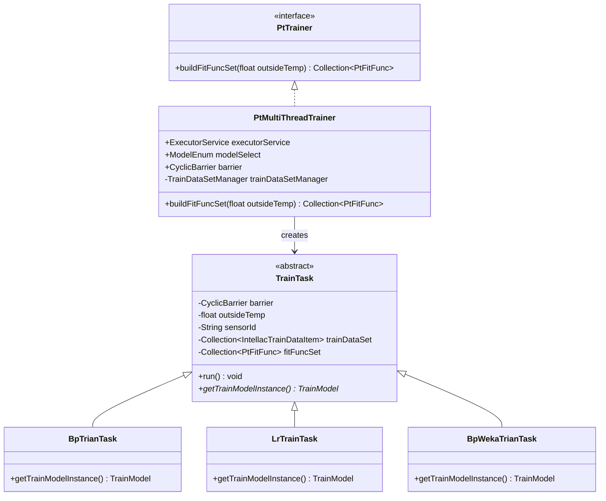
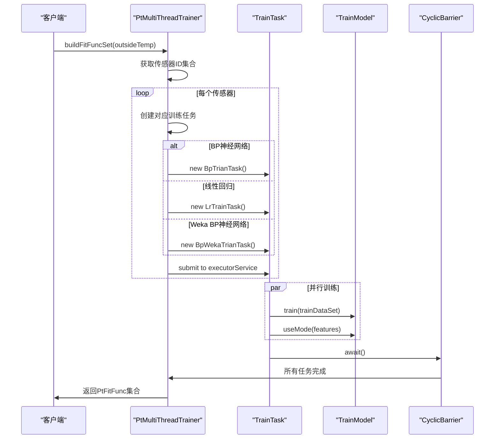
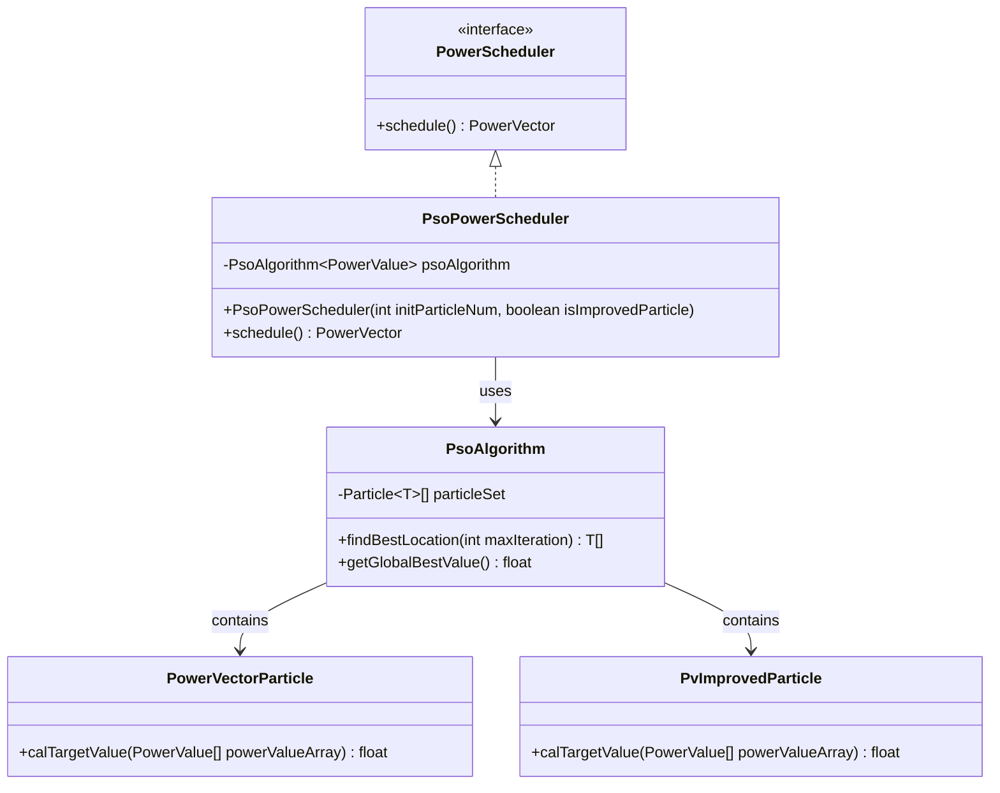
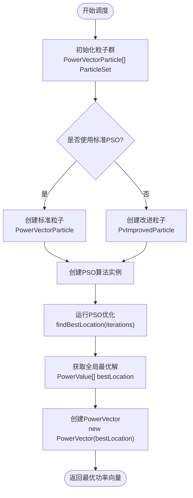
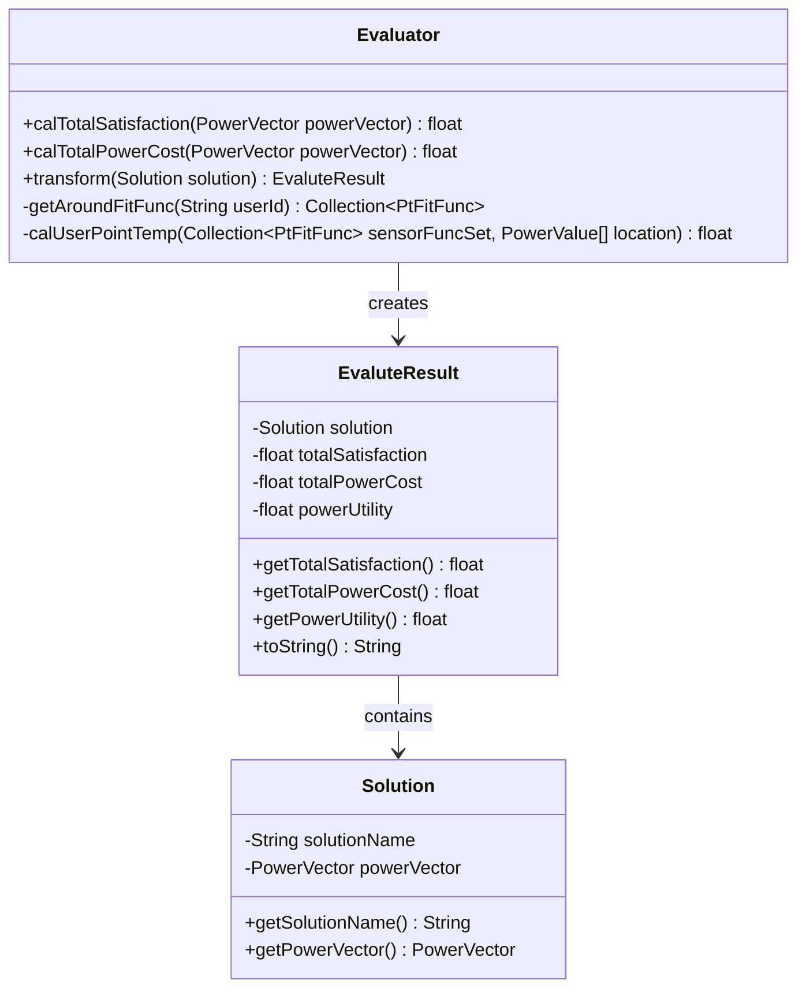
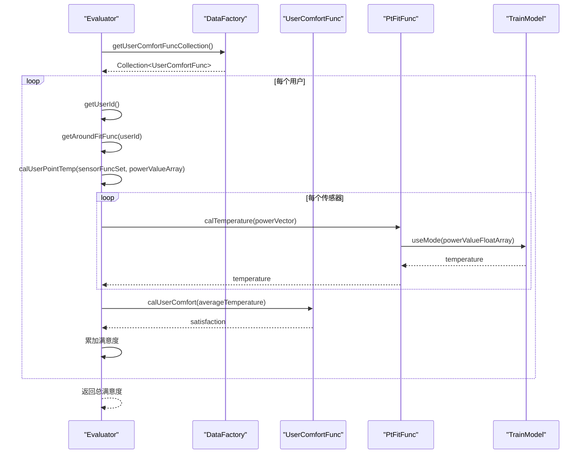
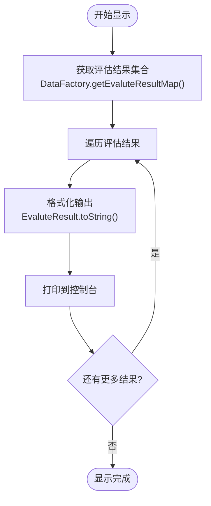
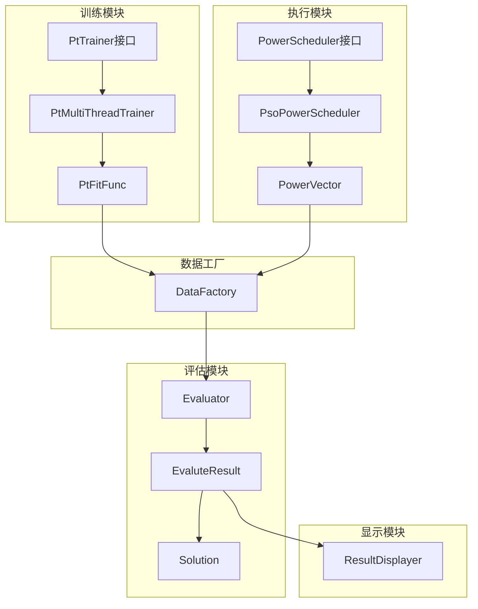
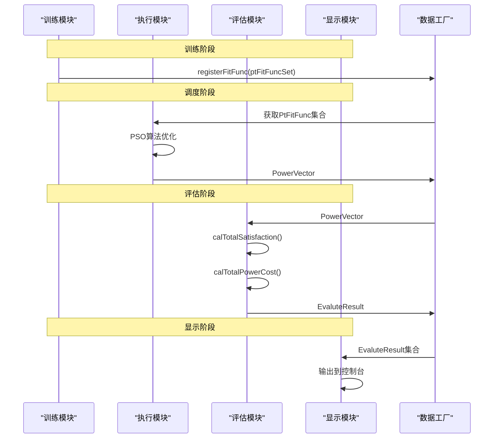

# 核心模块详解

<cite>
**本文档引用的文件**
- [PtTrainer.java](file://src/main/java/com/leavesfly/iac/train/PtTrainer.java)
- [PtMultiThreadTrainer.java](file://src/main/java/com/leavesfly/iac/train/trainer/PtMultiThreadTrainer.java)
- [TrainModel.java](file://src/main/java/com/leavesfly/iac/train/trainer/TrainModel.java)
- [TrainTask.java](file://src/main/java/com/leavesfly/iac/train/trainer/TrainTask.java)
- [ModelEnum.java](file://src/main/java/com/leavesfly/iac/train/trainer/ModelEnum.java)
- [PowerScheduler.java](file://src/main/java/com/leavesfly/iac/execute/PowerScheduler.java)
- [PsoPowerScheduler.java](file://src/main/java/com/leavesfly/iac/execute/scheduler/PsoPowerScheduler.java)
- [Evaluator.java](file://src/main/java/com/leavesfly/iac/evalute/Evaluator.java)
- [EvaluteResult.java](file://src/main/java/com/leavesfly/iac/evalute/EvaluteResult.java)
- [ResultDisplayer.java](file://src/main/java/com/leavesfly/iac/display/ResultDisplayer.java)
- [PtFitFunc.java](file://src/main/java/com/leavesfly/iac/domain/PtFitFunc.java)
- [PowerVector.java](file://src/main/java/com/leavesfly/iac/domain/PowerVector.java)
- [IntelliAirCondition.java](file://src/main/java/com/leavesfly/iac/IntelliAirCondition.java)
- [AppContextConstant.java](file://src/main/java/com/leavesfly/iac/config/AppContextConstant.java)
</cite>

## 目录
1. [简介](#简介)
2. [训练模块详解](#训练模块详解)
3. [执行模块详解](#执行模块详解)
4. [评估模块详解](#评估模块详解)
5. [显示模块详解](#显示模块详解)
6. [模块间数据流分析](#模块间数据流分析)
7. [性能考虑](#性能考虑)
8. [总结](#总结)

## 简介

智能空调仿真平台是一个基于机器学习和优化算法的空调功率调度系统。该系统包含四个核心模块：训练模块、执行模块、评估模块和显示模块。每个模块都有明确的职责分工，通过统一的数据接口进行协作，共同完成空调功率的智能调度和优化。

## 训练模块详解

### PtTrainer接口设计

训练模块的核心是`PtTrainer`接口，它定义了功率-温度模型训练器的基本功能：

```java
public interface PtTrainer {
    public Collection<PtFitFunc> buildFitFuncSet(float outsideTemp);
}
```

该接口的设计体现了面向对象编程的开闭原则，允许不同的训练策略实现相同的接口契约。

### PtMultiThreadTrainer实现类

`PtMultiThreadTrainer`是`PtTrainer`接口的主要实现类，它使用多线程技术并行训练多个传感器的功率-温度模型：



**图表来源**
- [PtTrainer.java](file://src/main/java/com/leavesfly/iac/train/PtTrainer.java#L1-L19)
- [PtMultiThreadTrainer.java](file://src/main/java/com/leavesfly/iac/train/trainer/PtMultiThreadTrainer.java#L1-L114)
- [TrainTask.java](file://src/main/java/com/leavesfly/iac/train/trainer/TrainTask.java#L1-L89)

### 支持的训练算法

训练模块支持三种主要的训练算法：

1. **BP神经网络** (`BPNN`)：传统的反向传播神经网络
2. **Weka BP神经网络** (`BPWEKA`)：基于Weka库的BP神经网络
3. **线性回归** (`LR`)：简单的线性回归模型

每种算法都有对应的训练任务实现类，它们都继承自`TrainTask`抽象类：



**图表来源**
- [PtMultiThreadTrainer.java](file://src/main/java/com/leavesfly/iac/train/trainer/PtMultiThreadTrainer.java#L60-L95)
- [TrainTask.java](file://src/main/java/com/leavesfly/iac/train/trainer/TrainTask.java#L60-L89)

### PtFitFunc模型封装

训练完成后，系统会创建`PtFitFunc`对象来封装每个传感器的功率-温度拟合函数：

```java
public class PtFitFunc {
    private String sensorId;
    private float outsideTemp;
    private TrainModel trainModel;
    
    public float calTemperature(PowerVector powerVector) {
        return trainModel.useMode(powerVector.getPowerValueFloatArray());
    }
}
```

**章节来源**
- [PtTrainer.java](file://src/main/java/com/leavesfly/iac/train/PtTrainer.java#L1-L19)
- [PtMultiThreadTrainer.java](file://src/main/java/com/leavesfly/iac/train/trainer/PtMultiThreadTrainer.java#L1-L114)
- [PtFitFunc.java](file://src/main/java/com/leavesfly/iac/domain/PtFitFunc.java#L1-L88)

## 执行模块详解

### PowerScheduler接口设计

执行模块的核心是`PowerScheduler`接口，它定义了功率调度器的基本功能：

```java
public interface PowerScheduler {
    public PowerVector schedule();
}
```

该接口采用策略模式，允许不同的调度算法实现相同的接口契约。

### PsoPowerScheduler实现类

`PsoPowerScheduler`是基于粒子群优化算法的功率调度器实现：



**图表来源**
- [PowerScheduler.java](file://src/main/java/com/leavesfly/iac/execute/PowerScheduler.java#L1-L19)
- [PsoPowerScheduler.java](file://src/main/java/com/leavesfly/iac/execute/scheduler/PsoPowerScheduler.java#L1-L92)

### PSO算法优化过程

PSO算法通过以下步骤进行功率调度优化：



**图表来源**
- [PsoPowerScheduler.java](file://src/main/java/com/leavesfly/iac/execute/scheduler/PsoPowerScheduler.java#L30-L55)

### PowerVector数据结构

`PowerVector`类表示一组空调设备的功率值集合，是执行模块的核心数据结构：

```java
public class PowerVector implements Serializable {
    private PowerValue[] powerValueVector;
    private int size;
    
    public PowerVector(PowerValue[] powerValueVector) {
        this.powerValueVector = powerValueVector;
        this.size = powerValueVector.length;
    }
    
    public Float[] getPowerValueFloatArray() {
        Float[] value = new Float[powerValueVector.length];
        for (int i = 0; i < value.length; i++) {
            value[i] = powerValueVector[i].getValue();
        }
        return value;
    }
}
```

**章节来源**
- [PowerScheduler.java](file://src/main/java/com/leavesfly/iac/execute/PowerScheduler.java#L1-L19)
- [PsoPowerScheduler.java](file://src/main/java/com/leavesfly/iac/execute/scheduler/PsoPowerScheduler.java#L1-L92)
- [PowerVector.java](file://src/main/java/com/leavesfly/iac/domain/PowerVector.java#L1-L142)

## 评估模块详解

### Evaluator评估器

评估模块的核心是`Evaluator`类，它负责对空调功率调度方案进行评估：



**图表来源**
- [Evaluator.java](file://src/main/java/com/leavesfly/iac/evalute/Evaluator.java#L1-L123)
- [EvaluteResult.java](file://src/main/java/com/leavesfly/iac/evalute/EvaluteResult.java#L1-L104)

### 满意度计算机制

满意度计算是评估模块的核心功能，它通过以下步骤计算总满意度：



**图表来源**
- [Evaluator.java](file://src/main/java/com/leavesfly/iac/evalute/Evaluator.java#L25-L50)

### 综合评估指标

评估模块计算三个关键指标：

1. **总满意度** (`totalSatisfaction`)：反映用户舒适度的总体水平
2. **总用电成本** (`totalPowerCost`)：反映系统的能源消耗成本
3. **功率效用** (`powerUtility`)：综合满意度和用电成本的权衡指标

```java
public EvaluteResult(Solution solution, float totalSatisfaction, float totalPowerCost) {
    this.solution = solution;
    this.totalSatisfaction = totalSatisfaction;
    this.totalPowerCost = totalPowerCost;
    // 功率效用 = (满意度 / 用电成本) × 效用单位
    this.powerUtility = (totalSatisfaction / totalPowerCost) * AppContextConstant.POWER_UTILITY_UNIT;
}
```

**章节来源**
- [Evaluator.java](file://src/main/java/com/leavesfly/iac/evalute/Evaluator.java#L1-L123)
- [EvaluteResult.java](file://src/main/java/com/leavesfly/iac/evalute/EvaluteResult.java#L1-L104)

## 显示模块详解

### ResultDisplayer接口设计

显示模块的核心是`ResultDisplayer`接口，它定义了结果展示的基本功能：

```java
public interface ResultDisplayer {
    public void diplayResult(Collection<EvaluteResult> evaluteResultSet);
}
```

该接口采用策略模式，允许不同的展示方式实现相同的接口契约。

### 数据展示流程

显示模块的执行流程相对简单，主要是将评估结果输出到控制台：



**图表来源**
- [IntelliAirCondition.java](file://src/main/java/com/leavesfly/iac/IntelliAirCondition.java#L170-L186)

### 输出格式化

评估结果的输出格式经过精心设计，包含完整的解决方案信息：

```java
@Override
public String toString() {
    StringBuilder strBuilder = new StringBuilder();
    strBuilder.append(solution.toString())
              .append("\t")
              .append("totalSatisfaction:")
              .append(totalSatisfaction)
              .append("\t")
              .append("totalPowerCost:")
              .append(totalPowerCost)
              .append("\t")
              .append("powerUtility:")
              .append(powerUtility);
    return strBuilder.toString();
}
```

**章节来源**
- [ResultDisplayer.java](file://src/main/java/com/leavesfly/iac/display/ResultDisplayer.java#L1-L14)

## 模块间数据流分析

### 整体流程架构

整个系统遵循清晰的模块化架构，各模块之间通过标准化的数据接口进行交互：



**图表来源**
- [IntelliAirCondition.java](file://src/main/java/com/leavesfly/iac/IntelliAirCondition.java#L1-L187)

### 数据流转过程

系统中的数据流转遵循以下路径：

1. **训练阶段**：历史数据 → 训练器 → PtFitFunc集合 → 数据工厂注册
2. **调度阶段**：PtFitFunc集合 → PSO算法 → PowerVector → 评估器
3. **评估阶段**：PowerVector → 满意度计算 → 用电成本计算 → 综合评估
4. **显示阶段**：评估结果 → 控制台输出



**图表来源**
- [IntelliAirCondition.java](file://src/main/java/com/leavesfly/iac/IntelliAirCondition.java#L45-L186)

## 性能考虑

### 多线程训练优化

训练模块采用了多线程技术来提高训练效率：

- **线程池管理**：使用`ExecutorService`管理线程生命周期
- **同步机制**：使用`CyclicBarrier`确保所有训练任务完成后再继续
- **模型选择**：支持多种训练算法，可根据需求选择最适合的模型

### PSO算法优化

执行模块的PSO算法具有以下优化特性：

- **粒子初始化**：支持标准粒子和改进粒子两种初始化方式
- **迭代优化**：可配置最大迭代次数，平衡精度和性能
- **并行计算**：粒子群可以并行评估各自的目标函数值

### 内存管理

系统在内存管理方面采取了以下措施：

- **懒加载**：数据工厂采用单例模式，按需加载数据
- **缓存机制**：训练好的模型可以重复使用，避免重复计算
- **及时释放**：线程池在使用完成后及时关闭，释放资源

## 总结

智能空调仿真平台的四个核心模块各司其职，形成了一个完整的空调功率调度和优化系统：

1. **训练模块**：基于历史数据训练功率-温度预测模型，支持多种算法
2. **执行模块**：使用PSO算法进行功率调度优化，生成最优功率向量
3. **评估模块**：计算综合评估指标，包括满意度和用电成本
4. **显示模块**：输出评估结果，提供直观的性能对比

这种模块化设计不仅提高了系统的可维护性和扩展性，还为后续的功能增强提供了良好的基础。通过统一的数据接口和清晰的职责分工，系统能够高效地完成复杂的空调功率调度任务。