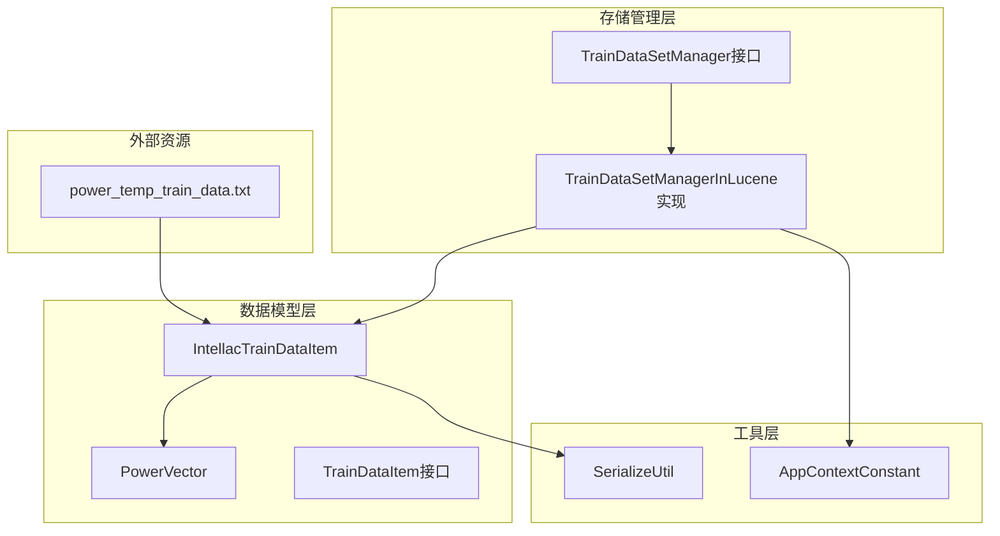
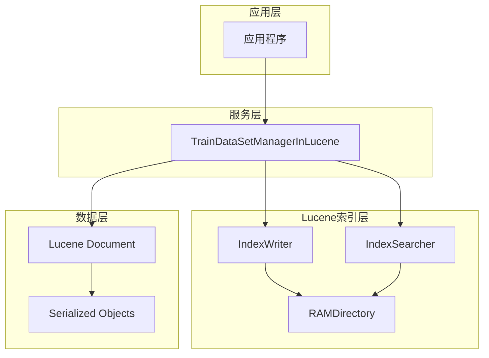
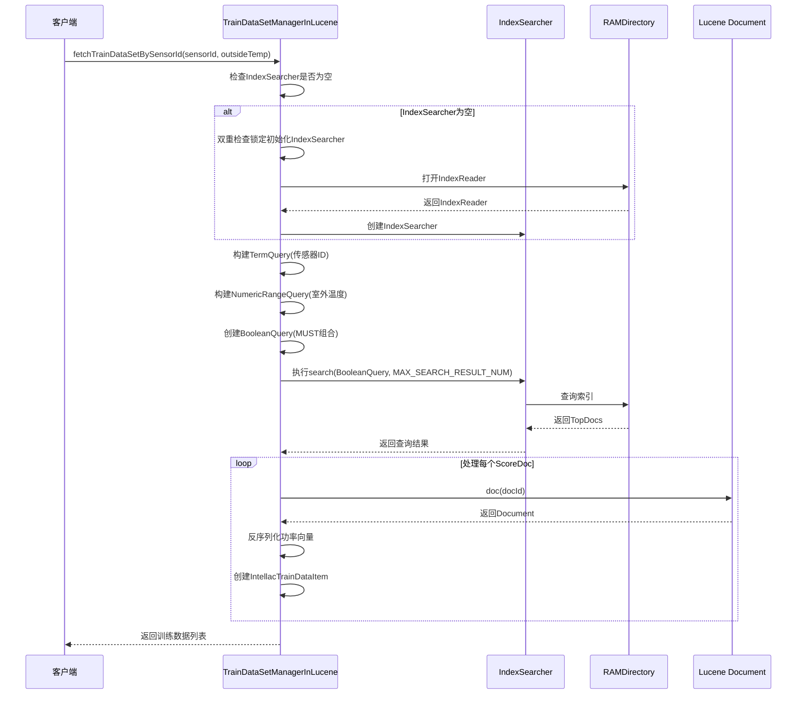
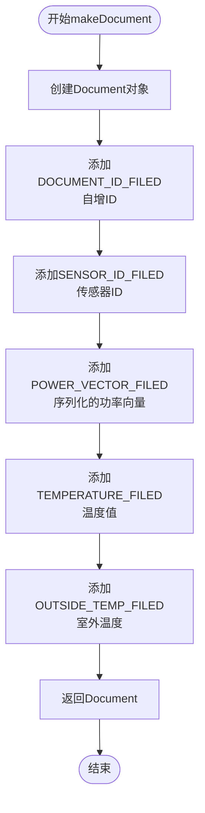
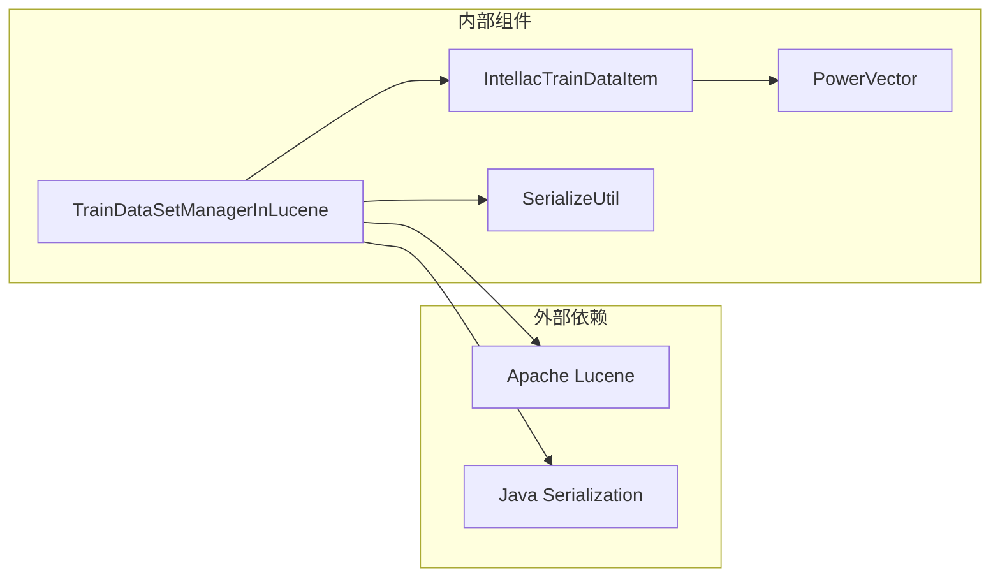

# 存储管理机制文档

<cite>
**本文档中引用的文件**
- [TrainDataSetManagerInLucene.java](file://src/main/java/com/leavesfly/iac/train/store/TrainDataSetManagerInLucene.java)
- [IntellacTrainDataItem.java](file://src/main/java/com/leavesfly/iac/train/domain/IntellacTrainDataItem.java)
- [TrainDataSetManager.java](file://src/main/java/com/leavesfly/iac/train/store/TrainDataSetManager.java)
- [SerializeUtil.java](file://src/main/java/com/leavesfly/iac/util/SerializeUtil.java)
- [PowerVector.java](file://src/main/java/com/leavesfly/iac/domain/PowerVector.java)
- [AppContextConstant.java](file://src/main/java/com/leavesfly/iac/config/AppContextConstant.java)
- [power_temp_train_data.txt](file://src/main/resource/power_temp_train_data.txt)
</cite>

## 目录
1. [简介](#简介)
2. [项目结构概览](#项目结构概览)
3. [核心组件分析](#核心组件分析)
4. [架构概览](#架构概览)
5. [详细组件分析](#详细组件分析)
6. [依赖关系分析](#依赖关系分析)
7. [性能考虑](#性能考虑)
8. [故障排除指南](#故障排除指南)
9. [结论](#结论)

## 简介

本文档深入分析了智能空调系统中的存储管理机制，重点关注基于Apache Lucene构建的高效索引系统。该系统通过`TrainDataSetManagerInLucene`类实现了对训练数据的快速存储和检索，特别针对传感器ID和室外温度进行优化查询。

该存储管理系统的核心优势在于：
- **高性能索引**：基于Lucene内存索引提供快速查询能力
- **灵活的数据结构**：支持复杂的数据类型序列化存储
- **线程安全设计**：采用适当的同步机制确保并发访问安全
- **可扩展性**：支持大规模训练数据的高效管理

## 项目结构概览

智能空调系统的存储管理模块位于`src/main/java/com/leavesfly/iac/train/store/`目录下，主要包含以下关键文件：



**图表来源**
- [TrainDataSetManager.java](file://src/main/java/com/leavesfly/iac/train/store/TrainDataSetManager.java#L1-L31)
- [TrainDataSetManagerInLucene.java](file://src/main/java/com/leavesfly/iac/train/store/TrainDataSetManagerInLucene.java#L1-L213)

**章节来源**
- [TrainDataSetManager.java](file://src/main/java/com/leavesfly/iac/train/store/TrainDataSetManager.java#L1-L31)
- [TrainDataSetManagerInLucene.java](file://src/main/java/com/leavesfly/iac/train/store/TrainDataSetManagerInLucene.java#L1-L213)

## 核心组件分析

### TrainDataSetManagerInLucene类

`TrainDataSetManagerInLucene`是整个存储管理系统的核心实现类，它继承了`TrainDataSetManager`接口并提供了基于Lucene的存储和检索功能。

#### 关键特性

1. **内存索引优势**：使用RAMDirectory作为索引存储位置，提供极快的读写速度
2. **字段设计**：精心设计的字段映射确保数据完整性和查询效率
3. **线程安全**：采用双重检查锁定模式确保IndexSearcher的线程安全初始化
4. **序列化支持**：通过SerializeUtil处理复杂对象的二进制存储

#### 字段常量定义

```java
// 文档标识字段
private static final String DOCUMENT_ID_FILED = "documentId";

// 传感器ID字段
private static final String SENSOR_ID_FILED = "sensorId";

// 功率向量字段
private static final String POWER_VECTOR_FILED = "powerVector";

// 温度字段
private static final String TEMPERATURE_FILED = "temperature";

// 室外温度字段
private static final String OUTSIDE_TEMP_FILED = "outsideTemp";
```

**章节来源**
- [TrainDataSetManagerInLucene.java](file://src/main/java/com/leavesfly/iac/train/store/TrainDataSetManagerInLucene.java#L30-L50)

## 架构概览

存储管理系统采用分层架构设计，清晰地分离了接口定义、具体实现和数据模型：



**图表来源**
- [TrainDataSetManagerInLucene.java](file://src/main/java/com/leavesfly/iac/train/store/TrainDataSetManagerInLucene.java#L70-L90)

## 详细组件分析

### fetchTrainDataSetBySensorId方法分析

这是系统中最关键的方法之一，负责根据传感器ID和室外温度快速检索训练数据：



**图表来源**
- [TrainDataSetManagerInLucene.java](file://src/main/java/com/leavesfly/iac/train/store/TrainDataSetManagerInLucene.java#L70-L120)

#### 查询逻辑详解

1. **布尔查询构建**：使用`BooleanQuery`结合两个条件
   - `TermQuery`：精确匹配传感器ID
   - `NumericRangeQuery`：匹配室外温度范围（单点范围）

2. **线程安全处理**：IndexSearcher的延迟初始化和双重检查锁定
3. **结果限制**：设置最大返回结果数为100，防止内存溢出

### 数据持久化结构分析

`makeDocument`方法负责将`IntellacTrainDataItem`对象序列化为Lucene文档：



**图表来源**
- [TrainDataSetManagerInLucene.java](file://src/main/java/com/leavesfly/iac/train/store/TrainDataSetManagerInLucene.java#L180-L213)

#### 序列化机制

系统使用`SerializeUtil`类处理复杂对象的序列化：

```java
// 对象转字节数组
byte[] serializedData = SerializeUtil.object2ByteArray(powerVector);

// 字节数组转对象
PowerVector deserializedVector = (PowerVector) SerializeUtil.byteArray2Object(binaryData);
```

**章节来源**
- [TrainDataSetManagerInLucene.java](file://src/main/java/com/leavesfly/iac/train/store/TrainDataSetManagerInLucene.java#L180-L213)
- [SerializeUtil.java](file://src/main/java/com/leavesfly/iac/util/SerializeUtil.java#L1-L60)

### RAMDirectory内存索引优势与限制

#### 优势

1. **高速访问**：内存存储提供毫秒级响应时间
2. **无磁盘I/O**：避免磁盘寻道和传输延迟
3. **自动清理**：JVM退出时自动释放内存资源
4. **简单部署**：无需额外的文件系统配置

#### 限制

1. **容量限制**：受可用内存大小限制
2. **持久性缺失**：重启后数据丢失
3. **共享困难**：多进程间无法共享索引
4. **备份复杂**：需要额外的备份策略

**章节来源**
- [TrainDataSetManagerInLucene.java](file://src/main/java/com/leavesfly/iac/train/store/TrainDataSetManagerInLucene.java#L70-L90)

## 依赖关系分析

系统的依赖关系展现了清晰的分层结构：



**图表来源**
- [TrainDataSetManagerInLucene.java](file://src/main/java/com/leavesfly/iac/train/store/TrainDataSetManagerInLucene.java#L1-L30)

**章节来源**
- [TrainDataSetManagerInLucene.java](file://src/main/java/com/leavesfly/iac/train/store/TrainDataSetManagerInLucene.java#L1-L30)

## 性能考虑

### 索引性能优化建议

1. **批量提交策略**
   ```java
   // 当前实现：每次存储后立即commit
   indexWriter.commit();
   
   // 推荐：批量提交
   if (++batchCount % BATCH_SIZE == 0) {
       indexWriter.commit();
   }
   ```

2. **缓存策略优化**
   - 调整IndexSearcher的缓存大小
   - 使用适当的查询缓存策略
   - 避免频繁的IndexSearcher重建

3. **内存管理**
   - 监控RAMDirectory的内存使用
   - 实现定期的索引刷新和合并
   - 考虑使用混合存储策略（内存+磁盘）

### 查询性能优化

1. **索引字段优化**
   - 为常用查询字段建立倒排索引
   - 使用适当的字段类型（NOT_ANALYZED vs ANALYZED）
   - 合理设置字段的Store属性

2. **查询策略优化**
   - 使用Filter代替Query进行范围查询
   - 实现查询结果的分页处理
   - 考虑使用复合查询优化器

## 故障排除指南

### 常见问题及解决方案

1. **IndexWriter并发访问异常**
   ```
   问题：多个线程同时写入导致冲突
   解决：使用同步块或ConcurrentModificationException处理
   ```

2. **内存溢出错误**
   ```
   问题：RAMDirectory超出可用内存
   解决：监控内存使用，实现定期清理或切换到磁盘索引
   ```

3. **序列化失败**
   ```
   问题：PowerVector对象无法序列化
   解决：确保所有嵌套对象都实现Serializable接口
   ```

4. **查询结果为空**
   ```
   问题：布尔查询条件过于严格
   解决：检查查询条件，考虑使用更宽松的范围查询
   ```

**章节来源**
- [TrainDataSetManagerInLucene.java](file://src/main/java/com/leavesfly/iac/train/store/TrainDataSetManagerInLucene.java#L70-L120)

## 结论

智能空调系统的存储管理机制通过精心设计的Lucene索引系统，实现了高效的数据存储和检索功能。该系统的主要优势包括：

1. **高性能查询**：基于内存索引的快速检索能力
2. **灵活的数据模型**：支持复杂对象的序列化存储
3. **清晰的架构设计**：分层结构便于维护和扩展
4. **完善的错误处理**：全面的异常处理和日志记录

然而，在实际应用中需要注意内存使用限制和持久性需求，可能需要考虑以下改进方向：

- 实现混合存储策略（内存+磁盘）
- 添加索引持久化机制
- 优化批量操作性能
- 增强监控和诊断功能

通过持续的性能优化和功能增强，该存储管理系统能够更好地支持智能空调系统的训练数据管理需求。