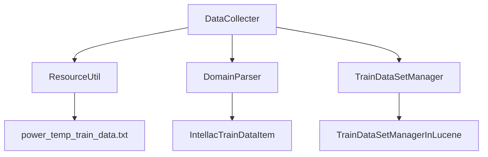
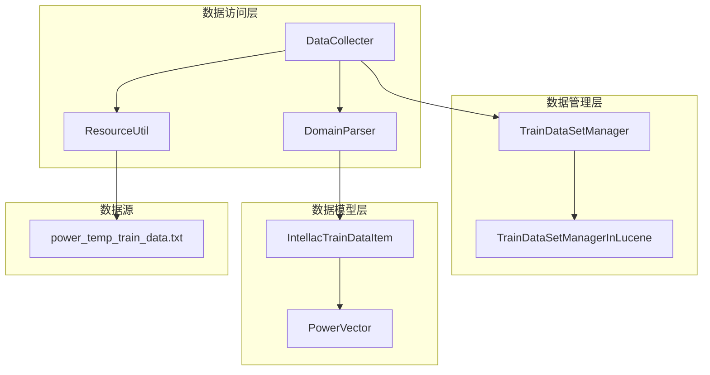
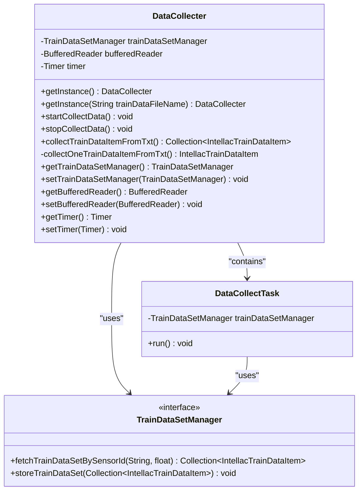
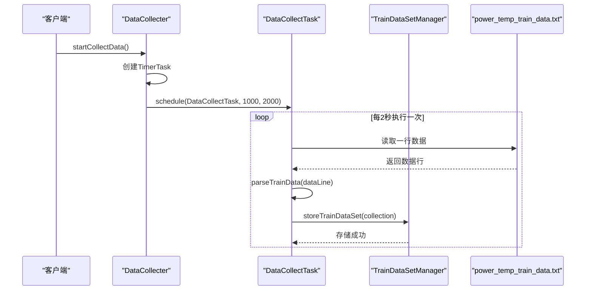
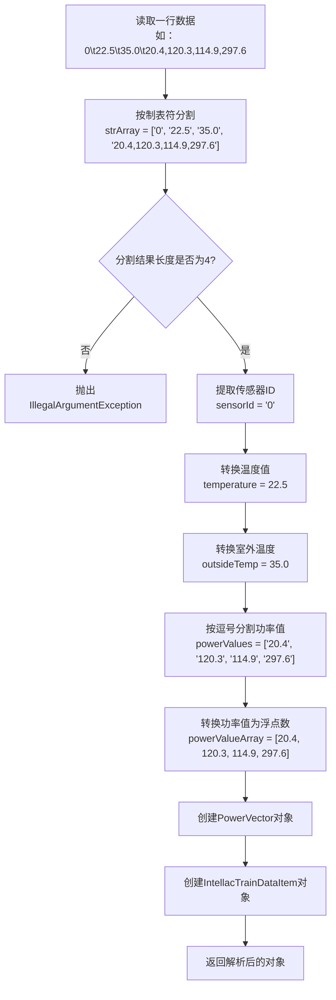

# 数据收集模块详细文档

<cite>
**本文档引用的文件**
- [DataCollecter.java](file://src/main/java/com/leavesfly/iac/train/collect/DataCollecter.java)
- [ResourceUtil.java](file://src/main/java/com/leavesfly/iac/datasource/ResourceUtil.java)
- [DomainParser.java](file://src/main/java/com/leavesfly/iac/datasource/DomainParser.java)
- [IntellacTrainDataItem.java](file://src/main/java/com/leavesfly/iac/train/domain/IntellacTrainDataItem.java)
- [TrainDataSetManager.java](file://src/main/java/com/leavesfly/iac/train/store/TrainDataSetManager.java)
- [TrainDataSetManagerInLucene.java](file://src/main/java/com/leavesfly/iac/train/store/TrainDataSetManagerInLucene.java)
- [AppContextConstant.java](file://src/main/java/com/leavesfly/iac/config/AppContextConstant.java)
- [power_temp_train_data.txt](file://src/main/resource/power_temp_train_data.txt)
</cite>

## 目录
1. [简介](#简介)
2. [项目结构概览](#项目结构概览)
3. [核心组件分析](#核心组件分析)
4. [架构设计](#架构设计)
5. [详细组件分析](#详细组件分析)
6. [数据格式规范](#数据格式规范)
7. [性能考虑](#性能考虑)
8. [故障排除指南](#故障排除指南)
9. [总结](#总结)

## 简介

数据收集模块是智能空调仿真平台的核心组件之一，负责从文本资源文件中读取历史训练数据，并将其转换为系统可用的数据结构。该模块主要由DataCollecter类实现，它通过ResourceUtil加载power_temp_train_data.txt等数据文件，并利用DomainParser解析成IntellacTrainDataItem对象集合。

## 项目结构概览

数据收集模块位于`src/main/java/com/leavesfly/iac/train/collect/`目录下，主要包含以下关键文件：



**图表来源**
- [DataCollecter.java](file://src/main/java/com/leavesfly/iac/train/collect/DataCollecter.java#L1-L253)
- [ResourceUtil.java](file://src/main/java/com/leavesfly/iac/datasource/ResourceUtil.java#L1-L98)
- [DomainParser.java](file://src/main/java/com/leavesfly/iac/datasource/DomainParser.java#L1-L158)

## 核心组件分析

### DataCollecter类

DataCollecter是数据收集模块的核心类，提供了完整的数据收集和管理功能：

```java
public class DataCollecter {
    private TrainDataSetManager trainDataSetManager;
    private BufferedReader bufferedReader;
    private Timer timer;
    
    public static DataCollecter getInstance() {
        // 默认实例化方式
    }
    
    public static DataCollecter getInstance(String trainDataFileName) {
        // 指定训练数据文件名的实例化方式
    }
}
```

**章节来源**
- [DataCollecter.java](file://src/main/java/com/leavesfly/iac/train/collect/DataCollecter.java#L17-L50)

### ResourceUtil类

ResourceUtil提供了资源文件加载的基础功能：

```java
public class ResourceUtil {
    public static BufferedReader loadTxtResource(String resourceName) {
        InputStream inputStream = loadClassPathResource(resourceName);
        return new BufferedReader(new InputStreamReader(inputStream));
    }
}
```

**章节来源**
- [ResourceUtil.java](file://src/main/java/com/leavesfly/iac/datasource/ResourceUtil.java#L50-L60)

### DomainParser类

DomainParser负责将文本数据解析为领域对象：

```java
public class DomainParser {
    public static IntellacTrainDataItem parseTrainData(String strLine) {
        // 解析训练数据字符串为IntellacTrainDataItem对象
    }
}
```

**章节来源**
- [DomainParser.java](file://src/main/java/com/leavesfly/iac/datasource/DomainParser.java#L35-L70)

## 架构设计

数据收集模块采用分层架构设计，确保了良好的可维护性和扩展性：



**图表来源**
- [DataCollecter.java](file://src/main/java/com/leavesfly/iac/train/collect/DataCollecter.java#L1-L253)
- [TrainDataSetManager.java](file://src/main/java/com/leavesfly/iac/train/store/TrainDataSetManager.java#L1-L30)

## 详细组件分析

### DataCollecter类详细分析

DataCollecter类实现了单例模式，提供了两种实例化方式：



**图表来源**
- [DataCollecter.java](file://src/main/java/com/leavesfly/iac/train/collect/DataCollecter.java#L17-L253)

#### 实例化机制

DataCollecter提供了两个静态工厂方法来创建实例：

1. **默认实例化**：使用系统默认的训练数据文件
```java
public static DataCollecter getInstance() {
    DataCollecter dataCollecter = new DataCollecter();
    dataCollecter.setTrainDataSetManager(new TrainDataSetManagerInLucene());
    dataCollecter.setTimer(new Timer(true));
    return dataCollecter;
}
```

2. **指定文件实例化**：允许传入特定的训练数据文件名
```java
public static DataCollecter getInstance(String trainDataFileName) {
    DataCollecter dataCollecter = new DataCollecter();
    dataCollecter.setTrainDataSetManager(new TrainDataSetManagerInLucene());
    dataCollecter.setBufferedReader(ResourceUtil.loadTxtResource(trainDataFileName));
    return dataCollecter;
}
```

**章节来源**
- [DataCollecter.java](file://src/main/java/com/leavesfly/iac/train/collect/DataCollecter.java#L35-L50)

#### 定时任务执行机制

DataCollecter支持通过定时任务动态收集数据：



**图表来源**
- [DataCollecter.java](file://src/main/java/com/leavesfly/iac/train/collect/DataCollecter.java#L60-L70)
- [DataCollecter.java](file://src/main/java/com/leavesfly/iac/train/collect/DataCollecter.java#L210-L225)

**章节来源**
- [DataCollecter.java](file://src/main/java/com/leavesfly/iac/train/collect/DataCollecter.java#L60-L85)

### 数据解析流程

数据解析过程通过DomainParser完成，将文本格式的数据转换为IntellacTrainDataItem对象：



**图表来源**
- [DomainParser.java](file://src/main/java/com/leavesfly/iac/datasource/DomainParser.java#L35-L70)

**章节来源**
- [DomainParser.java](file://src/main/java/com/leavesfly/iac/datasource/DomainParser.java#L35-L70)

### 数据存储机制

TrainDataSetManager接口定义了数据存储的标准：

```java
public interface TrainDataSetManager {
    public Collection<IntellacTrainDataItem> fetchTrainDataSetBySensorId(String sensorId, float outsideTemp);
    public void storeTrainDataSet(Collection<IntellacTrainDataItem> tarinDataSet);
}
```

TrainDataSetManagerInLucene提供了基于Lucene的高性能存储实现，支持快速的数据检索和存储。

**章节来源**
- [TrainDataSetManager.java](file://src/main/java/com/leavesfly/iac/train/store/TrainDataSetManager.java#L1-L30)
- [TrainDataSetManagerInLucene.java](file://src/main/java/com/leavesfly/iac/train/store/TrainDataSetManagerInLucene.java#L30-L90)

## 数据格式规范

### 训练数据文件格式

power_temp_train_data.txt文件采用制表符分隔的格式，每行包含四个字段：

```
传感器ID	温度	室外温度	功率值1,功率值2,...,功率值N
```

**字段定义：**

1. **传感器ID**：字符串类型，标识特定的传感器
2. **温度**：浮点数，表示当前室内温度
3. **室外温度**：浮点数，表示室外环境温度
4. **功率向量**：逗号分隔的浮点数值序列，表示空调系统的功率消耗

**示例数据：**
```
0	22.5	35.0	20.4,120.3,114.9,297.6,298.3,190.0,198.7,83.5
1	23.6	35.0	20.4,120.3,114.9,297.6,298.3,190.0,198.7,83.5
```

**章节来源**
- [power_temp_train_data.txt](file://src/main/resource/power_temp_train_data.txt#L1-L50)

### IntellacTrainDataItem数据结构

IntellacTrainDataItem类封装了训练数据的所有必要信息：

```java
public class IntellacTrainDataItem implements TrainDataItem<Float, Float> {
    private String sensorId;
    private PowerVector powerVector;
    private float temperature;
    private float outsideTemp;
    
    @Override
    public Float[] getFeature() {
        return powerVector.getPowerValueFloatArray();
    }
    
    @Override
    public Float getResult() {
        return temperature;
    }
}
```

**章节来源**
- [IntellacTrainDataItem.java](file://src/main/java/com/leavesfly/iac/train/domain/IntellacTrainDataItem.java#L1-L151)

## 性能考虑

### 内存管理

1. **BufferedReader使用**：DataCollecter使用BufferedReader进行高效的数据读取，避免了全文件加载到内存中
2. **流式处理**：采用逐行读取的方式，支持处理大型数据文件
3. **对象复用**：TrainDataSetManagerInLucene使用内存索引，减少磁盘I/O操作

### 并发处理

1. **定时任务并发**：DataCollectTask支持定时并发执行，不会阻塞主线程
2. **线程安全**：TrainDataSetManagerInLucene使用volatile变量和原子操作保证线程安全

### 缓存策略

1. **Lucene索引缓存**：基于Lucene的内存索引提供快速的数据检索能力
2. **数据预加载**：支持批量数据加载，提高整体性能

## 故障排除指南

### 常见数据解析错误

1. **空行或格式错误**
```java
// 错误处理示例
private IntellacTrainDataItem collectOneTrainDataItemFromTxt() {
    String strLine = null;
    try {
        strLine = bufferedReader.readLine();
    } catch (IOException e) {
        e.printStackTrace();
    }
    if (strLine == null) {
        return null; // 文件结束
    }
    return DomainParser.parseTrainData(strLine);
}
```

**章节来源**
- [DataCollecter.java](file://src/main/java/com/leavesfly/iac/train/collect/DataCollecter.java#L100-L115)

2. **数据格式不匹配**
```java
// DomainParser中的错误处理
if (strArray.length == 4) {
    // 正常处理逻辑
} else {
    throw new IllegalArgumentException("Invalid data format: " + strLine);
}
```

**章节来源**
- [DomainParser.java](file://src/main/java/com/leavesfly/iac/datasource/DomainParser.java#L45-L55)

### 调试技巧

1. **启用日志记录**：在关键节点添加日志输出
2. **数据验证**：在解析前后验证数据完整性
3. **异常捕获**：合理捕获和处理IO异常

### 性能监控

1. **读取速度监控**：跟踪BufferedReader的读取性能
2. **内存使用监控**：监控TrainDataSetManagerInLucene的内存占用
3. **索引效率监控**：评估Lucene索引的查询性能

## 总结

数据收集模块通过精心设计的架构和组件，实现了高效、可靠的历史训练数据收集功能。主要特点包括：

1. **模块化设计**：清晰的职责分离，便于维护和扩展
2. **高效解析**：基于正则表达式的快速数据解析
3. **灵活存储**：支持多种存储方式，满足不同需求
4. **错误处理**：完善的异常处理机制，提高系统稳定性
5. **性能优化**：采用流式处理和缓存策略，提升处理效率

该模块为智能空调仿真平台提供了坚实的数据基础，支持后续的机器学习和优化算法的训练与执行。