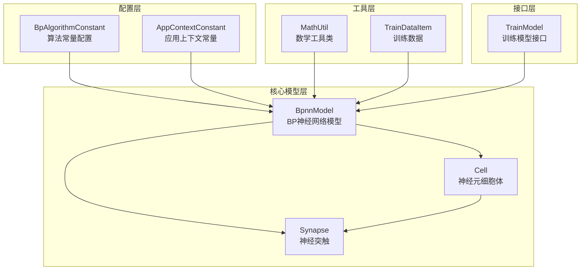
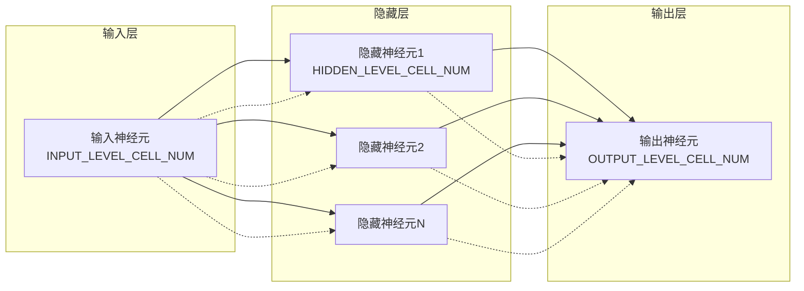
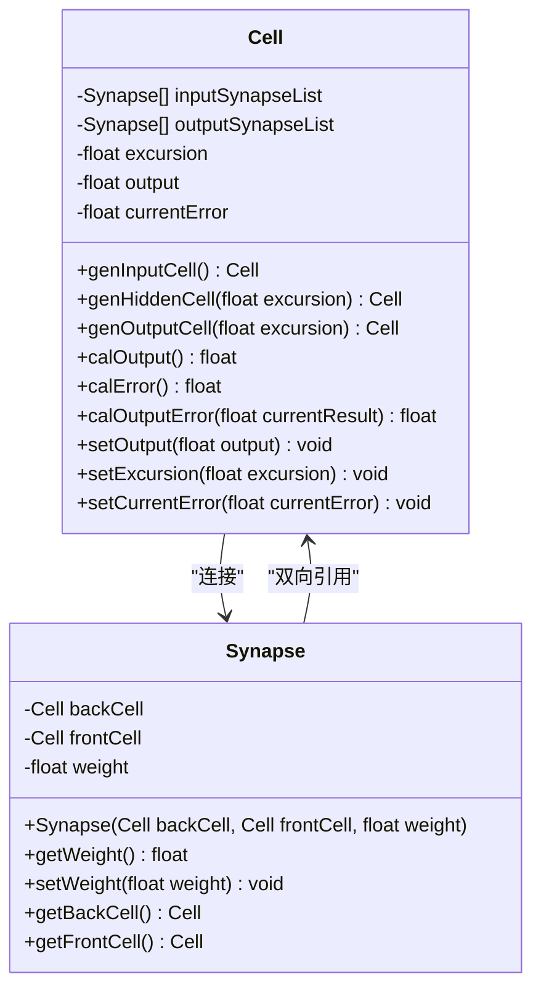
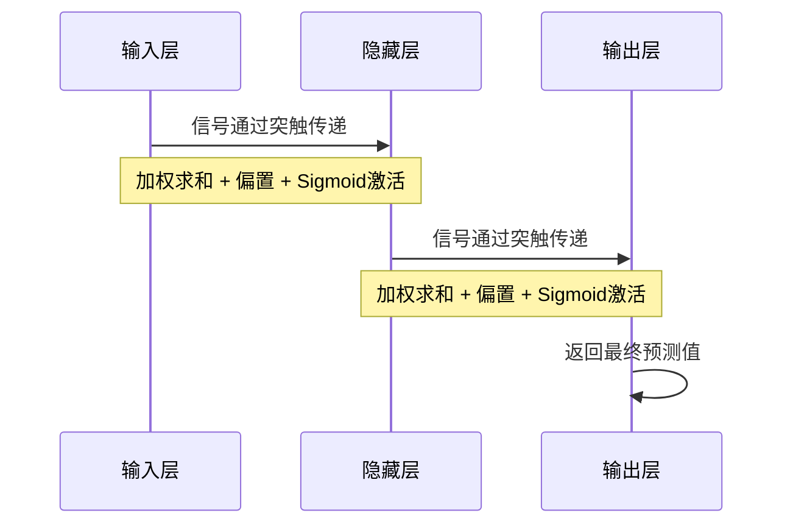
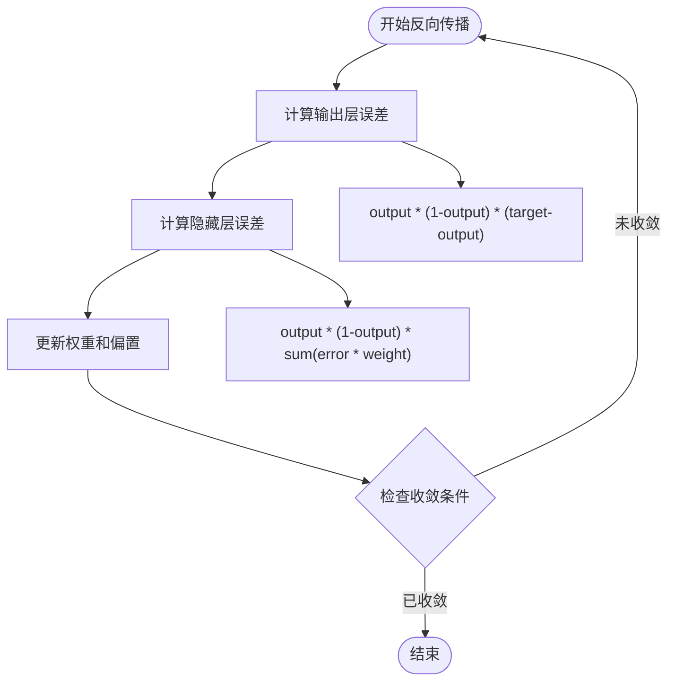
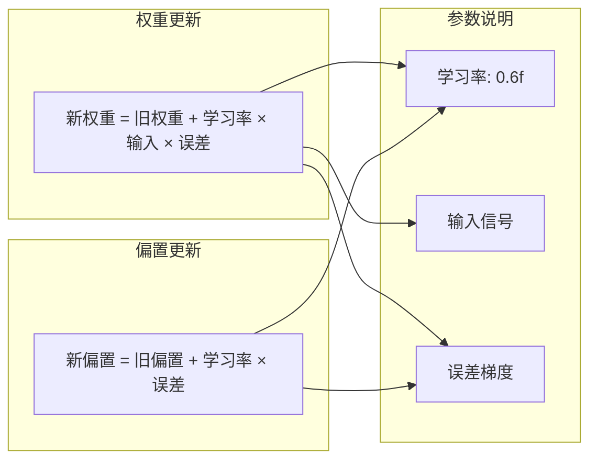
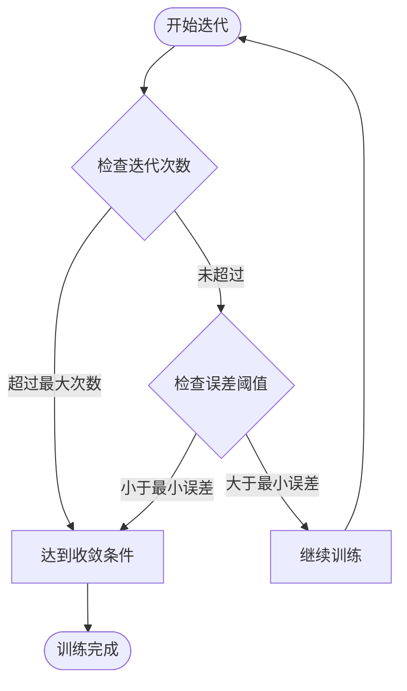

# BP神经网络模型实现机制详解

<cite>
**本文档引用的文件**
- [BpAlgorithmConstant.java](file://src/main/java/com/leavesfly/iac/config/BpAlgorithmConstant.java)
- [BpnnModel.java](file://src/main/java/com/leavesfly/iac/train/trainer/bp/BpnnModel.java)
- [AppContextConstant.java](file://src/main/java/com/leavesfly/iac/config/AppContextConstant.java)
- [MathUtil.java](file://src/main/java/com/leavesfly/iac/util/MathUtil.java)
- [TrainModel.java](file://src/main/java/com/leavesfly/iac/train/trainer/TrainModel.java)
</cite>

## 目录
1. [简介](#简介)
2. [项目结构概览](#项目结构概览)
3. [核心组件分析](#核心组件分析)
4. [三层神经网络架构](#三层神经网络架构)
5. [细胞体与突触设计原理](#细胞体与突触设计原理)
6. [权重初始化策略](#权重初始化策略)
7. [前向传播机制](#前向传播机制)
8. [反向传播与误差回传](#反向传播与误差回传)
9. [权重调整算法](#权重调整算法)
10. [训练收敛条件](#训练收敛条件)
11. [性能优化与调试建议](#性能优化与调试建议)
12. [总结](#总结)

## 简介

BP（Back Propagation）神经网络是一种经典的监督学习算法，通过前向传播计算输出并利用反向传播误差来调整网络权重。本文档深入分析了一个三层BP神经网络模型的完整实现，重点关注其内部细胞体（Cell）与突触（Synapse）的设计原理，以及完整的训练流程。

该实现采用了标准的三层感知器架构：输入层、隐藏层和输出层，每层都由多个神经元组成，神经元之间通过突触连接形成完整的网络拓扑结构。

## 项目结构概览



**图表来源**
- [BpAlgorithmConstant.java](file://src/main/java/com/leavesfly/iac/config/BpAlgorithmConstant.java#L1-L106)
- [BpnnModel.java](file://src/main/java/com/leavesfly/iac/train/trainer/bp/BpnnModel.java#L1-L50)

## 核心组件分析

BP神经网络模型的核心组件包括：

1. **BpnnModel类**：主控制器，负责整个网络的初始化、训练和推理
2. **Cell类**：神经元细胞体，包含神经元的状态和计算逻辑
3. **Synapse类**：神经突触，负责连接不同神经元并存储权重信息

这些组件协同工作，形成了一个完整的BP神经网络系统。

**章节来源**
- [BpnnModel.java](file://src/main/java/com/leavesfly/iac/train/trainer/bp/BpnnModel.java#L1-L100)

## 三层神经网络架构

### 架构设计原理



**图表来源**
- [BpnnModel.java](file://src/main/java/com/leavesfly/iac/train/trainer/bp/BpnnModel.java#L25-L35)
- [BpAlgorithmConstant.java](file://src/main/java/com/leavesfly/iac/config/BpAlgorithmConstant.java#L15-L35)

### 层级配置参数

网络的三层结构具有以下关键参数：

- **输入层节点数**：等于空调数量，由`INPUT_LEVEL_CELL_NUM`决定
- **输出层节点数**：固定为1，表示单输出回归任务
- **隐藏层节点数**：通过经验公式动态计算，确保网络容量适中

```java
// 隐藏层节点数计算公式
hidden = sqrt(0.43*input^2 + 0.12*output^2 + 2.54*input + 0.77*output + 0.35) + 0.51
```

**章节来源**
- [BpAlgorithmConstant.java](file://src/main/java/com/leavesfly/iac/config/BpAlgorithmConstant.java#L50-L70)
- [BpnnModel.java](file://src/main/java/com/leavesfly/iac/train/trainer/bp/BpnnModel.java#L60-L85)

## 细胞体与突触设计原理

### Cell类设计

Cell类是神经网络的基本单元，实现了神经元的所有功能：



**图表来源**
- [BpnnModel.java](file://src/main/java/com/leavesfly/iac/train/trainer/bp/BpnnModel.java#L275-L400)

### 神经元类型区分

系统根据不同层级的神经元特性，提供了三种静态工厂方法：

1. **输入神经元**：无偏置项，仅接收外部输入
2. **隐藏神经元**：具有可学习的偏置参数
3. **输出神经元**：具有可学习的偏置参数，输出经过激活函数处理

### 激活函数实现

神经元采用Sigmoid激活函数：

```java
result = 1 / (1 + Math.exp(-result))
```

这种非线性激活函数能够将输入映射到(0,1)区间，为神经网络提供非线性建模能力。

**章节来源**
- [BpnnModel.java](file://src/main/java/com/leavesfly/iac/train/trainer/bp/BpnnModel.java#L333-L350)

## 权重初始化策略

### 初始化范围设置

权重和偏置的随机初始化对网络训练至关重要：

```mermaid
graph TD
subgraph "偏置初始化"
EX_FROM[EXCURSION_RANDOM_FROM<br/>-0.5f]
EX_TO[EXCURSION_RANDOM_TO<br/>0.5f]
end
subgraph "权重初始化"
W_FROM[WEIGHT_RANDOM_FROM<br/>-1.0f]
W_TO[WEIGHT_RANDOM_TO<br/>1.0f]
end
subgraph "初始化策略"
RAND[MathUtil.nextFloat(from, to)<br/>均匀分布随机数]
end
EX_FROM --> RAND
EX_TO --> RAND
W_FROM --> RAND
W_TO --> RAND
```

**图表来源**
- [BpAlgorithmConstant.java](file://src/main/java/com/leavesfly/iac/config/BpAlgorithmConstant.java#L35-L50)
- [BpnnModel.java](file://src/main/java/com/leavesfly/iac/train/trainer/bp/BpnnModel.java#L110-L140)

### 初始化策略分析

1. **偏置初始化**：使用较小的随机范围[-0.5, 0.5]，避免初始输出过大或过小
2. **权重初始化**：使用较大的随机范围[-1.0, 1.0]，确保网络具有足够的表达能力
3. **随机分布**：采用均匀分布，保证初始化的随机性和一致性

**章节来源**
- [BpAlgorithmConstant.java](file://src/main/java/com/leavesfly/iac/config/BpAlgorithmConstant.java#L35-L50)
- [BpnnModel.java](file://src/main/java/com/leavesfly/iac/train/trainer/bp/BpnnModel.java#L110-L140)

## 前向传播机制

### 信号传递流程



**图表来源**
- [BpnnModel.java](file://src/main/java/com/leavesfly/iac/train/trainer/bp/BpnnModel.java#L210-L220)

### 前向传播算法实现

前向传播过程分为两个阶段：

1. **隐藏层计算**：
```java
for (int i = 0; i < hiddenLevel.length; i++) {
    hiddenLevel[i].setOutput(hiddenLevel[i].calOutput());
}
```

2. **输出层计算**：
```java
for (int i = 0; i < outputLevel.length; i++) {
    outputLevel[i].setOutput(outputLevel[i].calOutput());
}
```

### 前向传播计算细节

每个神经元的输出计算遵循以下公式：

```java
// 加权求和
float result = 0f;
for (Synapse backSynapse : inputSynapseList) {
    result += backSynapse.getBackCell().getOutput() * backSynapse.getWeight();
}
// 添加偏置
result += excursion;
// 应用激活函数
result = (float) (1 / (1 + Math.exp(-result)));
```

**章节来源**
- [BpnnModel.java](file://src/main/java/com/leavesfly/iac/train/trainer/bp/BpnnModel.java#L210-L220)
- [BpnnModel.java](file://src/main/java/com/leavesfly/iac/train/trainer/bp/BpnnModel.java#L333-L345)

## 反向传播与误差回传

### 误差计算机制



**图表来源**
- [BpnnModel.java](file://src/main/java/com/leavesfly/iac/train/trainer/bp/BpnnModel.java#L220-L230)

### 误差计算公式

1. **输出层误差计算**：
```java
public float calOutputError(float currentResult) {
    return output * (1.0f - output) * (currentResult - output);
}
```

2. **隐藏层误差计算**：
```java
public float calError() {
    float result = 0f;
    for (Synapse frontSynapse : outputSynapseList) {
        result += frontSynapse.getFrontCell().getCurrentError() * frontSynapse.getWeight();
    }
    result = output * (1.0f - output) * result;
    return result;
}
```

### 反向传播算法特点

- **梯度下降**：通过链式法则计算梯度，逐层向后传播
- **误差共享**：每个神经元的误差贡献与其连接权重成正比
- **局部性原则**：误差只影响直接相连的神经元

**章节来源**
- [BpnnModel.java](file://src/main/java/com/leavesfly/iac/train/trainer/bp/BpnnModel.java#L220-L230)
- [BpnnModel.java](file://src/main/java/com/leavesfly/iac/train/trainer/bp/BpnnModel.java#L347-L365)

## 权重调整算法

### 调整公式详解



**图表来源**
- [BpnnModel.java](file://src/main/java/com/leavesfly/iac/train/trainer/bp/BpnnModel.java#L225-L250)

### 权重调整实现

权重和偏置的调整遵循标准的梯度下降规则：

```java
// 隐藏层权重调整
for (int i = 0; i < hiddenLevel.length; i++) {
    List<Synapse> synapseList = hiddenLevel[i].getInputSynapseList();
    for (Synapse synapse : synapseList) {
        synapse.setWeight(synapse.getWeight() + 
            synapse.getBackCell().getOutput() * 
            hiddenLevel[i].getCurrentError() * learnRate);
    }
    // 隐藏层偏置调整
    hiddenLevel[i].setExcursion(hiddenLevel[i].getExcursion() + 
        hiddenLevel[i].getCurrentError() * learnRate);
}
```

### 调整因子的作用

- **学习率控制**：0.6f的学习率平衡了收敛速度和稳定性
- **梯度缩放**：通过乘以输入信号大小，确保调整幅度适当
- **误差放大**：通过乘以误差梯度，加速错误修正

**章节来源**
- [BpnnModel.java](file://src/main/java/com/leavesfly/iac/train/trainer/bp/BpnnModel.java#L225-L250)

## 训练收敛条件

### 收敛判断逻辑



**图表来源**
- [BpnnModel.java](file://src/main/java/com/leavesfly/iac/train/trainer/bp/BpnnModel.java#L252-L260)

### 收敛条件实现

```java
private boolean isMeetOverCondition() {
    if (currentIterateNum > MaxIterateNum
            || outputLevel[0].getCurrentError() < BpAlgorithmConstant.MIN_ERROR) {
        return true;
    }
    return false;
}
```

### 参数配置分析

- **最大迭代次数**：1,000次，防止过拟合和计算浪费
- **最小误差阈值**：0.000001，确保训练精度
- **早停机制**：任一条件满足即停止训练

**章节来源**
- [BpAlgorithmConstant.java](file://src/main/java/com/leavesfly/iac/config/BpAlgorithmConstant.java#L25-L35)
- [BpnnModel.java](file://src/main/java/com/leavesfly/iac/train/trainer/bp/BpnnModel.java#L252-L260)

## 性能优化与调试建议

### 输入数据归一化

为了提高训练效率和稳定性，系统对输入数据进行了归一化处理：

```java
// 输入归一化
for (int i = 0; i < inputLevel.length; i++) {
    inputLevel[i].setOutput(currentFeature[i] / AppContextConstant.AIR_CONDITION_MAX_POWER);
}
```

### 调试建议

1. **梯度消失检测**：
   - 监控隐藏层神经元的输出值
   - 检查权重梯度的绝对值变化
   - 观察训练过程中的误差曲线

2. **参数调优策略**：
   - 逐步调整学习率（0.1 → 0.6 → 0.9）
   - 增加隐藏层节点数以提高表达能力
   - 使用更复杂的初始化策略

3. **训练监控**：
   - 定期保存最佳模型状态
   - 实现交叉验证评估
   - 监控过拟合现象

### 性能优化技巧

- **批量训练**：考虑实现小批量梯度下降
- **动量项**：添加动量参数加速收敛
- **自适应学习率**：实现学习率衰减机制

**章节来源**
- [BpnnModel.java](file://src/main/java/com/leavesfly/iac/train/trainer/bp/BpnnModel.java#L200-L210)

## 总结

本文档详细分析了BP神经网络模型的完整实现机制，涵盖了从基础架构设计到具体算法实现的各个方面。该模型具有以下特点：

1. **模块化设计**：清晰分离Cell、Synapse和网络控制器，便于维护和扩展
2. **灵活配置**：支持多种构造函数，适应不同的应用场景
3. **标准化实现**：严格遵循BP算法的标准流程，确保理论正确性
4. **实用导向**：针对空调温度预测任务进行了专门优化

通过深入理解这些设计原理和实现细节，开发者可以更好地使用和改进这个BP神经网络模型，为实际应用提供可靠的智能解决方案。