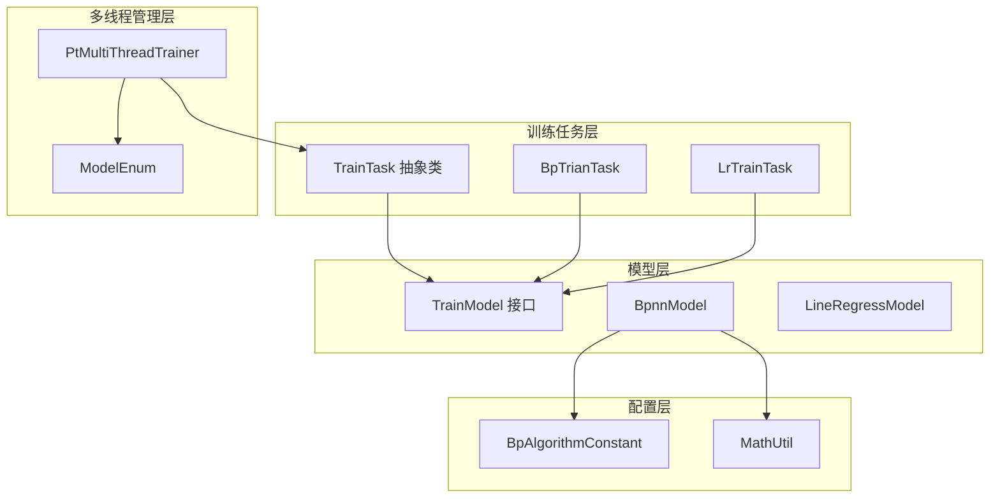
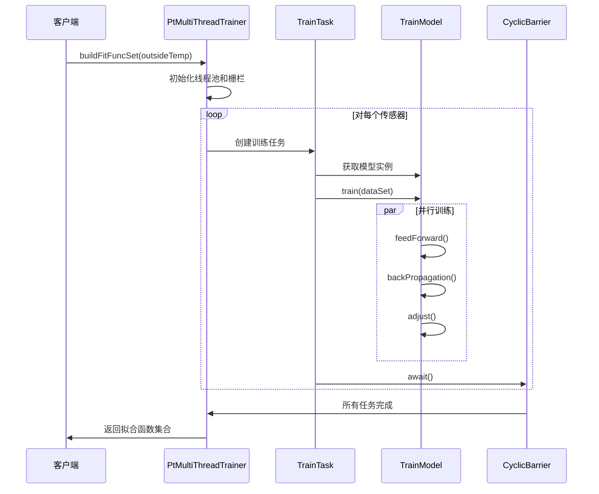
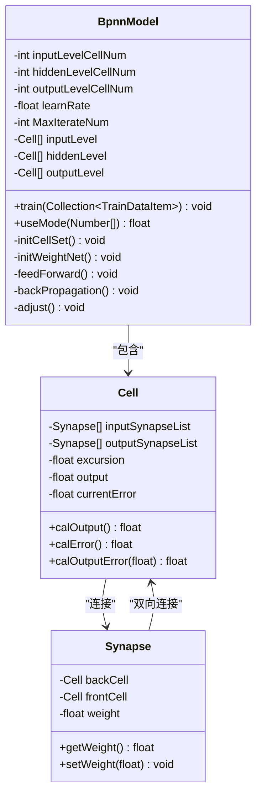
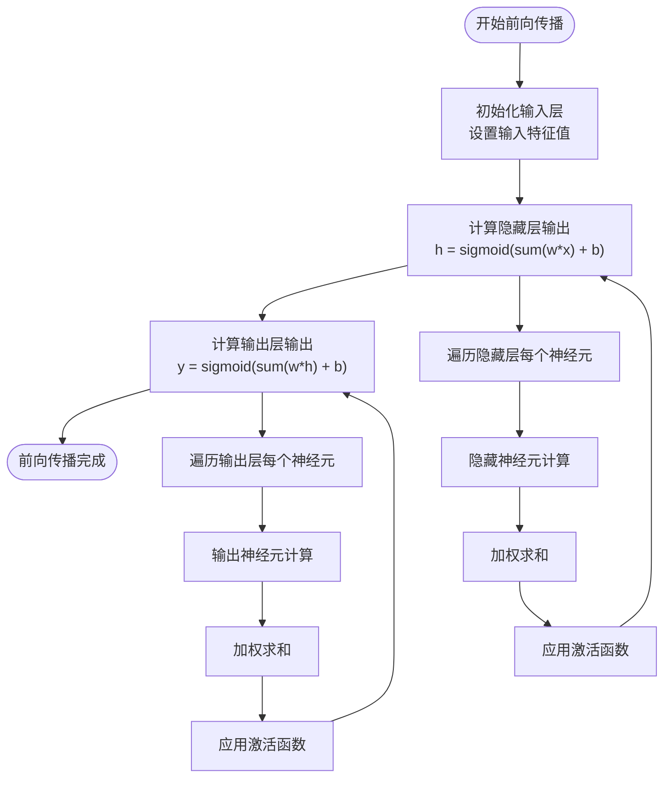
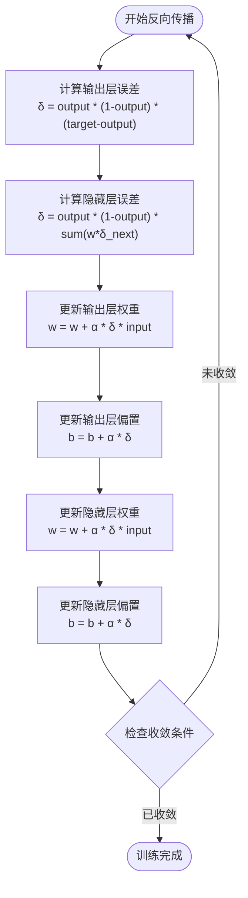
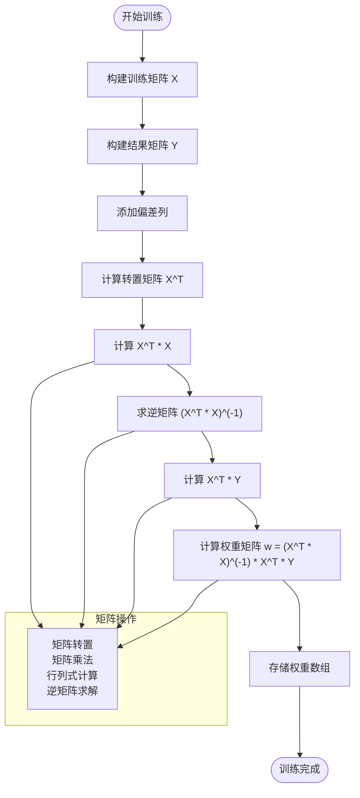
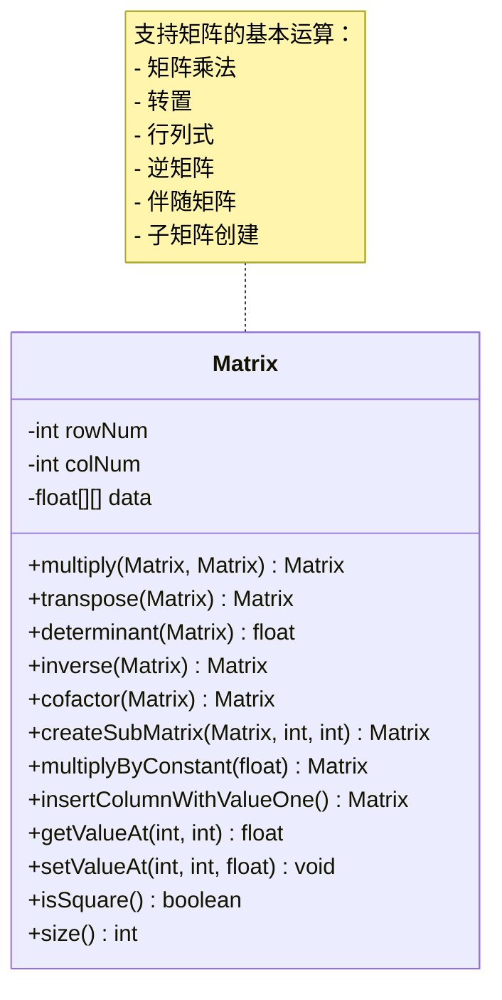
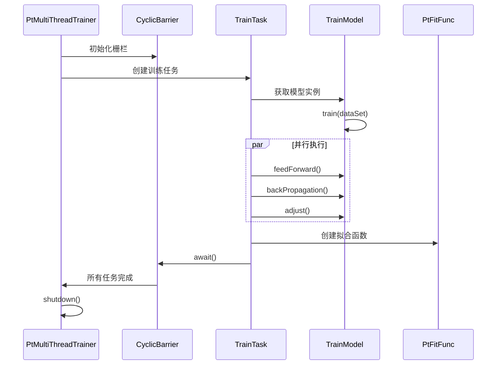
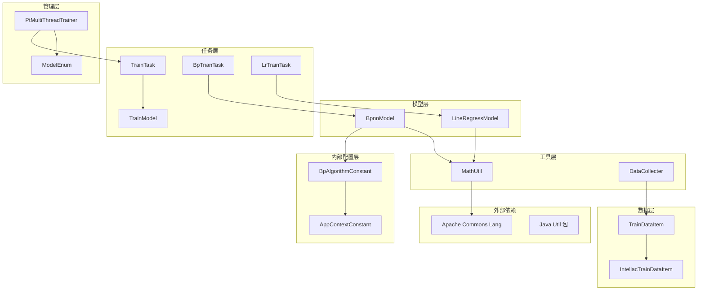

# 模型训练子模块

<cite>
**本文档引用的文件**
- [BpnnModel.java](file://src/main/java/com/leavesfly/iac/train/trainer/bp/BpnnModel.java)
- [LineRegressModel.java](file://src/main/java/com/leavesfly/iac/train/trainer/lr/LineRegressModel.java)
- [BpTrianTask.java](file://src/main/java/com/leavesfly/iac/train/trainer/bp/BpTrianTask.java)
- [LrTrainTask.java](file://src/main/java/com/leavesfly/iac/train/trainer/lr/LrTrainTask.java)
- [TrainTask.java](file://src/main/java/com/leavesfly/iac/train/trainer/TrainTask.java)
- [PtMultiThreadTrainer.java](file://src/main/java/com/leavesfly/iac/train/trainer/PtMultiThreadTrainer.java)
- [ModelEnum.java](file://src/main/java/com/leavesfly/iac/train/trainer/ModelEnum.java)
- [BpAlgorithmConstant.java](file://src/main/java/com/leavesfly/iac/config/BpAlgorithmConstant.java)
- [MathUtil.java](file://src/main/java/com/leavesfly/iac/util/MathUtil.java)
</cite>

## 目录
1. [简介](#简介)
2. [项目结构](#项目结构)
3. [核心组件](#核心组件)
4. [架构概览](#架构概览)
5. [详细组件分析](#详细组件分析)
6. [依赖关系分析](#依赖关系分析)
7. [性能考虑](#性能考虑)
8. [故障排除指南](#故障排除指南)
9. [结论](#结论)

## 简介

模型训练子模块是智能空调系统的核心组件，负责训练和优化预测模型以实现精确的功率-温度控制。该模块主要包含两种算法模型：BP神经网络模型和线性回归模型，支持多线程并行训练，并提供了完整的训练流程管理和模型选择机制。

## 项目结构

模型训练子模块采用分层架构设计，主要分为以下几个层次：

**图表来源**
- [TrainTask.java](file://src/main/java/com/leavesfly/iac/train/trainer/TrainTask.java#L1-L90)
- [BpnnModel.java](file://src/main/java/com/leavesfly/iac/train/trainer/bp/BpnnModel.java#L1-L461)
- [LineRegressModel.java](file://src/main/java/com/leavesfly/iac/train/trainer/lr/LineRegressModel.java#L1-L316)

## 核心组件

### BP神经网络模型 (BpnnModel)

BP神经网络模型是三层感知器网络，具有明确的输入层、隐藏层和输出层结构。该模型采用反向传播算法进行训练，具有以下特点：

- **三层结构**：输入层节点数等于空调数量，隐藏层节点数通过经验公式计算，输出层固定为1个节点
- **权重初始化**：使用随机初始化策略，权重范围为[-1.0, 1.0]，偏移量范围为[-0.5, 0.5]
- **激活函数**：使用Sigmoid函数作为激活函数
- **学习率**：默认值为0.6，可通过配置调整

### 线性回归模型 (LineRegressModel)

线性回归模型采用最小二乘法求解权重矩阵，具有以下特点：

- **数学基础**：基于正规方程组 w = (X^T * X)^(-1) * X^T * Y
- **矩阵运算**：封装了完整的矩阵操作，包括转置、行列式计算、逆矩阵求解
- **偏差处理**：自动添加偏差项，提高模型拟合能力

**章节来源**
- [BpnnModel.java](file://src/main/java/com/leavesfly/iac/train/trainer/bp/BpnnModel.java#L20-L50)
- [LineRegressModel.java](file://src/main/java/com/leavesfly/iac/train/trainer/lr/LineRegressModel.java#L15-L30)

## 架构概览

模型训练系统采用多线程并行架构，支持多种训练模型的动态切换：

**图表来源**
- [PtMultiThreadTrainer.java](file://src/main/java/com/leavesfly/iac/train/trainer/PtMultiThreadTrainer.java#L50-L90)
- [TrainTask.java](file://src/main/java/com/leavesfly/iac/train/trainer/TrainTask.java#L50-L80)

## 详细组件分析

### BP神经网络模型详细分析

#### 网络结构与初始化

BP神经网络模型采用标准的三层感知器结构：

**图表来源**
- [BpnnModel.java](file://src/main/java/com/leavesfly/iac/train/trainer/bp/BpnnModel.java#L20-L100)
- [BpnnModel.java](file://src/main/java/com/leavesfly/iac/train/trainer/bp/BpnnModel.java#L300-L400)

#### 前向传播过程

前向传播是BP神经网络的核心计算过程：

**图表来源**
- [BpnnModel.java](file://src/main/java/com/leavesfly/iac/train/trainer/bp/BpnnModel.java#L200-L220)

#### 反向传播与权重调整

反向传播算法通过链式法则计算梯度并更新网络参数：

**图表来源**
- [BpnnModel.java](file://src/main/java/com/leavesfly/iac/train/trainer/bp/BpnnModel.java#L222-L240)
- [BpnnModel.java](file://src/main/java/com/leavesfly/iac/train/trainer/bp/BpnnModel.java#L242-L270)

**章节来源**
- [BpnnModel.java](file://src/main/java/com/leavesfly/iac/train/trainer/bp/BpnnModel.java#L150-L270)

### 线性回归模型详细分析

#### 最小二乘法求解过程

线性回归模型通过正规方程组求解最优权重：

**图表来源**
- [LineRegressModel.java](file://src/main/java/com/leavesfly/iac/train/trainer/lr/LineRegressModel.java#L35-L60)

#### 矩阵运算实现

线性回归模型包含了完整的矩阵运算库：

**图表来源**
- [LineRegressModel.java](file://src/main/java/com/leavesfly/iac/train/trainer/lr/LineRegressModel.java#L100-L200)

**章节来源**
- [LineRegressModel.java](file://src/main/java/com/leavesfly/iac/train/trainer/lr/LineRegressModel.java#L35-L100)
- [LineRegressModel.java](file://src/main/java/com/leavesfly/iac/train/trainer/lr/LineRegressModel.java#L100-L316)

### 多线程训练任务分析

#### 训练任务执行流程

**图表来源**
- [TrainTask.java](file://src/main/java/com/leavesfly/iac/train/trainer/TrainTask.java#L50-L80)
- [PtMultiThreadTrainer.java](file://src/main/java/com/leavesfly/iac/train/trainer/PtMultiThreadTrainer.java#L70-L90)

**章节来源**
- [TrainTask.java](file://src/main/java/com/leavesfly/iac/train/trainer/TrainTask.java#L1-L90)
- [PtMultiThreadTrainer.java](file://src/main/java/com/leavesfly/iac/train/trainer/PtMultiThreadTrainer.java#L1-L114)

## 依赖关系分析

模型训练子模块具有清晰的依赖层次结构：

**图表来源**
- [BpnnModel.java](file://src/main/java/com/leavesfly/iac/train/trainer/bp/BpnnModel.java#L1-L20)
- [LineRegressModel.java](file://src/main/java/com/leavesfly/iac/train/trainer/lr/LineRegressModel.java#L1-L15)

**章节来源**
- [BpnnModel.java](file://src/main/java/com/leavesfly/iac/train/trainer/bp/BpnnModel.java#L1-L20)
- [LineRegressModel.java](file://src/main/java/com/leavesfly/iac/train/trainer/lr/LineRegressModel.java#L1-L15)

## 性能考虑

### 训练收敛条件

模型训练设置了严格的收敛条件以确保训练质量和效率：

- **最大迭代次数**：默认1000次，可通过配置调整
- **误差阈值**：最小误差阈值为0.000001，当误差低于此值时提前终止训练
- **学习率调优**：默认学习率为0.6，可根据具体场景调整

### 内存优化策略

- **矩阵缓存**：线性回归模型中的中间矩阵结果会被缓存，减少重复计算
- **对象复用**：神经网络细胞和突触对象在训练过程中保持不变
- **流式数据处理**：支持大数据集的流式处理，避免内存溢出

### 并行化优化

- **线程池管理**：使用CachedThreadPool根据CPU核心数动态调整线程数
- **栅栏同步**：使用CyclicBarrier确保所有训练任务完成后再继续
- **无锁集合**：使用synchronizedCollection保证线程安全的同时保持高性能

## 故障排除指南

### 常见训练问题及解决方案

#### BP神经网络训练问题

1. **梯度消失问题**
   - **症状**：训练过程中误差不下降或下降缓慢
   - **原因**：权重初始化不当或学习率过小
   - **解决方案**：调整权重初始化范围，增加学习率

2. **过拟合问题**
   - **症状**：训练误差低但测试误差高
   - **原因**：网络复杂度过高或训练数据不足
   - **解决方案**：减少隐藏层节点数，增加正则化

3. **收敛速度慢**
   - **症状**：需要大量迭代才能达到收敛
   - **原因**：学习率设置不当或数据预处理不足
   - **解决方案**：使用学习率衰减策略，标准化输入数据

#### 线性回归训练问题

1. **矩阵奇异问题**
   - **症状**：计算逆矩阵时抛出异常
   - **原因**：特征之间存在线性相关性
   - **解决方案**：使用岭回归或主成分分析去除冗余特征

2. **数值不稳定**
   - **症状**：权重值过大或过小
   - **原因**：特征尺度差异过大
   - **解决方案**：对特征进行标准化处理

**章节来源**
- [BpnnModel.java](file://src/main/java/com/leavesfly/iac/train/trainer/bp/BpnnModel.java#L272-L280)
- [BpAlgorithmConstant.java](file://src/main/java/com/leavesfly/iac/config/BpAlgorithmConstant.java#L50-L70)

### 调试建议

1. **启用详细日志**：在训练过程中打印每轮的误差值
2. **可视化训练曲线**：绘制误差随迭代次数变化的曲线
3. **交叉验证**：使用交叉验证评估模型泛化能力
4. **参数敏感性分析**：测试不同参数组合对模型性能的影响

## 结论

模型训练子模块是一个设计精良、功能完备的机器学习框架，具有以下优势：

1. **模块化设计**：清晰的分层架构便于维护和扩展
2. **多模型支持**：同时支持BP神经网络和线性回归两种算法
3. **并行化处理**：高效的多线程训练机制提升性能
4. **完善的配置**：丰富的参数配置满足不同应用场景需求
5. **健壮的错误处理**：全面的异常处理和调试支持

该模块为智能空调系统的功率-温度预测提供了强大的技术支持，能够适应复杂的实际应用场景，为系统的智能化运行奠定了坚实的基础。