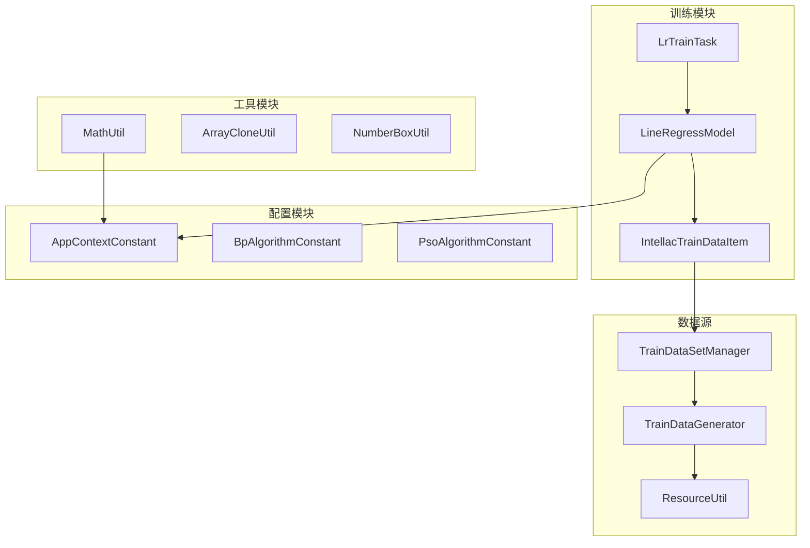
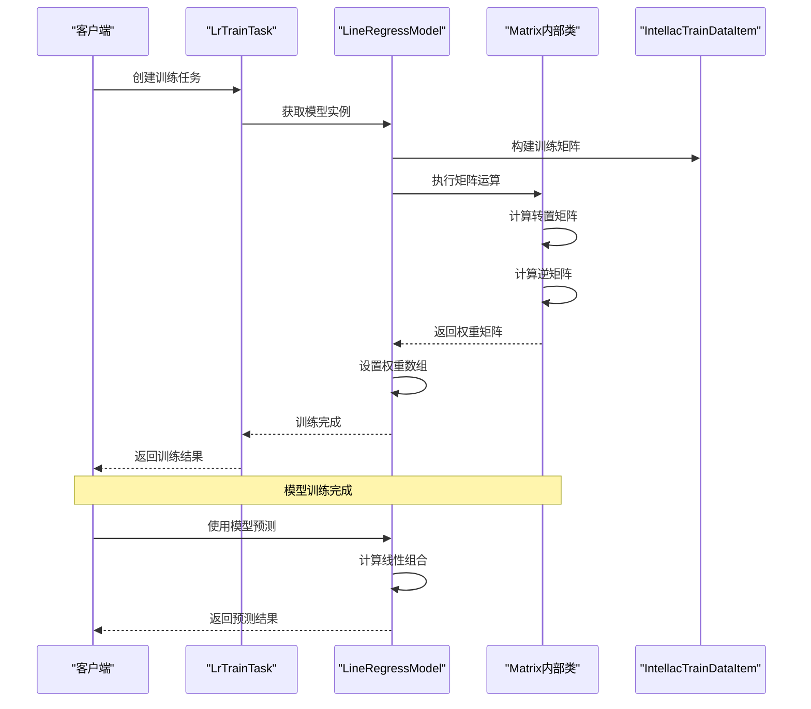
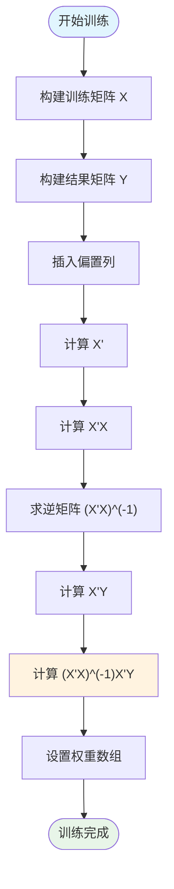
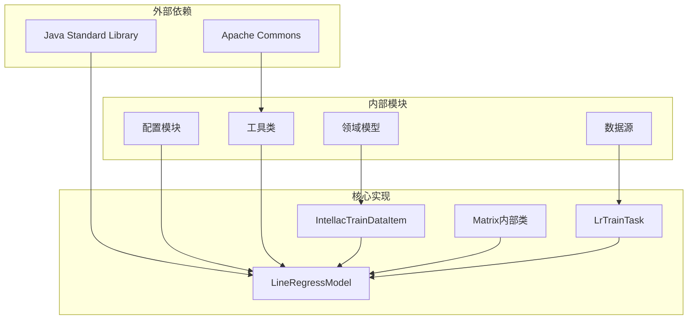

# 线性回归模型技术实现文档

<cite>
**本文档中引用的文件**
- [LineRegressModel.java](file://src/main/java/com/leavesfly/iac/train/trainer/lr/LineRegressModel.java)
- [LrTrainTask.java](file://src/main/java/com/leavesfly/iac/train/trainer/lr/LrTrainTask.java)
- [IntellacTrainDataItem.java](file://src/main/java/com/leavesfly/iac/train/domain/IntellacTrainDataItem.java)
- [AppContextConstant.java](file://src/main/java/com/leavesfly/iac/config/AppContextConstant.java)
- [MathUtil.java](file://src/main/java/com/leavesfly/iac/util/MathUtil.java)
</cite>

## 目录
1. [简介](#简介)
2. [项目结构概述](#项目结构概述)
3. [核心组件分析](#核心组件分析)
4. [架构概览](#架构概览)
5. [详细组件分析](#详细组件分析)
6. [依赖关系分析](#依赖关系分析)
7. [性能考虑](#性能考虑)
8. [故障排除指南](#故障排除指南)
9. [结论](#结论)

## 简介

本文档深入分析了一个基于最小二乘法的线性回归模型实现，该模型专门用于智能空调系统的功率与温度预测。该实现采用了经典的线性回归算法，通过求解(X^T*X)^(-1)*X^T*Y公式来获得最优权重参数，支持多维特征输入并自动添加偏置项。

线性回归模型是机器学习中最基础且重要的算法之一，它假设目标变量与特征之间存在线性关系。在本系统中，该模型被用来预测空调系统的温度响应，基于传感器收集的功率数据进行训练和预测。

## 项目结构概述

该项目采用分层架构设计，主要包含以下核心模块：



**图表来源**
- [LineRegressModel.java](file://src/main/java/com/leavesfly/iac/train/trainer/lr/LineRegressModel.java#L1-L316)
- [LrTrainTask.java](file://src/main/java/com/leavesfly/iac/train/trainer/lr/LrTrainTask.java#L1-L25)
- [IntellacTrainDataItem.java](file://src/main/java/com/leavesfly/iac/train/domain/IntellacTrainDataItem.java#L1-L151)

**章节来源**
- [LineRegressModel.java](file://src/main/java/com/leavesfly/iac/train/trainer/lr/LineRegressModel.java#L1-L50)
- [AppContextConstant.java](file://src/main/java/com/leavesfly/iac/config/AppContextConstant.java#L1-L150)

## 核心组件分析

### LineRegressModel 类

LineRegressModel 是整个线性回归系统的核心类，实现了 TrainModel 接口。该类采用单例模式创建实例，并维护一个权重数组来存储训练得到的模型参数。

```java
public class LineRegressModel implements TrainModel {
    private float[] weightArray;
    
    public static TrainModel getIntance() {
        return new LineRegressModel();
    }
}
```

该类的核心功能包括：
- **模型训练**：通过最小二乘法求解最优权重参数
- **模型预测**：使用训练好的权重进行新数据的预测
- **矩阵运算**：内部实现完整的矩阵运算支持

**章节来源**
- [LineRegressModel.java](file://src/main/java/com/leavesfly/iac/train/trainer/lr/LineRegressModel.java#L15-L30)

## 架构概览

线性回归模型的整体架构遵循经典的机器学习流程，从数据预处理到模型训练再到预测应用：



**图表来源**
- [LineRegressModel.java](file://src/main/java/com/leavesfly/iac/train/trainer/lr/LineRegressModel.java#L32-L50)
- [LrTrainTask.java](file://src/main/java/com/leavesfly/iac/train/trainer/lr/LrTrainTask.java#L18-L24)

## 详细组件分析

### Matrix 内部类深度分析

Matrix 类是整个线性回归算法的核心，提供了完整的矩阵运算支持。该类实现了多种关键的矩阵操作：

#### 矩阵乘法实现

```java
public static Matrix multiply(Matrix matrix1, Matrix matrix2) {
    Matrix multipliedMatrix = new Matrix(matrix1.getRowNum(), matrix2.getColNum());
    for (int i = 0; i < multipliedMatrix.getRowNum(); i++) {
        for (int j = 0; j < multipliedMatrix.getColNum(); j++) {
            float sum = 0f;
            for (int k = 0; k < matrix1.getColNum(); k++) {
                sum += matrix1.getValueAt(i, k) * matrix2.getValueAt(k, j);
            }
            multipliedMatrix.setValueAt(i, j, sum);
        }
    }
    return multipliedMatrix;
}
```

该实现采用标准的三重循环矩阵乘法算法，时间复杂度为 O(n³)，适用于中小型矩阵运算。

#### 矩阵转置操作

```java
public static Matrix transpose(Matrix matrix) {
    Matrix transposedMatrix = new Matrix(matrix.getColNum(), matrix.getColNum());
    for (int i = 0; i < matrix.getRowNum(); i++) {
        for (int j = 0; j < matrix.getColNum(); j++) {
            transposedMatrix.setValueAt(j, i, matrix.getValueAt(i, j));
        }
    }
    return transposedMatrix;
}
```

转置操作的时间复杂度为 O(m*n)，其中 m 和 n 分别是矩阵的行数和列数。

#### 行列式计算（递归实现）

```java
public static float determinant(Matrix matrix) {
    if (!matrix.isSquare())
        throw new RuntimeException("matrix need to be square.");
    if (matrix.size() == 1) {
        return matrix.getValueAt(0, 0);
    }
    if (matrix.size() == 2) {
        return (matrix.getValueAt(0, 0) * matrix.getValueAt(1, 1))
                - (matrix.getValueAt(0, 1) * matrix.getValueAt(1, 0));
    }
    float sum = 0f;
    for (int i = 0; i < matrix.getColNum(); i++) {
        sum += changeSign(i) * matrix.getValueAt(0, i)
                * determinant(createSubMatrix(matrix, 0, i));
    }
    return sum;
}
```

行列式计算采用拉普拉斯展开的递归方法，对于 n×n 矩阵的时间复杂度为 O(n!)，在实际应用中通常限制在 4×4 以内。

#### 伴随矩阵与逆矩阵求解

```java
public static Matrix cofactor(Matrix matrix) {
    Matrix mat = new Matrix(matrix.getRowNum(), matrix.getColNum());
    for (int i = 0; i < matrix.getRowNum(); i++) {
        for (int j = 0; j < matrix.getColNum(); j++) {
            mat.setValueAt(i, j, changeSign(i) * changeSign(j)
                    * determinant(createSubMatrix(matrix, i, j)));
        }
    }
    return mat;
}

public static Matrix inverse(Matrix matrix) {
    return (transpose(cofactor(matrix)).multiplyByConstant(1f / determinant(matrix)));
}
```

逆矩阵求解通过伴随矩阵法实现，先计算伴随矩阵再乘以行列式的倒数。

#### 偏置项插入方法

```java
public Matrix insertColumnWithValueOne() {
    Matrix newMatrix = new Matrix(this.rowNum, this.colNum + 1);
    for (int i = 0; i < newMatrix.rowNum; i++) {
        for (int j = 0; j < newMatrix.colNum; j++) {
            if (j == 0)
                newMatrix.setValueAt(i, j, 1.0f);
            else
                newMatrix.setValueAt(i, j, this.getValueAt(i, j - 1));
        }
    }
    return newMatrix;
}
```

该方法在矩阵的第一列插入全1列，用于支持线性模型中的偏置项（截距）。

**章节来源**
- [LineRegressModel.java](file://src/main/java/com/leavesfly/iac/train/trainer/lr/LineRegressModel.java#L100-L316)

### 训练过程详解

训练过程的核心算法遵循最小二乘法原理，通过求解正规方程组来获得最优权重：



**图表来源**
- [LineRegressModel.java](file://src/main/java/com/leavesfly/iac/train/trainer/lr/LineRegressModel.java#L32-L50)

训练过程的关键步骤：

1. **训练矩阵构建**：将训练数据转换为矩阵形式
2. **结果矩阵构建**：提取目标变量形成结果矩阵
3. **偏置项添加**：通过 insertColumnWithValueOne 方法添加偏置列
4. **矩阵运算**：执行完整的矩阵运算链
5. **权重设置**：将计算得到的权重矩阵转换为一维数组

### 预测过程分析

```java
@Override
public <T extends Number> float useMode(T[] feature) {
    if (feature.length != weightArray.length - 1) {
        throw new IllegalArgumentException();
    }
    Float[] floatFeature = (Float[]) feature;
    float result = 0f;
    for (int i = 0; i < floatFeature.length; i++) {
        result += floatFeature[i] * weightArray[i + 1];
    }
    result += weightArray[0];
    return result;
}
```

预测过程采用简单的线性组合计算：

```
y = w₀ + w₁*x₁ + w₂*x₂ + ... + wₙ*xₙ
```

其中 w₀ 是偏置项，w₁ 到 wₙ 是特征对应的权重系数。

**章节来源**
- [LineRegressModel.java](file://src/main/java/com/leavesfly/iac/train/trainer/lr/LineRegressModel.java#L70-L85)

## 依赖关系分析

系统的依赖关系呈现清晰的层次结构：



**图表来源**
- [LineRegressModel.java](file://src/main/java/com/leavesfly/iac/train/trainer/lr/LineRegressModel.java#L1-L15)
- [AppContextConstant.java](file://src/main/java/com/leavesfly/iac/config/AppContextConstant.java#L1-L10)

**章节来源**
- [LineRegressModel.java](file://src/main/java/com/leavesfly/iac/train/trainer/lr/LineRegressModel.java#L1-L316)
- [LrTrainTask.java](file://src/main/java/com/leavesfly/iac/train/trainer/lr/LrTrainTask.java#L1-L25)

## 性能考虑

### 时间复杂度分析

1. **矩阵乘法**：O(n³)，适用于中小型矩阵
2. **行列式计算**：O(n!)，建议限制在 4×4 以内
3. **矩阵转置**：O(m*n)
4. **训练过程**：O(n³) + O(m*n)，主要受限于矩阵求逆操作
5. **预测过程**：O(p)，其中 p 是特征数量

### 空间复杂度分析

- 权重数组：O(p+1)，其中 p 是特征数量
- 中间矩阵：O(n²)，n 是样本数量
- 整体空间复杂度：O(n² + p)

### 优化建议

1. **矩阵大小限制**：对于大规模数据，考虑使用近似算法或分布式计算
2. **内存管理**：及时释放大型中间矩阵对象
3. **数值稳定性**：在矩阵求逆时检查条件数，避免病态矩阵问题

## 故障排除指南

### 常见错误及解决方案

#### 1. 矩阵维度不匹配
**错误现象**：运行时抛出 ArrayIndexOutOfBoundsException
**原因**：训练数据特征数量与权重数组长度不匹配
**解决方案**：确保训练数据的特征数量与 AppContextConstant.SENSOR_NUM 一致

#### 2. 行列式为零
**错误现象**：计算逆矩阵时出现异常
**原因**：训练矩阵的列向量线性相关
**解决方案**：
- 检查特征选择是否合理
- 考虑特征标准化或降维
- 添加正则化项防止过拟合

#### 3. 数值不稳定
**错误现象**：权重值过大或过小，导致预测结果异常
**原因**：特征尺度差异过大
**解决方案**：
- 对特征进行标准化处理
- 使用梯度下降等迭代方法替代直接求解

### 模型适用场景与局限性

#### 适用场景
1. **线性关系明确的数据**：当目标变量与特征之间存在明显的线性关系时
2. **中小规模数据集**：适合样本数量不超过几千的情况
3. **解释性要求高**：需要理解特征对结果的影响程度

#### 局限性分析
1. **特征线性相关性要求**：强线性相关可能导致矩阵奇异
2. **异常值敏感性**：单个异常点可能显著影响模型性能
3. **非线性关系处理能力有限**：无法捕捉复杂的非线性模式

#### 应对策略
1. **数据预处理**：去除异常值，进行特征缩放
2. **特征工程**：添加多项式特征或交互特征
3. **正则化**：使用岭回归或LASSO增强模型鲁棒性

**章节来源**
- [LineRegressModel.java](file://src/main/java/com/leavesfly/iac/train/trainer/lr/LineRegressModel.java#L70-L85)
- [AppContextConstant.java](file://src/main/java/com/leavesfly/iac/config/AppContextConstant.java#L25-L30)

## 结论

本文档详细分析了基于最小二乘法的线性回归模型实现。该系统具有以下特点：

### 技术优势
1. **算法完整性**：实现了完整的最小二乘法求解流程
2. **矩阵运算支持**：提供了全面的矩阵运算功能
3. **偏置项支持**：通过 insertColumnWithValueOne 方法优雅地处理偏置项
4. **可扩展性**：良好的模块化设计便于功能扩展

### 应用价值
1. **智能空调系统**：专门针对空调功率与温度预测场景
2. **教育价值**：清晰的代码结构适合作为机器学习算法教学案例
3. **研究参考**：为更复杂的机器学习算法提供基础参考

### 发展方向
1. **性能优化**：考虑使用更高效的矩阵分解算法
2. **功能扩展**：添加正则化、交叉验证等功能
3. **应用场景**：扩展到其他类型的预测任务

该线性回归模型为智能空调系统提供了可靠的温度预测能力，其简洁而完整的实现为理解和应用机器学习算法提供了宝贵的参考。