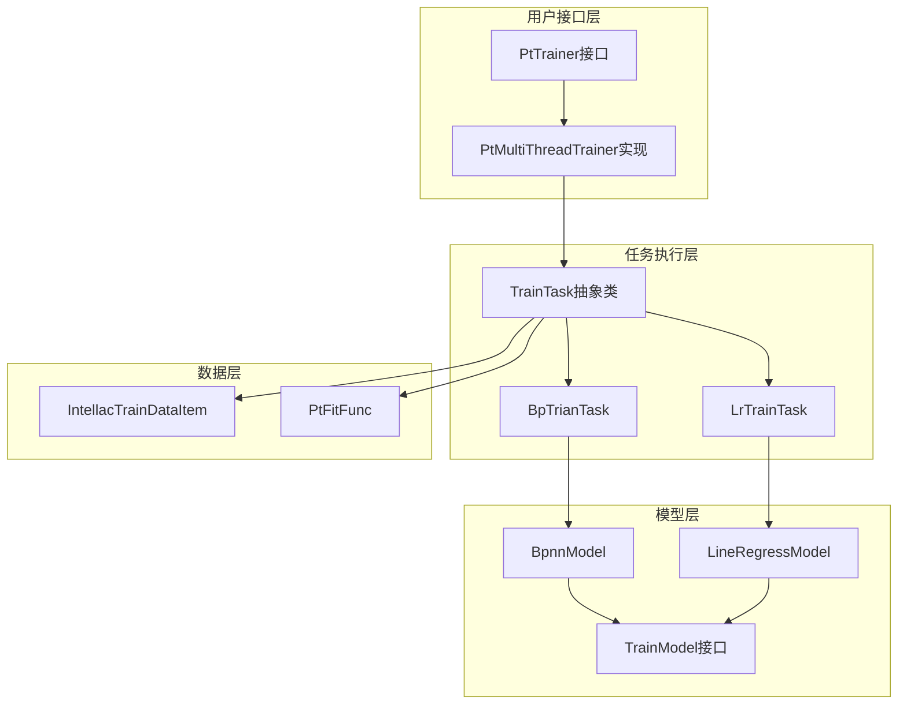
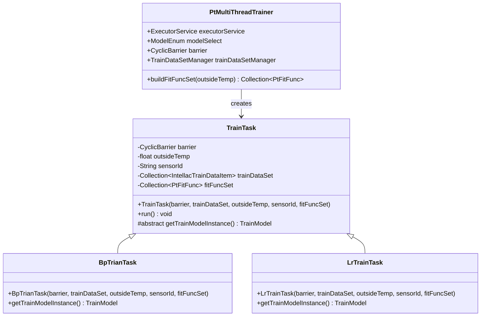
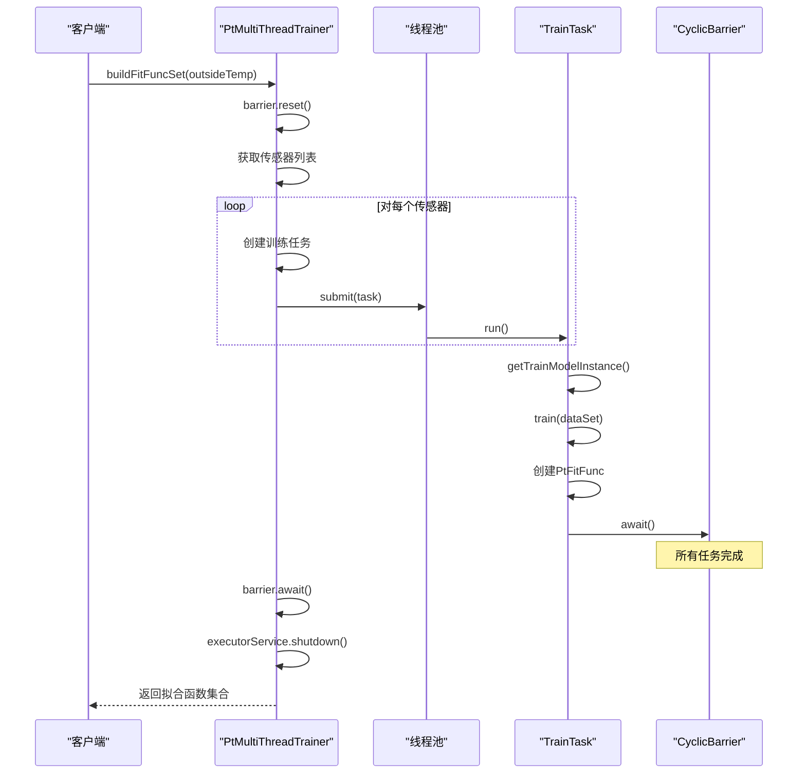
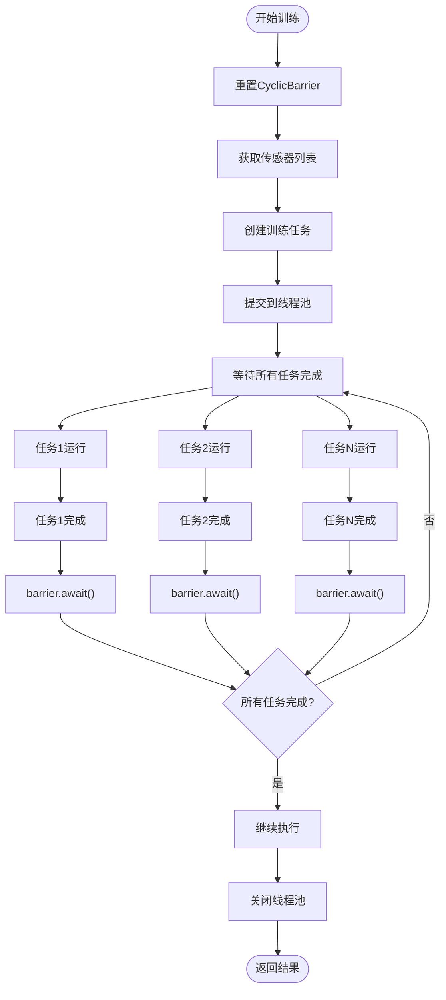
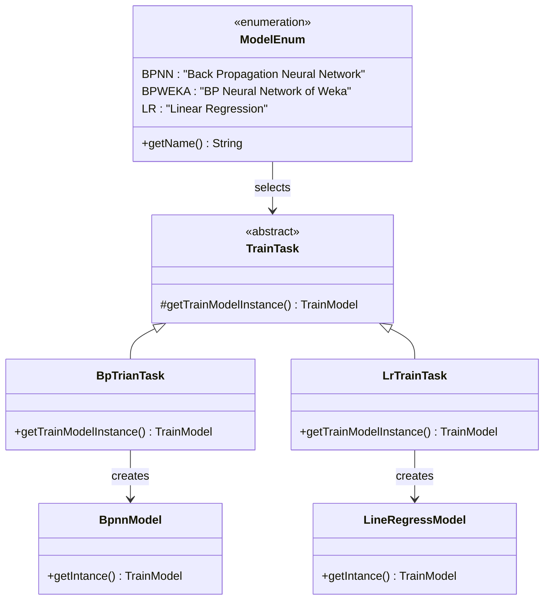
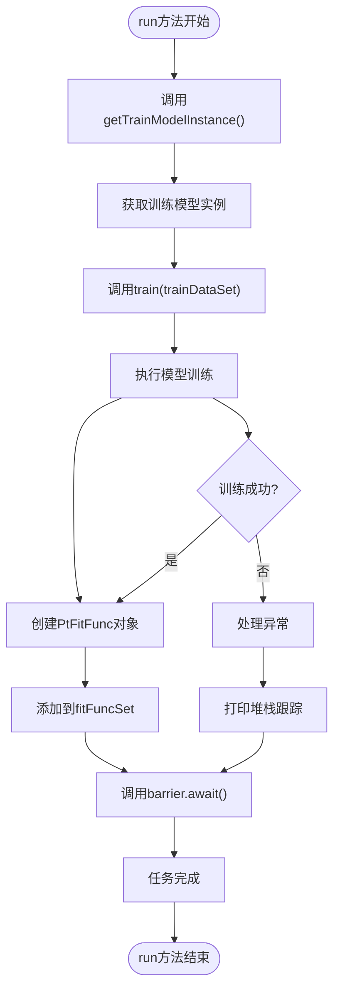
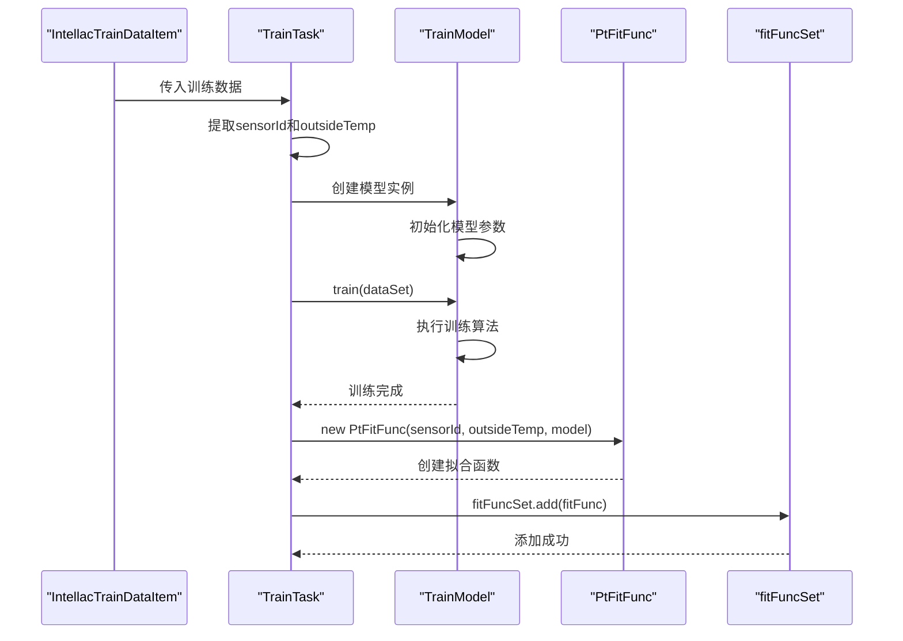

# 训练任务执行机制

<cite>
**本文档引用的文件**
- [TrainTask.java](file://src/main/java/com/leavesfly/iac/train/trainer/TrainTask.java)
- [ModelEnum.java](file://src/main/java/com/leavesfly/iac/train/trainer/ModelEnum.java)
- [PtMultiThreadTrainer.java](file://src/main/java/com/leavesfly/iac/train/trainer/PtMultiThreadTrainer.java)
- [BpTrianTask.java](file://src/main/java/com/leavesfly/iac/train/trainer/bp/BpTrianTask.java)
- [LrTrainTask.java](file://src/main/java/com/leavesfly/iac/train/trainer/lr/LrTrainTask.java)
- [TrainModel.java](file://src/main/java/com/leavesfly/iac/train/trainer/TrainModel.java)
- [BpnnModel.java](file://src/main/java/com/leavesfly/iac/train/trainer/bp/BpnnModel.java)
- [LineRegressModel.java](file://src/main/java/com/leavesfly/iac/train/trainer/lr/LineRegressModel.java)
- [IntellacTrainDataItem.java](file://src/main/java/com/leavesfly/iac/train/domain/IntellacTrainDataItem.java)
- [PtFitFunc.java](file://src/main/java/com/leavesfly/iac/domain/PtFitFunc.java)
</cite>

## 目录
1. [简介](#简介)
2. [项目架构概览](#项目架构概览)
3. [核心组件分析](#核心组件分析)
4. [多线程执行机制](#多线程执行机制)
5. [CyclicBarrier同步机制](#cyclicbarrier同步机制)
6. [模型类型与扩展性](#模型类型与扩展性)
7. [训练流程详解](#训练流程详解)
8. [性能优化建议](#性能优化建议)
9. [故障排除指南](#故障排除指南)
10. [总结](#总结)

## 简介

本系统是一个智能空调训练框架，专门设计用于并行训练多个传感器的功率-温度模型。通过多线程执行机制和CyclicBarrier同步栅栏，系统能够高效地协调多个训练任务，确保所有传感器模型训练完成后才继续后续流程。

该系统的核心设计理念是通过抽象工厂模式和模板方法模式，将不同类型的机器学习模型（如BP神经网络、线性回归等）统一到相同的训练框架中，同时保持良好的可扩展性和线程安全性。

## 项目架构概览

系统采用分层架构设计，主要包含以下层次：



**图表来源**
- [PtTrainer.java](file://src/main/java/com/leavesfly/iac/train/PtTrainer.java#L1-L20)
- [PtMultiThreadTrainer.java](file://src/main/java/com/leavesfly/iac/train/trainer/PtMultiThreadTrainer.java#L1-L50)
- [TrainTask.java](file://src/main/java/com/leavesfly/iac/train/trainer/TrainTask.java#L1-L30)

## 核心组件分析

### TrainTask抽象类

TrainTask是整个训练任务体系的核心抽象类，它实现了Runnable接口，表示一个可以在独立线程中执行的训练任务。



**图表来源**
- [TrainTask.java](file://src/main/java/com/leavesfly/iac/train/trainer/TrainTask.java#L15-L89)
- [BpTrianTask.java](file://src/main/java/com/leavesfly/iac/train/trainer/bp/BpTrianTask.java#L1-L23)
- [LrTrainTask.java](file://src/main/java/com/leavesfly/iac/train/trainer/lr/LrTrainTask.java#L1-L25)

**章节来源**
- [TrainTask.java](file://src/main/java/com/leavesfly/iac/train/trainer/TrainTask.java#L1-L89)
- [BpTrianTask.java](file://src/main/java/com/leavesfly/iac/train/trainer/bp/BpTrianTask.java#L1-L23)
- [LrTrainTask.java](file://src/main/java/com/leavesfly/iac/train/trainer/lr/LrTrainTask.java#L1-L25)

### 构造函数参数详解

TrainTask的构造函数接收五个关键参数：

1. **CyclicBarrier barrier**: 同步栅栏对象，用于协调多个训练线程
2. **Collection<IntellacTrainDataItem> trainDataSet**: 训练数据集，包含传感器的功率-温度数据
3. **float outsideTemp**: 室外温度，作为训练的环境条件
4. **String sensorId**: 传感器唯一标识符，用于区分不同的传感器
5. **Collection<PtFitFunc> fitFuncSet**: 拟合函数集合，存储训练完成后的模型

这些参数通过构造函数注入，确保了线程安全的访问方式。每个训练任务都有自己的独立副本，避免了线程间的数据竞争。

## 多线程执行机制

### 线程池配置

PtMultiThreadTrainer使用Java的Executors.newCachedThreadPool()创建线程池，这种配置具有以下特点：

- **动态线程管理**: 根据任务负载自动调整线程数量
- **资源高效利用**: 空闲线程会被回收，减少资源浪费
- **快速响应**: 新任务可以立即获得可用线程



**图表来源**
- [PtMultiThreadTrainer.java](file://src/main/java/com/leavesfly/iac/train/trainer/PtMultiThreadTrainer.java#L60-L113)

**章节来源**
- [PtMultiThreadTrainer.java](file://src/main/java/com/leavesfly/iac/train/trainer/PtMultiThreadTrainer.java#L40-L113)

### 并行训练策略

系统采用基于传感器的并行训练策略：

1. **数据分片**: 每个传感器的数据单独提取，形成独立的训练数据集
2. **任务隔离**: 每个传感器对应一个独立的TrainTask实例
3. **资源分配**: 线程池自动分配线程给各个训练任务
4. **结果聚合**: 所有训练完成后，将结果收集到统一的集合中

## CyclicBarrier同步机制

### 同步栅栏的作用

CyclicBarrier在系统中扮演着关键的同步角色：



**图表来源**
- [TrainTask.java](file://src/main/java/com/leavesfly/iac/train/trainer/TrainTask.java#L60-L75)
- [PtMultiThreadTrainer.java](file://src/main/java/com/leavesfly/iac/train/trainer/PtMultiThreadTrainer.java#L95-L105)

### 同步机制的优势

1. **精确同步**: 确保所有传感器模型训练完成后才继续
2. **错误处理**: 如果某个任务失败，整个同步过程会抛出异常
3. **循环使用**: CyclicBarrier可以重复使用，支持多次训练
4. **超时保护**: 可以设置超时时间，防止死锁

**章节来源**
- [TrainTask.java](file://src/main/java/com/leavesfly/iac/train/trainer/TrainTask.java#L60-L75)
- [PtMultiThreadTrainer.java](file://src/main/java/com/leavesfly/iac/train/trainer/PtMultiThreadTrainer.java#L95-L105)

## 模型类型与扩展性

### ModelEnum枚举类

系统通过ModelEnum枚举类定义了支持的模型类型：



**图表来源**
- [ModelEnum.java](file://src/main/java/com/leavesfly/iac/train/trainer/ModelEnum.java#L1-L47)
- [BpTrianTask.java](file://src/main/java/com/leavesfly/iac/train/trainer/bp/BpTrianTask.java#L15-L20)
- [LrTrainTask.java](file://src/main/java/com/leavesfly/iac/train/trainer/lr/LrTrainTask.java#L15-L20)

### 扩展性设计

系统的扩展性体现在以下几个方面：

1. **接口驱动**: 所有模型都实现TrainModel接口
2. **工厂模式**: 每种模型都有对应的工厂方法
3. **配置化**: 通过ModelEnum轻松切换不同模型
4. **插件化**: 新模型只需实现TrainModel接口即可集成

**章节来源**
- [ModelEnum.java](file://src/main/java/com/leavesfly/iac/train/trainer/ModelEnum.java#L1-L47)
- [TrainModel.java](file://src/main/java/com/leavesfly/iac/train/trainer/TrainModel.java#L1-L35)

## 训练流程详解

### run方法执行流程

TrainTask的run方法实现了完整的训练流程：



**图表来源**
- [TrainTask.java](file://src/main/java/com/leavesfly/iac/train/trainer/TrainTask.java#L60-L75)

### 异常处理机制

系统提供了完善的异常处理机制：

1. **InterruptedException**: 当线程被中断时抛出
2. **BrokenBarrierException**: 当同步栅栏损坏时抛出
3. **错误恢复**: 异常发生时打印堆栈跟踪，但不会终止整个训练过程

**章节来源**
- [TrainTask.java](file://src/main/java/com/leavesfly/iac/train/trainer/TrainTask.java#L60-L75)

### 数据流分析

训练过程中的数据流向如下：



**图表来源**
- [TrainTask.java](file://src/main/java/com/leavesfly/iac/train/trainer/TrainTask.java#L60-L75)
- [PtFitFunc.java](file://src/main/java/com/leavesfly/iac/domain/PtFitFunc.java#L25-L35)

**章节来源**
- [TrainTask.java](file://src/main/java/com/leavesfly/iac/train/trainer/TrainTask.java#L60-L75)
- [PtFitFunc.java](file://src/main/java/com/leavesfly/iac/domain/PtFitFunc.java#L1-L88)

## 性能优化建议

### 线程池配置优化

1. **固定大小线程池**: 对于已知的传感器数量，可以使用FixedThreadPool
   ```java
   executorService = Executors.newFixedThreadPool(sensorCount);
   ```

2. **带缓冲的线程池**: 适用于任务执行时间不均匀的情况
   ```java
   executorService = Executors.newCachedThreadPool();
   ```

3. **自定义线程工厂**: 控制线程属性和优先级
   ```java
   ThreadFactory factory = new ThreadFactory() {
       public Thread newThread(Runnable r) {
           Thread t = new Thread(r);
           t.setPriority(Thread.NORM_PRIORITY);
           return t;
       }
   };
   executorService = Executors.newCachedThreadPool(factory);
   ```

### 数据分片策略

1. **按传感器分片**: 每个传感器独立训练，避免数据竞争
2. **按时间窗口分片**: 将历史数据按时间段分割
3. **按地理位置分片**: 根据传感器分布进行空间划分

### 内存使用控制

1. **及时释放资源**: 训练完成后及时清理临时数据
2. **使用弱引用**: 对大型数据结构使用WeakReference
3. **监控内存使用**: 定期检查内存占用情况

### 并行度调优

1. **CPU密集型任务**: 线程数 = CPU核心数 + 1
2. **IO密集型任务**: 线程数 = CPU核心数 × 2
3. **混合任务**: 根据实际测试调整

## 故障排除指南

### 常见问题及解决方案

1. **线程阻塞**
   - 症状: 程序卡在barrier.await()处
   - 原因: 某些任务未能正常完成
   - 解决: 检查任务日志，确认异常处理

2. **内存溢出**
   - 症状: OutOfMemoryError异常
   - 原因: 数据集过大或模型复杂度过高
   - 解决: 减少数据集大小或简化模型

3. **训练不收敛**
   - 症状: 模型训练结果不稳定
   - 原因: 学习率设置不当或数据质量问题
   - 解决: 调整学习参数，清洗数据

### 调试技巧

1. **启用详细日志**: 在关键步骤添加日志输出
2. **使用断点调试**: 在IDE中设置断点跟踪执行流程
3. **性能分析**: 使用JProfiler等工具分析性能瓶颈
4. **单元测试**: 为每个组件编写独立的单元测试

**章节来源**
- [TrainTask.java](file://src/main/java/com/leavesfly/iac/train/trainer/TrainTask.java#L70-L75)

## 总结

本系统通过精心设计的多线程训练框架，实现了高效、可靠的传感器模型训练。其核心优势包括：

1. **高效的并行处理**: 通过CyclicBarrier确保精确同步，充分利用多核CPU性能
2. **灵活的模型支持**: 支持BP神经网络、线性回归等多种模型类型
3. **良好的扩展性**: 易于添加新的模型类型和训练算法
4. **完善的异常处理**: 提供健壮的错误处理和恢复机制

该系统为智能空调应用提供了强大的机器学习训练能力，能够适应不同规模和复杂度的训练需求。通过合理的性能优化和故障排除策略，可以确保系统在生产环境中的稳定运行。

未来的改进方向包括：
- 支持更多的机器学习模型类型
- 实现动态负载均衡
- 增强监控和诊断功能
- 优化内存使用效率