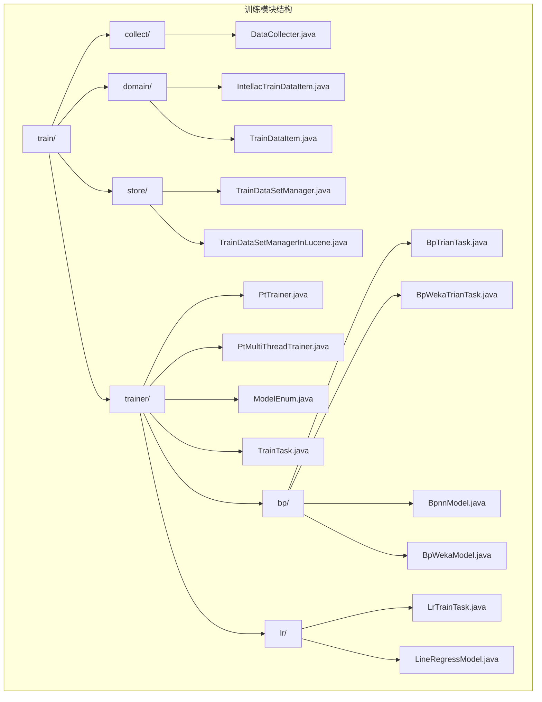
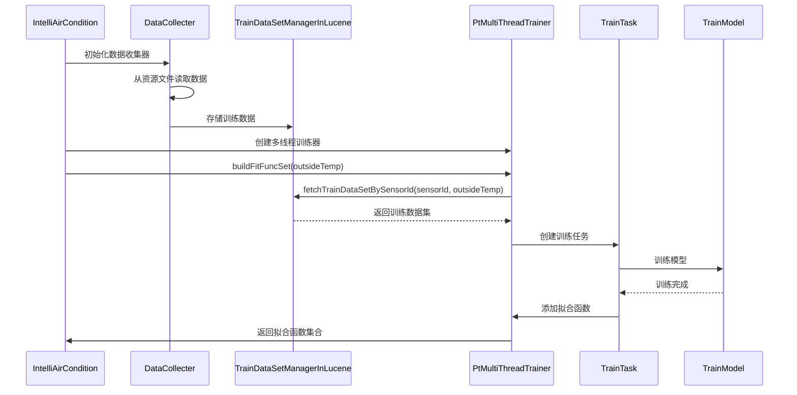
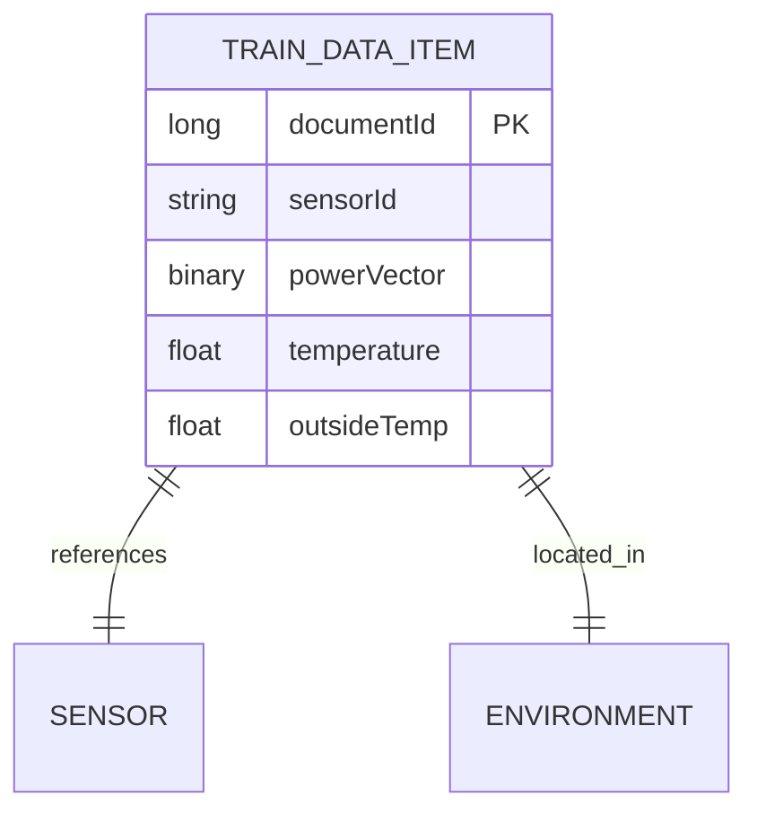
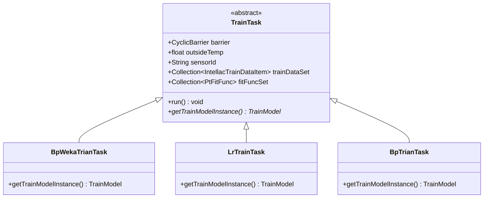
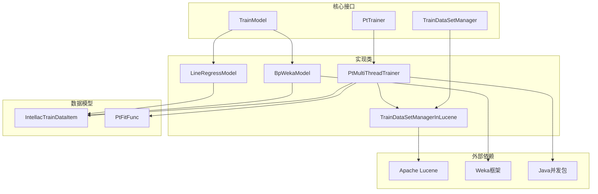

# 训练模块

<cite>
**本文档引用的文件**
- [PtTrainer.java](file://src/main/java/com/leavesfly/iac/train/PtTrainer.java)
- [PtMultiThreadTrainer.java](file://src/main/java/com/leavesfly/iac/train/trainer/PtMultiThreadTrainer.java)
- [TrainDataSetManagerInLucene.java](file://src/main/java/com/leavesfly/iac/train/store/TrainDataSetManagerInLucene.java)
- [DataCollecter.java](file://src/main/java/com/leavesfly/iac/train/collect/DataCollecter.java)
- [IntellacTrainDataItem.java](file://src/main/java/com/leavesfly/iac/train/domain/IntellacTrainDataItem.java)
- [TrainTask.java](file://src/main/java/com/leavesfly/iac/train/trainer/TrainTask.java)
- [BpWekaTrianTask.java](file://src/main/java/com/leavesfly/iac/train/trainer/bp/BpWekaTrianTask.java)
- [LrTrainTask.java](file://src/main/java/com/leavesfly/iac/train/trainer/lr/LrTrainTask.java)
- [PtFitFunc.java](file://src/main/java/com/leavesfly/iac/domain/PtFitFunc.java)
- [IntelliAirCondition.java](file://src/main/java/com/leavesfly/iac/IntelliAirCondition.java)
</cite>

## 目录
1. [简介](#简介)
2. [项目结构](#项目结构)
3. [核心组件](#核心组件)
4. [架构概览](#架构概览)
5. [详细组件分析](#详细组件分析)
6. [依赖关系分析](#依赖关系分析)
7. [性能考虑](#性能考虑)
8. [故障排除指南](#故障排除指南)
9. [结论](#结论)

## 简介

训练模块是智能空调仿真平台的核心组件之一，负责收集、存储和处理历史功率-温度数据，为系统提供精确的温度预测能力。该模块采用多线程并行训练策略，支持BP神经网络和线性回归两种算法模型，通过Weka框架集成BP神经网络训练，并利用Lucene索引技术实现高效的数据存储与检索。

训练模块的主要功能包括：
- 从资源文件中收集历史功率-温度数据
- 使用TrainDataSetManagerInLucene进行高效存储与检索
- 基于指定室外温度为每个传感器节点训练功率-温度拟合函数
- 支持多线程并行训练提高效率
- 提供灵活的模型选择机制

## 项目结构

训练模块的文件组织遵循分层架构设计，主要分为以下几个层次：



**图表来源**
- [PtTrainer.java](file://src/main/java/com/leavesfly/iac/train/PtTrainer.java#L1-L20)
- [PtMultiThreadTrainer.java](file://src/main/java/com/leavesfly/iac/train/trainer/PtMultiThreadTrainer.java#L1-L50)
- [TrainDataSetManagerInLucene.java](file://src/main/java/com/leavesfly/iac/train/store/TrainDataSetManagerInLucene.java#L1-L50)

## 核心组件

### PtTrainer接口

PtTrainer接口定义了功率-温度训练器的基本功能，是整个训练模块的核心抽象：

```java
public interface PtTrainer {
    public Collection<PtFitFunc> buildFitFuncSet(float outsideTemp);
}
```

该接口的核心方法`buildFitFuncSet`接受室外温度参数，返回对应传感器节点的功率-温度拟合函数集合。这种设计允许不同的训练器实现采用不同的算法和策略。

### PtMultiThreadTrainer实现类

PtMultiThreadTrainer是PtTrainer接口的具体实现，提供了多线程并行训练的能力：

```java
public class PtMultiThreadTrainer implements PtTrainer {
    public final ExecutorService executorService;
    public final ModelEnum modelSelect;
    public final CyclicBarrier barrier;
    private TrainDataSetManager trainDataSetManager;
}
```

该类使用线程池和CyclicBarrier实现多线程同步，能够同时训练多个传感器的模型，显著提高训练效率。

**章节来源**
- [PtTrainer.java](file://src/main/java/com/leavesfly/iac/train/PtTrainer.java#L1-L20)
- [PtMultiThreadTrainer.java](file://src/main/java/com/leavesfly/iac/train/trainer/PtMultiThreadTrainer.java#L1-L114)

## 架构概览

训练模块的整体架构采用分层设计，各组件职责明确，相互协作：



**图表来源**
- [IntelliAirCondition.java](file://src/main/java/com/leavesfly/iac/IntelliAirCondition.java#L60-L85)
- [PtMultiThreadTrainer.java](file://src/main/java/com/leavesfly/iac/train/trainer/PtMultiThreadTrainer.java#L50-L90)
- [TrainDataSetManagerInLucene.java](file://src/main/java/com/leavesfly/iac/train/store/TrainDataSetManagerInLucene.java#L80-L120)

## 详细组件分析

### 数据收集组件

#### DataCollecter类

DataCollecter负责从资源文件中收集历史功率-温度数据，支持批量读取和定时收集两种模式：

```java
public class DataCollecter {
    private TrainDataSetManager trainDataSetManager;
    private BufferedReader bufferedReader;
    private Timer timer;
    
    public Collection<IntellacTrainDataItem> collectTrainDataItemFromTxt() {
        List<IntellacTrainDataItem> trainDatas = new ArrayList<>();
        IntellacTrainDataItem trainDataItem = collectOneTrainDataItemFromTxt();
        while (trainDataItem != null) {
            trainDatas.add(trainDataItem);
            trainDataItem = collectOneTrainDataItemFromTxt();
        }
        return trainDatas;
    }
}
```

该类提供了灵活的数据收集机制，既可以一次性加载所有数据，也可以通过定时任务动态收集新数据。

#### IntellacTrainDataItem数据模型

IntellacTrainDataItem是训练数据的标准表示形式，包含了传感器ID、功率向量、温度和室外温度等关键信息：

```java
public class IntellacTrainDataItem implements TrainDataItem<Float, Float> {
    private String sensorId;
    private PowerVector powerVector;
    private float temperature;
    private float outsideTemp;
    
    @Override
    public Float[] getFeature() {
        return powerVector.getPowerValueFloatArray();
    }
    
    @Override
    public Float getResult() {
        return temperature;
    }
}
```

**章节来源**
- [DataCollecter.java](file://src/main/java/com/leavesfly/iac/train/collect/DataCollecter.java#L1-L253)
- [IntellacTrainDataItem.java](file://src/main/java/com/leavesfly/iac/train/domain/IntellacTrainDataItem.java#L1-L151)

### 数据存储与检索组件

#### TrainDataSetManagerInLucene实现

TrainDataSetManagerInLucene使用Apache Lucene内存索引技术实现高效的数据存储与检索：

```java
public class TrainDataSetManagerInLucene implements TrainDataSetManager {
    private static IndexWriter indexWriter;
    private static Directory directory;
    private static volatile IndexSearcher indexSearcher;
    
    @Override
    public Collection<IntellacTrainDataItem> fetchTrainDataSetBySensorId(String sensorId, float outsideTemp) {
        TermQuery sensorIdTermQuery = new TermQuery(new Term(SENSOR_ID_FILED, sensorId));
        Query outsideTempQuery = NumericRangeQuery.newFloatRange(OUTSIDE_TEMP_FILED, outsideTemp, outsideTemp, true, true);
        
        BooleanQuery booleanQuery = new BooleanQuery();
        booleanQuery.add(sensorIdTermQuery, Occur.MUST);
        booleanQuery.add(outsideTempQuery, Occur.MUST);
        
        // 执行查询并返回结果
    }
}
```

该实现支持基于传感器ID和室外温度的快速检索，具有以下特点：
- 内存索引提供快速访问
- 支持复杂查询条件组合
- 序列化存储复杂对象
- 线程安全的设计

#### Lucene索引字段设计



**图表来源**
- [TrainDataSetManagerInLucene.java](file://src/main/java/com/leavesfly/iac/train/store/TrainDataSetManagerInLucene.java#L40-L80)

**章节来源**
- [TrainDataSetManagerInLucene.java](file://src/main/java/com/leavesfly/iac/train/store/TrainDataSetManagerInLucene.java#L1-L213)

### 训练任务组件

#### TrainTask抽象类

TrainTask是所有训练任务的基类，实现了Runnable接口，负责在线程中执行具体的训练工作：

```java
public abstract class TrainTask implements Runnable {
    private final CyclicBarrier barrier;
    private float outsideTemp;
    private String sensorId;
    private Collection<IntellacTrainDataItem> trainDataSet;
    private Collection<PtFitFunc> fitFuncSet;
    
    @Override
    public void run() {
        TrainModel trainModel = getTrainModelInstance();
        trainModel.train(trainDataSet);
        PtFitFunc fitFunc = new PtFitFunc(sensorId, outsideTemp, trainModel);
        fitFuncSet.add(fitFunc);
        try {
            barrier.await();
        } catch (Exception e) {
            e.printStackTrace();
        }
    }
    
    protected abstract TrainModel getTrainModelInstance();
}
```

#### 多种训练任务实现

系统提供了三种不同类型的训练任务：

1. **BpWekaTrianTask** - 基于Weka框架的BP神经网络训练
2. **LrTrainTask** - 线性回归模型训练
3. **BpTrianTask** - 传统的BP神经网络训练

每种任务都继承自TrainTask，通过重写`getTrainModelInstance`方法提供相应的训练模型实例。



**图表来源**
- [TrainTask.java](file://src/main/java/com/leavesfly/iac/train/trainer/TrainTask.java#L1-L90)
- [BpWekaTrianTask.java](file://src/main/java/com/leavesfly/iac/train/trainer/bp/BpWekaTrianTask.java#L1-L23)
- [LrTrainTask.java](file://src/main/java/com/leavesfly/iac/train/trainer/lr/LrTrainTask.java#L1-L25)

**章节来源**
- [TrainTask.java](file://src/main/java/com/leavesfly/iac/train/trainer/TrainTask.java#L1-L90)
- [BpWekaTrianTask.java](file://src/main/java/com/leavesfly/iac/train/trainer/bp/BpWekaTrianTask.java#L1-L23)
- [LrTrainTask.java](file://src/main/java/com/leavesfly/iac/train/trainer/lr/LrTrainTask.java#L1-L25)

### 拟合函数组件

#### PtFitFunc类

PtFitFunc表示传感器节点的功率-温度映射关系，是训练结果的最终表现形式：

```java
public class PtFitFunc {
    private String sensorId;
    private float outsideTemp;
    private TrainModel trainModel;
    
    public float calTemperature(PowerVector powerVector) {
        return trainModel.useMode(powerVector.getPowerValueFloatArray());
    }
}
```

该类封装了训练模型，提供了简洁的API来计算给定功率向量对应的温度值。

**章节来源**
- [PtFitFunc.java](file://src/main/java/com/leavesfly/iac/domain/PtFitFunc.java#L1-L88)

## 依赖关系分析

训练模块的依赖关系体现了清晰的分层架构：



**图表来源**
- [PtMultiThreadTrainer.java](file://src/main/java/com/leavesfly/iac/train/trainer/PtMultiThreadTrainer.java#L1-L30)
- [TrainDataSetManagerInLucene.java](file://src/main/java/com/leavesfly/iac/train/store/TrainDataSetManagerInLucene.java#L1-L50)

**章节来源**
- [PtMultiThreadTrainer.java](file://src/main/java/com/leavesfly/iac/train/trainer/PtMultiThreadTrainer.java#L1-L114)
- [TrainDataSetManagerInLucene.java](file://src/main/java/com/leavesfly/iac/train/store/TrainDataSetManagerInLucene.java#L1-L213)

## 性能考虑

### 多线程优化

PtMultiThreadTrainer采用多线程并行训练策略，通过以下机制提升性能：

1. **线程池管理** - 使用`Executors.newCachedThreadPool()`创建可缓存的线程池
2. **同步控制** - 使用CyclicBarrier确保所有训练任务完成后再返回结果
3. **并发集合** - 使用`synchronizedCollection`保证线程安全

### 数据存储优化

TrainDataSetManagerInLucene通过以下方式优化数据访问性能：

1. **内存索引** - 使用RAMDirectory减少磁盘I/O
2. **序列化存储** - 对复杂对象进行二进制序列化存储
3. **字段索引** - 为常用查询字段建立索引
4. **延迟初始化** - 搜索器采用延迟初始化策略

### 内存管理

系统采用了多种内存优化策略：

- 使用原子操作生成唯一文档ID
- 及时关闭索引写入器和搜索器
- 合理设置最大搜索结果数量限制

## 故障排除指南

### 常见训练问题及解决方案

#### 数据缺失问题

**问题描述**：训练数据不完整或缺失导致模型训练失败

**解决方案**：
1. 检查资源文件路径是否正确
2. 验证数据格式是否符合预期
3. 确认传感器ID和室外温度范围的有效性

```java
// 数据验证示例
public boolean validateTrainData(IntellacTrainDataItem item) {
    return item.getSensorId() != null && 
           item.getPowerVector() != null && 
           item.getTemperature() > 0 && 
           item.getOutsideTemp() != Float.NaN;
}
```

#### 模型收敛失败

**问题描述**：BP神经网络无法正常收敛

**解决方案**：
1. 调整学习率参数
2. 增加训练轮数
3. 检查输入数据归一化
4. 验证网络结构配置

#### 内存溢出问题

**问题描述**：大量训练数据导致内存不足

**解决方案**：
1. 分批处理大数据集
2. 使用磁盘索引替代内存索引
3. 优化对象序列化过程
4. 及时释放不再使用的资源

**章节来源**
- [DataCollecter.java](file://src/main/java/com/leavesfly/iac/train/collect/DataCollecter.java#L80-L120)
- [TrainDataSetManagerInLucene.java](file://src/main/java/com/leavesfly/iac/train/store/TrainDataSetManagerInLucene.java#L150-L200)

## 结论

训练模块是智能空调仿真平台的核心组件，通过精心设计的架构实现了高效的数据收集、存储、处理和模型训练功能。其主要优势包括：

1. **模块化设计** - 清晰的接口分离和实现，便于扩展和维护
2. **高性能** - 多线程并行训练和Lucene索引优化，显著提升处理效率
3. **灵活性** - 支持多种训练算法和模型选择
4. **可扩展性** - 易于添加新的训练模型和数据源

该模块为整个仿真平台提供了可靠的温度预测能力，是实现智能空调控制策略的基础。通过合理的配置和优化，能够满足大规模部署的需求，为用户提供准确、及时的温度预测服务。