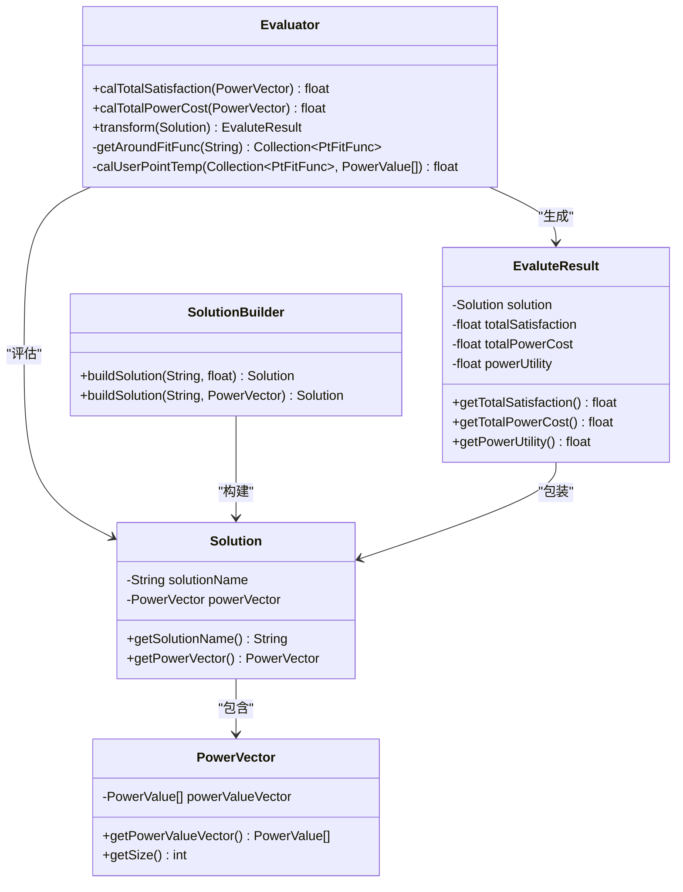
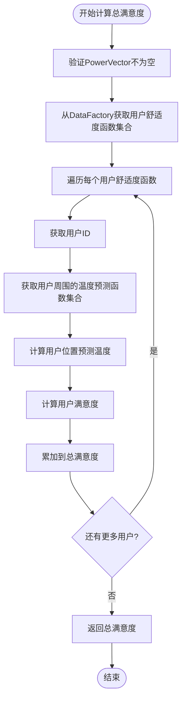
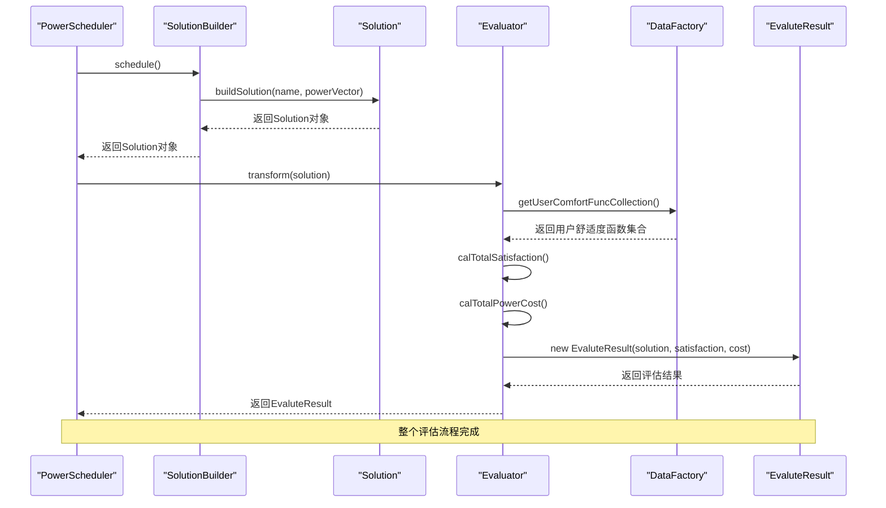
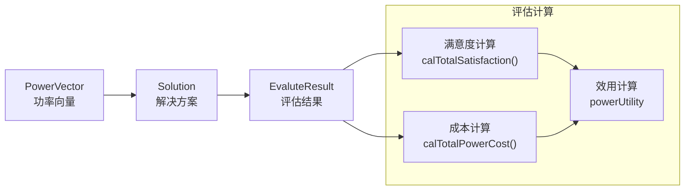

# 评估模块

<cite>
**本文档引用的文件**
- [Evaluator.java](file://src/main/java/com/leavesfly/iac/evalute/Evaluator.java)
- [Solution.java](file://src/main/java/com/leavesfly/iac/evalute/Solution.java)
- [EvaluteResult.java](file://src/main/java/com/leavesfly/iac/evalute/EvaluteResult.java)
- [SolutionBuilder.java](file://src/main/java/com/leavesfly/iac/evalute/SolutionBuilder.java)
- [PowerVector.java](file://src/main/java/com/leavesfly/iac/domain/PowerVector.java)
- [DataFactory.java](file://src/main/java/com/leavesfly/iac/datasource/DataFactory.java)
- [AppContextConstant.java](file://src/main/java/com/leavesfly/iac/config/AppContextConstant.java)
- [IntelliAirCondition.java](file://src/main/java/com/leavesfly/iac/IntelliAirCondition.java)
- [PowerScheduler.java](file://src/main/java/com/leavesfly/iac/execute/PowerScheduler.java)
- [PsoPowerScheduler.java](file://src/main/java/com/leavesfly/iac/execute/scheduler/PsoPowerScheduler.java)
</cite>

## 目录
1. [简介](#简介)
2. [核心组件概览](#核心组件概览)
3. [Evaluator类详细分析](#evaluator类详细分析)
4. [评估流程架构](#评估流程架构)
5. [数据流转分析](#数据流转分析)
6. [评估指标详解](#评估指标详解)
7. [性能考虑](#性能考虑)
8. [故障排除指南](#故障排除指南)
9. [总结](#总结)

## 简介

评估模块是智能空调仿真平台的核心组件之一，负责对空调功率调度方案进行全面评估。该模块通过计算用户满意度、用电成本和综合效用等关键指标，为优化算法提供决策依据。评估模块采用面向对象设计，主要由Evaluator类作为核心评估器，配合Solution、EvaluteResult等类实现完整的评估流程。

## 核心组件概览

评估模块包含以下核心组件：



**图表来源**
- [Evaluator.java](file://src/main/java/com/leavesfly/iac/evalute/Evaluator.java#L1-L123)
- [Solution.java](file://src/main/java/com/leavesfly/iac/evalute/Solution.java#L1-L59)
- [EvaluteResult.java](file://src/main/java/com/leavesfly/iac/evalute/EvaluteResult.java#L1-L105)
- [SolutionBuilder.java](file://src/main/java/com/leavesfly/iac/evalute/SolutionBuilder.java#L1-L46)
- [PowerVector.java](file://src/main/java/com/leavesfly/iac/domain/PowerVector.java#L1-L142)

## Evaluator类详细分析

Evaluator类是评估模块的核心，提供了三个关键的评估方法：

### calTotalSatisfaction方法

该方法负责计算用户总体满意度，是评估模块中最复杂的计算逻辑：

```java
public static float calTotalSatisfaction(PowerVector powerVector) {
    if (powerVector == null) {
        throw new IllegalArgumentException();
    }
    float satisfaction = 0f;
    PowerValue[] powerValueArray = powerVector.getPowerValueVector();

    Collection<UserComfortFunc> userComfortFuncSet = DataFactory.getInstance()
            .getUserComfortFuncCollection();
    for (UserComfortFunc userComfortFunc : userComfortFuncSet) {
        String userId = userComfortFunc.getUserId();
        Collection<PtFitFunc> sensorFuncSet = getAroundFitFunc(userId);
        float temperature = calUserPointTemp(sensorFuncSet, powerValueArray);
        satisfaction += userComfortFunc.calUserComfort(temperature);
    }
    return satisfaction;
}
```

#### 计算流程分解：

1. **输入验证**：检查PowerVector是否为空
2. **获取用户舒适度函数**：从DataFactory获取所有用户的舒适度函数集合
3. **逐用户计算**：
   - 获取用户ID
   - 获取用户周围的温度预测函数集合
   - 计算用户位置的预测温度
   - 根据舒适度函数计算用户满意度
4. **累加求和**：将所有用户的满意度相加得到总满意度



**图表来源**
- [Evaluator.java](file://src/main/java/com/leavesfly/iac/evalute/Evaluator.java#L25-L45)

### calTotalPowerCost方法

该方法计算总用电成本，实现简单但关键：

```java
public static float calTotalPowerCost(PowerVector powerVector) {
    if (powerVector == null) {
        throw new IllegalArgumentException();
    }
    float powerCost = 0.0f;
    PowerValue[] powerValueArray = powerVector.getPowerValueVector();
    for (PowerValue powerValue : powerValueArray) {
        powerCost += powerValue.getValue() * AppContextConstant.POWER_PRICE;
    }
    return powerCost;
}
```

该方法直接遍历功率向量中的每个功率值，乘以电价常量POWER_PRICE，然后累加得到总成本。

### transform方法

这是评估流程的入口点，将Solution对象转换为EvaluteResult对象：

```java
public static EvaluteResult transform(Solution solution) {
    PowerVector powerVector = solution.getPowerVector();
    float satisfaction = calTotalSatisfaction(powerVector);
    float powerCost = calTotalPowerCost(powerVector);
    return new EvaluteResult(solution, satisfaction, powerCost);
}
```

**节来源**
- [Evaluator.java](file://src/main/java/com/leavesfly/iac/evalute/Evaluator.java#L25-L123)

## 评估流程架构

评估模块的整体架构展示了各个组件之间的交互关系：



**图表来源**
- [IntelliAirCondition.java](file://src/main/java/com/leavesfly/iac/IntelliAirCondition.java#L95-L130)
- [Evaluator.java](file://src/main/java/com/leavesfly/iac/evalute/Evaluator.java#L105-L112)

## 数据流转分析

评估模块的数据流经以下关键节点：

### 1. PowerScheduler输出PowerVector

PowerScheduler接口定义了功率调度的基本功能，具体的实现类如PsoPowerScheduler使用PSO算法生成最优的功率向量配置。

### 2. SolutionBuilder构建Solution

SolutionBuilder根据不同的策略构建Solution对象：
- 基于统一温度值构建（适用于简单场景）
- 基于现有PowerVector构建（适用于复杂场景）

### 3. Evaluator.transform生成最终结果

Evaluator的transform方法是整个评估流程的核心，它串联了满意度计算和成本计算两个关键步骤。



**图表来源**
- [Evaluator.java](file://src/main/java/com/leavesfly/iac/evalute/Evaluator.java#L105-L112)
- [SolutionBuilder.java](file://src/main/java/com/leavesfly/iac/evalute/SolutionBuilder.java#L15-L45)

**节来源**
- [IntelliAirCondition.java](file://src/main/java/com/leavesfly/iac/IntelliAirCondition.java#L95-L130)
- [Evaluator.java](file://src/main/java/com/leavesfly/iac/evalute/Evaluator.java#L105-L112)

## 评估指标详解

### 总满意度（totalSatisfaction）

总满意度反映了用户在空调系统运行期间的舒适程度。计算公式如下：

1. **用户舒适度函数**：每个用户都有自己的舒适度函数，描述温度与舒适度的关系
2. **预测温度计算**：通过用户周围的传感器温度预测函数，结合功率向量计算用户位置的预测温度
3. **满意度累加**：将所有用户的满意度相加得到总满意度

**业务含义**：
- 值越高表示用户舒适度越好
- 典型数值范围：0.0-100.0（取决于具体实现）
- 影响因素：空调功率分配、传感器分布、用户位置

### 总用电成本（totalPowerCost）

总用电成本是衡量空调系统经济性的关键指标：

```java
powerCost += powerValue.getValue() * AppContextConstant.POWER_PRICE;
```

其中POWER_PRICE是电价常量，默认值为1.0元/千瓦时。

**业务含义**：
- 值越低表示运行成本越低
- 典型数值范围：根据空调数量和功率配置而定
- 影响因素：空调功率设置、运行时间、电价

### 功率效用（powerUtility）

功率效用是综合满意度和成本的权衡指标：

```java
powerUtility = (totalSatisfaction / totalPowerCost) * AppContextConstant.POWER_UTILITY_UNIT;
```

POWER_UTILITY_UNIT默认值为1000，用于标准化效用值。

**业务含义**：
- 值越高表示每单位成本获得的满意度越高
- 典型数值范围：根据具体场景而定
- 影响因素：满意度计算精度、成本计算准确性、效用单位设置

**节来源**
- [Evaluator.java](file://src/main/java/com/leavesfly/iac/evalute/Evaluator.java#L25-L123)
- [EvaluteResult.java](file://src/main/java/com/leavesfly/iac/evalute/EvaluteResult.java#L25-L45)
- [AppContextConstant.java](file://src/main/java/com/leavesfly/iac/config/AppContextConstant.java#L85-L95)

## 性能考虑

评估模块在设计时考虑了以下几个性能方面：

### 1. 单例模式优化

DataFactory采用双重检查锁定的单例模式，确保全局唯一实例，避免重复加载数据：

```java
public static DataFactory getInstance() {
    if (dataFactory != null) {
        return dataFactory;
    } else {
        synchronized (DataFactory.class) {
            if (dataFactory == null) {
                dataFactory = new DataFactory();
            }
        }
    }
    return dataFactory;
}
```

### 2. 延迟初始化

用户舒适度函数和传感器数据采用延迟初始化策略，只有在需要时才加载：

```java
public Collection<UserComfortFunc> getUserComfortFuncCollection() {
    if (userComfortFuncSet != null) {
        return userComfortFuncSet;
    }
    synchronized (this) {
        if (userComfortFuncSet == null) {
            // 初始化逻辑
        }
    }
    return userComfortFuncSet;
}
```

### 3. 并行处理

在IntelliAirCondition的调度阶段，使用线程池并行执行多个评估任务：

```java
ExecutorService executorService = Executors.newCachedThreadPool();
CountDownLatch latch = new CountDownLatch(3);
```

这种设计可以显著提高大规模评估任务的执行效率。

### 4. 内存优化

- 使用volatile关键字确保多线程环境下的可见性
- 采用同步的LinkedHashMap存储评估结果，保证线程安全
- 合理使用Collections.synchronizedMap包装集合

## 故障排除指南

### 常见问题及解决方案

#### 1. NullPointerException

**问题描述**：在calTotalSatisfaction或calTotalPowerCost方法中抛出空指针异常

**可能原因**：
- PowerVector对象为null
- DataFactory未正确初始化
- 用户舒适度函数集合为空

**解决方案**：
```java
// 在调用前进行空值检查
if (powerVector == null) {
    throw new IllegalArgumentException("PowerVector cannot be null");
}
```

#### 2. 数据加载失败

**问题描述**：无法加载用户舒适度函数或传感器数据

**可能原因**：
- 配置文件路径错误
- 文件格式不正确
- 权限不足

**解决方案**：
- 检查AppContextConstant中定义的文件名是否正确
- 验证文件格式符合预期
- 确保程序有读取文件的权限

#### 3. 评估结果异常

**问题描述**：评估结果出现不合理值（如负数、极大值）

**可能原因**：
- 电价常量设置错误
- 温度预测函数异常
- 用户舒适度函数计算错误

**解决方案**：
- 验证AppContextConstant.POWER_PRICE设置
- 检查温度预测模型的有效性
- 验证用户舒适度函数的数学表达式

**节来源**
- [Evaluator.java](file://src/main/java/com/leavesfly/iac/evalute/Evaluator.java#L25-L45)
- [DataFactory.java](file://src/main/java/com/leavesfly/iac/datasource/DataFactory.java#L85-L105)

## 总结

评估模块是智能空调仿真平台的核心组件，通过Evaluator类实现了完整的评估流程。该模块具有以下特点：

### 主要优势

1. **模块化设计**：清晰的职责分离，便于维护和扩展
2. **高性能实现**：采用单例模式、延迟初始化等优化策略
3. **线程安全**：支持多线程并发执行评估任务
4. **可扩展性**：易于添加新的评估指标和计算方法

### 关键特性

1. **用户满意度计算**：通过舒适度函数和温度预测精确计算用户舒适度
2. **成本效益分析**：综合考虑用电成本和满意度，提供权衡指标
3. **灵活的解决方案构建**：支持多种方式构建评估方案
4. **完整的评估结果**：提供满意度、成本和效用的完整评估报告

### 应用价值

评估模块为智能空调系统的优化提供了科学的决策依据，帮助系统在满足用户舒适度要求的同时，实现能源的高效利用。通过合理的参数设置和算法优化，该模块能够支持大规模的空调系统仿真和优化应用。