# 系统工作流程

<cite>
**本文档引用的文件**
- [IntelliAirCondition.java](file://src/main/java/com/leavesfly/iac/IntelliAirCondition.java)
- [DataFactory.java](file://src/main/java/com/leavesfly/iac/datasource/DataFactory.java)
- [PtTrainer.java](file://src/main/java/com/leavesfly/iac/train/PtTrainer.java)
- [DataCollecter.java](file://src/main/java/com/leavesfly/iac/train/collect/DataCollecter.java)
- [TrainDataSetManager.java](file://src/main/java/com/leavesfly/iac/train/store/TrainDataSetManager.java)
- [PtMultiThreadTrainer.java](file://src/main/java/com/leavesfly/iac/train/trainer/PtMultiThreadTrainer.java)
- [PowerScheduler.java](file://src/main/java/com/leavesfly/iac/execute/PowerScheduler.java)
- [PsoPowerScheduler.java](file://src/main/java/com/leavesfly/iac/execute/scheduler/PsoPowerScheduler.java)
- [Evaluator.java](file://src/main/java/com/leavesfly/iac/evalute/Evaluator.java)
- [PtFitFunc.java](file://src/main/java/com/leavesfly/iac/domain/PtFitFunc.java)
- [PowerVector.java](file://src/main/java/com/leavesfly/iac/domain/PowerVector.java)
- [AppContextConstant.java](file://src/main/java/com/leavesfly/iac/config/AppContextConstant.java)
</cite>

## 目录
1. [简介](#简介)
2. [系统架构概览](#系统架构概览)
3. [训练阶段详细分析](#训练阶段详细分析)
4. [调度阶段详细分析](#调度阶段详细分析)
5. [展示阶段详细分析](#展示阶段详细分析)
6. [DataFactory核心作用](#datafactory核心作用)
7. [数据流分析](#数据流分析)
8. [性能考虑](#性能考虑)
9. [总结](#总结)

## 简介

IntelliAirCondition是一个智能空调仿真平台，通过三个主要阶段实现空调系统的优化调度：训练阶段、调度阶段和展示阶段。该系统采用模块化设计，以DataFactory为核心数据中枢，管理用户、传感器、函数、结果等所有数据的生命周期。

## 系统架构概览

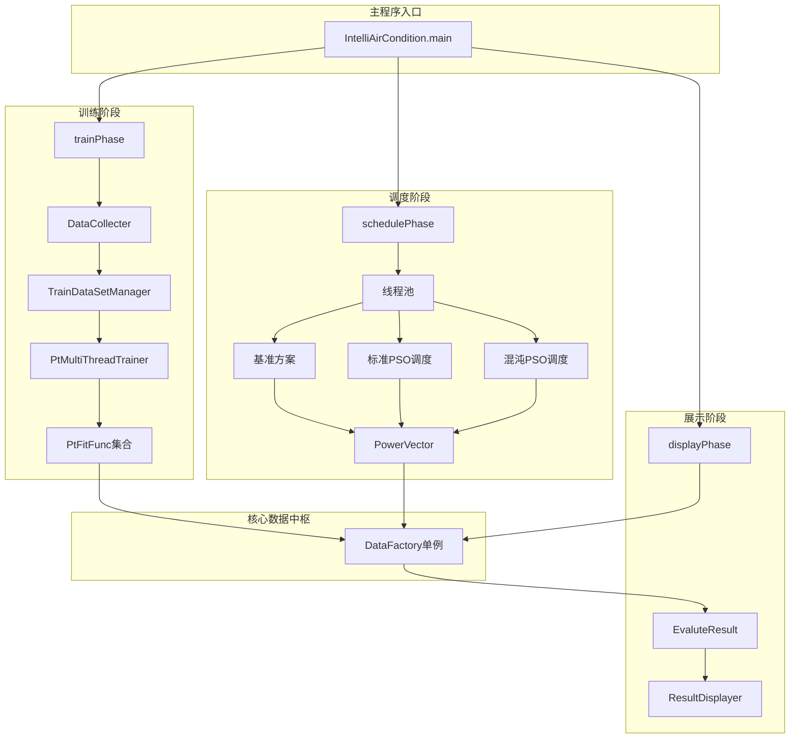

**图表来源**
- [IntelliAirCondition.java](file://src/main/java/com/leavesfly/iac/IntelliAirCondition.java#L35-L187)
- [DataFactory.java](file://src/main/java/com/leavesfly/iac/datasource/DataFactory.java#L1-L431)

## 训练阶段详细分析

训练阶段是系统的基础，负责建立温度预测模型。该阶段包含四个关键步骤：

### 1. 数据收集阶段

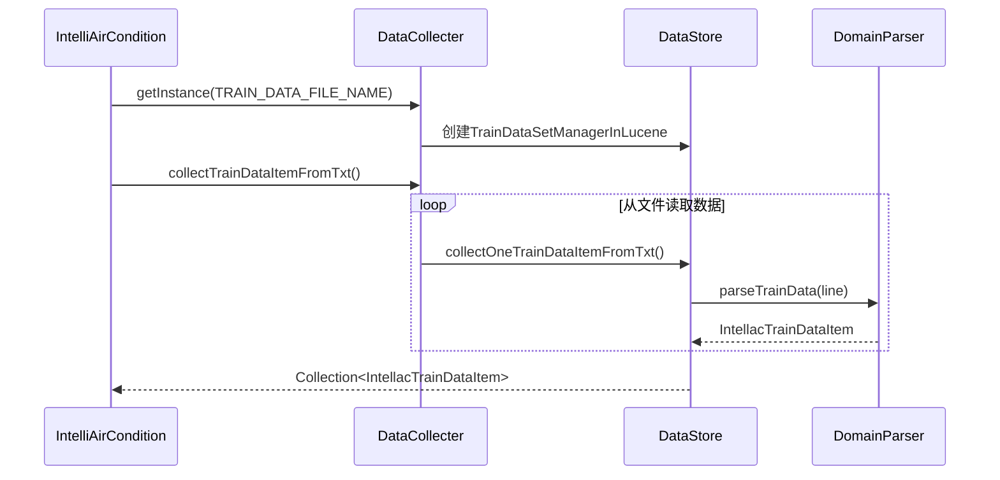

**图表来源**
- [IntelliAirCondition.java](file://src/main/java/com/leavesfly/iac/IntelliAirCondition.java#L50-L65)
- [DataCollecter.java](file://src/main/java/com/leavesfly/iac/train/collect/DataCollecter.java#L80-L100)

### 2. 数据存储阶段

训练数据被存储到TrainDataSetManager中，该接口提供了灵活的数据存储和检索能力：

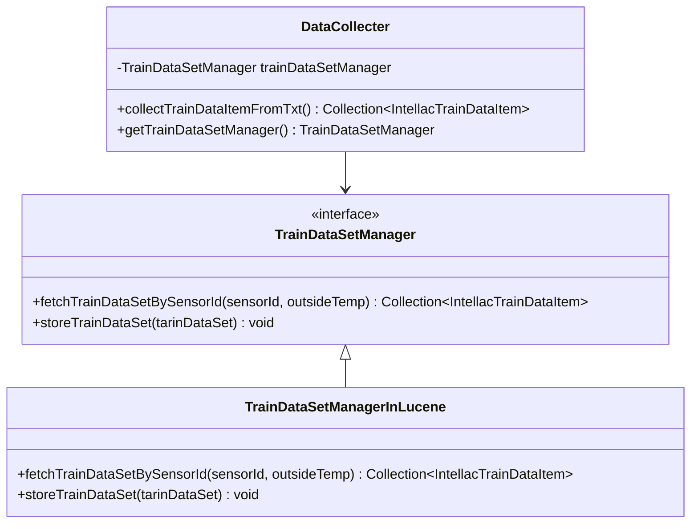

**图表来源**
- [TrainDataSetManager.java](file://src/main/java/com/leavesfly/iac/train/store/TrainDataSetManager.java#L1-L31)
- [DataCollecter.java](file://src/main/java/com/leavesfly/iac/train/collect/DataCollecter.java#L20-L30)

### 3. 模型训练阶段

系统使用多线程并行训练多个传感器的功率-温度模型：

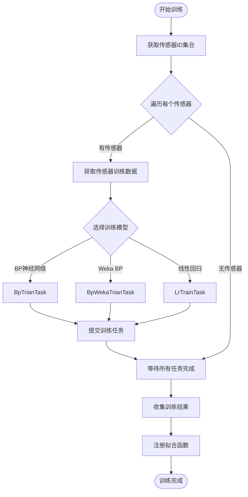

**图表来源**
- [PtMultiThreadTrainer.java](file://src/main/java/com/leavesfly/iac/train/trainer/PtMultiThreadTrainer.java#L50-L90)

### 4. 模型注册阶段

训练完成的PtFitFunc集合被注册到DataFactory中，供后续调度阶段使用：

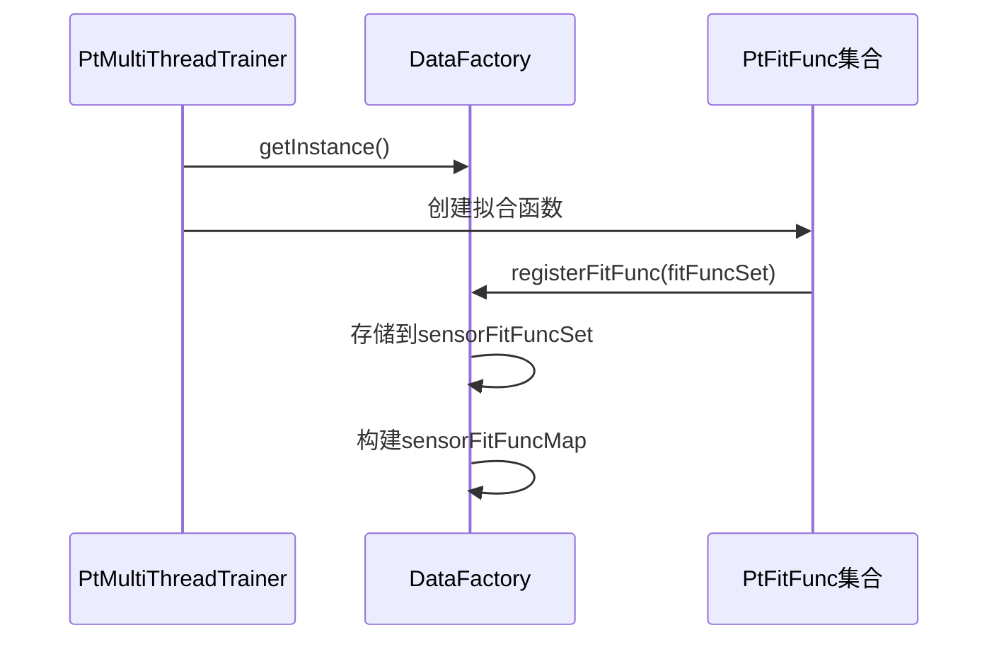

**图表来源**
- [IntelliAirCondition.java](file://src/main/java/com/leavesfly/iac/IntelliAirCondition.java#L70-L75)
- [DataFactory.java](file://src/main/java/com/leavesfly/iac/datasource/DataFactory.java#L200-L220)

**章节来源**
- [IntelliAirCondition.java](file://src/main/java/com/leavesfly/iac/IntelliAirCondition.java#L45-L80)
- [DataCollecter.java](file://src/main/java/com/leavesfly/iac/train/collect/DataCollecter.java#L1-L253)
- [PtMultiThreadTrainer.java](file://src/main/java/com/leavesfly/iac/train/trainer/PtMultiThreadTrainer.java#L1-L114)

## 调度阶段详细分析

调度阶段是系统的核心，使用线程池并行执行三种不同的调度算法：

### 1. 线程池架构

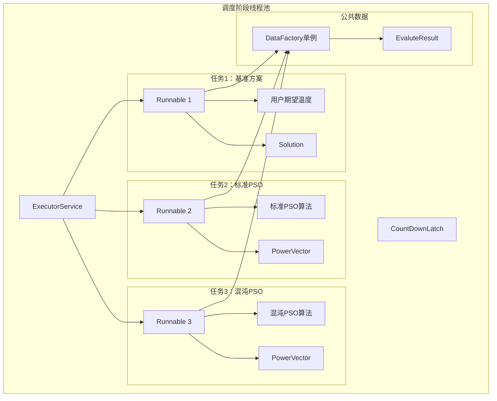

**图表来源**
- [IntelliAirCondition.java](file://src/main/java/com/leavesfly/iac/IntelliAirCondition.java#L85-L130)

### 2. 基准方案执行

基于用户期望温度的解决方案评估：

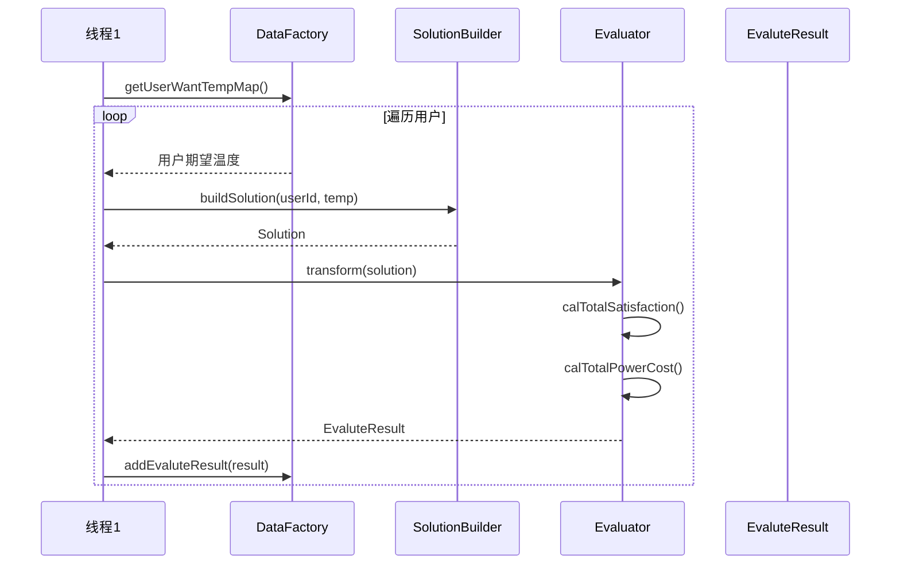

**图表来源**
- [IntelliAirCondition.java](file://src/main/java/com/leavesfly/iac/IntelliAirCondition.java#L90-L100)

### 3. PSO算法调度

标准PSO和混沌PSO算法的并行执行：

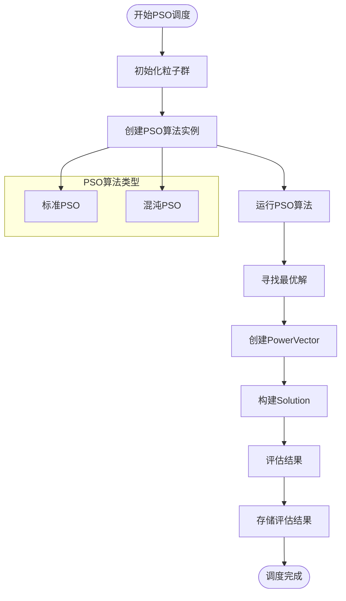

**图表来源**
- [PsoPowerScheduler.java](file://src/main/java/com/leavesfly/iac/execute/scheduler/PsoPowerScheduler.java#L30-L50)

### 4. PowerVector生成

PowerVector是调度结果的核心数据结构，表示空调设备的功率配置：

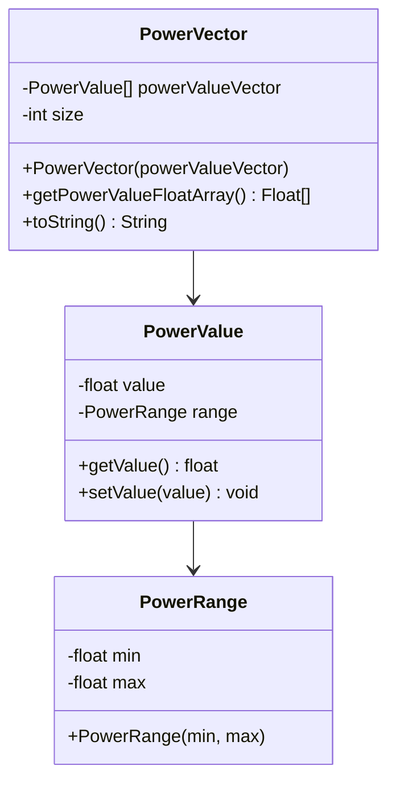

**图表来源**
- [PowerVector.java](file://src/main/java/com/leavesfly/iac/domain/PowerVector.java#L1-L142)

**章节来源**
- [IntelliAirCondition.java](file://src/main/java/com/leavesfly/iac/IntelliAirCondition.java#L80-L140)
- [PsoPowerScheduler.java](file://src/main/java/com/leavesfly/iac/execute/scheduler/PsoPowerScheduler.java#L1-L92)

## 展示阶段详细分析

展示阶段负责输出所有评估结果，为用户提供决策支持：

### 1. 结果获取

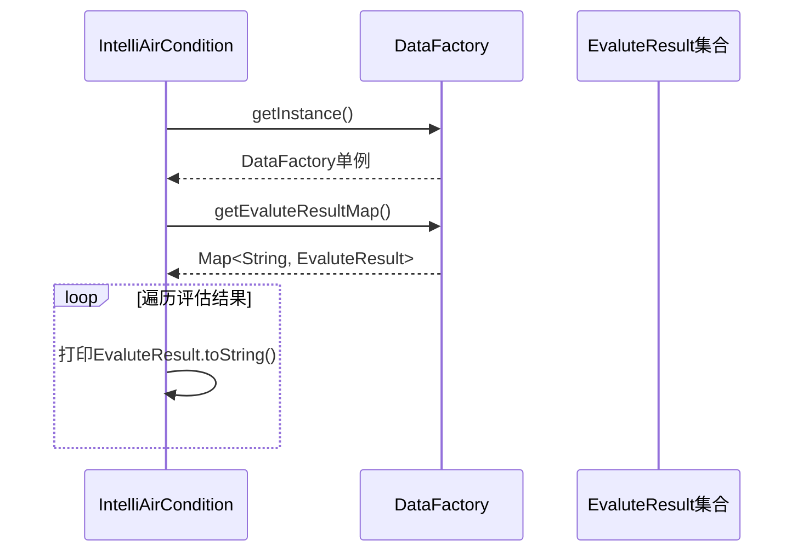

**图表来源**
- [IntelliAirCondition.java](file://src/main/java/com/leavesfly/iac/IntelliAirCondition.java#L145-L155)

### 2. 评估结果结构

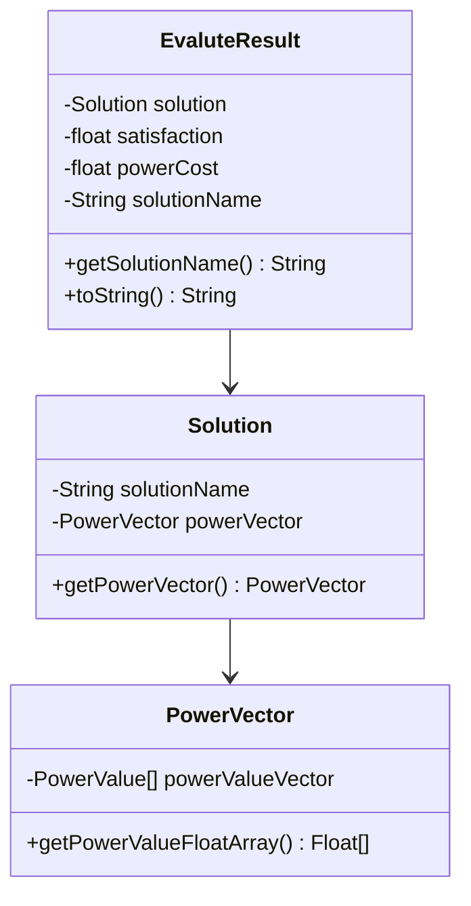

**图表来源**
- [Evaluator.java](file://src/main/java/com/leavesfly/iac/evalute/Evaluator.java#L1-L123)

**章节来源**
- [IntelliAirCondition.java](file://src/main/java/com/leavesfly/iac/IntelliAirCondition.java#L140-L160)

## DataFactory核心作用

DataFactory是整个系统的核心数据中枢，采用单例模式确保全局唯一性：

### 1. 数据管理职责

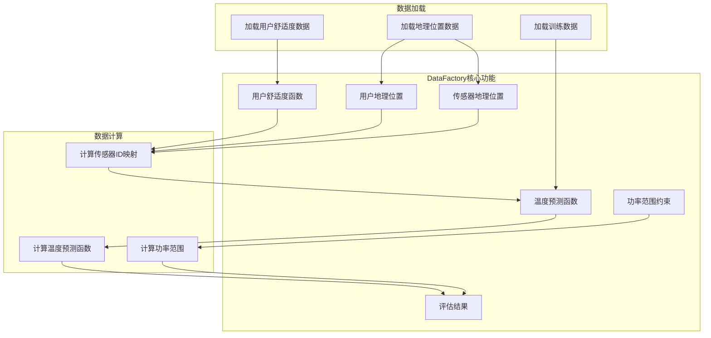

**图表来源**
- [DataFactory.java](file://src/main/java/com/leavesfly/iac/datasource/DataFactory.java#L50-L150)

### 2. 单例模式实现

DataFactory使用双重检查锁定机制确保线程安全：

```java
public static DataFactory getInstance() {
    if (dataFactory != null) {
        return dataFactory;
    } else {
        synchronized (DataFactory.class) {
            if (dataFactory == null) {
                dataFactory = new DataFactory();
            }
        }
    }
    return dataFactory;
}
```

### 3. 数据生命周期管理

DataFactory负责管理所有数据的生命周期，包括延迟加载、缓存和同步：

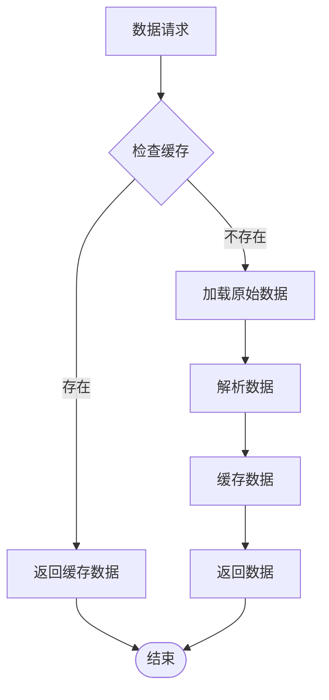

**章节来源**
- [DataFactory.java](file://src/main/java/com/leavesfly/iac/datasource/DataFactory.java#L1-L431)

## 数据流分析

系统中的数据流贯穿三个主要阶段，形成了完整的数据处理管道：

### 1. 数据流向图

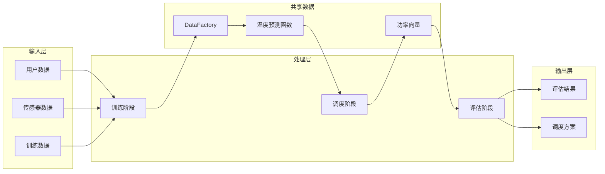

### 2. 数据转换过程

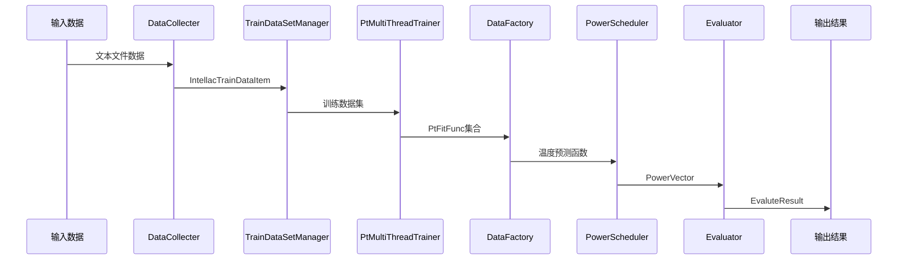

**图表来源**
- [IntelliAirCondition.java](file://src/main/java/com/leavesfly/iac/IntelliAirCondition.java#L45-L155)

### 3. 数据一致性保证

系统通过以下机制保证数据一致性：

1. **单例模式**：DataFactory确保全局数据的一致性
2. **同步容器**：使用Collections.synchronizedMap保护共享数据
3. **原子操作**：关键数据更新使用原子操作
4. **线程安全**：所有并发访问都经过适当的同步

## 性能考虑

### 1. 并发优化

系统在多个层面实现了并发优化：

- **训练阶段**：使用多线程并行训练多个传感器模型
- **调度阶段**：使用线程池并行执行三种调度算法
- **数据访问**：使用同步容器和原子操作保证线程安全

### 2. 内存管理

- **延迟加载**：按需加载用户舒适度函数和地理位置信息
- **缓存策略**：缓存频繁访问的数据减少重复计算
- **对象复用**：重用PowerVector等对象减少GC压力

### 3. I/O优化

- **批量处理**：一次性读取所有训练数据
- **流式处理**：使用BufferedReader处理大型数据文件
- **异步加载**：使用定时器异步收集实时数据

## 总结

IntelliAirCondition系统通过三个阶段实现了完整的空调调度优化流程：

1. **训练阶段**：从历史数据中学习温度预测模型，建立功率-温度映射关系
2. **调度阶段**：使用多种PSO算法并行搜索最优调度方案
3. **展示阶段**：输出评估结果，为用户提供决策支持

DataFactory作为核心数据中枢，统一管理所有数据的生命周期，确保系统的稳定性和可扩展性。系统采用模块化设计和并发优化，能够高效处理大规模空调调度问题，为智能建筑能源管理提供了有效的解决方案。