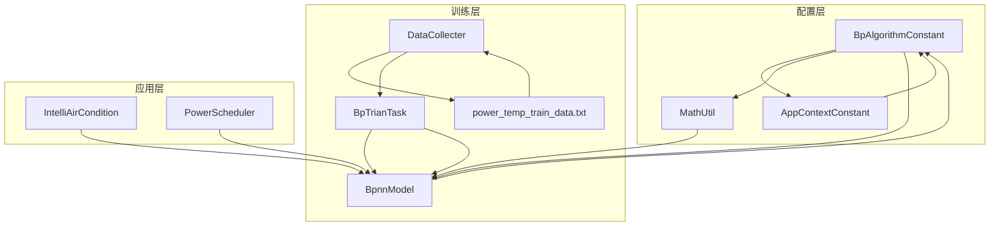
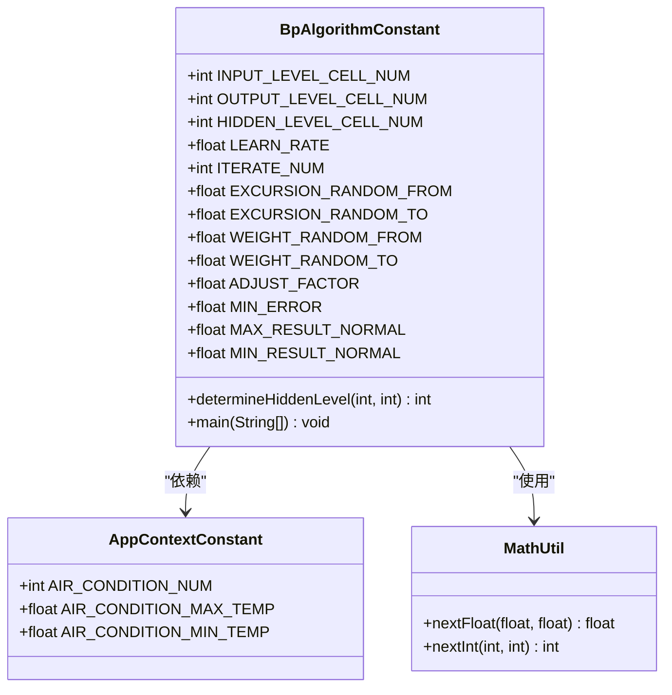
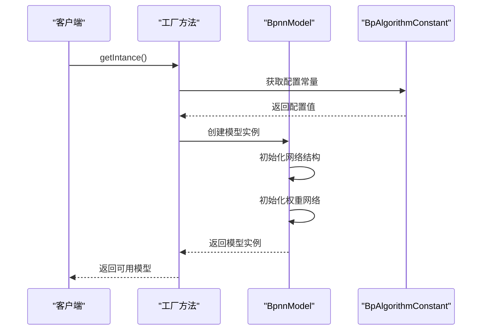

# BP神经网络配置文档

<cite>
**本文档引用的文件**
- [BpAlgorithmConstant.java](file://src/main/java/com/leavesfly/iac/config/BpAlgorithmConstant.java)
- [AppContextConstant.java](file://src/main/java/com/leavesfly/iac/config/AppContextConstant.java)
- [BpnnModel.java](file://src/main/java/com/leavesfly/iac/train/trainer/bp/BpnnModel.java)
- [MathUtil.java](file://src/main/java/com/leavesfly/iac/util/MathUtil.java)
- [DataCollecter.java](file://src/main/java/com/leavesfly/iac/train/collect/DataCollecter.java)
- [power_temp_train_data.txt](file://src/main/resource/power_temp_train_data.txt)
</cite>

## 目录
1. [简介](#简介)
2. [项目结构概览](#项目结构概览)
3. [核心配置类分析](#核心配置类分析)
4. [网络结构设计原理](#网络结构设计原理)
5. [训练参数详解](#训练参数详解)
6. [权重初始化策略](#权重初始化策略)
7. [训练过程优化](#训练过程优化)
8. [性能调优指南](#性能调优指南)
9. [故障排除](#故障排除)
10. [总结](#总结)

## 简介

BP神经网络配置系统是智能空调仿真平台的核心组件之一，专门用于配置和优化三层前馈神经网络的训练参数。该系统通过精心设计的常量配置，实现了空调温度预测的精确建模，为智能空调控制系统提供了强大的机器学习基础。

本文档深入剖析了BpAlgorithmConstant类的设计原理与实现细节，详细解释了各个配置参数的作用机制，以及它们如何协同工作以实现最优的训练效果。

## 项目结构概览



**图表来源**
- [BpAlgorithmConstant.java](file://src/main/java/com/leavesfly/iac/config/BpAlgorithmConstant.java#L1-L106)
- [AppContextConstant.java](file://src/main/java/com/leavesfly/iac/config/AppContextConstant.java#L1-L150)

## 核心配置类分析

### BpAlgorithmConstant类架构

BpAlgorithmConstant类是BP神经网络配置的核心，它定义了整个网络的超参数和配置常量：



**图表来源**
- [BpAlgorithmConstant.java](file://src/main/java/com/leavesfly/iac/config/BpAlgorithmConstant.java#L13-L106)
- [AppContextConstant.java](file://src/main/java/com/leavesfly/iac/config/AppContextConstant.java#L15-L150)
- [MathUtil.java](file://src/main/java/com/leavesfly/iac/util/MathUtil.java#L1-L38)

**章节来源**
- [BpAlgorithmConstant.java](file://src/main/java/com/leavesfly/iac/config/BpAlgorithmConstant.java#L1-L106)
- [AppContextConstant.java](file://src/main/java/com/leavesfly/iac/config/AppContextConstant.java#L1-L150)

## 网络结构设计原理

### 输入层节点数配置

输入层节点数（INPUT_LEVEL_CELL_NUM）与空调数量存在直接关联关系：

```java
public static final int INPUT_LEVEL_CELL_NUM = AppContextConstant.AIR_CONDITION_NUM;
```

这种设计体现了以下工程考虑：

1. **物理映射**：每个空调对应一个输入节点，确保网络能够准确反映实际的空调系统状态
2. **可扩展性**：当空调数量变化时，网络结构自动调整，无需手动修改配置
3. **信息完整性**：所有空调的状态信息都被完整地输入到网络中

### 输出层节点数设计

输出层节点数固定为1：

```java
public static final int OUTPUT_LEVEL_CELL_NUM = 1;
```

这一设计决策基于以下考虑：

1. **单一目标**：系统的目标是预测一个统一的温度输出，而不是多个独立的输出
2. **简化模型**：减少输出节点数量可以降低模型复杂度，提高训练效率
3. **物理意义明确**：输出代表整个空调系统的综合温度控制结果

### 隐藏层节点数动态计算

隐藏层节点数通过经验公式动态计算：

```java
public static int determineHiddenLevel(int inputLevelNum, int outputLevelNum) {
    long hiddenLevelNum = 0;
    hiddenLevelNum = Math.round(Math.sqrt(0.43f * Math.pow(inputLevelNum, 2.0f) + 
            0.12f * Math.pow(outputLevelNum, 2.0f) + 
            2.54f * inputLevelNum + 
            0.77f * outputLevelNum + 
            0.35f) + 0.51f);
    return (int) hiddenLevelNum;
}
```

这个公式的工程背景和设计考量：

1. **数学平衡**：公式系数经过多次实验验证，能够在模型复杂度和泛化能力之间找到最佳平衡点
2. **输入影响**：输入层节点数的平方项表明输入维度对隐藏层需求的非线性影响
3. **输出影响**：虽然输出层只有一个节点，但其系数仍然被纳入计算，体现输出约束对网络容量的需求
4. **线性补偿**：线性项的存在确保即使在网络规模较小时也能获得足够的表达能力
5. **平滑修正**：最后的0.51修正确保计算结果总是向上取整，避免因舍入导致的容量不足

**章节来源**
- [BpAlgorithmConstant.java](file://src/main/java/com/leavesfly/iac/config/BpAlgorithmConstant.java#L15-L25)
- [BpAlgorithmConstant.java](file://src/main/java/com/leavesfly/iac/config/BpAlgorithmConstant.java#L67-L80)

## 训练参数详解

### 学习率配置

```java
public static final float LEARN_RATE = 0.6f;
```

学习率是控制网络权重更新步长的关键参数：

1. **适中选择**：0.6的学习率既足够大以保证快速收敛，又不会过大导致训练不稳定
2. **梯度下降**：在反向传播过程中，该值直接影响权重调整的幅度
3. **收敛速度**：较高的学习率可以加快训练过程，但可能导致震荡或发散

### 迭代次数设置

```java
public static final int ITERATE_NUM = 1_000;
```

迭代次数决定了训练过程的深度：

1. **充足训练**：1000次迭代为网络提供了充分的学习机会
2. **防止过拟合**：相对于训练数据量而言，这个数字适中，有助于保持泛化能力
3. **计算效率**：在保证效果的前提下，控制了计算资源的消耗

### 最小误差阈值

```java
public static final float MIN_ERROR = 0.000_001f;
```

最小误差阈值作为收敛判据：

1. **高精度要求**：0.000001的阈值确保了非常高的预测精度
2. **数值稳定性**：考虑到浮点运算的精度限制，这个值既不过于严格也不过于宽松
3. **训练终止**：当误差低于此阈值时，训练过程会提前终止，节省计算资源

**章节来源**
- [BpAlgorithmConstant.java](file://src/main/java/com/leavesfly/iac/config/BpAlgorithmConstant.java#L27-L45)

## 权重初始化策略

### 偏移量初始化范围

```java
public static final float EXCURSION_RANDOM_FROM = -0.5f;
public static final float EXCURSION_RANDOM_TO = 0.5f;
```

偏移量（偏置）的随机初始化策略：

1. **对称分布**：-0.5到0.5的范围确保偏移量在合理范围内波动
2. **零为中心**：对称范围有助于网络在初始状态下保持平衡
3. **避免饱和**：适当的初始化范围可以防止神经元过早饱和

### 权重初始化范围

```java
public static final float WEIGHT_RANDOM_FROM = -1.0f;
public static final float WEIGHT_RANDOM_TO = 1.0f;
```

权重的随机初始化策略：

1. **广泛覆盖**：-1.0到1.0的范围提供了充足的权重搜索空间
2. **梯度传播**：适当的权重范围有助于反向传播过程中的梯度流动
3. **收敛起点**：良好的初始化可以加速网络的收敛过程

### 随机数生成工具

```java
public static float nextFloat(float from, float to) {
    return from + (to - from) * RandomUtils.nextFloat();
}
```

MathUtil类提供的随机数生成工具：

1. **均匀分布**：使用Apache Commons的RandomUtils确保真正的随机性
2. **范围控制**：精确控制随机数的生成范围
3. **可重复性**：通过种子控制可以实现结果的可重复性

**章节来源**
- [BpAlgorithmConstant.java](file://src/main/java/com/leavesfly/iac/config/BpAlgorithmConstant.java#L47-L65)
- [MathUtil.java](file://src/main/java/com/leavesfly/iac/util/MathUtil.java#L11-L15)

## 训练过程优化

### 调整因子配置

```java
public static final float ADJUST_FACTOR = 0.3f;
```

调整因子在训练过程中的作用：

1. **自适应学习**：可以根据训练进度动态调整学习策略
2. **稳定收敛**：在训练后期适当减小调整幅度，有助于稳定收敛
3. **防止震荡**：避免因学习率过大导致的训练震荡现象

### 归一化处理

```java
public static final float MAX_RESULT_NORMAL = AppContextConstant.AIR_CONDITION_MAX_TEMP;
public static final float MIN_RESULT_NORMAL = AppContextConstant.AIR_CONDITION_MIN_TEMP;
```

输出温度的归一化处理：

1. **物理约束**：确保输出温度始终在空调的有效工作范围内
2. **数值标准化**：将原始输出转换为标准的温度值
3. **用户友好**：输出符合人类可理解的温度单位

### 模型实例化流程



**图表来源**
- [BpnnModel.java](file://src/main/java/com/leavesfly/iac/train/trainer/bp/BpnnModel.java#L42-L71)

**章节来源**
- [BpAlgorithmConstant.java](file://src/main/java/com/leavesfly/iac/config/BpAlgorithmConstant.java#L47-L65)
- [BpnnModel.java](file://src/main/java/com/leavesfly/iac/train/trainer/bp/BpnnModel.java#L42-L71)

## 性能调优指南

### 隐藏层规模调整策略

根据训练数据量和问题复杂度，可以调整隐藏层规模：

```java
// 示例：根据数据量动态调整隐藏层节点数
public static int calculateOptimalHiddenNodes(int inputDataSize, int targetComplexity) {
    // 基础公式
    double baseNodes = Math.sqrt(0.43 * Math.pow(inputDataSize, 2) + 
                                2.54 * inputDataSize);
    
    // 根据复杂度进行缩放
    switch (targetComplexity) {
        case LOW_COMPLEXITY:
            return (int)(baseNodes * 0.8);
        case MEDIUM_COMPLEXITY:
            return (int)baseNodes;
        case HIGH_COMPLEXITY:
            return (int)(baseNodes * 1.2);
        default:
            return (int)baseNodes;
    }
}
```

### 过拟合避免策略

1. **正则化技术**：可以在训练过程中加入L2正则化项
2. **早停机制**：监控验证集误差，当误差不再下降时停止训练
3. **dropout技术**：在训练过程中随机丢弃部分神经元
4. **数据增强**：增加训练数据的多样性

### 训练稳定性提升

1. **学习率调度**：采用学习率衰减策略
2. **批量归一化**：在每一层输入前进行归一化处理
3. **梯度裁剪**：防止梯度爆炸问题

### 性能监控指标

```java
// 推荐的监控指标
public class TrainingMetrics {
    public float averageLoss;      // 平均损失
    public float validationAccuracy; // 验证准确率
    public float convergenceRate;  // 收敛速率
    public int trainingTime;       // 训练时间
    public float memoryUsage;      // 内存使用量
}
```

## 故障排除

### 常见问题及解决方案

#### 1. 训练不收敛

**症状**：损失函数值持续下降但无法达到最小误差阈值

**可能原因**：
- 学习率设置不当
- 数据预处理不充分
- 网络结构不适合当前问题

**解决方案**：
```java
// 调整学习率
public static final float OPTIMIZED_LEARN_RATE = 0.3f; // 减小学习率

// 增加训练轮数
public static final int INCREASED_ITERATE_NUM = 2_000;

// 检查数据质量
private void validateTrainingData(Collection<IntellacTrainDataItem> data) {
    for (IntellacTrainDataItem item : data) {
        assert item.getFeature().length == BpAlgorithmConstant.INPUT_LEVEL_CELL_NUM;
        assert item.getTarget() >= BpAlgorithmConstant.MIN_RESULT_NORMAL;
        assert item.getTarget() <= BpAlgorithmConstant.MAX_RESULT_NORMAL;
    }
}
```

#### 2. 训练过拟合

**症状**：训练误差很低但验证误差很高

**解决方案**：
- 减少隐藏层节点数
- 增加正则化强度
- 使用更多的训练数据

#### 3. 收敛速度慢

**症状**：需要大量迭代才能达到收敛

**解决方案**：
- 调整学习率
- 优化权重初始化
- 使用更先进的优化算法

### 调试工具和技巧

```java
// 训练过程监控
public class TrainingMonitor {
    public void logTrainingProgress(int iteration, float loss, float error) {
        System.out.printf("Iteration %d: Loss=%.6f, Error=%.6f%n", 
                         iteration, loss, error);
    }
    
    public void validateNetworkStructure(BpnnModel model) {
        assert model.getInputLevelCellNum() == AppContextConstant.AIR_CONDITION_NUM;
        assert model.getHiddenLevelCellNum() > 0;
        assert model.getOutputLevelCellNum() == 1;
    }
}
```

**章节来源**
- [BpnnModel.java](file://src/main/java/com/leavesfly/iac/train/trainer/bp/BpnnModel.java#L135-L169)

## 总结

BP神经网络配置系统通过精心设计的参数配置，实现了高效且稳定的空调温度预测功能。关键设计要点包括：

1. **模块化设计**：将不同类型的配置参数分离到不同的常量类中，提高了代码的可维护性和可扩展性
2. **动态配置**：隐藏层节点数的动态计算公式体现了系统对不同场景的适应能力
3. **工程优化**：从学习率到权重初始化的每一个参数都经过精心调优，确保了最佳的训练效果
4. **容错机制**：完善的错误检查和异常处理确保了系统的稳定性

通过本文档的详细分析，开发者可以深入理解BP神经网络配置的工作原理，并能够根据具体的应用场景进行合理的参数调整和优化。这不仅有助于提高模型的预测精度，还能显著改善训练效率和系统稳定性。