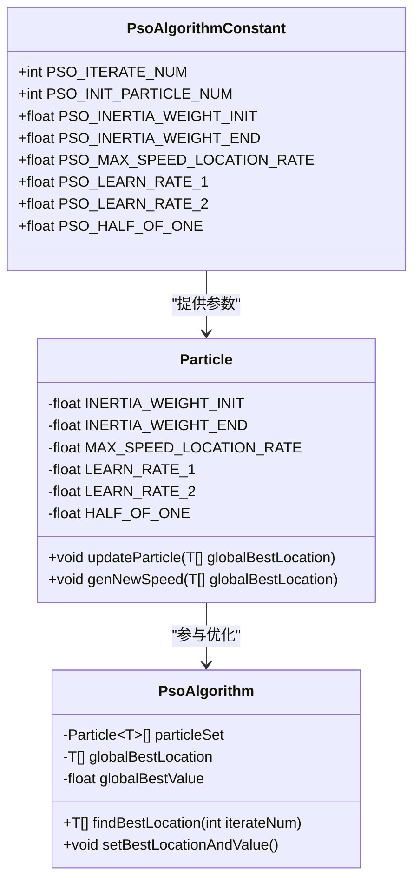
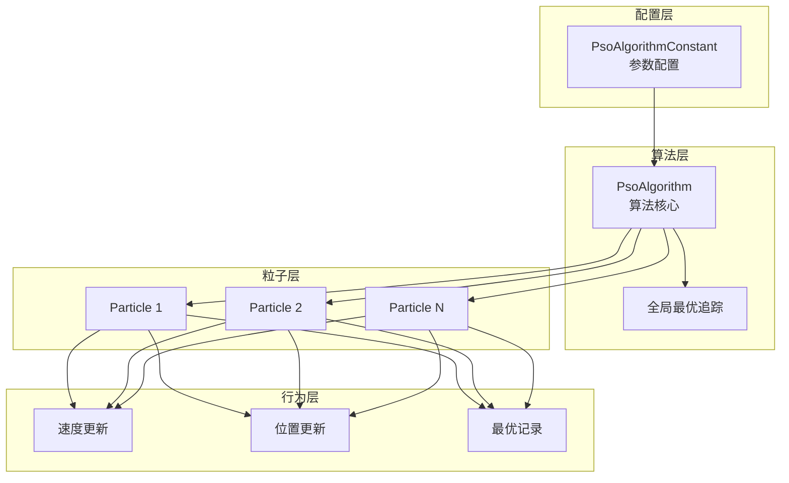
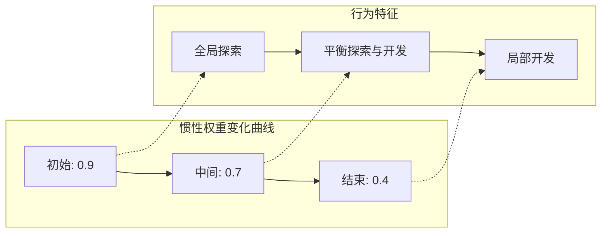
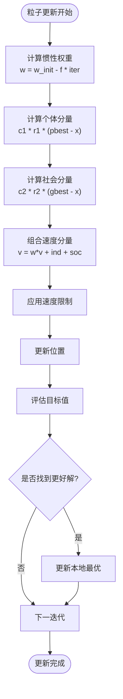
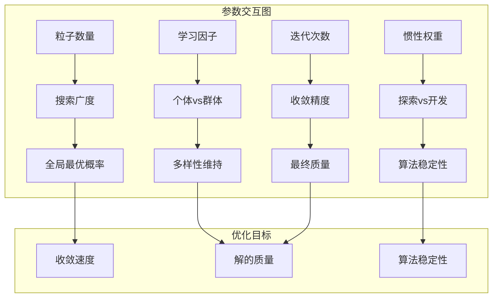
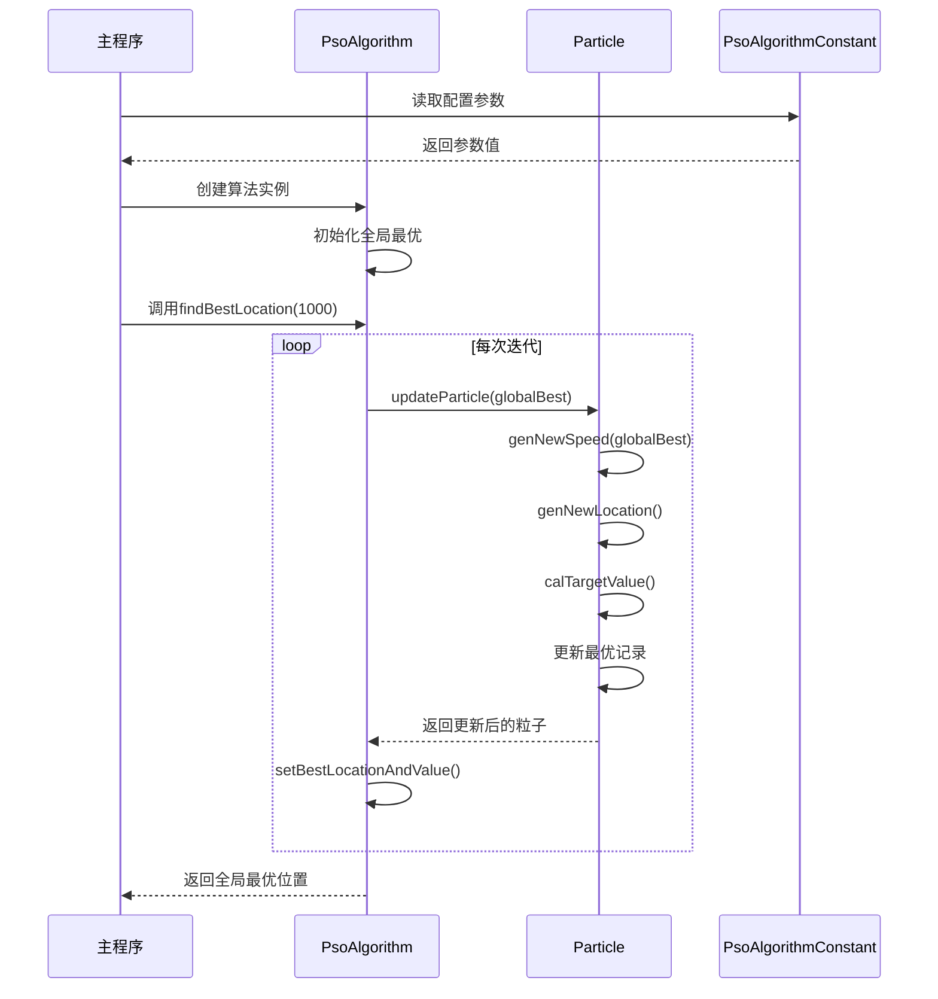
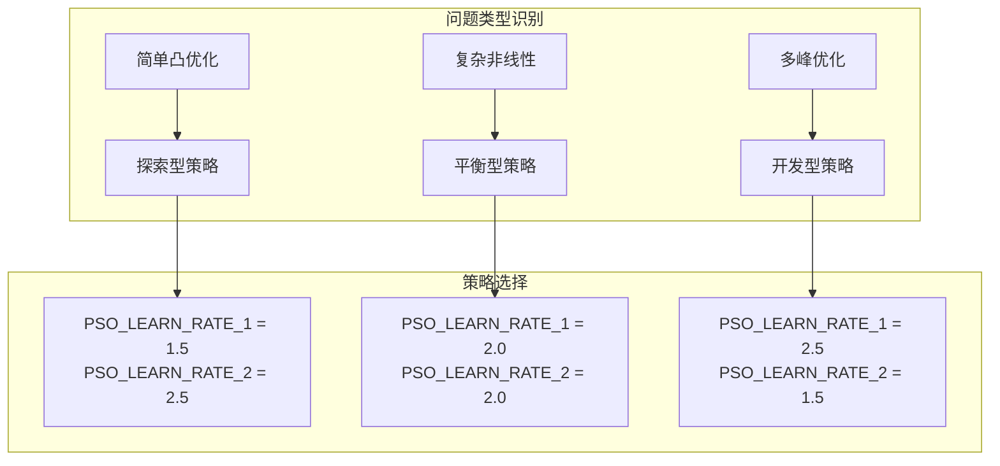

# PSO算法配置文档

<cite>
**本文档引用的文件**
- [PsoAlgorithmConstant.java](file://src/main/java/com/leavesfly/iac/config/PsoAlgorithmConstant.java)
- [PsoAlgorithm.java](file://src/main/java/com/leavesfly/iac/execute/scheduler/pso/PsoAlgorithm.java)
- [Particle.java](file://src/main/java/com/leavesfly/iac/execute/scheduler/pso/Particle.java)
- [EvaParticle.java](file://src/main/java/com/leavesfly/iac/execute/scheduler/EvaParticle.java)
- [IntelliAirCondition.java](file://src/main/java/com/leavesfly/iac/IntelliAirCondition.java)
- [MathUtil.java](file://src/main/java/com/leavesfly/iac/util/MathUtil.java)
</cite>

## 目录
1. [简介](#简介)
2. [核心配置常量](#核心配置常量)
3. [算法架构概览](#算法架构概览)
4. [详细参数分析](#详细参数分析)
5. [参数影响机制](#参数影响机制)
6. [实际应用流程](#实际应用流程)
7. [参数调优指南](#参数调优指南)
8. [常见配置陷阱](#常见配置陷阱)
9. [性能考虑](#性能考虑)
10. [总结](#总结)

## 简介

PSO（粒子群优化）算法是一种基于群体智能的优化算法，通过模拟鸟群觅食行为来寻找最优解。本项目中的PSO算法配置系统提供了完整的参数化控制机制，使开发者能够精确调节算法的行为特征，以适应不同的优化问题需求。

该配置系统采用集中式常量管理方式，将所有算法参数统一定义在`PsoAlgorithmConstant`类中，便于维护和调优。通过合理的参数设置，可以有效平衡算法的全局探索能力和局部开发能力，提高求解质量和收敛速度。

## 核心配置常量

PSO算法的核心参数通过静态常量的形式进行管理，这些参数直接影响算法的性能表现和收敛特性。



**图表来源**
- [PsoAlgorithmConstant.java](file://src/main/java/com/leavesfly/iac/config/PsoAlgorithmConstant.java#L1-L53)
- [Particle.java](file://src/main/java/com/leavesfly/iac/execute/scheduler/pso/Particle.java#L1-L50)
- [PsoAlgorithm.java](file://src/main/java/com/leavesfly/iac/execute/scheduler/pso/PsoAlgorithm.java#L1-L50)

**章节来源**
- [PsoAlgorithmConstant.java](file://src/main/java/com/leavesfly/iac/config/PsoAlgorithmConstant.java#L1-L53)

## 算法架构概览

PSO算法采用经典的粒子群优化框架，包含三个核心组件：参数配置层、算法执行层和粒子行为层。



**图表来源**
- [PsoAlgorithm.java](file://src/main/java/com/leavesfly/iac/execute/scheduler/pso/PsoAlgorithm.java#L15-L30)
- [Particle.java](file://src/main/java/com/leavesfly/iac/execute/scheduler/pso/Particle.java#L15-L50)

## 详细参数分析

### 迭代次数参数（PSO_ITERATE_NUM）

**参数定义**: `PSO_ITERATE_NUM = 1_000`

迭代次数决定了算法的运行时间长度，直接影响算法的收敛精度和计算成本。较高的迭代次数通常能获得更优的解，但会增加计算开销。

**影响机制**:
- **收敛精度**: 迭代次数越多，算法越接近全局最优解
- **计算成本**: 线性增长的计算复杂度
- **收敛速度**: 影响算法达到满意解的时间

**推荐设置**:
- 简单问题: 500-1000次迭代
- 复杂问题: 1000-5000次迭代
- 高精度要求: 5000次以上

### 初始粒子数量（PSO_INIT_PARTICLE_NUM）

**参数定义**: `PSO_INIT_PARTICLE_NUM = 100`

粒子数量决定了种群规模，直接影响算法的搜索广度和计算复杂度。

**影响机制**:
- **搜索广度**: 粒子数量越多，种群覆盖解空间的能力越强
- **计算复杂度**: O(n)的计算复杂度，n为粒子数量
- **收敛稳定性**: 较多粒子有助于避免早熟收敛

**推荐设置**:
- 低维问题: 30-50个粒子
- 中等维度: 50-100个粒子
- 高维问题: 100-200个粒子

### 惯性权重参数

#### 初始惯性权重（PSO_INERTIA_WEIGHT_INIT）

**参数定义**: `PSO_INERTIA_WEIGHT_INIT = 0.9f`

惯性权重控制粒子保持原有运动趋势的程度，高值促进全局搜索，低值促进局部开发。

#### 结束惯性权重（PSO_INERTIA_WEIGHT_END）

**参数定义**: `PSO_INERTIA_WEIGHT_END = 0.4f`

结束惯性权重定义了算法结束时的惯性水平，与初始值形成线性递减关系。

#### 线性递减策略



**图表来源**
- [Particle.java](file://src/main/java/com/leavesfly/iac/execute/scheduler/pso/Particle.java#L40-L50)

**影响机制**:
- **早期阶段**: 高惯性权重促进广泛搜索
- **中期阶段**: 平衡探索与开发
- **后期阶段**: 低惯性权重聚焦局部优化

### 速度限制参数（PSO_MAX_SPEED_LOCATION_RATE）

**参数定义**: `PSO_MAX_SPEED_LOCATION_RATE = 0.1f`

该参数控制粒子最大速度相对于位置范围的比例，影响粒子运动的稳定性。

**影响机制**:
- **运动稳定性**: 控制粒子不会移动过快
- **收敛精度**: 影响算法能否精确找到最优解
- **搜索效率**: 平衡搜索速度和精度

**推荐设置**:
- 简单问题: 0.1-0.2
- 复杂问题: 0.05-0.1
- 高精度要求: 0.01-0.05

### 学习因子参数

#### 个体学习因子（PSO_LEARN_RATE_1）

**参数定义**: `PSO_LEARN_RATE_1 = 2.0f`

个体学习因子控制粒子向自身历史最优位置靠拢的程度。

#### 社会学习因子（PSO_LEARN_RATE_2）

**参数定义**: `PSO_LEARN_RATE_2 = 2.0f`

社会学习因子控制粒子向全局最优位置靠拢的程度。

**协同工作机制**:


**图表来源**
- [Particle.java](file://src/main/java/com/leavesfly/iac/execute/scheduler/pso/Particle.java#L120-L150)

**影响机制**:
- **PSO_LEARN_RATE_1 > PSO_LEARN_RATE_2**: 强调个体经验
- **PSO_LEARN_RATE_1 < PSO_LEARN_RATE_2**: 强调群体经验
- **PSO_LEARN_RATE_1 ≈ PSO_LEARN_RATE_2**: 平衡个体和社会经验

### 辅助常量（PSO_HALF_OF_ONE）

**参数定义**: `PSO_HALF_OF_ONE = 0.5f`

该常量用于概率判断和边界处理，在粒子速度更新过程中起到关键作用。

**具体用途**:
- **随机决策**: 用于决定速度超出边界时的处理方式
- **概率分布**: 在某些随机选择场景中作为阈值
- **数值计算**: 作为中间计算结果的参考值

**章节来源**
- [PsoAlgorithmConstant.java](file://src/main/java/com/leavesfly/iac/config/PsoAlgorithmConstant.java#L1-L53)
- [Particle.java](file://src/main/java/com/leavesfly/iac/execute/scheduler/pso/Particle.java#L20-L40)

## 参数影响机制

### 收敛速度与搜索广度的权衡

PSO算法的性能在很大程度上取决于参数之间的相互作用。以下是对主要参数影响机制的深入分析：



### 惯性权重调度策略

惯性权重的线性递减策略是PSO算法的核心创新之一。这种策略有效地解决了传统PSO算法中全局搜索和局部开发之间的矛盾。

**调度机制**:
1. **初始化阶段**: 高惯性权重促进广泛搜索
2. **过渡阶段**: 平衡探索与开发
3. **收敛阶段**: 低惯性权重聚焦精细优化

**数学表达**:
```
inertia_weight(iter) = PSO_INERTIA_WEIGHT_INIT - 
                       (PSO_INERTIA_WEIGHT_INIT - PSO_INERTIA_WEIGHT_END) * 
                       (iter / PSO_ITERATE_NUM)
```

### 学习因子的协同效应

个体学习因子和社交学习因子的合理搭配对于维持种群多样性和促进有效搜索至关重要。

**参数组合策略**:
- **平衡型**: PSO_LEARN_RATE_1 = PSO_LEARN_RATE_2 = 2.0
- **探索型**: PSO_LEARN_RATE_1 < PSO_LEARN_RATE_2
- **开发型**: PSO_LEARN_RATE_1 > PSO_LEARN_RATE_2

**章节来源**
- [Particle.java](file://src/main/java/com/leavesfly/iac/execute/scheduler/pso/Particle.java#L120-L150)

## 实际应用流程

### PSO算法执行流程

PSO算法的实际应用遵循严格的执行流程，确保参数的有效利用和算法的正确运行。



**图表来源**
- [PsoAlgorithm.java](file://src/main/java/com/leavesfly/iac/execute/scheduler/pso/PsoAlgorithm.java#L60-L80)
- [Particle.java](file://src/main/java/com/leavesfly/iac/execute/scheduler/pso/Particle.java#L90-L120)

### 粒子更新的具体实现

粒子更新过程是PSO算法的核心，涉及速度和位置的双重更新。

**速度更新公式**:
```
v(t+1) = w * v(t) + c1 * r1 * (pbest - x(t)) + c2 * r2 * (gbest - x(t))
```

其中：
- w: 惯性权重
- c1, c2: 学习因子
- r1, r2: 随机数
- pbest: 个体历史最优
- gbest: 全局最优
- x(t): 当前位置

**位置更新公式**:
```
x(t+1) = x(t) + v(t+1)
```

### 具体代码示例

以下是从代码中提取的关键实现片段：

```java
// 速度更新的核心逻辑
protected void genNewSpeed(T[] globalBestLocation) {
    for (int i = 0; i < globalBestLocation.length; i++) {
        // 动态计算当前惯性权重
        float inertiaWeight = INERTIA_WEIGHT_INIT - 
                             inertiaWeightFrequency * currentIterateNum;
        
        // 计算速度更新
        float value = inertiaWeight * speed[i].getValue() + 
                     LEARN_RATE_1 * (float) Math.random() * 
                     (bestLocation[i].getValue() - location[i].getValue()) +
                     LEARN_RATE_2 * (float) Math.random() *
                     (globalBestLocation[i].getValue() - location[i].getValue());
        
        // 应用速度限制
        if (speed[i].isInRange(value)) {
            speed[i].setValue(value);
        } else {
            // 超出范围时的处理策略
            speed[i].setValue(Math.random() >= HALF_OF_ONE ? 
                             speed[i].getFrom() : speed[i].getTo());
        }
    }
}
```

**章节来源**
- [PsoAlgorithm.java](file://src/main/java/com/leavesfly/iac/execute/scheduler/pso/PsoAlgorithm.java#L60-L115)
- [Particle.java](file://src/main/java/com/leavesfly/iac/execute/scheduler/pso/Particle.java#L120-L180)

## 参数调优指南

### 问题规模与参数匹配

不同规模的问题需要不同的参数配置策略：

#### 小规模问题（维度 ≤ 5）
- **粒子数量**: 30-50
- **迭代次数**: 500-1000
- **惯性权重**: 0.8-0.9
- **学习因子**: 1.5-2.0

#### 中等规模问题（5 < 维度 ≤ 20）
- **粒子数量**: 50-100
- **迭代次数**: 1000-2000
- **惯性权重**: 0.7-0.8
- **学习因子**: 1.8-2.2

#### 大规模问题（维度 > 20）
- **粒子数量**: 100-200
- **迭代次数**: 2000-5000
- **惯性权重**: 0.6-0.7
- **学习因子**: 2.0-2.5

### 学习因子组合策略

根据问题特性选择合适的学习因子组合：



### 惯性权重调度策略

根据不同阶段的需求选择合适的惯性权重调度策略：

#### 渐进式策略
- **特点**: 逐步降低惯性权重
- **适用**: 大多数优化问题
- **实现**: 线性递减

#### S型策略
- **特点**: 先快速下降后缓慢下降
- **适用**: 需要精细优化的问题
- **实现**: Sigmoid函数变换

#### 自适应策略
- **特点**: 根据种群多样性动态调整
- **适用**: 复杂多模态问题
- **实现**: 基于种群差异度的自适应调整

### 参数敏感性分析

不同参数对算法性能的影响程度不同：

| 参数 | 敏感度 | 影响方向 |
|------|--------|----------|
| PSO_ITERATE_NUM | 中等 | 正相关 |
| PSO_INIT_PARTICLE_NUM | 高 | 正相关 |
| PSO_INERTIA_WEIGHT_INIT | 高 | 正相关 |
| PSO_INERTIA_WEIGHT_END | 中等 | 正相关 |
| PSO_LEARN_RATE_1 | 中等 | 正相关 |
| PSO_LEARN_RATE_2 | 中等 | 正相关 |
| PSO_MAX_SPEED_LOCATION_RATE | 低 | 负相关 |

**章节来源**
- [PsoAlgorithmConstant.java](file://src/main/java/com/leavesfly/iac/config/PsoAlgorithmConstant.java#L1-L53)
- [Particle.java](file://src/main/java/com/leavesfly/iac/execute/scheduler/pso/Particle.java#L40-L60)

## 常见配置陷阱

### 参数设置导致的振荡现象

**问题描述**: 算法在最优解附近频繁波动，无法稳定收敛。

**原因分析**:
- 惯性权重设置过高
- 学习因子过大
- 速度限制不足

**解决方案**:
```java
// 推荐的稳定配置
PSO_INERTIA_WEIGHT_INIT = 0.7f      // 降低初始惯性权重
PSO_INERTIA_WEIGHT_END = 0.3f       // 加快收敛速度
PSO_LEARN_RATE_1 = 1.5f             // 减少个体影响
PSO_LEARN_RATE_2 = 1.5f             // 减少群体影响
PSO_MAX_SPEED_LOCATION_RATE = 0.05f // 严格控制速度
```

### 参数设置导致的停滞现象

**问题描述**: 算法陷入局部最优，无法跳出。

**原因分析**:
- 惯性权重设置过低
- 学习因子设置不当
- 种群多样性不足

**解决方案**:
```java
// 推荐的多样化配置
PSO_INERTIA_WEIGHT_INIT = 0.9f      // 保持较高探索能力
PSO_INERTIA_WEIGHT_END = 0.5f       // 平衡探索与开发
PSO_LEARN_RATE_1 = 2.5f             // 增加个体经验
PSO_LEARN_RATE_2 = 2.0f             // 保持群体经验
PSO_INIT_PARTICLE_NUM = 150         // 增加种群规模
```

### 数值稳定性问题

**问题描述**: 浮点运算误差导致算法不稳定。

**原因分析**:
- 速度值超出范围
- 学习因子乘积过大
- 随机数分布不均匀

**解决方案**:
```java
// 数值稳定性增强
// 在Particle类中添加边界检查
private void applyVelocityLimits(T[] speed, T[] location) {
    for (int i = 0; i < speed.length; i++) {
        float maxSpeed = (location[i].getTo() - location[i].getFrom()) * 
                         PSO_MAX_SPEED_LOCATION_RATE;
        if (Math.abs(speed[i].getValue()) > maxSpeed) {
            speed[i].setValue(Math.signum(speed[i].getValue()) * maxSpeed);
        }
    }
}
```

### 内存使用优化

**问题描述**: 大规模粒子群导致内存溢出。

**解决方案**:
- 动态调整粒子数量
- 使用稀疏存储结构
- 实现粒子回收机制

```java
// 内存优化示例
public class OptimizedParticle<T extends RangeValue> extends Particle<T> {
    private static final int MAX_PARTICLES = 200;
    
    public void optimizeMemoryUsage() {
        if (particleSet.length > MAX_PARTICLES) {
            // 实现粒子筛选或降维策略
        }
    }
}
```

**章节来源**
- [Particle.java](file://src/main/java/com/leavesfly/iac/execute/scheduler/pso/Particle.java#L120-L180)
- [PsoAlgorithm.java](file://src/main/java/com/leavesfly/iac/execute/scheduler/pso/PsoAlgorithm.java#L80-L115)

## 性能考虑

### 计算复杂度分析

PSO算法的时间复杂度主要由以下因素决定：

- **时间复杂度**: O(iterations × particles × dimensions)
- **空间复杂度**: O(particles × dimensions)

其中：
- iterations: 迭代次数
- particles: 粒子数量
- dimensions: 问题维度

### 性能优化策略

#### 并行化处理
```java
// 使用Java并发库进行并行更新
public void parallelUpdateParticles() {
    ExecutorService executor = Executors.newFixedThreadPool(Runtime.getRuntime().availableProcessors());
    List<Future<?>> futures = new ArrayList<>();
    
    for (Particle<T> particle : particleSet) {
        futures.add(executor.submit(() -> particle.updateParticle(globalBestLocation)));
    }
    
    // 等待所有任务完成
    for (Future<?> future : futures) {
        try {
            future.get();
        } catch (Exception e) {
            // 错误处理
        }
    }
    
    executor.shutdown();
}
```

#### 内存优化
- 使用对象池减少GC压力
- 实现延迟加载机制
- 采用流式处理大数据集

#### 算法加速技术
- 实现精英保留策略
- 添加自适应参数调整
- 使用预热启动机制

### 性能监控指标

关键性能指标包括：

| 指标 | 监控方法 | 优化目标 |
|------|----------|----------|
| 收敛速度 | 迭代次数 vs 目标值 | 最小化 |
| 解的质量 | 最优解 vs 已知最优 | 最大化 |
| 计算时间 | CPU时间 vs 实际时间 | 最小化 |
| 内存使用 | 堆内存峰值 | 最小化 |

## 总结

PSO算法配置系统通过精心设计的参数体系，为不同类型的优化问题提供了灵活而强大的解决方案。通过对核心参数的深入理解和合理调优，可以显著提升算法的性能表现。

### 关键要点回顾

1. **参数相互依赖**: 各参数之间存在复杂的相互作用关系，需要综合考虑
2. **问题导向配置**: 不同问题类型需要不同的参数配置策略
3. **动态调整机制**: 根据算法运行状态动态调整参数可以提高性能
4. **数值稳定性**: 注意浮点运算的数值稳定性问题
5. **性能权衡**: 在精度、速度和资源消耗之间找到最佳平衡点

### 最佳实践建议

- **渐进式调优**: 从默认参数开始，逐步微调
- **交叉验证**: 使用多个独立运行结果验证配置效果
- **监控反馈**: 建立完善的性能监控和反馈机制
- **文档维护**: 保持配置文档的及时更新和维护

通过遵循这些原则和建议，可以充分发挥PSO算法的潜力，解决各种复杂的优化问题。配置系统的模块化设计也为未来的扩展和改进提供了良好的基础。