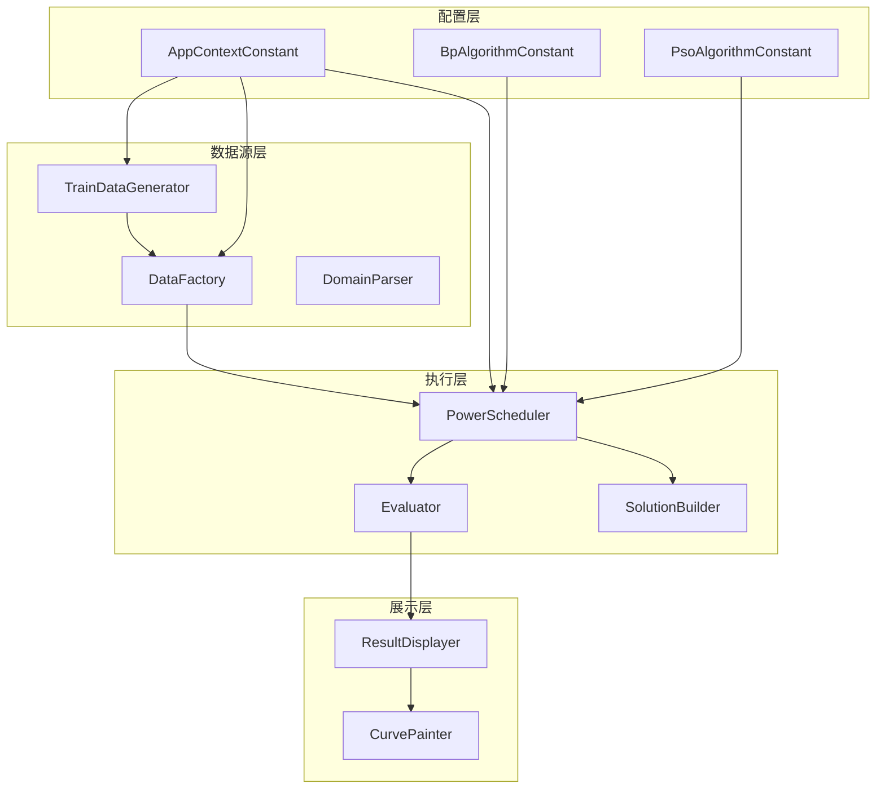
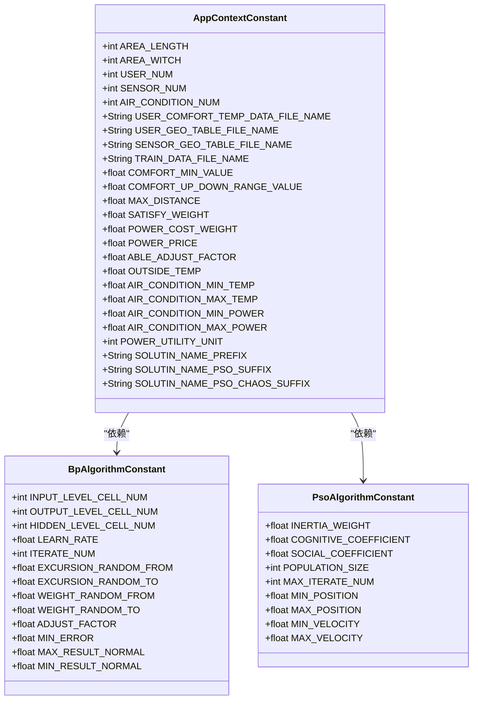
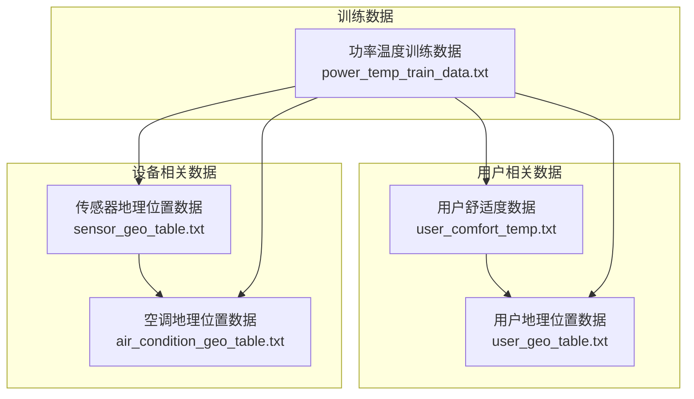
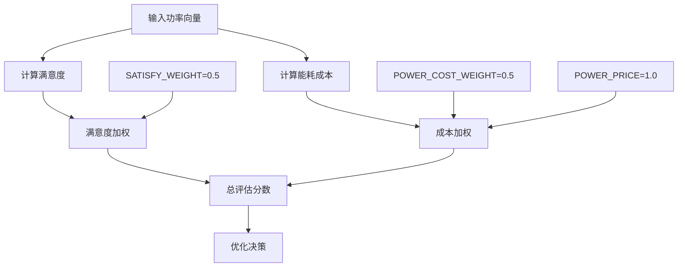

# 应用上下文配置文档

<cite>
**本文档引用的文件**
- [AppContextConstant.java](file://src/main/java/com/leavesfly/iac/config/AppContextConstant.java)
- [BpAlgorithmConstant.java](file://src/main/java/com/leavesfly/iac/config/BpAlgorithmConstant.java)
- [PsoAlgorithmConstant.java](file://src/main/java/com/leavesfly/iac/config/PsoAlgorithmConstant.java)
- [TrainDataGenerator.java](file://src/main/java/com/leavesfly/iac/datasource/datagene/TrainDataGenerator.java)
- [Evaluator.java](file://src/main/java/com/leavesfly/iac/evalute/Evaluator.java)
- [user_comfort_temp.txt](file://src/main/resource/user_comfort_temp.txt)
- [user_geo_table.txt](file://src/main/resource/user_geo_table.txt)
- [sensor_geo_table.txt](file://src/main/resource/sensor_geo_table.txt)
- [power_temp_train_data.txt](file://src/main/resource/power_temp_train_data.txt)
- [air_condition_geo_table.txt](file://src/main/resource/air_condition_geo_table.txt)
</cite>

## 目录
1. [简介](#简介)
2. [项目结构概览](#项目结构概览)
3. [核心常量配置](#核心常量配置)
4. [区域与设备参数](#区域与设备参数)
5. [舒适度与性能参数](#舒适度与性能参数)
6. [空调设备参数](#空调设备参数)
7. [数据文件配置](#数据文件配置)
8. [权重与成本参数](#权重与成本参数)
9. [动态计算参数](#动态计算参数)
10. [参数敏感性分析](#参数敏感性分析)
11. [最佳实践建议](#最佳实践建议)
12. [总结](#总结)

## 简介

智能空调仿真平台是一个基于Java开发的复杂系统，旨在模拟和优化空调系统的运行策略。该平台通过精确的参数配置实现对空调设备、用户舒适度、传感器布局和电力消耗的全面仿真。本文档详细解析了AppContextConstant类中定义的所有系统级常量，帮助开发者深入理解各个参数的物理意义及其对仿真环境的影响。

## 项目结构概览

智能空调仿真平台采用分层架构设计，主要包含以下核心模块：



**图表来源**
- [AppContextConstant.java](file://src/main/java/com/leavesfly/iac/config/AppContextConstant.java#L1-L150)
- [TrainDataGenerator.java](file://src/main/java/com/leavesfly/iac/datasource/datagene/TrainDataGenerator.java#L1-L198)

## 核心常量配置

AppContextConstant类是整个仿真平台的核心配置中心，定义了系统运行所需的所有基础参数。这些常量不仅控制着仿真环境的基本特征，还直接影响算法的收敛性和结果的准确性。

### 配置分类体系



**图表来源**
- [AppContextConstant.java](file://src/main/java/com/leavesfly/iac/config/AppContextConstant.java#L10-L150)
- [BpAlgorithmConstant.java](file://src/main/java/com/leavesfly/iac/config/BpAlgorithmConstant.java#L10-L106)

**章节来源**
- [AppContextConstant.java](file://src/main/java/com/leavesfly/iac/config/AppContextConstant.java#L1-L150)

## 区域与设备参数

### 区域尺寸参数

区域尺寸是仿真环境的基础物理参数，决定了整个系统的空间范围和布局密度。

#### AREA_LENGTH 和 AREA_WITCH
- **AREA_LENGTH**: 区域长度为10米，表示仿真环境的水平跨度
- **AREA_WITCH**: 区域宽度为10米，表示仿真环境的垂直跨度
- **物理意义**: 创建一个10m×10m的正方形仿真区域
- **影响**: 决定传感器和空调设备的分布密度，影响信号覆盖范围和计算复杂度

#### 设备数量参数

```mermaid
graph LR
subgraph "设备分布"
A[用户设备<br/>USER_NUM=16]
S[传感器设备<br/>SENSOR_NUM=10]
C[空调设备<br/>AIR_CONDITION_NUM=8]
end
subgraph "空间关系"
R[仿真区域<br/>10m×10m]
D[平均间距<br/>√(100/16)=2.5m]
end
A --> R
S --> R
C --> R
R --> D
```

**图表来源**
- [AppContextConstant.java](file://src/main/java/com/leavesfly/iac/config/AppContextConstant.java#L16-L36)

**章节来源**
- [AppContextConstant.java](file://src/main/java/com/leavesfly/iac/config/AppContextConstant.java#L16-L36)

## 舒适度与性能参数

### 用户舒适度参数

舒适度参数直接影响用户体验评估和算法优化目标。

#### COMFORT_MIN_VALUE
- **值**: 0.2f
- **物理意义**: 用户舒适度的最小可接受阈值
- **工程依据**: 基于人体热舒适理论，低于此值的温度差异会导致明显不适
- **影响**: 影响满意度计算的下限，决定算法是否认为当前温度设置合理

#### COMFORT_UP_DOWN_RANGE_VALUE
- **值**: 1.5f
- **物理意义**: 温度舒适度的上下浮动范围
- **工程依据**: 考虑人体对温度变化的适应能力，通常为±1.5°C
- **影响**: 在温度预测和优化过程中，允许的舒适度波动范围

### 性能优化参数

#### ABLE_ADJUST_FACTOR
- **值**: 0.25f
- **物理意义**: 可调节因子，控制温度调整的幅度
- **工程依据**: 平衡快速响应和稳定性的折衷值
- **影响**: 在温度补偿算法中，限制单次调整的最大幅度

**章节来源**
- [AppContextConstant.java](file://src/main/java/com/leavesfly/iac/config/AppContextConstant.java#L41-L51)

## 空调设备参数

### 温度控制参数

空调设备的温度控制参数直接关系到系统的节能效果和用户舒适度。

#### OUTSIDE_TEMP
- **值**: 35.0f
- **物理意义**: 外部环境温度（摄氏度）
- **工程依据**: 基于典型夏季高温环境的设计基准
- **影响**: 作为温度预测模型的输入基准，影响空调制冷需求

#### AIR_CONDITION_MIN_TEMP 和 AIR_CONDITION_MAX_TEMP
- **MIN_TEMP**: 15.0f
- **MAX_TEMP**: 35.0f（等于OUTSIDE_TEMP）
- **物理意义**: 空调设备的温度调节范围
- **工程依据**: 考虑设备能力和人体舒适度极限
- **影响**: 决定空调系统的运行边界，影响节能潜力

#### AIR_CONDITION_MIN_POWER 和 AIR_CONDITION_MAX_POWER
- **MIN_POWER**: 0.0f
- **MAX_POWER**: 400.0f
- **物理意义**: 空调设备的功率范围（瓦特）
- **工程依据**: 基于典型家用空调的功率规格
- **影响**: 影响能耗计算和成本评估

### 辅助参数

#### POWER_UTILITY_UNIT
- **值**: 1000
- **物理意义**: 功率效用单位转换因子
- **工程依据**: 将瓦特转换为千瓦，便于成本计算
- **影响**: 在功率向量处理和成本计算中使用

**章节来源**
- [AppContextConstant.java](file://src/main/java/com/leavesfly/iac/config/AppContextConstant.java#L56-L71)

## 数据文件配置

数据文件配置定义了系统运行所需的各种数据文件及其格式要求。

### 文件命名规范



**图表来源**
- [AppContextConstant.java](file://src/main/java/com/leavesfly/iac/config/AppContextConstant.java#L38-L46)

### 文件格式要求

#### user_comfort_temp.txt
- **格式**: 每行一个用户，格式为`用户ID\t舒适温度`
- **示例**: `0\t23`
- **用途**: 存储每个用户的理想舒适温度
- **数据范围**: 通常在22°C-25°C之间

#### user_geo_table.txt
- **格式**: 每行一个用户，格式为`用户ID\tX坐标,Y坐标`
- **示例**: `0\t2,3`
- **用途**: 定义用户在仿真区域内的具体位置
- **坐标系**: 原点在左上角，X轴向右，Y轴向下

#### sensor_geo_table.txt
- **格式**: 每行一个传感器，格式为`传感器ID\tX坐标,Y坐标`
- **示例**: `0\t5,2`
- **用途**: 定义传感器的部署位置
- **分布策略**: 均匀分布在仿真区域内

#### power_temp_train_data.txt
- **格式**: 复杂的多列数据，包含功率、温度和空调状态
- **用途**: 用于训练温度预测模型
- **数据量**: 包含大量功率-温度对应关系

**章节来源**
- [AppContextConstant.java](file://src/main/java/com/leavesfly/iac/config/AppContextConstant.java#L38-L46)
- [user_comfort_temp.txt](file://src/main/resource/user_comfort_temp.txt#L1-L16)
- [user_geo_table.txt](file://src/main/resource/user_geo_table.txt#L1-L16)
- [sensor_geo_table.txt](file://src/main/resource/sensor_geo_table.txt#L1-L10)

## 权重与成本参数

### 成本评估体系

系统采用多维度的成本评估体系，平衡用户满意度和能源消耗。

#### SATISFY_WEIGHT 和 POWER_COST_WEIGHT
- **SATISFY_WEIGHT**: 0.5f（满意度权重）
- **POWER_COST_WEIGHT**: 0.5f（成本权重）
- **关系**: SATISFY_WEIGHT + POWER_COST_WEIGHT = 1.0f
- **物理意义**: 权衡用户舒适度和能源成本的重要性
- **影响**: 决定优化目标的优先级，在满意度最大化和成本最小化之间找到平衡

### 电费定价参数

#### POWER_PRICE
- **值**: 1.0f
- **物理意义**: 每度电的价格（元/千瓦时）
- **工程依据**: 基于典型商业电价的简化模型
- **影响**: 直接影响总成本计算，决定节能策略的经济价值

### 权重分配机制



**图表来源**
- [Evaluator.java](file://src/main/java/com/leavesfly/iac/evalute/Evaluator.java#L25-L122)

**章节来源**
- [AppContextConstant.java](file://src/main/java/com/leavesfly/iac/config/AppContextConstant.java#L52-L55)
- [Evaluator.java](file://src/main/java/com/leavesfly/iac/evalute/Evaluator.java#L85-L122)

## 动态计算参数

### MAX_DISTANCE 参数

MAX_DISTANCE 是一个重要的动态计算参数，基于区域大小和传感器数量自动计算得出。

#### 数学公式
```java
MAX_DISTANCE = Math.pow(((AREA_LENGTH * AREA_WITCH / SENSOR_NUM) * 3.0f) / Math.PI, 0.5f)
```

#### 公式解析
- **分子部分**: `(AREA_LENGTH * AREA_WITCH / SENSOR_NUM)`
  - 计算每个传感器的平均覆盖面积
  - 结果：`(10 * 10) / 10 = 10平方米`
- **系数**: `* 3.0f`
  - 考虑传感器覆盖的圆形区域
  - 基于圆面积公式 πr² = 10，推导出半径 r = √(10/π)
- **开方**: `Math.pow(..., 0.5f)`
  - 计算传感器的最大有效覆盖半径

#### 物理意义
- **值**: 约3.19米
- **工程意义**: 表示传感器能够有效检测温度的最大距离
- **影响**: 决定温度预测的精度和算法的计算复杂度

### 计算流程图

```mermaid
flowchart TD
A[开始计算] --> B[计算平均覆盖面积]
B --> C[AREA_LENGTH × AREA_WITCH ÷ SENSOR_NUM]
C --> D[乘以覆盖系数]
D --> E[× 3.0f]
E --> F[除以π]
F --> G[÷ π]
G --> H[开平方根]
H --> I[√(结果)]
I --> J[得到MAX_DISTANCE]
J --> K[结束]
```

**图表来源**
- [AppContextConstant.java](file://src/main/java/com/leavesfly/iac/config/AppContextConstant.java#L70-L73)

**章节来源**
- [AppContextConstant.java](file://src/main/java/com/leavesfly/iac/config/AppContextConstant.java#L70-L73)

## 参数敏感性分析

### 关键参数影响分析

不同参数对仿真结果的影响程度存在显著差异：

#### 高敏感度参数
1. **USER_NUM (16)**: 用户数量直接影响计算复杂度和结果准确性
2. **SENSOR_NUM (10)**: 传感器数量决定温度预测精度
3. **AIR_CONDITION_NUM (8)**: 空调设备数量影响能耗计算
4. **MAX_DISTANCE**: 决定算法收敛速度和精度

#### 中等敏感度参数
1. **COMFORT_MIN_VALUE (0.2)**: 影响满意度计算的下限
2. **SATISFY_WEIGHT (0.5)**: 权重分配影响优化方向
3. **POWER_PRICE (1.0)**: 价格参数影响成本评估

#### 低敏感度参数
1. **ABLE_ADJUST_FACTOR (0.25)**: 调整幅度对整体结果影响较小
2. **POWER_UTILITY_UNIT (1000)**: 单位转换对结果无实质性影响

### 敏感性测试案例

#### 案例1：用户数量变化
- **场景**: USER_NUM从16减少到8
- **影响**: 
  - 计算复杂度降低约50%
  - 温度预测精度可能下降
  - 结果可靠性降低

#### 案例2：传感器密度变化
- **场景**: SENSOR_NUM从10增加到20
- **影响**:
  - 计算复杂度增加约100%
  - 温度预测精度提高
  - MAX_DISTANCE相应减小

#### 案例3：权重分配变化
- **场景**: SATISFY_WEIGHT从0.5调整为0.8
- **影响**:
  - 优化目标更倾向于满意度
  - 可能导致能耗增加
  - 用户体验改善但成本上升

**章节来源**
- [TrainDataGenerator.java](file://src/main/java/com/leavesfly/iac/datasource/datagene/TrainDataGenerator.java#L145-L180)

## 最佳实践建议

### 参数调优指南

#### 1. 区域参数设置
- **推荐**: 保持AREA_LENGTH = AREA_WITCH = 10米
- **原因**: 简化计算且满足大多数应用场景
- **例外**: 大型区域可按比例放大

#### 2. 设备数量配置
- **用户数量**: 根据实际场景确定，建议不超过50个
- **传感器数量**: 建议为用户数量的60%-80%
- **空调数量**: 建议为用户数量的50%-70%

#### 3. 舒适度参数
- **COMFORT_MIN_VALUE**: 保持默认值0.2f
- **COMFORT_UP_DOWN_RANGE_VALUE**: 保持默认值1.5f
- **调整时机**: 仅在特殊场景下考虑修改

#### 4. 成本参数
- **POWER_PRICE**: 根据实际电价调整
- **权重分配**: 根据业务需求平衡满意度和成本

### 性能优化建议

#### 1. 计算效率优化
- **传感器分布**: 采用均匀分布策略
- **算法选择**: 根据参数规模选择合适的优化算法
- **缓存策略**: 缓存频繁计算的结果

#### 2. 结果质量保证
- **数据验证**: 确保输入数据的合理性
- **边界检查**: 验证参数在合理范围内
- **结果校验**: 对关键参数进行敏感性分析

#### 3. 扩展性考虑
- **参数化设计**: 所有关键参数都应可配置
- **模块化架构**: 支持独立修改各功能模块参数
- **版本兼容**: 保持参数向后兼容性

### 常见问题与解决方案

#### 问题1：仿真结果不准确
- **原因**: 参数设置不合理或数据质量问题
- **解决方案**: 检查参数范围，验证数据文件格式

#### 问题2：计算性能差
- **原因**: 参数规模过大或算法选择不当
- **解决方案**: 减少设备数量，优化算法参数

#### 问题3：结果波动大
- **原因**: 随机因素过多或权重分配不合理
- **解决方案**: 固定随机种子，调整权重分配

## 总结

AppContextConstant类作为智能空调仿真平台的核心配置中心，通过精心设计的参数体系实现了对空调系统运行的全面模拟。本文档详细解析了各个参数的物理意义、工程依据和对仿真结果的影响，为开发者提供了深入理解和灵活配置的指导。

### 关键要点回顾

1. **参数体系完整性**: 从区域尺寸到设备参数，从舒适度到成本评估，形成了完整的配置体系
2. **动态计算价值**: MAX_DISTANCE等动态参数体现了系统智能化的特点
3. **权重平衡重要性**: SATISFY_WEIGHT和POWER_COST_WEIGHT的合理分配是获得满意结果的关键
4. **参数敏感性**: 不同参数对结果的影响程度存在显著差异，需要针对性调整
5. **最佳实践指导**: 提供了参数调优、性能优化和问题解决的具体建议

### 未来发展方向

随着智能空调技术的发展，参数配置体系也需要持续优化：

1. **自适应参数**: 根据实际运行情况动态调整参数
2. **机器学习集成**: 利用AI技术优化参数选择和调优过程
3. **多目标优化**: 支持更多维度的优化目标
4. **实时反馈**: 实现参数配置与实际运行效果的实时关联

通过深入理解和合理配置这些参数，开发者可以构建更加准确、高效和实用的智能空调仿真系统，为实际应用提供有力支持。