现在我已经收集了足够的信息来创建详细的配置说明文档。让我开始编写文档：

<docs>
# 配置说明

<cite>
**本文档引用的文件**
- [AppContextConstant.java](file://src/main/java/com/leavesfly/iac/config/AppContextConstant.java)
- [PsoAlgorithmConstant.java](file://src/main/java/com/leavesfly/iac/config/PsoAlgorithmConstant.java)
- [BpAlgorithmConstant.java](file://src/main/java/com/leavesfly/iac/config/BpAlgorithmConstant.java)
- [user_comfort_temp.txt](file://src/main/resource/user_comfort_temp.txt)
- [power_temp_train_data.txt](file://src/main/resource/power_temp_train_data.txt)
- [PowerRange.java](file://src/main/java/com/leavesfly/iac/domain/PowerRange.java)
- [PowerValue.java](file://src/main/java/com/leavesfly/iac/domain/PowerValue.java)
- [Particle.java](file://src/main/java/com/leavesfly/iac/execute/scheduler/pso/Particle.java)
- [PsoAlgorithm.java](file://src/main/java/com/leavesfly/iac/execute/scheduler/pso/PsoAlgorithm.java)
- [BpnnModel.java](file://src/main/java/com/leavesfly/iac/train/trainer/bp/BpnnModel.java)
</cite>

## 目录
1. [简介](#简介)
2. [AppContextConstant系统级常量配置](#appcontextconstant系统级常量配置)
3. [PsoAlgorithmConstant PSO算法参数配置](#psosalgorithmconstant-pso算法参数配置)
4. [BpAlgorithmConstant BP神经网络参数配置](#bpalgorithmconstant-bp神经网络参数配置)
5. [配置参数详解与影响分析](#配置参数详解与影响分析)
6. [参数优化指南](#参数优化指南)
7. [配置文件映射关系](#配置文件映射关系)
8. [故障排除指南](#故障排除指南)
9. [总结](#总结)

## 简介

本文档详细介绍了智能空调仿真平台中的三个核心配置类：AppContextConstant、PsoAlgorithmConstant和BpAlgorithmConstant。这些配置类定义了系统运行所需的各种常量参数，包括环境参数、算法参数和神经网络参数。正确理解和调整这些参数对于获得理想的仿真效果至关重要。

## AppContextConstant系统级常量配置

AppContextConstant类定义了智能空调仿真平台的系统级常量，涵盖了环境参数、用户舒适度参数、空调设备参数以及解决方案命名规则等关键配置。

### 环境参数配置

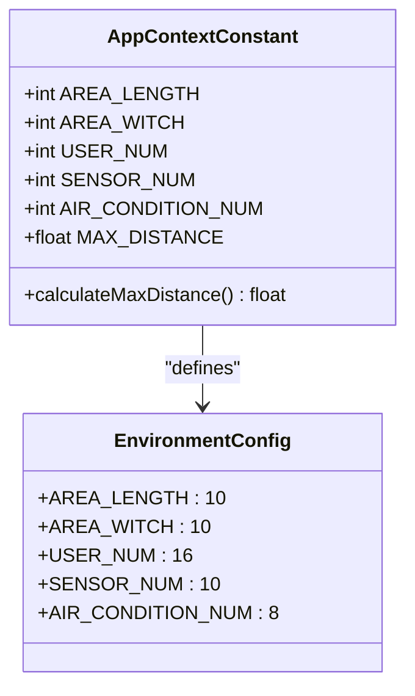
```mermaid
classDiagram
class AppContextConstant {
+int AREA_LENGTH
+int AREA_WITCH
+int USER_NUM
+int SENSOR_NUM
+int AIR_CONDITION_NUM
+float MAX_DISTANCE
+calculateMaxDistance() float
}
class EnvironmentConfig {
+AREA_LENGTH : 10
+AREA_WITCH : 10
+USER_NUM : 16
+SENSOR_NUM : 10
+AIR_CONDITION_NUM : 8
}
AppContextConstant --> EnvironmentConfig : "defines"
```

**图表来源**
- [AppContextConstant.java](file://src/main/java/com/leavesfly/iac/config/AppContextConstant.java#L15-L35)

#### 区域尺寸配置
- **AREA_LENGTH**: 区域长度为10米
- **AREA_WITCH**: 区域宽度为10米
- **最大距离计算**: 基于区域大小和传感器数量计算得出

```java
public static final float MAX_DISTANCE = (float) Math.pow(
    ((AREA_LENGTH * AREA_WITCH / SENSOR_NUM) * 3.0f) / Math.PI, 0.5f);
```

#### 设备数量配置
- **USER_NUM**: 用户数量为16个
- **SENSOR_NUM**: 传感器数量为10个
- **AIR_CONDITION_NUM**: 空调数量为8个

### 用户舒适度参数

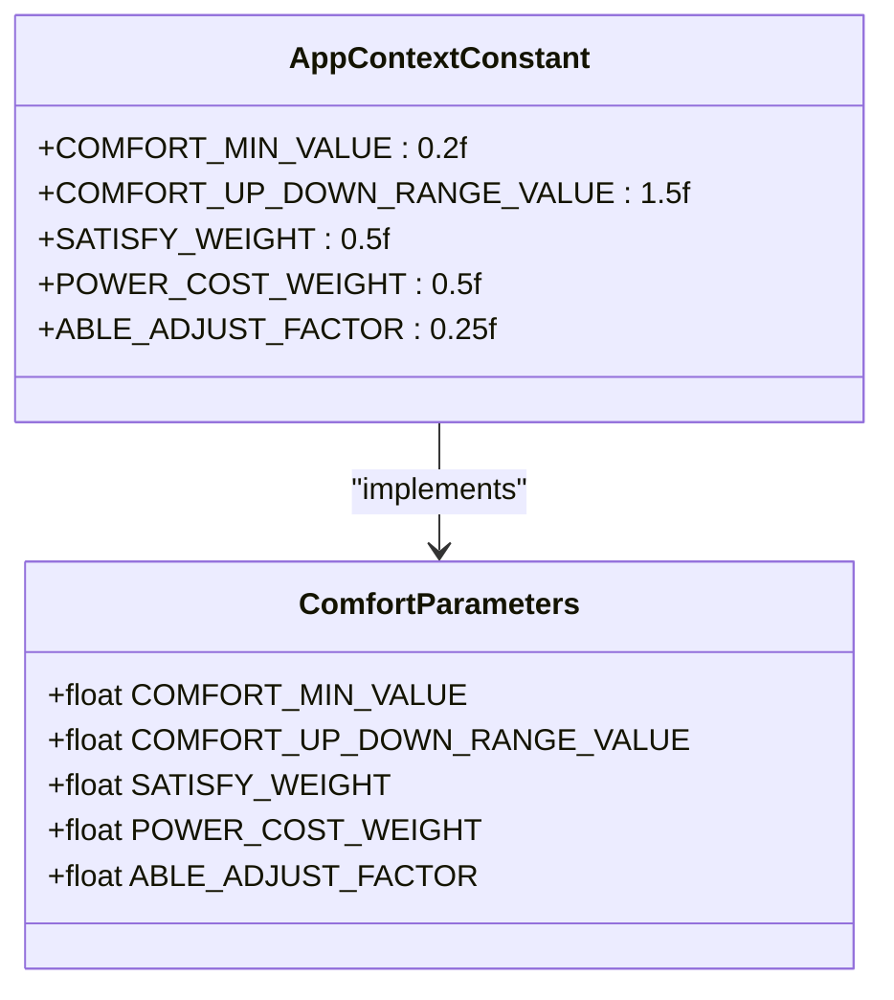
```mermaid
classDiagram
class ComfortParameters {
+float COMFORT_MIN_VALUE
+float COMFORT_UP_DOWN_RANGE_VALUE
+float SATISFY_WEIGHT
+float POWER_COST_WEIGHT
+float ABLE_ADJUST_FACTOR
}
class AppContextConstant {
+COMFORT_MIN_VALUE : 0.2f
+COMFORT_UP_DOWN_RANGE_VALUE : 1.5f
+SATISFY_WEIGHT : 0.5f
+POWER_COST_WEIGHT : 0.5f
+ABLE_ADJUST_FACTOR : 0.25f
}
AppContextConstant --> ComfortParameters : "implements"
```

**图表来源**
- [AppContextConstant.java](file://src/main/java/com/leavesfly/iac/config/AppContextConstant.java#L37-L55)

#### 舒适度权重配置
- **COMFORT_MIN_VALUE**: 舒适度最小值阈值为0.2
- **COMFORT_UP_DOWN_RANGE_VALUE**: 舒适度上下调整范围为1.5
- **SATISFY_WEIGHT**: 满意度权重为0.5（对应POWER_COST_WEIGHT为0.5）

### 空调设备参数

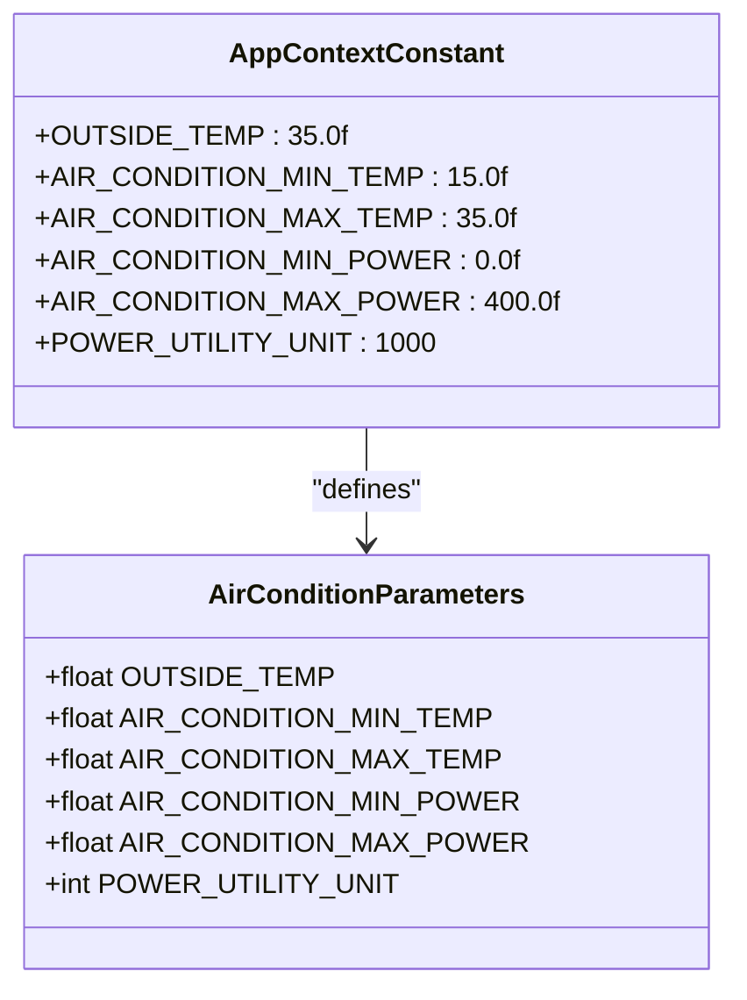
```mermaid
classDiagram
class AirConditionParameters {
+float OUTSIDE_TEMP
+float AIR_CONDITION_MIN_TEMP
+float AIR_CONDITION_MAX_TEMP
+float AIR_CONDITION_MIN_POWER
+float AIR_CONDITION_MAX_POWER
+int POWER_UTILITY_UNIT
}
class AppContextConstant {
+OUTSIDE_TEMP : 35.0f
+AIR_CONDITION_MIN_TEMP : 15.0f
+AIR_CONDITION_MAX_TEMP : 35.0f
+AIR_CONDITION_MIN_POWER : 0.0f
+AIR_CONDITION_MAX_POWER : 400.0f
+POWER_UTILITY_UNIT : 1000
}
AppContextConstant --> AirConditionParameters : "defines"
```

**图表来源**
- [AppContextConstant.java](file://src/main/java/com/leavesfly/iac/config/AppContextConstant.java#L57-L85)

#### 温度参数
- **OUTSIDE_TEMP**: 室外温度为35°C
- **AIR_CONDITION_MIN_TEMP**: 空调最低温度为15°C
- **AIR_CONDITION_MAX_TEMP**: 空调最高温度等于室外温度（35°C）

#### 功率参数
- **AIR_CONDITION_MIN_POWER**: 空调最小功率为0.0
- **AIR_CONDITION_MAX_POWER**: 空调最大功率为400.0瓦
- **POWER_UTILITY_UNIT**: 功率效用单位为1000

### 文件路径配置

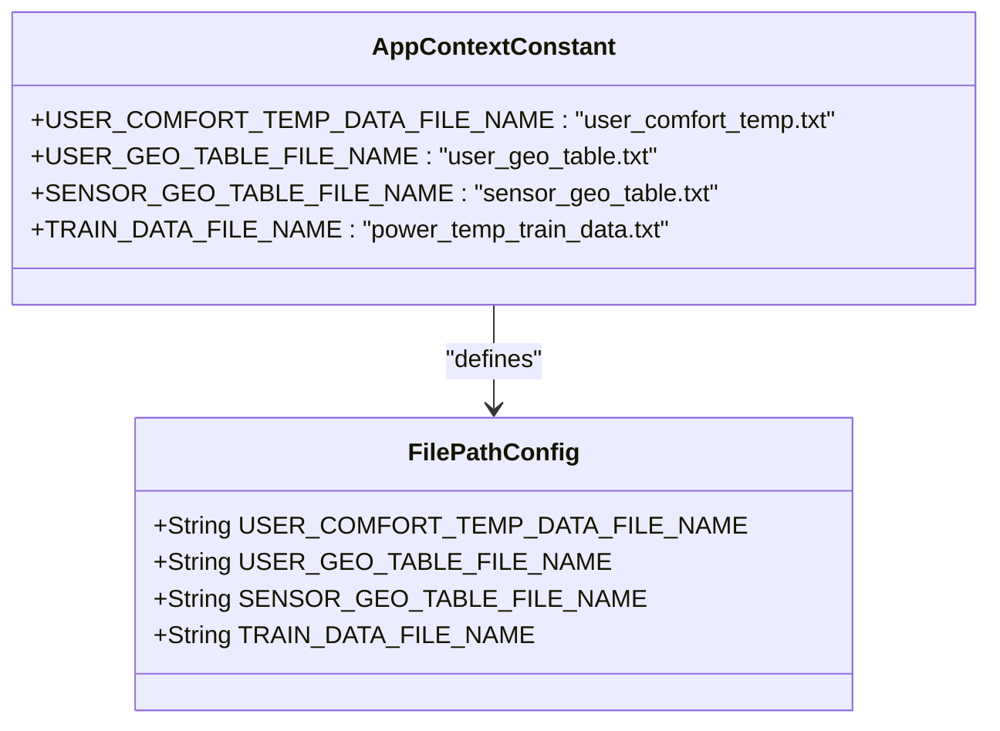
```mermaid
classDiagram
class FilePathConfig {
+String USER_COMFORT_TEMP_DATA_FILE_NAME
+String USER_GEO_TABLE_FILE_NAME
+String SENSOR_GEO_TABLE_FILE_NAME
+String TRAIN_DATA_FILE_NAME
}
class AppContextConstant {
+USER_COMFORT_TEMP_DATA_FILE_NAME : "user_comfort_temp.txt"
+USER_GEO_TABLE_FILE_NAME : "user_geo_table.txt"
+SENSOR_GEO_TABLE_FILE_NAME : "sensor_geo_table.txt"
+TRAIN_DATA_FILE_NAME : "power_temp_train_data.txt"
}
AppContextConstant --> FilePathConfig : "defines"
```

**图表来源**
- [AppContextConstant.java](file://src/main/java/com/leavesfly/iac/config/AppContextConstant.java#L87-L95)

### 解决方案命名规则

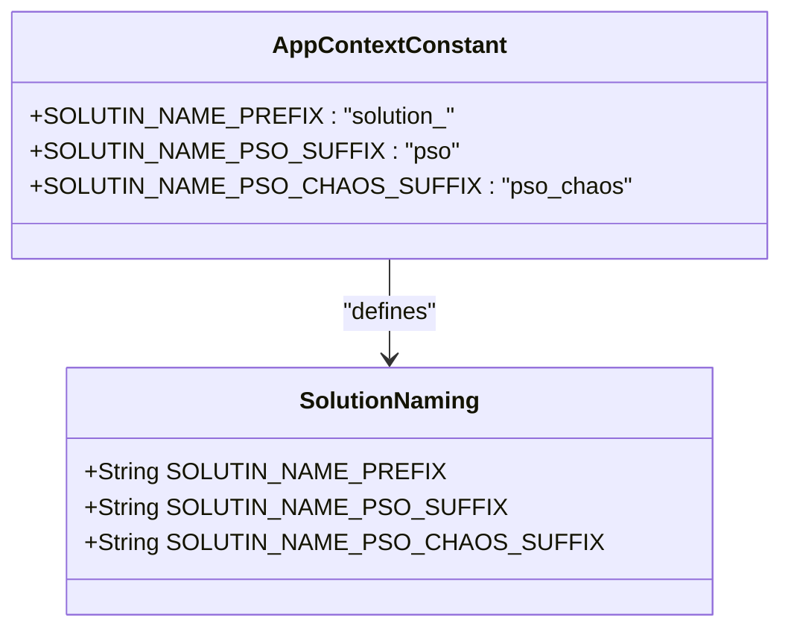
```mermaid
classDiagram
class SolutionNaming {
+String SOLUTIN_NAME_PREFIX
+String SOLUTIN_NAME_PSO_SUFFIX
+String SOLUTIN_NAME_PSO_CHAOS_SUFFIX
}
class AppContextConstant {
+SOLUTIN_NAME_PREFIX : "solution_"
+SOLUTIN_NAME_PSO_SUFFIX : "pso"
+SOLUTIN_NAME_PSO_CHAOS_SUFFIX : "pso_chaos"
}
AppContextConstant --> SolutionNaming : "defines"
```

**图表来源**
- [AppContextConstant.java](file://src/main/java/com/leavesfly/iac/config/AppContextConstant.java#L122-L130)

**章节来源**
- [AppContextConstant.java](file://src/main/java/com/leavesfly/iac/config/AppContextConstant.java#L1-L150)

## PsoAlgorithmConstant PSO算法参数配置

PsoAlgorithmConstant类专门定义了粒子群优化（PSO）算法的各种参数和配置常量，这些参数直接影响算法的收敛速度、精度和稳定性。

### PSO算法核心参数

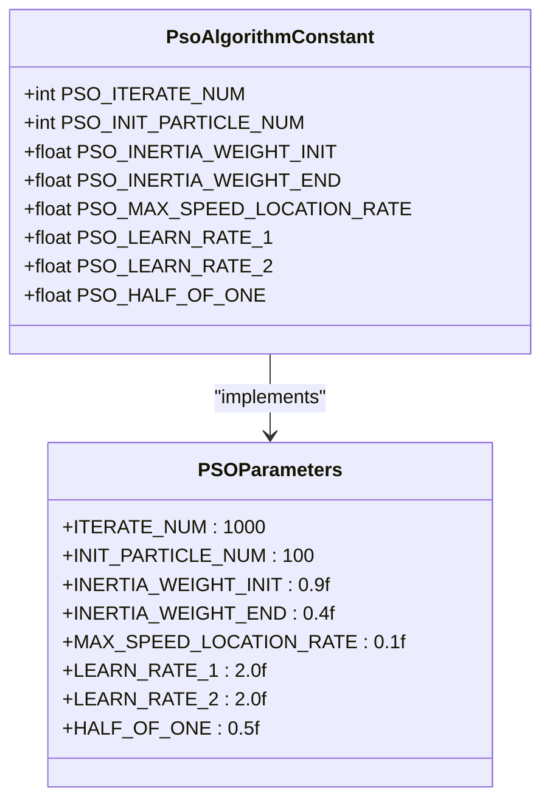
```mermaid
classDiagram
class PsoAlgorithmConstant {
+int PSO_ITERATE_NUM
+int PSO_INIT_PARTICLE_NUM
+float PSO_INERTIA_WEIGHT_INIT
+float PSO_INERTIA_WEIGHT_END
+float PSO_MAX_SPEED_LOCATION_RATE
+float PSO_LEARN_RATE_1
+float PSO_LEARN_RATE_2
+float PSO_HALF_OF_ONE
}
class PSOParameters {
+ITERATE_NUM : 1000
+INIT_PARTICLE_NUM : 100
+INERTIA_WEIGHT_INIT : 0.9f
+INERTIA_WEIGHT_END : 0.4f
+MAX_SPEED_LOCATION_RATE : 0.1f
+LEARN_RATE_1 : 2.0f
+LEARN_RATE_2 : 2.0f
+HALF_OF_ONE : 0.5f
}
PsoAlgorithmConstant --> PSOParameters : "implements"
```

**图表来源**
- [PsoAlgorithmConstant.java](file://src/main/java/com/leavesfly/iac/config/PsoAlgorithmConstant.java#L15-L52)

### 迭代参数配置

#### PSO_ITERATE_NUM
- **默认值**: 1000次迭代
- **作用**: 控制PSO算法的最大迭代次数
- **影响**: 迭代次数越多，算法越有可能找到全局最优解，但计算时间也会增加

#### PSO_INIT_PARTICLE_NUM
- **默认值**: 100个粒子
- **作用**: 初始化粒子群的数量
- **影响**: 粒子数量影响搜索空间的覆盖程度，过多可能导致计算资源浪费，过少可能影响搜索质量

### 惯性权重参数

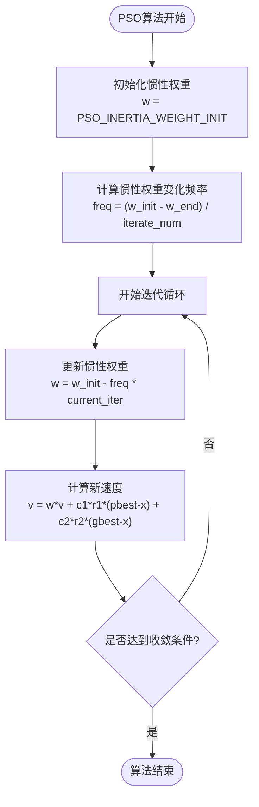
```mermaid
flowchart TD
Start([PSO算法开始]) --> InitWeight["初始化惯性权重<br/>w = PSO_INERTIA_WEIGHT_INIT"]
InitWeight --> CalcFreq["计算惯性权重变化频率<br/>freq = (w_init - w_end) / iterate_num"]
CalcFreq --> Iterate["开始迭代循环"]
Iterate --> UpdateWeight["更新惯性权重<br/>w = w_init - freq * current_iter"]
UpdateWeight --> CalcVelocity["计算新速度<br/>v = w*v + c1*r1*(pbest-x) + c2*r2*(gbest-x)"]
CalcVelocity --> CheckConverge{"是否达到收敛条件?"}
CheckConverge --> |否| Iterate
CheckConverge --> |是| End([算法结束])
```

**图表来源**
- [Particle.java](file://src/main/java/com/leavesfly/iac/execute/scheduler/pso/Particle.java#L47-L52)

#### PSO_INERTIA_WEIGHT_INIT
- **默认值**: 0.9
- **作用**: 初始惯性权重，控制粒子保持原有运动状态的程度
- **影响**: 较高的初始惯性权重有利于全局搜索，但可能导致收敛速度变慢

#### PSO_INERTIA_WEIGHT_END
- **默认值**: 0.4
- **作用**: 结束时的惯性权重
- **影响**: 较低的结束惯性权重有助于算法后期的精细搜索

### 学习因子参数

#### PSO_LEARN_RATE_1
- **默认值**: 2.0
- **作用**: 个体学习因子，控制粒子向自身最佳位置移动的倾向
- **影响**: 影响粒子的局部搜索能力

#### PSO_LEARN_RATE_2
- **默认值**: 2.0
- **作用**: 社会学习因子，控制粒子向群体最佳位置移动的倾向
- **影响**: 影响粒子的全局搜索能力

### 速度限制参数

#### PSO_MAX_SPEED_LOCATION_RATE
- **默认值**: 0.1
- **作用**: 最大速度与位置比率，限制粒子的速度范围
- **影响**: 防止粒子在搜索空间中移动过快，确保算法稳定性

### 辅助常量

#### PSO_HALF_OF_ONE
- **默认值**: 0.5
- **作用**: PSO算法中的常数0.5
- **用途**: 在速度更新过程中用于随机决策

**章节来源**
- [PsoAlgorithmConstant.java](file://src/main/java/com/leavesfly/iac/config/PsoAlgorithmConstant.java#L1-L53)

## BpAlgorithmConstant BP神经网络参数配置

BpAlgorithmConstant类定义了BP（反向传播）神经网络算法的各种超参数和配置常量，这些参数决定了神经网络的结构、训练过程和性能表现。

### 神经网络结构配置

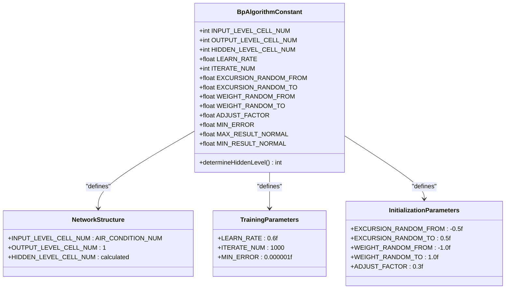
```mermaid
classDiagram
class BpAlgorithmConstant {
+int INPUT_LEVEL_CELL_NUM
+int OUTPUT_LEVEL_CELL_NUM
+int HIDDEN_LEVEL_CELL_NUM
+float LEARN_RATE
+int ITERATE_NUM
+float EXCURSION_RANDOM_FROM
+float EXCURSION_RANDOM_TO
+float WEIGHT_RANDOM_FROM
+float WEIGHT_RANDOM_TO
+float ADJUST_FACTOR
+float MIN_ERROR
+float MAX_RESULT_NORMAL
+float MIN_RESULT_NORMAL
+determineHiddenLevel() int
}
class NetworkStructure {
+INPUT_LEVEL_CELL_NUM : AIR_CONDITION_NUM
+OUTPUT_LEVEL_CELL_NUM : 1
+HIDDEN_LEVEL_CELL_NUM : calculated
}
class TrainingParameters {
+LEARN_RATE : 0.6f
+ITERATE_NUM : 1000
+MIN_ERROR : 0.000001f
}
class InitializationParameters {
+EXCURSION_RANDOM_FROM : -0.5f
+EXCURSION_RANDOM_TO : 0.5f
+WEIGHT_RANDOM_FROM : -1.0f
+WEIGHT_RANDOM_TO : 1.0f
+ADJUST_FACTOR : 0.3f
}
BpAlgorithmConstant --> NetworkStructure : "defines"
BpAlgorithmConstant --> TrainingParameters : "defines"
BpAlgorithmConstant --> InitializationParameters : "defines"
```

**图表来源**
- [BpAlgorithmConstant.java](file://src/main/java/com/leavesfly/iac/config/BpAlgorithmConstant.java#L15-L105)

### 网络结构参数

#### 输入层节点数
- **INPUT_LEVEL_CELL_NUM**: 等于空调数量（AppContextConstant.AIR_CONDITION_NUM）
- **作用**: 表示输入层的节点数量，对应空调系统的输入特征
- **影响**: 决定了神经网络接收的输入维度

#### 输出层节点数
- **OUTPUT_LEVEL_CELL_NUM**: 固定为1
- **作用**: 表示输出层的节点数量，对应单一输出结果
- **影响**: 简化了网络结构，便于处理标量输出

#### 隐藏层节点数
- **HIDDEN_LEVEL_CELL_NUM**: 通过公式动态计算得出
- **计算公式**: 
```java
hidden = sqrt(0.43*input^2 + 0.12*output^2 + 2.54*input + 0.77*output + 0.35) + 0.51
```

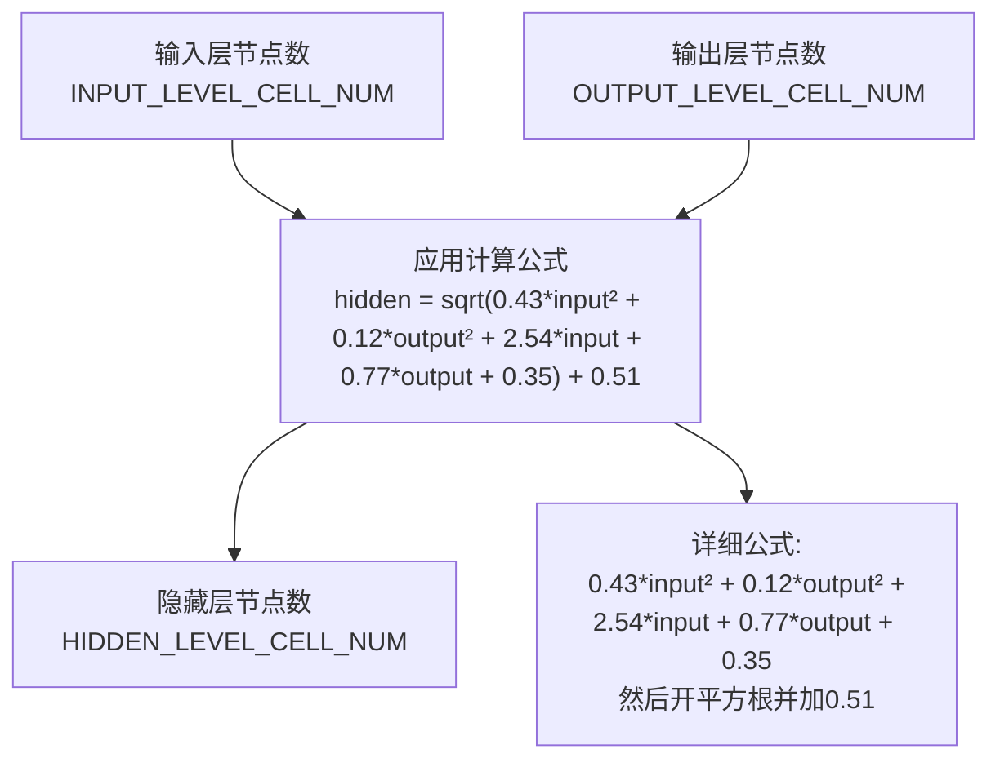
```mermaid
flowchart TD
Input["输入层节点数<br/>INPUT_LEVEL_CELL_NUM"] --> Formula["应用计算公式<br/>hidden = sqrt(0.43*input² + 0.12*output² + 2.54*input + 0.77*output + 0.35) + 0.51"]
Output["输出层节点数<br/>OUTPUT_LEVEL_CELL_NUM"] --> Formula
Formula --> Hidden["隐藏层节点数<br/>HIDDEN_LEVEL_CELL_NUM"]
Formula --> Detail["详细公式:<br/>0.43*input² + 0.12*output² +<br/>2.54*input + 0.77*output + 0.35<br/>然后开平方根并加0.51"]
```

**图表来源**
- [BpAlgorithmConstant.java](file://src/main/java/com/leavesfly/iac/config/BpAlgorithmConstant.java#L75-L85)

### 学习参数

#### LEARN_RATE
- **默认值**: 0.6
- **作用**: 学习率，控制权重更新的步长
- **影响**: 
  - 较大的学习率可能导致训练不稳定
  - 较小的学习率需要更多迭代次数

#### ITERATE_NUM
- **默认值**: 1000
- **作用**: 最大迭代次数
- **影响**: 控制训练过程的终止条件

#### MIN_ERROR
- **默认值**: 0.000001
- **作用**: 最小误差阈值
- **影响**: 当误差小于该值时，训练提前终止

### 权重和偏移量初始化参数

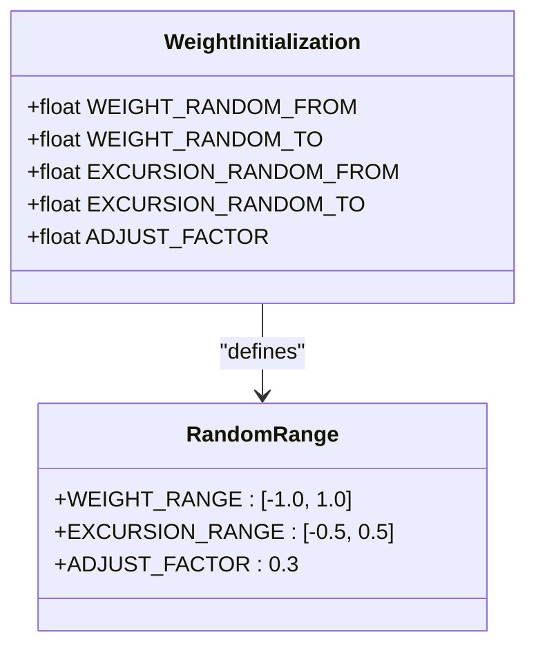
```mermaid
classDiagram
class WeightInitialization {
+float WEIGHT_RANDOM_FROM
+float WEIGHT_RANDOM_TO
+float EXCURSION_RANDOM_FROM
+float EXCURSION_RANDOM_TO
+float ADJUST_FACTOR
}
class RandomRange {
+WEIGHT_RANGE : [-1.0, 1.0]
+EXCURSION_RANGE : [-0.5, 0.5]
+ADJUST_FACTOR : 0.3
}
WeightInitialization --> RandomRange : "defines"
```

**图表来源**
- [BpAlgorithmConstant.java](file://src/main/java/com/leavesfly/iac/config/BpAlgorithmConstant.java#L45-L65)

#### 权重初始化范围
- **WEIGHT_RANDOM_FROM**: -1.0
- **WEIGHT_RANDOM_TO**: 1.0
- **作用**: 权重的随机初始化范围
- **影响**: 合理的初始化范围有助于避免梯度消失或爆炸问题

#### 偏移量初始化范围
- **EXCURSION_RANDOM_FROM**: -0.5
- **EXCURSION_RANDOM_TO**: 0.5
- **作用**: 偏移量的随机初始化范围
- **影响**: 类似于权重初始化，影响网络的初始状态

#### ADJUST_FACTOR
- **默认值**: 0.3
- **作用**: 调整因子，用于某些调整操作
- **影响**: 在网络调整过程中使用

### 结果归一化参数

#### 结果范围配置
- **MAX_RESULT_NORMAL**: 等于空调最高温度（AppContextConstant.AIR_CONDITION_MAX_TEMP）
- **MIN_RESULT_NORMAL**: 等于空调最低温度（AppContextConstant.AIR_CONDITION_MIN_TEMP）

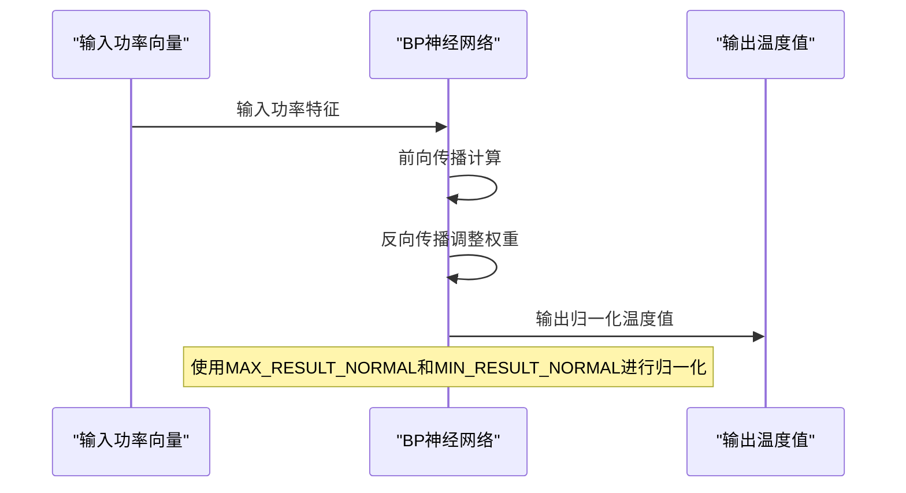
```mermaid
sequenceDiagram
participant Input as "输入功率向量"
participant NN as "BP神经网络"
participant Output as "输出温度值"
Input->>NN : 输入功率特征
NN->>NN : 前向传播计算
NN->>NN : 反向传播调整权重
NN->>Output : 输出归一化温度值
Note over NN : 使用MAX_RESULT_NORMAL和MIN_RESULT_NORMAL进行归一化
```

**图表来源**
- [BpnnModel.java](file://src/main/java/com/leavesfly/iac/train/trainer/bp/BpnnModel.java#L105-L110)

**章节来源**
- [BpAlgorithmConstant.java](file://src/main/java/com/leavesfly/iac/config/BpAlgorithmConstant.java#L1-L106)

## 配置参数详解与影响分析

### 参数间依赖关系

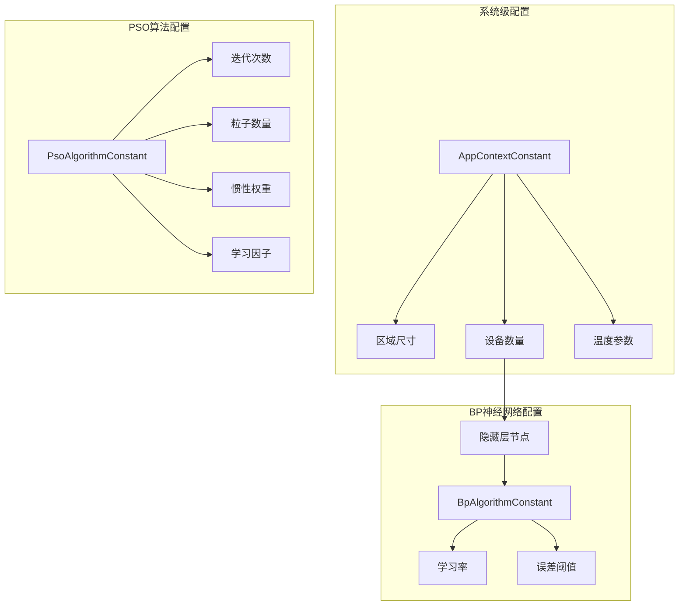
```mermaid
graph TB
subgraph "系统级配置"
APP[AppContextConstant]
AREA[区域尺寸]
DEVICE[设备数量]
TEMP[温度参数]
end
subgraph "PSO算法配置"
PSO[PsoAlgorithmConstant]
ITER[迭代次数]
PARTICLE[粒子数量]
WEIGHT[惯性权重]
FACTOR[学习因子]
end
subgraph "BP神经网络配置"
BP[BpAlgorithmConstant]
HIDDEN[隐藏层节点]
LEARN[学习率]
ERROR[误差阈值]
end
APP --> AREA
APP --> DEVICE
APP --> TEMP
DEVICE --> HIDDEN
PSO --> ITER
PSO --> PARTICLE
PSO --> WEIGHT
PSO --> FACTOR
HIDDEN --> BP
BP --> LEARN
BP --> ERROR
```

### 关键参数影响分析

#### 系统级参数影响
1. **区域尺寸（AREA_LENGTH, AREA_WITCH）**
   - 影响最大距离计算
   - 决定传感器部署密度
   - 影响用户分布模拟

2. **设备数量（USER_NUM, SENSOR_NUM, AIR_CONDITION_NUM）**
   - 影响计算复杂度
   - 决定网络结构规模
   - 影响仿真精度

#### PSO算法参数影响
1. **惯性权重范围（PSO_INERTIA_WEIGHT_INIT, PSO_INERTIA_WEIGHT_END）**
   - 初始权重高：全局搜索能力强
   - 结束权重低：局部搜索精度高
   - 影响收敛速度和精度平衡

2. **学习因子（PSO_LEARN_RATE_1, PSO_LEARN_RATE_2）**
   - 个体学习因子：影响粒子记忆能力
   - 社会学习因子：影响群体协作能力
   - 两者的平衡决定搜索策略

#### BP神经网络参数影响
1. **隐藏层节点数（HIDDEN_LEVEL_CELL_NUM）**
   - 由输入输出节点数动态计算
   - 影响网络表达能力
   - 过多导致过拟合，过少导致欠拟合

2. **学习率（LEARN_RATE）**
   - 大学习率：快速收敛，可能震荡
   - 小学习率：稳定收敛，可能过慢
   - 需要根据具体任务调整

### 性能影响对比

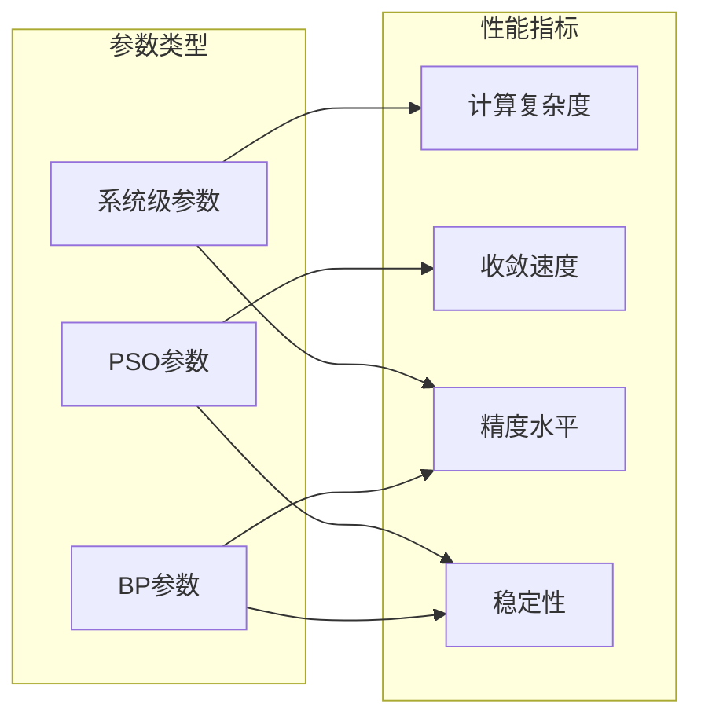
```mermaid
graph LR
subgraph "参数类型"
A[系统级参数]
B[PSO参数]
C[BP参数]
end
subgraph "性能指标"
D[计算复杂度]
E[收敛速度]
F[精度水平]
G[稳定性]
end
A --> D
A --> F
B --> E
B --> G
C --> F
C --> G
```

## 参数优化指南

### 系统级参数优化

#### 区域尺寸调整
- **增大区域尺寸**: 提高仿真真实性，但增加计算复杂度
- **减小区域尺寸**: 降低计算负担，但可能失去部分细节
- **建议**: 根据实际应用场景调整，通常10×10米适合大多数办公室场景

#### 设备数量优化
- **用户数量**: 根据实际用户规模调整，避免过度简化
- **传感器数量**: 确保覆盖整个区域，建议至少每10平方米一个传感器
- **空调数量**: 与用户数量匹配，考虑空调容量和效率

### PSO算法参数优化

#### 迭代次数调整
```java
// 增加迭代次数提高精度
public static final int PSO_ITERATE_NUM = 2000;

// 减少迭代次数提高效率  
public static final int PSO_ITERATE_NUM = 500;
```

#### 粒子数量优化
```java
// 增加粒子数量提高搜索质量
public static final int PSO_INIT_PARTICLE_NUM = 200;

// 减少粒子数量提高计算效率
public static final int PSO_INIT_PARTICLE_NUM = 50;
```

#### 惯性权重策略
```java
// 快速收敛策略
public static final float PSO_INERTIA_WEIGHT_INIT = 0.8f;
public static final float PSO_INERTIA_WEIGHT_END = 0.3f;

// 精确搜索策略
public static final float PSO_INERTIA_WEIGHT_INIT = 0.95f;
public static final float PSO_INERTIA_WEIGHT_END = 0.4f;
```

### BP神经网络参数优化

#### 学习率调整
```java
// 对于复杂非线性问题
public static final float LEARN_RATE = 0.8f;

// 对于简单线性问题
public static final float LEARN_RATE = 0.3f;
```

#### 隐藏层节点数优化
```java
// 根据输入输出特征复杂度调整
public static int determineHiddenLevel(int inputLevelNum, int outputLevelNum) {
    // 复杂问题：增加隐藏层节点
    return Math.round(Math.sqrt(inputLevelNum * outputLevelNum) * 1.5f);
}
```

#### 训练停止条件
```java
// 更严格的停止条件
public static final float MIN_ERROR = 0.0000001f;

// 更宽松的停止条件
public static final float MIN_ERROR = 0.0001f;
```

### 参数调优流程

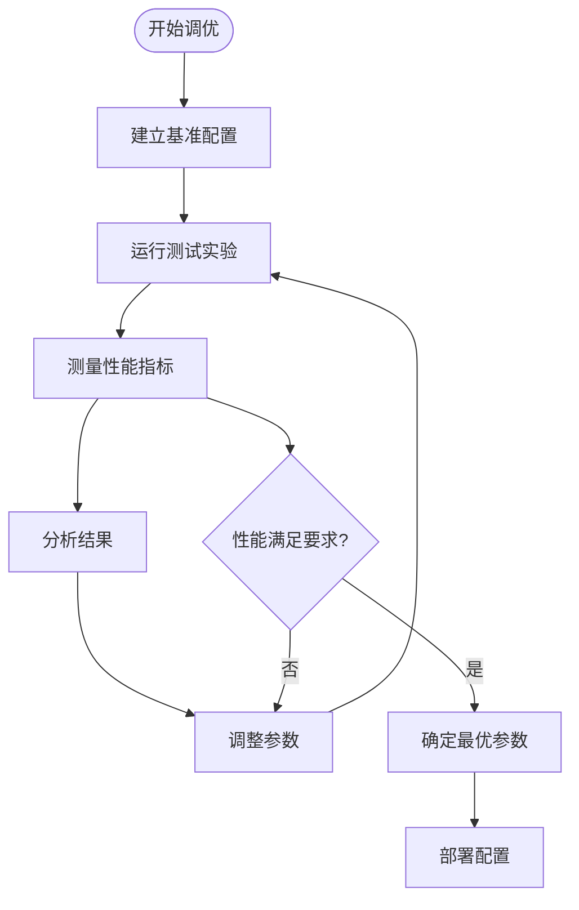
```mermaid
flowchart TD
Start([开始调优]) --> Baseline["建立基准配置"]
Baseline --> Test["运行测试实验"]
Test --> Measure["测量性能指标"]
Measure --> Analyze["分析结果"]
Analyze --> Adjust["调整参数"]
Adjust --> Test
Measure --> Good{"性能满足要求?"}
Good --> |是| Optimal["确定最优参数"]
Good --> |否| Adjust
Optimal --> Deploy["部署配置"]
```

## 配置文件映射关系

### 配置文件层次结构

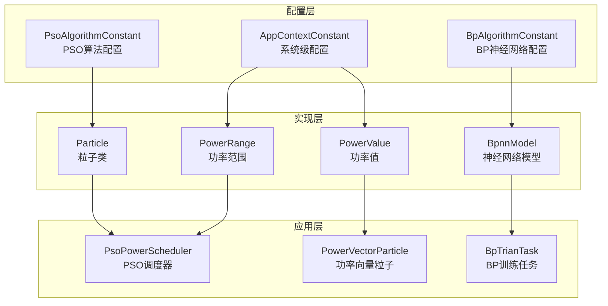
```mermaid
graph TD
subgraph "配置层"
A[AppContextConstant<br/>系统级配置]
B[PsoAlgorithmConstant<br/>PSO算法配置]
C[BpAlgorithmConstant<br/>BP神经网络配置]
end
subgraph "实现层"
D[PowerRange<br/>功率范围]
E[PowerValue<br/>功率值]
F[Particle<br/>粒子类]
G[BpnnModel<br/>神经网络模型]
end
subgraph "应用层"
H[PsoPowerScheduler<br/>PSO调度器]
I[PowerVectorParticle<br/>功率向量粒子]
J[BpTrianTask<br/>BP训练任务]
end
A --> D
A --> E
B --> F
C --> G
D --> H
E --> I
F --> H
G --> J
```

### 配置参数传递链路

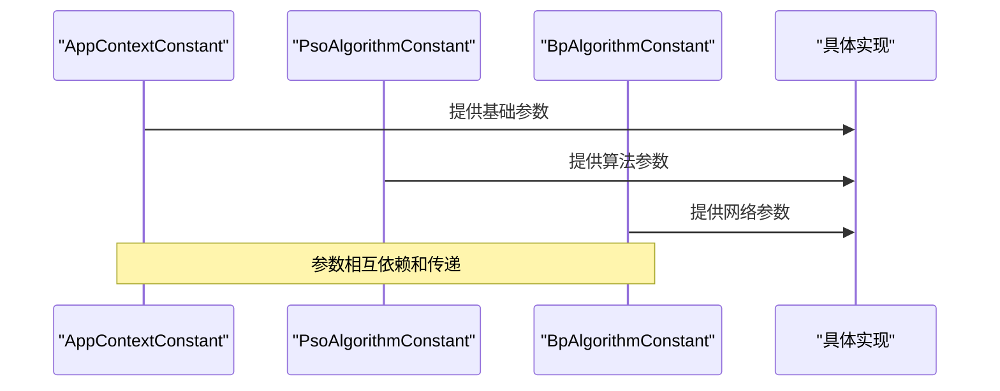
```mermaid
sequenceDiagram
participant App as "AppContextConstant"
participant PSO as "PsoAlgorithmConstant"
participant BP as "BpAlgorithmConstant"
participant Impl as "具体实现"
App->>Impl : 提供基础参数
PSO->>Impl : 提供算法参数
BP->>Impl : 提供网络参数
Note over App,BP : 参数相互依赖和传递
```

### 实际应用示例

#### PSO算法配置应用
```java
// PSO算法参数应用示例
Particle<T>[] particles = new PowerVectorParticle[PSO_INIT_PARTICLE_NUM];
for (int i = 0; i < PSO_INIT_PARTICLE_NUM; i++) {
    particles[i] = new PowerVectorParticle(powerRangeArray);
}

PsoAlgorithm<T> algorithm = new PsoAlgorithm<>(particles);
PowerValue[] bestSolution = algorithm.findBestLocation(PSO_ITERATE_NUM);
```

#### BP神经网络配置应用
```java
// BP神经网络参数应用示例
BpnnModel model = new BpnnModel(
    INPUT_LEVEL_CELL_NUM,
    HIDDEN_LEVEL_CELL_NUM,
    OUTPUT_LEVEL_CELL_NUM,
    LEARN_RATE,
    ITERATE_NUM
);
```

**章节来源**
- [Particle.java](file://src/main/java/com/leavesfly/iac/execute/scheduler/pso/Particle.java#L1-L105)
- [BpnnModel.java](file://src/main/java/com/leavesfly/iac/train/trainer/bp/BpnnModel.java#L1-L100)

## 故障排除指南

### 常见配置问题及解决方案

#### PSO算法相关问题

##### 问题1: 算法不收敛
**症状**: PSO算法在预设迭代次数内无法找到满意解
**可能原因**:
- 惯性权重范围不合适
- 学习因子过大或过小
- 粒子数量不足

**解决方案**:
```java
// 调整惯性权重范围
public static final float PSO_INERTIA_WEIGHT_INIT = 0.8f;  // 降低初始权重
public static final float PSO_INERTIA_WEIGHT_END = 0.3f;   // 增加结束权重

// 调整学习因子
public static final float PSO_LEARN_RATE_1 = 1.5f;         // 减少个体学习
public static final float PSO_LEARN_RATE_2 = 1.5f;         // 减少社会学习

// 增加粒子数量
public static final int PSO_INIT_PARTICLE_NUM = 150;      // 增加到150
```

##### 问题2: 收敛过快导致局部最优
**症状**: 算法很快收敛但解质量不高
**可能原因**:
- 惯性权重下降过快
- 学习因子过小

**解决方案**:
```java
// 缓慢减少惯性权重
public static final float PSO_INERTIA_WEIGHT_INIT = 0.9f;
public static final float PSO_INERTIA_WEIGHT_END = 0.5f;

// 增加学习因子
public static final float PSO_LEARN_RATE_1 = 2.5f;
public static final float PSO_LEARN_RATE_2 = 2.5f;
```

#### BP神经网络相关问题

##### 问题3: 训练不收敛
**症状**: 神经网络训练过程中误差不下降
**可能原因**:
- 学习率过大
- 隐藏层节点数不足
- 权重初始化不当

**解决方案**:
```java
// 降低学习率
public static final float LEARN_RATE = 0.3f;

// 增加隐藏层节点数
public static int determineHiddenLevel(int inputLevelNum, int outputLevelNum) {
    return Math.round(Math.sqrt(inputLevelNum * outputLevelNum) * 2.0f);
}

// 调整权重初始化范围
public static final float WEIGHT_RANDOM_FROM = -0.5f;
public static final float WEIGHT_RANDOM_TO = 0.5f;
```

##### 问题4: 过拟合现象
**症状**: 训练误差很低但测试误差很高
**可能原因**:
- 隐藏层节点数过多
- 训练数据不足
- 正则化缺失

**解决方案**:
```java
// 减少隐藏层节点数
public static int determineHiddenLevel(int inputLevelNum, int outputLevelNum) {
    return Math.round(Math.sqrt(inputLevelNum * outputLevelNum) * 1.0f);
}

// 增加正则化项
public static final float REGULARIZATION_LAMBDA = 0.01f;
```

### 性能监控指标

#### PSO算法性能指标
- **收敛速度**: 达到满意解所需的迭代次数
- **解的质量**: 最优解的目标函数值
- **稳定性**: 不同运行间的解的一致性

#### BP神经网络性能指标
- **训练误差**: 训练集上的预测误差
- **验证误差**: 验证集上的预测误差
- **泛化能力**: 测试集上的预测性能

### 调试工具和技巧

#### 参数可视化
```java
// 添加参数监控日志
public static void logParameterStatus() {
    System.out.println("PSO Parameters:");
    System.out.println("  Iterations: " + PSO_ITERATE_NUM);
    System.out.println("  Particles: " + PSO_INIT_PARTICLE_NUM);
    System.out.println("  Inertia Range: " + PSO_INERTIA_WEIGHT_INIT + " -> " + PSO_INERTIA_WEIGHT_END);
    
    System.out.println("BP Parameters:");
    System.out.println("  Learning Rate: " + LEARN_RATE);
    System.out.println("  Hidden Nodes: " + HIDDEN_LEVEL_CELL_NUM);
    System.out.println("  Max Iterations: " + ITERATE_NUM);
}
```

#### 性能基准测试
```java
// 性能基准测试框架
public class ParameterBenchmark {
    public static void benchmarkPSOParameters() {
        // 测试不同参数组合的效果
        // 记录收敛时间、解质量和稳定性指标
    }
    
    public static void benchmarkBPParameters() {
        // 测试不同网络结构和学习参数的效果
        // 记录训练时间、训练误差和测试误差
    }
}
```

## 总结

本文档详细介绍了智能空调仿真平台中的三个核心配置类，包括：

### 主要发现

1. **AppContextConstant**: 定义了系统级常量，涵盖环境参数、用户舒适度参数、空调设备参数和文件路径配置
2. **PsoAlgorithmConstant**: 专门针对PSO算法的参数配置，包括迭代次数、粒子数量、惯性权重范围和学习因子
3. **BpAlgorithmConstant**: 定义了BP神经网络的超参数，包括网络结构、学习参数、初始化范围和训练停止条件

### 配置优化要点

1. **参数间存在复杂的依赖关系**，需要综合考虑才能获得最佳效果
2. **不同参数对算法性能的影响各不相同**，需要针对性地进行调整
3. **配置参数的选择应基于具体的应用场景和性能需求**

### 最佳实践建议

1. **从基准配置开始**，逐步进行微调
2. **建立性能监控体系**，量化评估参数调整的效果
3