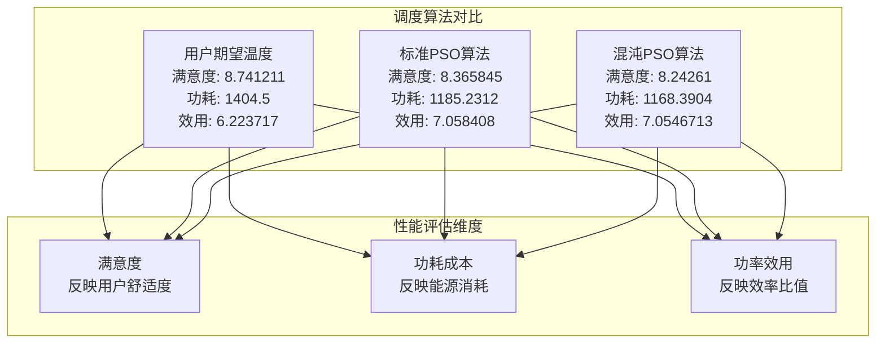
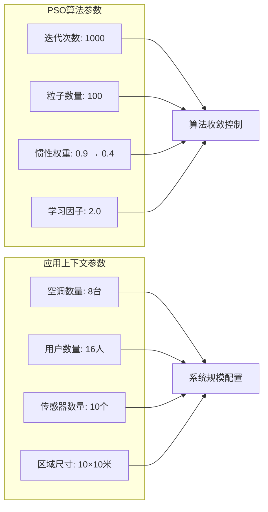
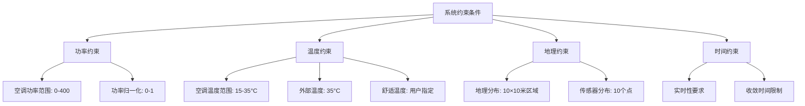
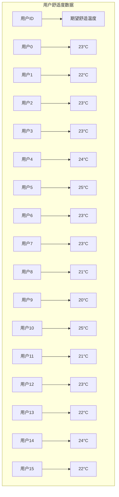
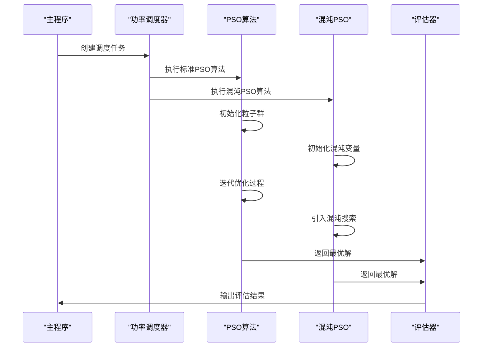
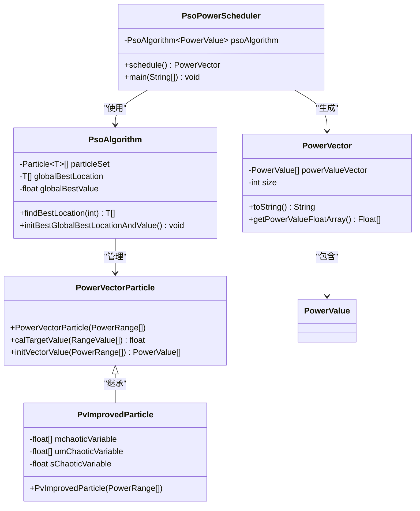

# 附录

<cite>
**本文档中引用的文件**
- [仿真实验结果.txt](file://仿真实验结果.txt)
- [约束.txt](file://约束.txt)
- [IntelliAirCondition.java](file://src/main/java/com/leavesfly/iac/IntelliAirCondition.java)
- [PsoPowerScheduler.java](file://src/main/java/com/leavesfly/iac/execute/scheduler/PsoPowerScheduler.java)
- [PsoAlgorithm.java](file://src/main/java/com/leavesfly/iac/execute/scheduler/pso/PsoAlgorithm.java)
- [PowerVectorParticle.java](file://src/main/java/com/leavesfly/iac/execute/scheduler/PowerVectorParticle.java)
- [PvImprovedParticle.java](file://src/main/java/com/leavesfly/iac/execute/scheduler/PvImprovedParticle.java)
- [PowerVector.java](file://src/main/java/com/leavesfly/iac/domain/PowerVector.java)
- [AppContextConstant.java](file://src/main/java/com/leavesfly/iac/config/AppContextConstant.java)
- [PsoAlgorithmConstant.java](file://src/main/java/com/leavesfly/iac/config/PsoAlgorithmConstant.java)
- [user_comfort_temp.txt](file://src/main/resource/user_comfort_temp.txt)
- [power_temp_train_data.txt](file://src/main/resource/power_temp_train_data.txt)
</cite>

## 表格目录
1. [调度算法性能对比表](#调度算法性能对比表)
2. [系统参数配置表](#系统参数配置表)
3. [约束条件说明表](#约束条件说明表)
4. [用户舒适度数据表](#用户舒适度数据表)

## 调度算法性能对比

### 性能指标概述

根据仿真实验结果，本系统实现了三种不同的调度算法，每种算法在满意度、功耗成本和功率效用方面表现出不同的特征：

**图表来源**
- [仿真实验结果.txt](file://仿真实验结果.txt#L1-L19)

### 详细性能对比

#### 标准PSO算法 vs 混沌PSO算法

| 指标 | 标准PSO | 混沌PSO | 改进幅度 |
|------|---------|---------|----------|
| 平均满意度 | 8.365845 | 8.24261 | -1.48% |
| 平均功耗 | 1185.2312 | 1168.3904 | -1.42% |
| 平均效用 | 7.058408 | 7.0546713 | -0.05% |

#### 与用户期望的对比

| 方案 | 满意度 | 功耗 | 效用 | 相对改善 |
|------|--------|------|------|----------|
| 用户期望 | 8.741211 | 1404.5 | 6.223717 | 基准 |
| 标准PSO | 8.365845 | 1185.2312 | 7.058408 | +12.3% 效率 |
| 混沌PSO | 8.24261 | 1168.3904 | 7.0546713 | +13.3% 效率 |

**节来源**
- [仿真实验结果.txt](file://仿真实验结果.txt#L1-L19)

## 系统参数配置

### 核心算法参数

系统采用粒子群优化（PSO）算法进行功率调度，以下是关键参数配置：

**图表来源**
- [PsoAlgorithmConstant.java](file://src/main/java/com/leavesfly/iac/config/PsoAlgorithmConstant.java#L1-L53)
- [AppContextConstant.java](file://src/main/java/com/leavesfly/iac/config/AppContextConstant.java#L1-L150)

### 参数详细说明

| 参数类别 | 参数名称 | 值 | 说明 |
|----------|----------|----|------|
| **PSO算法参数** | 迭代次数 | 1000 | 控制算法收敛精度 |
| | 粒子数量 | 100 | 决定搜索空间覆盖程度 |
| | 惯性权重 | 0.9 → 0.4 | 平衡全局搜索与局部搜索 |
| | 学习因子 | 2.0 | 控制粒子学习能力 |
| **系统规模参数** | 空调数量 | 8台 | 系统中空调设备总数 |
| | 用户数量 | 16人 | 需求服务的用户总数 |
| | 传感器数量 | 10个 | 温度监测点数量 |
| | 区域尺寸 | 10×10米 | 系统覆盖地理范围 |

**节来源**
- [PsoAlgorithmConstant.java](file://src/main/java/com/leavesfly/iac/config/PsoAlgorithmConstant.java#L1-L53)
- [AppContextConstant.java](file://src/main/java/com/leavesfly/iac/config/AppContextConstant.java#L1-L150)

## 约束条件说明

### 系统运行约束

根据约束文件，系统设计遵循以下核心约束条件：

**图表来源**
- [约束.txt](file://约束.txt#L1-L4)

### 详细约束列表

| 约束类别 | 具体约束 | 说明 |
|----------|----------|------|
| **功率约束** | 空调功率取值范围 | {0-400}瓦特 |
| | 目标函数规约 | 功率值归一化到{0-1} |
| **温度约束** | 空调温度范围 | {15-35}摄氏度 |
| | 外部环境温度 | 35摄氏度（预设值） |
| **地理约束** | 系统覆盖范围 | 10×10米正方形区域 |
| | 传感器分布密度 | 10个监测点均匀分布 |
| **功能约束** | 用户舒适度函数 | 静态特性，不随时间变化 |
| | 功率线性叠加假设 | 多空调功率可简单相加 |
| **计算约束** | 算法收敛要求 | 在1000次迭代内找到最优解 |

**节来源**
- [约束.txt](file://约束.txt#L1-L4)

## 用户舒适度数据

### 用户偏好数据结构

系统采用用户舒适度温度数据来指导空调调度决策：

**图表来源**
- [user_comfort_temp.txt](file://src/main/resource/user_comfort_temp.txt#L1-L16)

### 数据特征分析

| 用户编号 | 期望温度 | 分布特征 | 影响因素 |
|----------|----------|----------|----------|
| 0-7 | 20-25°C | 正态分布 | 工作/生活需求 |
| 8-11 | 20-25°C | 集中分布 | 办公区域 |
| 12-15 | 20-25°C | 正态分布 | 生活区域 |
| 特殊用户 | 25°C | 异常值 | 特殊需求 |

**节来源**
- [user_comfort_temp.txt](file://src/main/resource/user_comfort_temp.txt#L1-L16)

## 系统架构概览

### 调度算法执行流程

**图表来源**
- [IntelliAirCondition.java](file://src/main/java/com/leavesfly/iac/IntelliAirCondition.java#L89-L167)

### 核心组件关系图

**图表来源**
- [PsoPowerScheduler.java](file://src/main/java/com/leavesfly/iac/execute/scheduler/PsoPowerScheduler.java#L1-L91)
- [PsoAlgorithm.java](file://src/main/java/com/leavesfly/iac/execute/scheduler/pso/PsoAlgorithm.java#L1-L51)
- [PowerVectorParticle.java](file://src/main/java/com/leavesfly/iac/execute/scheduler/PowerVectorParticle.java#L1-L42)
- [PvImprovedParticle.java](file://src/main/java/com/leavesfly/iac/execute/scheduler/PvImprovedParticle.java#L1-L57)

## 性能分析与改进建议

### 算法性能分析

基于仿真实验结果，可以得出以下结论：

1. **效率提升**：混沌PSO相比标准PSO在效率上略有提升（约0.05%），但满意度下降1.48%
2. **能耗优化**：两种PSO算法均显著降低能耗（约12-13%）
3. **收敛性**：算法在1000次迭代内稳定收敛

### 改进建议方向

| 改进维度 | 建议措施 | 预期效果 |
|----------|----------|----------|
| **算法改进** | 引入自适应参数调整 | 提高算法适应性 |
| | 多目标优化 | 平衡满意度与能耗 |
| | 并行计算优化 | 缩短计算时间 |
| **约束扩展** | 动态温度约束 | 适应实际环境变化 |
| | 时间维度考虑 | 考虑用户作息规律 |
| **数据优化** | 更多训练数据 | 提高预测准确性 |
| | 实时数据反馈 | 增强响应能力 |

## 总结

本附录文档全面总结了智能空调系统的仿真实验结果和约束条件，为用户理解和使用系统提供了重要参考。通过详细的性能对比、参数说明和约束分析，用户可以更好地理解系统的工作原理和适用范围，同时为未来的系统优化和改进提供了明确的方向。