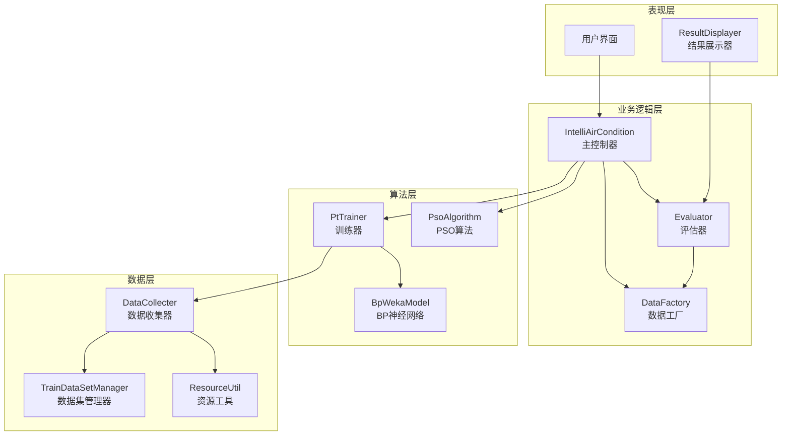
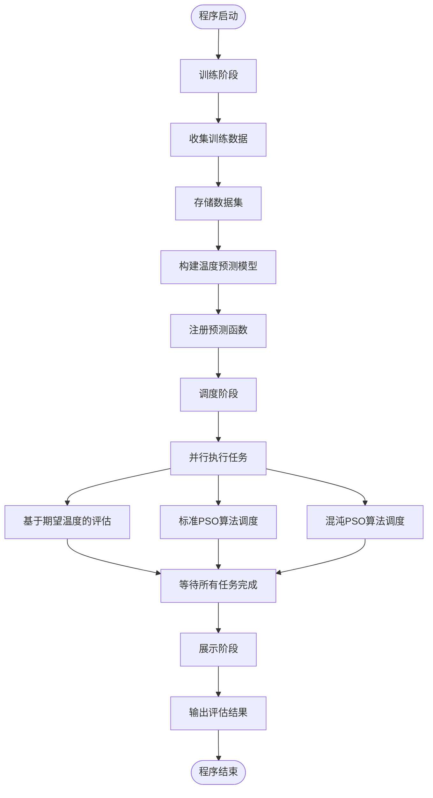
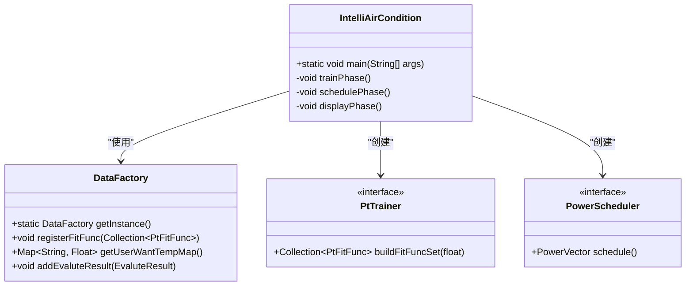
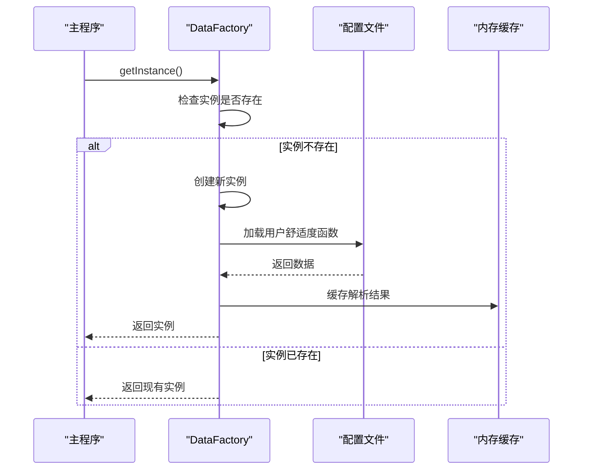
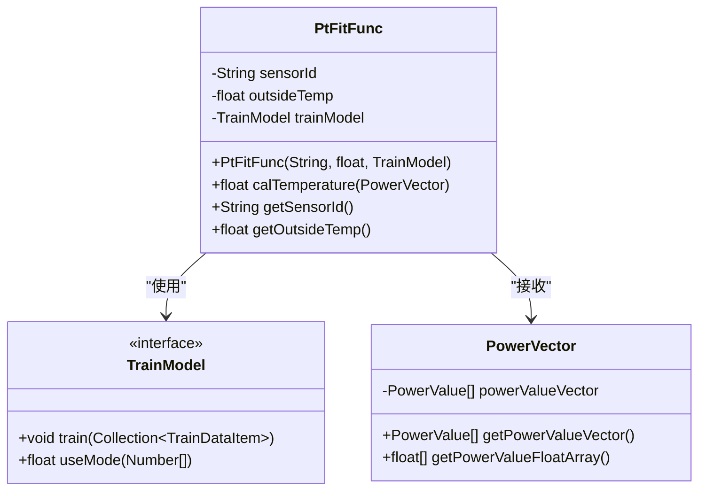
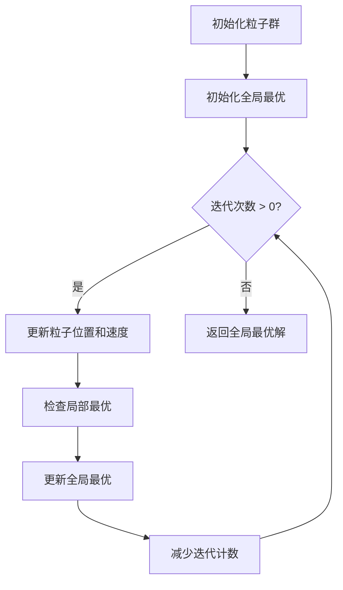
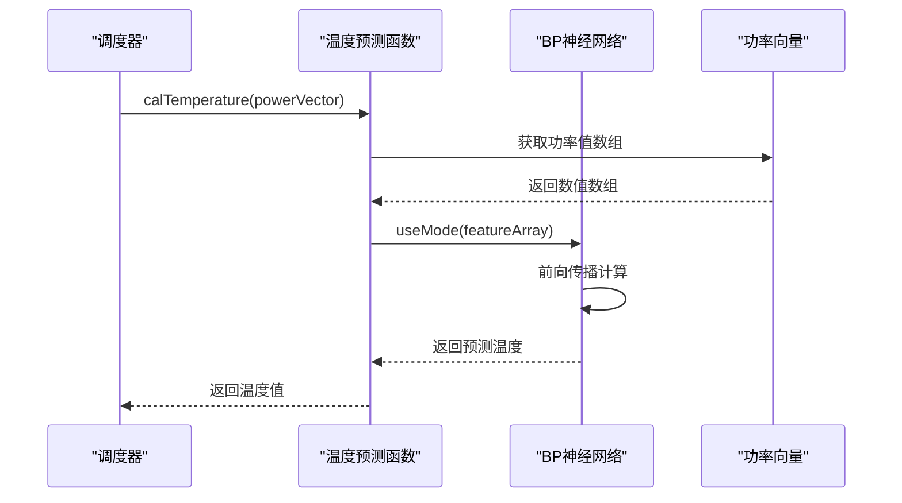

# 智能空调仿真平台（intellacondition）项目概述

<cite>
**本文档引用的文件**
- [IntelliAirCondition.java](file://src/main/java/com/leavesfly/iac/IntelliAirCondition.java)
- [pom.xml](file://pom.xml)
- [BpWekaModel.java](file://src/main/java/com/leavesfly/iac/train/trainer/bp/BpWekaModel.java)
- [PsoAlgorithm.java](file://src/main/java/com/leavesfly/iac/execute/scheduler/pso/PsoAlgorithm.java)
- [DataFactory.java](file://src/main/java/com/leavesfly/iac/datasource/DataFactory.java)
- [PtFitFunc.java](file://src/main/java/com/leavesfly/iac/domain/PtFitFunc.java)
- [Evaluator.java](file://src/main/java/com/leavesfly/iac/evalute/Evaluator.java)
- [AppContextConstant.java](file://src/main/java/com/leavesfly/iac/config/AppContextConstant.java)
</cite>

## 目录
1. [项目简介](#项目简介)
2. [核心目标](#核心目标)
3. [技术架构概览](#技术架构概览)
4. [系统流程详解](#系统流程详解)
5. [核心组件分析](#核心组件分析)
6. [关键技术原理](#关键技术原理)
7. [典型使用场景](#典型使用场景)
8. [系统依赖与第三方库](#系统依赖与第三方库)
9. [总结](#总结)

## 项目简介

智能空调仿真平台（intellacondition）是一个基于Java开发的创新性后端应用系统，专门设计用于通过机器学习与优化算法实现空调功率调度的智能化。该项目旨在解决传统空调控制系统中存在的能源浪费和用户体验不佳的问题，通过先进的算法和技术手段，实现空调系统的高效运行和用户舒适度的最大化。

该平台采用模块化设计理念，将复杂的空调调度问题分解为三个主要阶段：训练阶段、调度阶段和展示阶段。每一阶段都包含了精心设计的算法和数据处理流程，确保系统能够准确预测温度变化、优化功率分配，并提供直观的结果展示。

## 核心目标

### 1. 智能化功率调度
系统的核心目标是通过先进的优化算法实现空调功率的智能化调度。传统的空调控制系统往往采用固定模式或简单的定时控制，无法根据实时环境条件和用户需求进行动态调整。本系统通过粒子群优化（PSO）算法，能够在保证用户舒适度的前提下，最大限度地降低能耗。

### 2. 用户舒适度最大化
系统不仅关注能源效率，更重视用户体验。通过建立精确的用户舒适度模型，系统能够理解不同用户的个性化需求，提供定制化的温度调节方案。这种以人为本的设计理念确保了即使在节能的同时，也能满足用户的舒适要求。

### 3. 数据驱动的决策
系统采用数据驱动的方法，通过收集历史运行数据、用户反馈和环境参数，构建强大的预测模型。这些模型能够准确预测不同功率设置下的温度变化趋势，为调度决策提供科学依据。

### 4. 多算法对比验证
为了确保调度效果的可靠性，系统提供了多种算法的对比功能。除了标准的PSO算法外，还集成了混沌PSO算法，允许用户比较不同优化策略的效果，选择最适合特定场景的解决方案。

## 技术架构概览

智能空调仿真平台采用了分层架构设计，将系统划分为数据层、业务逻辑层、算法层和展示层，确保了良好的可维护性和扩展性。

**图表来源**
- [IntelliAirCondition.java](file://src/main/java/com/leavesfly/iac/IntelliAirCondition.java#L1-L187)
- [DataFactory.java](file://src/main/java/com/leavesfly/iac/datasource/DataFactory.java#L1-L431)

### 架构特点

1. **模块化设计**：每个功能模块都有明确的职责边界，便于独立开发和测试
2. **可扩展性**：新的算法和模型可以轻松集成到现有架构中
3. **数据一致性**：通过统一的数据工厂确保数据的一致性和完整性
4. **算法多样性**：支持多种优化算法，提供灵活的选择空间

## 系统流程详解

智能空调仿真平台遵循严格的三阶段流程设计，每一阶段都有明确的目标和输出。

**图表来源**
- [IntelliAirCondition.java](file://src/main/java/com/leavesfly/iac/IntelliAirCondition.java#L35-L187)

### 训练阶段详细流程

训练阶段是整个系统的基础，负责构建温度预测模型：

1. **数据收集**：从指定的训练数据文件中收集历史功率-温度数据
2. **数据存储**：将原始数据转换为适合机器学习算法处理的格式
3. **模型训练**：使用BP神经网络（基于Weka库）训练温度预测模型
4. **函数注册**：将训练好的模型封装为预测函数，供后续调度阶段使用

### 调度阶段详细流程

调度阶段是系统的核心，负责优化空调功率分配：

1. **并行任务执行**：系统同时执行多个调度任务，提高效率
2. **算法对比**：标准PSO和混沌PSO算法的对比分析
3. **结果评估**：对每种算法产生的调度方案进行评估
4. **结果汇总**：将所有评估结果集中管理，便于后续分析

### 展示阶段详细流程

展示阶段负责将复杂的评估结果转化为易于理解的信息：

1. **结果获取**：从数据工厂中提取所有评估结果
2. **格式化输出**：将结果按照统一格式输出到控制台
3. **可视化准备**：为可能的图形化展示做准备

**章节来源**
- [IntelliAirCondition.java](file://src/main/java/com/leavesfly/iac/IntelliAirCondition.java#L45-L187)

## 核心组件分析

### IntelliAirCondition 主控制器

IntelliAirCondition 类作为整个系统的入口点和协调器，体现了良好的面向对象设计原则：

**图表来源**
- [IntelliAirCondition.java](file://src/main/java/com/leavesfly/iac/IntelliAirCondition.java#L30-L187)
- [DataFactory.java](file://src/main/java/com/leavesfly/iac/datasource/DataFactory.java#L30-L431)

### DataFactory 单例模式

DataFactory 采用了经典的单例模式设计，确保系统中只有一个数据工厂实例：

**图表来源**
- [DataFactory.java](file://src/main/java/com/leavesfly/iac/datasource/DataFactory.java#L80-L120)

这种设计的优势在于：
- **线程安全**：采用双重检查锁定机制
- **延迟初始化**：只有在真正需要时才创建实例
- **资源共享**：确保所有模块访问相同的数据源

### PtFitFunc 功率-温度拟合函数

PtFitFunc 类是系统中最重要的数据结构之一，它将传感器ID、室外温度和训练模型组合在一起：

**图表来源**
- [PtFitFunc.java](file://src/main/java/com/leavesfly/iac/domain/PtFitFunc.java#L1-L88)

### PsoAlgorithm 粒子群优化算法

PsoAlgorithm 类实现了标准的粒子群优化算法，这是系统调度阶段的核心算法：

**图表来源**
- [PsoAlgorithm.java](file://src/main/java/com/leavesfly/iac/execute/scheduler/pso/PsoAlgorithm.java#L1-L116)

**章节来源**
- [IntelliAirCondition.java](file://src/main/java/com/leavesfly/iac/IntelliAirCondition.java#L1-L187)
- [DataFactory.java](file://src/main/java/com/leavesfly/iac/datasource/DataFactory.java#L1-L431)
- [PtFitFunc.java](file://src/main/java/com/leavesfly/iac/domain/PtFitFunc.java#L1-L88)
- [PsoAlgorithm.java](file://src/main/java/com/leavesfly/iac/execute/scheduler/pso/PsoAlgorithm.java#L1-L116)

## 关键技术原理

### 粒子群优化（PSO）算法

粒子群优化是一种基于群体智能的优化算法，灵感来源于鸟群觅食行为。在智能空调系统中，PSO算法被用来寻找最优的空调功率分配方案。

#### 算法核心思想
- **粒子**：代表一个可能的解决方案，具有位置和速度属性
- **个体最优**：每个粒子记住自己找到的最佳位置
- **全局最优**：整个群体记住迄今为止发现的最佳位置
- **更新规则**：粒子根据自身经验和群体经验调整位置和速度

#### 在空调调度中的应用
- **搜索空间**：空调功率向量构成的多维空间
- **适应度函数**：综合考虑用户满意度和能耗成本
- **约束条件**：功率范围限制和温度舒适度要求

### BP神经网络模型

BP（Back Propagation）神经网络是系统中用于温度预测的核心机器学习模型：

#### 网络结构
- **输入层**：空调功率值（8个空调设备）
- **隐藏层**：单层感知机，节点数根据输入特征自动确定
- **输出层**：预测的温度值

#### 训练过程
1. **前向传播**：输入功率向量，计算网络输出
2. **误差计算**：比较预测值与实际值
3. **反向传播**：将误差从输出层向输入层传播
4. **权重更新**：根据梯度下降法调整网络参数

### 温度预测函数

温度预测函数是连接物理世界和算法世界的桥梁，它将空调功率设置转换为预期温度：

**图表来源**
- [PtFitFunc.java](file://src/main/java/com/leavesfly/iac/domain/PtFitFunc.java#L35-L40)
- [BpWekaModel.java](file://src/main/java/com/leavesfly/iac/train/trainer/bp/BpWekaModel.java#L55-L70)

### 用户舒适度评估

系统通过复杂的评估机制来量化用户满意度：

#### 评估指标
- **温度偏差**：实际温度与期望温度的差异
- **舒适度函数**：非线性映射，反映温度变化对舒适度的影响
- **权重平衡**：满意度和能耗成本的权衡

#### 评估流程
1. **获取用户偏好**：从数据工厂中提取用户期望温度
2. **计算预测温度**：使用温度预测函数
3. **评估舒适度**：应用用户舒适度函数
4. **综合评分**：结合满意度和能耗成本

**章节来源**
- [PsoAlgorithm.java](file://src/main/java/com/leavesfly/iac/execute/scheduler/pso/PsoAlgorithm.java#L1-L116)
- [BpWekaModel.java](file://src/main/java/com/leavesfly/iac/train/trainer/bp/BpWekaModel.java#L1-L116)
- [Evaluator.java](file://src/main/java/com/leavesfly/iac/evalute/Evaluator.java#L1-L123)

## 典型使用场景

### 场景一：商业楼宇空调优化

在一个典型的商业楼宇环境中，系统可以发挥重要作用：

#### 环境特点
- **用户密度高**：不同时间段用户分布不均
- **设备数量多**：多个空调机组需要协调控制
- **能耗敏感**：运营成本压力大

#### 系统优势
- **动态调度**：根据实时人流密度调整空调功率
- **节能优先**：在保证舒适度的前提下最小化能耗
- **多算法对比**：选择最适合当前场景的优化策略

### 场景二：智能家居系统集成

对于智能家居应用，系统可以提供个性化的空调控制：

#### 个性化需求
- **用户偏好**：不同家庭成员有不同的舒适度要求
- **时间规律**：作息时间影响空调使用模式
- **环境变化**：室内外温差随季节变化

#### 系统响应
- **自适应学习**：根据用户习惯调整预测模型
- **情景模式**：针对不同生活场景优化调度策略
- **远程控制**：支持手机APP等远程操作方式

### 场景三：大型数据中心冷却

在对温度控制要求极高的数据中心环境中：

#### 特殊挑战
- **精密控温**：温度波动不能超过±0.1℃
- **高能耗**：冷却系统占总能耗的很大比例
- **可靠性要求**：系统必须持续稳定运行

#### 系统特性
- **高精度预测**：BP神经网络提供精确的温度预测
- **冗余设计**：多套算法互为备份，确保系统稳定性
- **实时监控**：持续监控系统状态，及时调整策略

## 系统依赖与第三方库

智能空调仿真平台依赖多个成熟的第三方库来实现其核心功能：

### Weka 机器学习库

Weka 是一个强大的机器学习工具包，为系统提供了BP神经网络的支持：

#### 核心功能
- **神经网络训练**：MultilayerPerceptron 类实现多层感知机
- **数据预处理**：自动归一化和特征转换
- **模型评估**：内置交叉验证和性能评估工具

#### 配置参数
- **隐藏层设置**："i" 表示单隐藏层，节点数等于输入特征数
- **学习率**：0.2f，平衡收敛速度和稳定性
- **动量项**：0.8f，加速收敛过程
- **迭代次数**：由 BpAlgorithmConstant 控制

### Apache Lucene 搜索引擎

Lucene 用于高效的数据存储和检索：

#### 应用场景
- **训练数据管理**：快速存储和检索大量训练样本
- **索引优化**：支持复杂查询和模糊匹配
- **内存管理**：高效的内存使用和垃圾回收

### JFreeChart 图表库

JFreeChart 为系统提供了丰富的可视化功能：

#### 可视化能力
- **曲线图绘制**：展示温度变化趋势
- **柱状图显示**：比较不同算法的性能
- **交互式图表**：支持缩放和鼠标悬停提示

### Commons Lang 工具库

Apache Commons Lang 提供了基础的Java工具类：

#### 主要功能
- **字符串处理**：简化文本解析和格式化
- **集合操作**：增强的集合类和工具方法
- **日期时间**：现代化的日期时间API

**章节来源**
- [pom.xml](file://pom.xml#L1-L64)
- [BpWekaModel.java](file://src/main/java/com/leavesfly/iac/train/trainer/bp/BpWekaModel.java#L20-L50)

## 总结

智能空调仿真平台（intellacondition）是一个设计精良、功能完备的创新性系统。它成功地将机器学习、优化算法和系统工程相结合，为现代空调控制系统提供了一个完整的解决方案。

### 技术亮点

1. **模块化架构**：清晰的层次划分和职责分离，便于维护和扩展
2. **算法多样性**：支持多种优化算法，提供灵活的选择空间
3. **数据驱动**：基于真实数据的预测模型，确保决策的科学性
4. **性能优化**：并行计算和多线程设计，提高系统响应速度

### 应用价值

- **节能减排**：通过智能调度显著降低空调系统的能耗
- **用户体验**：个性化舒适度控制，提升用户满意度
- **商业价值**：适用于各种规模的空调应用场景
- **科研意义**：为相关领域的研究提供了实用的参考框架

### 发展前景

随着物联网和人工智能技术的不断发展，智能空调系统将在更多领域发挥作用。本系统为未来的扩展和升级奠定了坚实的基础，可以轻松集成新的算法、支持更多的设备类型，并适应不断变化的应用需求。

这个项目不仅展示了现代软件工程的最佳实践，也为解决实际工程问题提供了创新的思路和方法。无论是对于初学者了解智能系统的基本概念，还是对于高级开发者探索系统设计的细节，这个项目都提供了宝贵的参考价值。