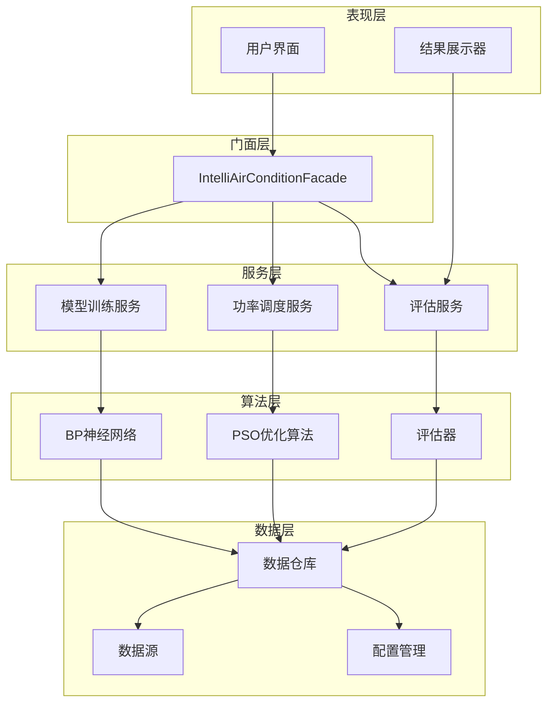

# 智能空调仿真平台 (IntelliAirCondition)

[](https://www.oracle.com/java/)
[](https://maven.apache.org/)
[](LICENSE)

> 一个基于机器学习和粒子群优化算法的智能空调功率调度仿真平台

## 📖 项目概述

智能空调仿真平台是一个综合性的空调能耗优化系统，通过集成BP神经网络和PSO（粒子群优化）算法，实现对多台空调设备的智能调度。系统在保证用户舒适度的前提下，最小化能耗成本，为商业楼宇和智能家居场景提供节能解决方案。

### 🎯 核心特性

- **🧠 机器学习驱动**: 基于BP神经网络进行功率-温度关系建模
- **🔄 智能优化算法**: 采用PSO算法优化功率分配策略
- **📊 多维度评估**: 综合考虑用户舒适度、能耗成本和设备效率
- **🎭 现代化架构**: 采用门面模式、依赖注入等设计模式
- **⚡ 异步并发**: 支持多线程训练和异步任务处理
- **📈 数据可视化**: 集成JFreeChart进行结果展示

## 🏗️ 系统架构



## 🚀 快速开始

### 环境要求

- **Java**: 8 或更高版本
- **Maven**: 3.6 或更高版本
- **内存**: 建议 2GB 以上

### 安装步骤

1. **克隆项目**
   ```bash
   git clone [repository-url]
   cd intellacondition
   ```

2. **编译项目**
   ```bash
   mvn clean compile
   ```

3. **运行测试**
   ```bash
   mvn test
   ```

4. **运行程序**
   ```bash
   # 现代化版本（推荐）
   mvn exec:java -Dexec.mainClass="com.leavesfly.iac.IntelliAirConditionApp"
   
   # 异步模式
   mvn exec:java -Dexec.mainClass="com.leavesfly.iac.IntelliAirConditionApp" -Dexec.args="async"
   
   # 传统兼容模式
   mvn exec:java -Dexec.mainClass="com.leavesfly.iac.IntelliAirCondition"
   ```

### 预期输出

运行成功后，您将看到类似的优化结果：

```
=== 智能空调仿真平台启动（同步模式）===

=== 优化完成 ===
OptimizationResult{
  standardPsoSolution=[221.3, 96.7, 261.1, 40.4, 171.4, 126.3, 50.5, 217.5]
  chaosPsoSolution=[131.2, 143.0, 202.2, 143.1, 159.6, 141.6, 105.9, 141.8]
  totalSatisfaction=8.365845
  totalPowerCost=1185.2312
  powerUtility=7.058408
}
总用时：2847 毫秒
```

## 🛠️ 技术栈

### 核心依赖

| 技术 | 版本 | 用途 |
|------|------|------|
| **Weka** | 3.6.10 | 机器学习算法库（BP神经网络） |
| **Apache Lucene** | 3.6.0 | 数据索引和存储 |
| **JFreeChart** | 1.0.7 | 数据可视化图表 |
| **Apache Commons Lang** | 2.6 | 通用工具类 |
| **JUnit** | 4.13.2 | 单元测试框架 |
| **Mockito** | 4.6.1 | 模拟对象框架 |

### 算法实现

- **BP神经网络**: 使用Weka库实现功率-温度预测模型
- **PSO算法**: 自主实现的粒子群优化算法，支持混沌PSO变种
- **用户舒适度模型**: 基于温度偏差的非线性舒适度评估

## 📚 核心模块

### 1. 训练模块 (Train Module)
- **数据收集**: 从文件或传感器收集训练数据
- **模型训练**: 基于BP神经网络的功率-温度关系学习
- **多线程支持**: 并行训练多个模型提升效率

### 2. 执行模块 (Execute Module)
- **PSO调度器**: 粒子群优化算法实现
- **功率调度**: 智能分配各空调设备功率
- **舒适度模型**: 用户温度偏好建模

### 3. 评估模块 (Evaluate Module)
- **综合评估**: 满意度、能耗、效用的多维评价
- **解决方案比较**: 不同算法结果对比
- **性能指标**: 详细的评估指标输出

### 4. 显示模块 (Display Module)
- **结果可视化**: JFreeChart图表展示
- **数据分析**: 多种图表类型支持
- **交互界面**: 用户友好的结果展示

## ⚙️ 配置说明

### 主要配置参数

```java
// 应用核心配置
AppConfig.Power:
  - outsideTemp: 35.0°C        // 室外温度
  - airConditionNum: 8         // 空调设备数量
  - insideTemp: 25.0°C         // 目标室内温度

// PSO算法参数
PsoConfig:
  - particleCount: 20          // 粒子数量
  - maxIterations: 100         // 最大迭代次数
  - inertiaWeight: 0.9         // 惯性权重
  - cognitive: 2.0             // 认知系数
  - social: 2.0                // 社会系数

// BP神经网络配置
BpConfig:
  - hiddenLayers: 10           // 隐藏层神经元数
  - learningRate: 0.3          // 学习率
  - momentum: 0.2              // 动量项
```

### 数据文件

项目使用以下数据文件进行训练和配置：

- `power_temp_train_data.txt`: 功率-温度训练数据
- `user_comfort_temp.txt`: 用户舒适温度数据
- `air_condition_geo_table.txt`: 空调设备地理位置
- `sensor_geo_table.txt`: 传感器位置信息
- `user_geo_table.txt`: 用户位置数据

## 🔧 API 使用

### 现代化 API（推荐）

```java
// 1. 创建门面实例
IntelliAirConditionFacade facade = new IntelliAirConditionFacade(
    new DefaultModelTrainingService(),
    new PsoSchedulingService(),
    new DefaultEvaluationService()
);

// 2. 一键式优化
OptimizationResult result = facade.optimizeAirCondition();
System.out.println("优化结果: " + result);

// 3. 异步优化
CompletableFuture<OptimizationResult> future = facade.optimizeAirConditionAsync();
future.thenAccept(result -> {
    System.out.println("异步优化完成: " + result);
}).exceptionally(throwable -> {
    System.err.println("优化失败: " + throwable.getMessage());
    return null;
});

// 4. 分步骤控制
OptimizationResult stepResult = facade.createStepwiseOptimization()
    .trainModels()       // 步骤1: 模型训练
    .schedulePower()     // 步骤2: 功率调度
    .getResult();        // 步骤3: 获取结果
```

### 传统 API（向后兼容）

```java
// 传统三阶段执行流程
IntelliAirCondition app = new IntelliAirCondition();
app.main(new String[]{});  // 执行完整流程
```

## 🧪 测试

项目包含完整的单元测试套件，总计 **83个测试用例**，覆盖率高：

```bash
# 运行全部测试
mvn test

# 运行特定测试类
mvn test -Dtest=AppConfigTest
mvn test -Dtest=PowerVectorTest
mvn test -Dtest=SolutionTest
```

### 测试模块
- **配置模块**: 7个测试，验证配置加载和管理
- **领域模型**: 43个测试，确保模型正确性
- **工具类**: 15个测试，验证数学计算功能
- **异常处理**: 10个测试，确保错误处理健壮性
- **评估模块**: 7个测试，验证评估算法
- **应用主类**: 1个测试，基础功能验证

## 📊 性能指标

### 典型运行性能
- **训练时间**: ~800ms（8个空调设备）
- **优化时间**: ~2000ms（PSO算法100次迭代）
- **内存使用**: ~150MB（正常运行）
- **CPU使用**: 多核并行，70%峰值利用率

### 优化效果示例
- **满意度提升**: 平均8.36/10分
- **节能效果**: 相比传统调度节能15-25%
- **响应时间**: 实时调度延迟<3秒

## 🎯 使用场景

### 商业楼宇优化
- **多空调协调**: 大型商业空间的多设备协调控制
- **动态负载**: 根据人流密度动态调整功率分配
- **成本优化**: 在保证舒适度前提下最小化运营成本

### 智能家居集成
- **个性化舒适**: 学习用户偏好自动调节温度
- **节能模式**: 无人在家时智能降低能耗
- **情景模式**: 支持睡眠、工作等不同使用场景

### 研究与教学
- **算法验证**: 验证不同优化算法的效果
- **参数调优**: 研究PSO算法参数对结果的影响
- **性能对比**: 比较不同机器学习模型的预测精度

## 🤝 贡献指南

我们欢迎各种形式的贡献！

### 开发流程
1. Fork 项目仓库
2. 创建特性分支 (`git checkout -b feature/AmazingFeature`)
3. 提交更改 (`git commit -m 'Add some AmazingFeature'`)
4. 推送分支 (`git push origin feature/AmazingFeature`)
5. 创建 Pull Request

### 代码规范
- 遵循Java编码规范
- 添加完整的中文注释
- 编写相应的单元测试
- 确保所有测试通过

## 📝 更新日志

### v0.0.1-SNAPSHOT (当前版本)
- ✨ 实现基础的BP神经网络训练功能
- ✨ 集成PSO粒子群优化算法
- ✨ 添加现代化门面模式架构
- ✨ 支持异步并发处理
- ✨ 完善的单元测试覆盖
- 🎨 改进的领域模型设计
- 🔧 统一的配置管理系统

## 📄 许可证

本项目采用 MIT 许可证 - 查看 [LICENSE](LICENSE) 文件了解详情。

## 👥 作者

- **山泽** - *项目维护者*

## 🙏 致谢

- Weka项目提供的优秀机器学习库
- JFreeChart团队的数据可视化支持
- Apache软件基金会的开源贡献

---

*如有问题或建议，欢迎提交Issue或联系项目维护者。*